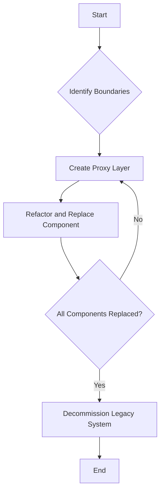

## 8.14 Strangler Fig Pattern

The Strangler Fig Pattern is a powerful strategy for gradually transforming monolithic applications into microservices. Named after the strangler fig tree, which grows around a host tree and eventually replaces it, this pattern allows for incremental refactoring and modernization of legacy systems without the need for complete rewrites. In this section, we will explore the intricacies of the Strangler Fig Pattern, its applicability, and how it can be effectively implemented in C# to transition from monolithic architectures to microservices.

### Intent

The primary intent of the Strangler Fig Pattern is to enable the gradual replacement of a monolithic system with a new system, often a microservices architecture, by incrementally refactoring and replacing components. This approach minimizes risk, reduces downtime, and allows for continuous delivery of new features and improvements.

### Key Participants

- **Legacy System**: The existing monolithic application that needs to be modernized.
- **New System**: The microservices architecture that will eventually replace the legacy system.
- **Proxy Layer**: A layer that routes requests to either the legacy system or the new system, depending on the state of the refactoring process.

### Applicability

The Strangler Fig Pattern is particularly applicable in scenarios where:

- A legacy system is too large or complex to be rewritten from scratch.
- Continuous operation of the system is critical, and downtime must be minimized.
- Incremental improvements and feature additions are required during the transition.
- The organization wants to adopt modern architectures, such as microservices, without disrupting existing operations.

### Strategies for Incremental Replacement

Implementing the Strangler Fig Pattern involves several strategies for incremental replacement:

#### Identifying and Replacing Components Gradually

1. **Identify Boundaries**: Begin by identifying the boundaries within the monolithic application. These boundaries often correspond to distinct business capabilities or modules that can be isolated and refactored independently.

2. **Create a Proxy Layer**: Implement a proxy layer that intercepts requests and routes them to either the legacy system or the new system. This layer acts as a mediator, allowing for seamless transitions between the two systems.

3. **Refactor and Replace**: Gradually refactor and replace components of the legacy system with microservices. Start with less critical components to minimize risk and gain experience with the new architecture.

4. **Monitor and Optimize**: Continuously monitor the performance and behavior of both the legacy and new systems. Optimize the proxy layer to ensure efficient routing and minimal latency.

5. **Decommission the Legacy System**: Once all components have been successfully refactored and replaced, decommission the legacy system, leaving only the new microservices architecture in place.

### Use Cases and Examples

The Strangler Fig Pattern is widely used in various industries to modernize legacy systems. Here are some common use cases and examples:

#### Modernizing Legacy Systems without Complete Rewrites

- **E-commerce Platforms**: Many e-commerce platforms have evolved from monolithic architectures to microservices to improve scalability and flexibility. By using the Strangler Fig Pattern, these platforms can gradually transition to a microservices architecture while continuing to serve customers.

- **Banking Systems**: Legacy banking systems often require modernization to support new features and regulatory requirements. The Strangler Fig Pattern allows banks to incrementally refactor their systems, ensuring compliance and enhancing customer experience.

- **Healthcare Applications**: Healthcare applications must adhere to strict regulations and ensure data privacy. The Strangler Fig Pattern enables healthcare providers to modernize their systems without disrupting critical operations.

### Sample Code Snippet

Let's explore a sample implementation of the Strangler Fig Pattern in C#. In this example, we'll demonstrate how to create a proxy layer that routes requests between a legacy system and a new microservices architecture.

```csharp
using System;

namespace StranglerFigPattern
{
    // Legacy system component
    public class LegacyComponent
    {
        public void Execute()
        {
            Console.WriteLine("Executing legacy component...");
        }
    }

    // New system component (microservice)
    public class NewMicroservice
    {
        public void Execute()
        {
            Console.WriteLine("Executing new microservice...");
        }
    }

    // Proxy layer
    public class ProxyLayer
    {
        private readonly LegacyComponent _legacyComponent;
        private readonly NewMicroservice _newMicroservice;
        private readonly bool _useNewSystem;

        public ProxyLayer(bool useNewSystem)
        {
            _legacyComponent = new LegacyComponent();
            _newMicroservice = new NewMicroservice();
            _useNewSystem = useNewSystem;
        }

        public void Execute()
        {
            if (_useNewSystem)
            {
                _newMicroservice.Execute();
            }
            else
            {
                _legacyComponent.Execute();
            }
        }
    }

    class Program
    {
        static void Main(string[] args)
        {
            // Use the proxy layer to route requests
            ProxyLayer proxy = new ProxyLayer(useNewSystem: false);
            proxy.Execute(); // Outputs: Executing legacy component...

            // Switch to the new system
            proxy = new ProxyLayer(useNewSystem: true);
            proxy.Execute(); // Outputs: Executing new microservice...
        }
    }
}
```

In this code snippet, we define a `LegacyComponent` representing the existing monolithic system and a `NewMicroservice` representing the new microservices architecture. The `ProxyLayer` class acts as a mediator, routing requests to either the legacy component or the new microservice based on the `useNewSystem` flag.

### Design Considerations

When implementing the Strangler Fig Pattern, consider the following design considerations:

- **Gradual Transition**: Ensure that the transition from the legacy system to the new system is gradual and well-planned. Avoid rushing the process, as this can lead to instability and increased risk.

- **Testing and Validation**: Thoroughly test and validate each component as it is refactored and replaced. This ensures that the new system meets all functional and non-functional requirements.

- **Performance Monitoring**: Continuously monitor the performance of both the legacy and new systems. Identify and address any bottlenecks or performance issues that arise during the transition.

- **Stakeholder Communication**: Maintain open communication with stakeholders throughout the transition process. Keep them informed of progress, challenges, and any changes to timelines or deliverables.

### Differences and Similarities

The Strangler Fig Pattern is often compared to other patterns, such as the **Branch by Abstraction** pattern. While both patterns involve incremental refactoring, the Strangler Fig Pattern focuses on replacing entire components, whereas Branch by Abstraction emphasizes creating abstractions to facilitate refactoring.

### Visualizing the Strangler Fig Pattern

To better understand the Strangler Fig Pattern, let's visualize the transition process using a flowchart.



This flowchart illustrates the key steps in implementing the Strangler Fig Pattern, from identifying boundaries within the monolithic application to decommissioning the legacy system once all components have been replaced.

### Try It Yourself

To gain hands-on experience with the Strangler Fig Pattern, try modifying the sample code snippet to include additional components and microservices. Experiment with different configurations of the proxy layer to see how it affects the routing of requests.

### Knowledge Check

To reinforce your understanding of the Strangler Fig Pattern, consider the following questions:

1. What are the key benefits of using the Strangler Fig Pattern for modernizing legacy systems?
2. How does the proxy layer facilitate the transition from a monolithic system to a microservices architecture?
3. What are some common challenges associated with implementing the Strangler Fig Pattern?

### Embrace the Journey

Remember, the journey of modernizing legacy systems is a continuous process. The Strangler Fig Pattern provides a structured approach to transition from monolithic architectures to microservices, enabling organizations to adapt to changing business needs and technological advancements. Keep experimenting, stay curious, and enjoy the journey!

### References and Links

For further reading on the Strangler Fig Pattern and related topics, consider the following resources:

- [Martin Fowler's Article on the Strangler Fig Pattern](https://martinfowler.com/bliki/StranglerFigApplication.html)
- [Microservices.io: Strangler Fig Pattern](https://microservices.io/patterns/refactoring/strangler-fig.html)
- [Microsoft's Guide to Modernizing Legacy Systems](https://docs.microsoft.com/en-us/azure/architecture/guide/modernization/)

## Quiz Time!



### What is the primary intent of the Strangler Fig Pattern?

- [x] To enable the gradual replacement of a monolithic system with a new system
- [ ] To completely rewrite a legacy system from scratch
- [ ] To maintain the legacy system without any changes
- [ ] To merge multiple systems into one

> **Explanation:** The Strangler Fig Pattern aims to gradually replace a monolithic system with a new system, often a microservices architecture, by incrementally refactoring and replacing components.

### Which component acts as a mediator in the Strangler Fig Pattern?

- [ ] Legacy System
- [ ] New System
- [x] Proxy Layer
- [ ] Database

> **Explanation:** The Proxy Layer acts as a mediator, routing requests to either the legacy system or the new system, depending on the state of the refactoring process.

### What is a key benefit of using the Strangler Fig Pattern?

- [x] Minimizes risk and reduces downtime during system transitions
- [ ] Requires complete system downtime during transitions
- [ ] Increases complexity and risk
- [ ] Eliminates the need for testing

> **Explanation:** The Strangler Fig Pattern minimizes risk and reduces downtime by allowing for incremental refactoring and replacement of components.

### What should be done once all components have been replaced in the Strangler Fig Pattern?

- [ ] Continue using the legacy system
- [x] Decommission the legacy system
- [ ] Merge the legacy and new systems
- [ ] Start the process over

> **Explanation:** Once all components have been successfully refactored and replaced, the legacy system should be decommissioned, leaving only the new microservices architecture in place.

### Which pattern is often compared to the Strangler Fig Pattern?

- [ ] Singleton Pattern
- [ ] Factory Pattern
- [x] Branch by Abstraction Pattern
- [ ] Observer Pattern

> **Explanation:** The Strangler Fig Pattern is often compared to the Branch by Abstraction pattern, as both involve incremental refactoring.

### What is the role of the proxy layer in the Strangler Fig Pattern?

- [x] To route requests between the legacy and new systems
- [ ] To store data for the new system
- [ ] To execute business logic
- [ ] To manage user authentication

> **Explanation:** The proxy layer routes requests to either the legacy system or the new system, facilitating the transition process.

### What is a common challenge when implementing the Strangler Fig Pattern?

- [x] Ensuring seamless integration between legacy and new systems
- [ ] Lack of documentation
- [ ] Inability to test new components
- [ ] Complete system downtime

> **Explanation:** A common challenge is ensuring seamless integration between the legacy and new systems during the transition process.

### How does the Strangler Fig Pattern handle system transitions?

- [x] By incrementally refactoring and replacing components
- [ ] By completely rewriting the system
- [ ] By maintaining the legacy system without changes
- [ ] By merging multiple systems into one

> **Explanation:** The Strangler Fig Pattern handles system transitions by incrementally refactoring and replacing components, allowing for a gradual and controlled transition.

### What is the first step in implementing the Strangler Fig Pattern?

- [x] Identify boundaries within the monolithic application
- [ ] Decommission the legacy system
- [ ] Create a new system from scratch
- [ ] Merge the legacy and new systems

> **Explanation:** The first step is to identify boundaries within the monolithic application, which often correspond to distinct business capabilities or modules.

### True or False: The Strangler Fig Pattern requires complete system downtime during transitions.

- [ ] True
- [x] False

> **Explanation:** False. The Strangler Fig Pattern minimizes downtime by allowing for incremental refactoring and replacement of components, ensuring continuous operation of the system.


