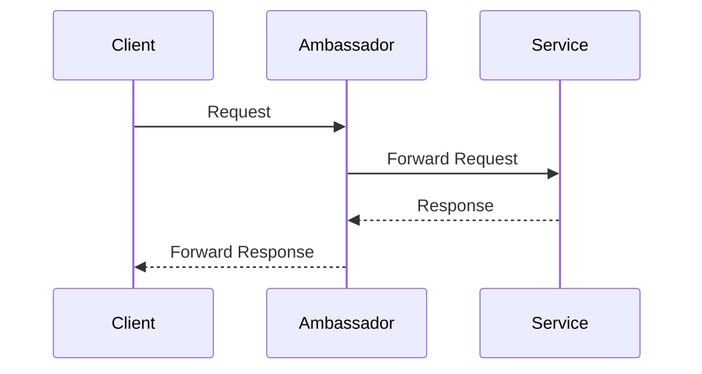

## 8.15 Ambassador Pattern

In the realm of microservices architecture, the Ambassador Pattern plays a pivotal role in managing service communication and addressing cross-cutting concerns. This pattern involves deploying a proxy, known as an ambassador, alongside each service. The ambassador handles tasks such as routing, monitoring, logging, and security, thereby offloading these responsibilities from the service itself. This guide will delve into the intricacies of the Ambassador Pattern, its implementation in .NET, and its practical applications.

### Understanding the Ambassador Pattern

#### Intent

The primary intent of the Ambassador Pattern is to separate cross-cutting concerns from the core business logic of a service. By doing so, it enhances modularity, maintainability, and scalability of microservices. The ambassador acts as an intermediary that manages communication between the service and the external world, ensuring that the service remains focused on its primary responsibilities.

#### Key Participants

1. **Service**: The core component that performs business logic.
2. **Ambassador**: A proxy that handles communication and cross-cutting concerns.
3. **External Systems**: Other services or clients interacting with the service through the ambassador.

#### Applicability

The Ambassador Pattern is particularly useful in scenarios where:

- Services require consistent handling of cross-cutting concerns such as logging, monitoring, and security.
- There is a need to abstract and manage complex communication protocols.
- Services need to be decoupled from infrastructure concerns to enhance portability and scalability.

### Implementing Ambassador in .NET

#### Using Proxies for Routing and Additional Functionalities

In .NET, implementing the Ambassador Pattern involves creating a proxy that encapsulates the logic for handling cross-cutting concerns. This proxy can be implemented using various techniques, such as middleware, decorators, or dedicated proxy classes.

##### Example: Implementing an Ambassador Proxy

Let's consider a scenario where we have a microservice responsible for processing orders. We want to implement an ambassador that handles logging and authentication.

```csharp
public interface IOrderService
{
    void ProcessOrder(Order order);
}

public class OrderService : IOrderService
{
    public void ProcessOrder(Order order)
    {
        // Business logic for processing the order
    }
}

public class OrderServiceAmbassador : IOrderService
{
    private readonly IOrderService _orderService;

    public OrderServiceAmbassador(IOrderService orderService)
    {
        _orderService = orderService;
    }

    public void ProcessOrder(Order order)
    {
        LogRequest(order);
        Authenticate(order);

        _orderService.ProcessOrder(order);

        LogResponse(order);
    }

    private void LogRequest(Order order)
    {
        // Logic for logging the request
    }

    private void Authenticate(Order order)
    {
        // Logic for authenticating the request
    }

    private void LogResponse(Order order)
    {
        // Logic for logging the response
    }
}
```

In this example, the `OrderServiceAmbassador` acts as a proxy that wraps the `OrderService`. It handles logging and authentication, allowing the `OrderService` to focus solely on processing orders.

#### Design Considerations

- **Performance**: Ensure that the ambassador does not introduce significant latency. Optimize logging and authentication mechanisms to be efficient.
- **Scalability**: The ambassador should be designed to handle high loads without becoming a bottleneck.
- **Security**: Implement robust authentication and authorization mechanisms to protect the service.

### Use Cases and Examples

#### Service Communication

The Ambassador Pattern is ideal for managing service communication, especially in complex microservices architectures. By abstracting communication protocols and handling retries, timeouts, and circuit breaking, the ambassador ensures reliable and resilient interactions between services.

##### Example: Handling Service Communication

Consider a scenario where a service needs to communicate with an external payment gateway. The ambassador can manage the communication protocol, handle retries in case of failures, and log all interactions for auditing purposes.

```csharp
public class PaymentServiceAmbassador : IPaymentService
{
    private readonly IPaymentService _paymentService;

    public PaymentServiceAmbassador(IPaymentService paymentService)
    {
        _paymentService = paymentService;
    }

    public PaymentResponse ProcessPayment(PaymentRequest request)
    {
        LogRequest(request);

        PaymentResponse response;
        try
        {
            response = _paymentService.ProcessPayment(request);
        }
        catch (Exception ex)
        {
            HandleFailure(ex);
            throw;
        }

        LogResponse(response);
        return response;
    }

    private void LogRequest(PaymentRequest request)
    {
        // Logic for logging the request
    }

    private void HandleFailure(Exception ex)
    {
        // Logic for handling failures, such as retries or circuit breaking
    }

    private void LogResponse(PaymentResponse response)
    {
        // Logic for logging the response
    }
}
```

#### Handling Cross-Cutting Concerns

Cross-cutting concerns such as logging, monitoring, and security can be efficiently managed by the ambassador, allowing services to remain focused on their core functionalities.

##### Example: Managing Cross-Cutting Concerns

In a microservices architecture, each service may need to implement consistent logging and monitoring. The ambassador can centralize these concerns, ensuring uniformity and reducing duplication.

```csharp
public class MonitoringAmbassador : IService
{
    private readonly IService _service;

    public MonitoringAmbassador(IService service)
    {
        _service = service;
    }

    public void Execute()
    {
        StartMonitoring();

        _service.Execute();

        StopMonitoring();
    }

    private void StartMonitoring()
    {
        // Logic for starting monitoring
    }

    private void StopMonitoring()
    {
        // Logic for stopping monitoring
    }
}
```

### Visualizing the Ambassador Pattern

To better understand the Ambassador Pattern, let's visualize its components and interactions using a sequence diagram.



**Diagram Description**: This sequence diagram illustrates the flow of a request from a client to a service through an ambassador. The ambassador intercepts the request, performs necessary cross-cutting tasks, and forwards the request to the service. The response follows a similar path back to the client.

### Differences and Similarities

The Ambassador Pattern is often compared to other patterns such as the Proxy Pattern and the Decorator Pattern. While all these patterns involve wrapping a component to add additional behavior, they differ in their primary focus:

- **Proxy Pattern**: Primarily focuses on controlling access to an object.
- **Decorator Pattern**: Aims to add responsibilities to an object dynamically.
- **Ambassador Pattern**: Specifically targets cross-cutting concerns in a microservices context.

### Design Considerations

When implementing the Ambassador Pattern, consider the following:

- **Separation of Concerns**: Ensure that the ambassador only handles cross-cutting concerns and does not interfere with business logic.
- **Modularity**: Design the ambassador to be easily reusable across different services.
- **Configuration**: Use configuration files or environment variables to manage ambassador settings, allowing for flexibility and adaptability.

### Try It Yourself

Experiment with the provided code examples by adding additional cross-cutting concerns such as caching or rate limiting. Observe how the ambassador can be extended to handle these tasks without modifying the core service logic.

### Knowledge Check

- Explain the primary intent of the Ambassador Pattern.
- Describe how the Ambassador Pattern enhances modularity in microservices.
- Discuss the differences between the Ambassador Pattern and the Proxy Pattern.

### Embrace the Journey

Remember, mastering design patterns is a journey. As you explore the Ambassador Pattern, consider how it can be applied to your own projects. Stay curious, experiment with different implementations, and enjoy the process of learning and growing as a software engineer.

## Quiz Time!



### What is the primary intent of the Ambassador Pattern?

- [x] To separate cross-cutting concerns from the core business logic of a service.
- [ ] To add new functionalities to an object dynamically.
- [ ] To control access to an object.
- [ ] To enhance the performance of a service.

> **Explanation:** The Ambassador Pattern aims to separate cross-cutting concerns such as logging and security from the core business logic, enhancing modularity and maintainability.

### Which of the following is a key participant in the Ambassador Pattern?

- [x] Ambassador
- [ ] Decorator
- [ ] Factory
- [ ] Adapter

> **Explanation:** The Ambassador is a key participant in the pattern, acting as a proxy to handle communication and cross-cutting concerns.

### How does the Ambassador Pattern enhance modularity?

- [x] By offloading cross-cutting concerns to a separate component.
- [ ] By dynamically adding new functionalities to an object.
- [ ] By controlling access to an object.
- [ ] By optimizing the performance of a service.

> **Explanation:** The Ambassador Pattern enhances modularity by offloading cross-cutting concerns to a separate component, allowing the service to focus on its core responsibilities.

### What is a common use case for the Ambassador Pattern?

- [x] Managing service communication and handling cross-cutting concerns.
- [ ] Dynamically adding new functionalities to an object.
- [ ] Controlling access to an object.
- [ ] Enhancing the performance of a service.

> **Explanation:** The Ambassador Pattern is commonly used to manage service communication and handle cross-cutting concerns such as logging and security.

### Which pattern is often compared to the Ambassador Pattern?

- [x] Proxy Pattern
- [ ] Singleton Pattern
- [ ] Factory Pattern
- [ ] Observer Pattern

> **Explanation:** The Proxy Pattern is often compared to the Ambassador Pattern as both involve wrapping a component to add additional behavior.

### What is a key design consideration when implementing the Ambassador Pattern?

- [x] Ensuring the ambassador only handles cross-cutting concerns.
- [ ] Dynamically adding new functionalities to an object.
- [ ] Controlling access to an object.
- [ ] Enhancing the performance of a service.

> **Explanation:** A key design consideration is ensuring that the ambassador only handles cross-cutting concerns and does not interfere with business logic.

### How can the Ambassador Pattern be extended?

- [x] By adding additional cross-cutting concerns such as caching or rate limiting.
- [ ] By dynamically adding new functionalities to an object.
- [ ] By controlling access to an object.
- [ ] By optimizing the performance of a service.

> **Explanation:** The Ambassador Pattern can be extended by adding additional cross-cutting concerns such as caching or rate limiting.

### What is the role of the ambassador in the pattern?

- [x] To handle communication and cross-cutting concerns.
- [ ] To dynamically add new functionalities to an object.
- [ ] To control access to an object.
- [ ] To enhance the performance of a service.

> **Explanation:** The ambassador's role is to handle communication and cross-cutting concerns, allowing the service to focus on its core responsibilities.

### Which of the following is NOT a cross-cutting concern typically handled by the ambassador?

- [ ] Logging
- [ ] Security
- [x] Business logic
- [ ] Monitoring

> **Explanation:** Business logic is not a cross-cutting concern; it is the core responsibility of the service.

### True or False: The Ambassador Pattern is only applicable in microservices architectures.

- [x] True
- [ ] False

> **Explanation:** The Ambassador Pattern is specifically designed for microservices architectures to handle cross-cutting concerns and manage service communication.


