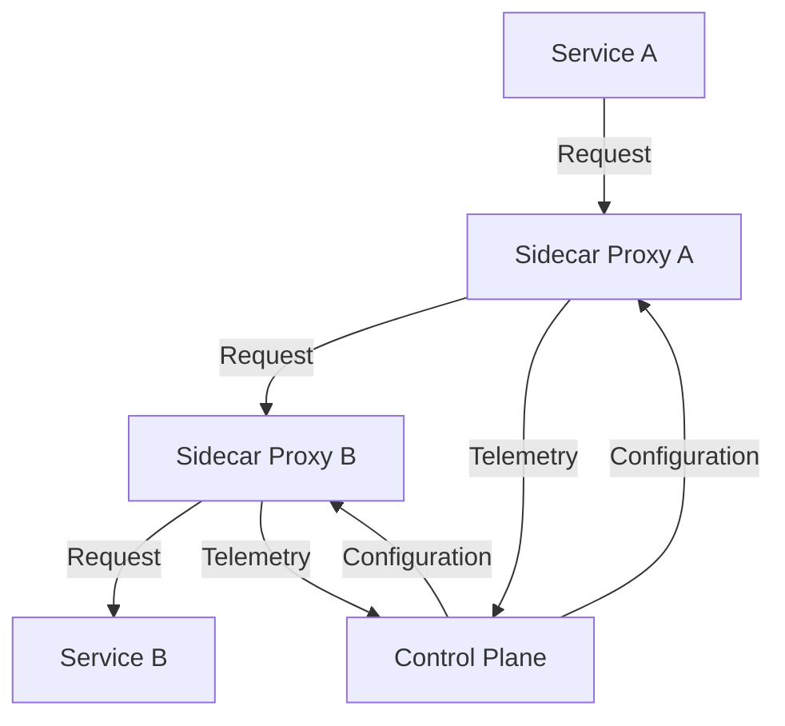

## 8.16 Service Mesh Pattern

In the realm of microservices architecture, managing service-to-service communication is crucial for ensuring the reliability, security, and observability of applications. The Service Mesh Pattern provides a dedicated infrastructure layer that handles these communications, allowing developers to focus on business logic rather than the complexities of network management. In this section, we will delve into the Service Mesh Pattern, its integration with C# applications, and the benefits it brings to microservices environments.

### Understanding the Service Mesh Pattern

A service mesh is a configurable infrastructure layer for a microservices application that makes communication between service instances flexible, reliable, and fast. It provides a way to control how different parts of an application share data with one another. The service mesh is typically implemented as a set of network proxies deployed alongside application code, without requiring changes to the application itself.

#### Key Concepts

- **Sidecar Proxy**: A sidecar proxy is deployed alongside each service instance, intercepting all incoming and outgoing network traffic. This proxy handles communication tasks such as load balancing, retries, and circuit breaking.
- **Control Plane**: The control plane manages and configures the proxies to route traffic, enforce policies, and collect telemetry.
- **Data Plane**: The data plane is responsible for the actual data transfer between services, managed by the sidecar proxies.

### Integrating Service Mesh with C# Applications

Integrating a service mesh with C# applications involves deploying a service mesh solution like Istio or Linkerd within your Kubernetes cluster. These tools provide the necessary infrastructure to manage service-to-service communication efficiently.

#### Using Istio with C#

Istio is one of the most popular service mesh solutions, offering a robust set of features for traffic management, security, and observability. To integrate Istio with C# applications, follow these steps:

1. **Install Istio**: Deploy Istio in your Kubernetes cluster. This involves installing the Istio control plane and configuring the data plane to manage your services.

2. **Deploy C# Services**: Deploy your C# microservices in the Kubernetes cluster. Ensure that each service is configured to work with Istio's sidecar proxy.

3. **Configure Traffic Management**: Use Istio's traffic management features to control the flow of traffic between your services. This includes setting up routing rules, load balancing, and retries.

4. **Implement Security Policies**: Leverage Istio's security features to enforce mutual TLS, access control, and authentication policies across your services.

5. **Enable Observability**: Utilize Istio's observability tools to monitor service performance, collect telemetry data, and visualize service dependencies.

#### Using Linkerd with C#

Linkerd is another popular service mesh solution known for its simplicity and performance. To integrate Linkerd with C# applications, follow these steps:

1. **Install Linkerd**: Deploy Linkerd in your Kubernetes cluster. This involves setting up the Linkerd control plane and injecting the Linkerd proxy into your service pods.

2. **Deploy C# Services**: Deploy your C# microservices in the Kubernetes cluster, ensuring compatibility with Linkerd's proxy.

3. **Configure Traffic Management**: Use Linkerd's traffic management capabilities to manage service communication, including load balancing and retries.

4. **Implement Security Policies**: Apply Linkerd's security features to enforce encryption and access control policies.

5. **Enable Observability**: Leverage Linkerd's observability tools to gain insights into service performance and network traffic.

### Benefits of the Service Mesh Pattern

The Service Mesh Pattern offers several benefits that enhance the reliability and security of microservices communication:

#### Traffic Management

- **Load Balancing**: Distribute incoming requests across multiple service instances to ensure optimal resource utilization and prevent overload.
- **Retries and Timeouts**: Automatically retry failed requests and set timeouts to prevent cascading failures.
- **Circuit Breaking**: Implement circuit breakers to prevent service failures from affecting the entire application.

#### Security

- **Mutual TLS**: Encrypt service-to-service communication to ensure data privacy and integrity.
- **Access Control**: Define and enforce access policies to restrict service communication based on identity and role.
- **Authentication and Authorization**: Implement authentication and authorization mechanisms to secure service interactions.

#### Observability

- **Telemetry Collection**: Collect metrics, logs, and traces to monitor service performance and diagnose issues.
- **Service Dependency Visualization**: Visualize service dependencies and communication patterns to identify bottlenecks and optimize performance.
- **Alerting and Monitoring**: Set up alerts and monitoring tools to detect anomalies and respond to incidents promptly.

### Sample Code Snippet

To illustrate the integration of a service mesh with C# applications, let's consider a simple example using Istio. We'll deploy a C# service in a Kubernetes cluster and configure Istio to manage its communication.

```csharp
using Microsoft.AspNetCore.Builder;
using Microsoft.AspNetCore.Hosting;
using Microsoft.Extensions.DependencyInjection;
using Microsoft.Extensions.Hosting;

namespace SampleService
{
    public class Startup
    {
        public void ConfigureServices(IServiceCollection services)
        {
            services.AddControllers();
        }

        public void Configure(IApplicationBuilder app, IWebHostEnvironment env)
        {
            if (env.IsDevelopment())
            {
                app.UseDeveloperExceptionPage();
            }

            app.UseRouting();

            app.UseAuthorization();

            app.UseEndpoints(endpoints =>
            {
                endpoints.MapControllers();
            });
        }
    }
}
```

In this example, we have a simple ASP.NET Core service that can be deployed in a Kubernetes cluster. Once deployed, Istio can be configured to manage its communication with other services.

### Design Considerations

When implementing the Service Mesh Pattern, consider the following:

- **Complexity**: Introducing a service mesh adds complexity to your architecture. Ensure that your team is equipped to manage and maintain the service mesh infrastructure.
- **Performance Overhead**: The sidecar proxies introduce some performance overhead. Evaluate the trade-offs between added features and performance impact.
- **Compatibility**: Ensure that your C# applications are compatible with the service mesh solution you choose. This may involve modifying your deployment configurations and service definitions.

### Differences and Similarities

The Service Mesh Pattern is often compared to other patterns like API Gateway and Circuit Breaker. While these patterns share some similarities, they serve different purposes:

- **API Gateway**: Manages external client requests and provides a single entry point to your services. In contrast, a service mesh manages internal service-to-service communication.
- **Circuit Breaker**: Prevents service failures from affecting the entire application. While a service mesh can implement circuit breaking, it offers a broader set of features for managing service communication.

### Visualizing the Service Mesh Architecture

To better understand the Service Mesh Pattern, let's visualize its architecture using a Mermaid.js diagram.



**Diagram Description**: This diagram illustrates the flow of requests and telemetry data in a service mesh architecture. Service A communicates with Service B through sidecar proxies, which are managed by the control plane.

### Try It Yourself

To gain hands-on experience with the Service Mesh Pattern, try deploying a simple C# microservices application in a Kubernetes cluster with Istio or Linkerd. Experiment with different traffic management and security configurations to see how they affect service communication.

### Knowledge Check

Let's reinforce our understanding of the Service Mesh Pattern with a few questions:

- What are the key components of a service mesh?
- How does a service mesh enhance security in microservices communication?
- What are the trade-offs of introducing a service mesh in your architecture?

### Embrace the Journey

Remember, mastering the Service Mesh Pattern is a journey. As you explore its capabilities and integrate it into your applications, you'll gain valuable insights into managing microservices communication. Keep experimenting, stay curious, and enjoy the journey!

## Quiz Time!



### What is a service mesh primarily used for?

- [x] Managing service-to-service communication
- [ ] Handling client requests
- [ ] Storing application data
- [ ] Managing user authentication

> **Explanation:** A service mesh is primarily used for managing service-to-service communication within a microservices architecture.

### Which component of a service mesh is responsible for data transfer?

- [ ] Control Plane
- [x] Data Plane
- [ ] Management Plane
- [ ] Security Plane

> **Explanation:** The data plane is responsible for the actual data transfer between services, managed by the sidecar proxies.

### What is a sidecar proxy?

- [x] A network proxy deployed alongside each service instance
- [ ] A central server managing all service communication
- [ ] A tool for monitoring application performance
- [ ] A database for storing service configurations

> **Explanation:** A sidecar proxy is deployed alongside each service instance, intercepting all incoming and outgoing network traffic.

### Which service mesh tool is known for its simplicity and performance?

- [ ] Istio
- [x] Linkerd
- [ ] Kubernetes
- [ ] Docker

> **Explanation:** Linkerd is known for its simplicity and performance as a service mesh solution.

### What is mutual TLS used for in a service mesh?

- [x] Encrypting service-to-service communication
- [ ] Balancing network traffic
- [ ] Storing telemetry data
- [ ] Managing service dependencies

> **Explanation:** Mutual TLS is used to encrypt service-to-service communication to ensure data privacy and integrity.

### Which feature of a service mesh helps prevent cascading failures?

- [ ] Load Balancing
- [x] Circuit Breaking
- [ ] Telemetry Collection
- [ ] Service Discovery

> **Explanation:** Circuit breaking helps prevent cascading failures by stopping requests to a service that is failing.

### What is the role of the control plane in a service mesh?

- [x] Managing and configuring proxies
- [ ] Transferring data between services
- [ ] Storing application logs
- [ ] Handling user authentication

> **Explanation:** The control plane manages and configures the proxies to route traffic, enforce policies, and collect telemetry.

### How does a service mesh enhance observability?

- [x] By collecting metrics, logs, and traces
- [ ] By encrypting data
- [ ] By balancing network traffic
- [ ] By storing application data

> **Explanation:** A service mesh enhances observability by collecting metrics, logs, and traces to monitor service performance.

### What is the primary difference between a service mesh and an API gateway?

- [x] A service mesh manages internal service-to-service communication, while an API gateway manages external client requests.
- [ ] A service mesh handles user authentication, while an API gateway manages data storage.
- [ ] A service mesh stores application data, while an API gateway encrypts communication.
- [ ] A service mesh balances network traffic, while an API gateway collects telemetry data.

> **Explanation:** A service mesh manages internal service-to-service communication, while an API gateway manages external client requests.

### True or False: A service mesh can implement circuit breaking.

- [x] True
- [ ] False

> **Explanation:** True. A service mesh can implement circuit breaking as part of its traffic management features.


