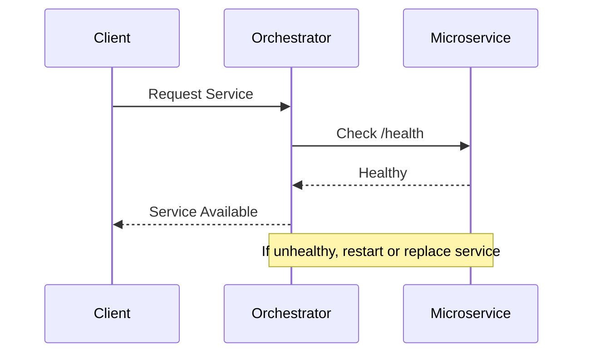

## 8.17 Health Check Pattern

In the realm of microservices architecture, ensuring that each service is healthy and responsive is crucial for maintaining the overall system's reliability and performance. The Health Check Pattern is a design pattern that addresses this need by implementing endpoints in each microservice to report its health status. This pattern is essential for monitoring, diagnosing, and maintaining the health of distributed systems. In this section, we will delve into the Health Check Pattern, focusing on its implementation in C# using ASP.NET Core, and explore how it integrates with orchestrators to ensure service availability and responsiveness.

### Intent

The primary intent of the Health Check Pattern is to provide a standardized way to monitor the health of individual microservices within a distributed system. By exposing health check endpoints, services can report their status, allowing orchestrators and monitoring tools to make informed decisions about service availability, scaling, and fault tolerance.

### Key Participants

- **Microservice**: The individual service that implements the health check endpoint.
- **Health Check Endpoint**: An HTTP endpoint exposed by the microservice to report its health status.
- **Orchestrator**: A tool or platform (e.g., Kubernetes, Docker Swarm) that manages the deployment, scaling, and operation of microservices.
- **Monitoring Tools**: Systems that consume health check data to provide insights and alerts about the system's health.

### Applicability

The Health Check Pattern is applicable in scenarios where:

- You have a distributed system with multiple microservices.
- You need to ensure high availability and reliability of services.
- You want to automate the detection and recovery from service failures.
- You require integration with orchestrators for service management.

### Implementing Health Checks in ASP.NET Core

ASP.NET Core provides robust support for implementing health checks through the `Microsoft.Extensions.Diagnostics.HealthChecks` package. This package allows developers to define health checks for various aspects of a service, such as database connectivity, external service availability, and system resource usage.

#### Setting Up Health Checks

To implement health checks in an ASP.NET Core application, follow these steps:

1. **Install the Health Checks Package**

   First, add the `Microsoft.Extensions.Diagnostics.HealthChecks` package to your project. You can do this via the NuGet Package Manager or by using the following command:

   ```bash
   dotnet add package Microsoft.Extensions.Diagnostics.HealthChecks
   ```

2. **Configure Health Checks in Startup.cs**

   In the `Startup.cs` file, configure the health checks in the `ConfigureServices` method:

   ```csharp
   public void ConfigureServices(IServiceCollection services)
   {
       services.AddHealthChecks()
           .AddCheck<ExampleHealthCheck>("example_health_check");
   }
   ```

   Here, `ExampleHealthCheck` is a custom health check that you will define.

3. **Define a Custom Health Check**

   Create a custom health check by implementing the `IHealthCheck` interface:

   ```csharp
   using Microsoft.Extensions.Diagnostics.HealthChecks;
   using System.Threading;
   using System.Threading.Tasks;

   public class ExampleHealthCheck : IHealthCheck
   {
       public Task<HealthCheckResult> CheckHealthAsync(
           HealthCheckContext context,
           CancellationToken cancellationToken = default)
       {
           // Perform health check logic here
           bool isHealthy = true; // Replace with actual health check logic

           if (isHealthy)
           {
               return Task.FromResult(HealthCheckResult.Healthy("The service is healthy."));
           }

           return Task.FromResult(HealthCheckResult.Unhealthy("The service is unhealthy."));
       }
   }
   ```

   In this example, the health check logic is simplified to always return healthy. In a real-world scenario, you would replace this with logic that checks the actual health of the service.

4. **Expose the Health Check Endpoint**

   In the `Configure` method of `Startup.cs`, map the health check endpoint:

   ```csharp
   public void Configure(IApplicationBuilder app, IWebHostEnvironment env)
   {
       app.UseRouting();

       app.UseEndpoints(endpoints =>
       {
           endpoints.MapHealthChecks("/health");
       });
   }
   ```

   This exposes a `/health` endpoint that returns the health status of the service.

#### Try It Yourself

To experiment with health checks, try modifying the `ExampleHealthCheck` class to include checks for database connectivity or external API availability. You can use the `AddCheck` method to register multiple health checks and see how they affect the overall health status.

### Integrating with Orchestrators

Orchestrators like Kubernetes and Docker Swarm rely on health check endpoints to manage the lifecycle of microservices. By integrating health checks with orchestrators, you can ensure that services are automatically restarted or replaced if they become unhealthy.

#### Kubernetes Health Checks

Kubernetes provides two types of health checks: liveness probes and readiness probes.

- **Liveness Probe**: Determines if a service is running. If the liveness probe fails, Kubernetes will restart the service.
- **Readiness Probe**: Determines if a service is ready to handle requests. If the readiness probe fails, Kubernetes will stop sending traffic to the service.

To configure a liveness probe in Kubernetes, add the following to your deployment YAML file:

```yaml
livenessProbe:
  httpGet:
    path: /health
    port: 80
  initialDelaySeconds: 5
  periodSeconds: 10
```

This configuration checks the `/health` endpoint every 10 seconds, starting 5 seconds after the service is deployed.

#### Docker Swarm Health Checks

In Docker Swarm, health checks can be defined in the `docker-compose.yml` file:

```yaml
services:
  myservice:
    image: myservice:latest
    healthcheck:
      test: ["CMD", "curl", "-f", "http://localhost/health"]
      interval: 30s
      timeout: 10s
      retries: 3
```

This configuration uses the `curl` command to check the `/health` endpoint every 30 seconds, with a timeout of 10 seconds and up to 3 retries.

### Design Considerations

When implementing the Health Check Pattern, consider the following:

- **Granularity**: Determine the level of detail you want to expose in your health checks. You can have simple checks that return a binary healthy/unhealthy status or more detailed checks that provide insights into specific components.
- **Security**: Protect health check endpoints from unauthorized access. Consider using authentication and authorization to restrict access to these endpoints.
- **Performance**: Ensure that health checks do not introduce significant overhead or latency. Avoid performing expensive operations in health check logic.
- **Alerting**: Integrate health checks with monitoring and alerting systems to receive notifications when services become unhealthy.

### Differences and Similarities

The Health Check Pattern is often compared to the Circuit Breaker Pattern. While both patterns aim to improve system resilience, they serve different purposes:

- **Health Check Pattern**: Focuses on monitoring the health of individual services and reporting their status.
- **Circuit Breaker Pattern**: Prevents cascading failures by stopping requests to a service that is likely to fail.

Both patterns can be used together to enhance the reliability and robustness of a microservices architecture.

### Visualizing Health Check Integration

To better understand how health checks integrate with orchestrators, consider the following sequence diagram:



This diagram illustrates the interaction between a client, an orchestrator, and a microservice. The orchestrator checks the health of the microservice before routing client requests to it.

### Knowledge Check

- What is the primary purpose of the Health Check Pattern?
- How do you implement a health check in ASP.NET Core?
- What are the differences between liveness probes and readiness probes in Kubernetes?
- Why is it important to secure health check endpoints?

### Embrace the Journey

Remember, implementing health checks is just one step in building resilient microservices. As you progress, you'll explore more patterns and techniques to enhance your system's reliability and performance. Keep experimenting, stay curious, and enjoy the journey!

## Quiz Time!



### What is the primary purpose of the Health Check Pattern?

- [x] To monitor the health of individual microservices
- [ ] To manage the deployment of microservices
- [ ] To provide a user interface for microservices
- [ ] To handle authentication and authorization

> **Explanation:** The Health Check Pattern is designed to monitor the health of individual microservices and report their status.

### Which package is used in ASP.NET Core to implement health checks?

- [x] Microsoft.Extensions.Diagnostics.HealthChecks
- [ ] Microsoft.AspNetCore.Diagnostics
- [ ] Microsoft.Extensions.Logging
- [ ] Microsoft.AspNetCore.Mvc

> **Explanation:** The `Microsoft.Extensions.Diagnostics.HealthChecks` package provides the necessary tools to implement health checks in ASP.NET Core.

### What is the difference between a liveness probe and a readiness probe in Kubernetes?

- [x] Liveness probes check if a service is running; readiness probes check if a service is ready to handle requests.
- [ ] Liveness probes check if a service is ready to handle requests; readiness probes check if a service is running.
- [ ] Both check if a service is running.
- [ ] Both check if a service is ready to handle requests.

> **Explanation:** Liveness probes determine if a service is running, while readiness probes determine if a service is ready to handle requests.

### How can you secure health check endpoints?

- [x] Use authentication and authorization
- [ ] Expose them publicly
- [ ] Use a different port
- [ ] Disable them in production

> **Explanation:** Securing health check endpoints involves using authentication and authorization to restrict access.

### What should you consider when designing health checks?

- [x] Granularity, security, performance, and alerting
- [ ] Only performance
- [ ] Only security
- [ ] Only granularity

> **Explanation:** When designing health checks, consider granularity, security, performance, and alerting to ensure they are effective and efficient.

### Which tool can be used to check the health of a service in Docker Swarm?

- [x] curl
- [ ] wget
- [ ] ping
- [ ] traceroute

> **Explanation:** The `curl` command is commonly used to check the health of a service in Docker Swarm by accessing the health check endpoint.

### What is a potential pitfall of health checks?

- [x] Introducing significant overhead or latency
- [ ] Improving system reliability
- [ ] Enhancing service availability
- [ ] Providing detailed insights

> **Explanation:** A potential pitfall of health checks is introducing significant overhead or latency if they perform expensive operations.

### How do health checks integrate with monitoring tools?

- [x] By providing data for insights and alerts
- [ ] By replacing monitoring tools
- [ ] By disabling alerts
- [ ] By reducing data visibility

> **Explanation:** Health checks integrate with monitoring tools by providing data that can be used for insights and alerts about the system's health.

### Can health checks be used with the Circuit Breaker Pattern?

- [x] Yes
- [ ] No

> **Explanation:** Health checks can be used alongside the Circuit Breaker Pattern to enhance system resilience and reliability.

### True or False: Health checks should always be exposed publicly.

- [ ] True
- [x] False

> **Explanation:** Health checks should not be exposed publicly; they should be secured to prevent unauthorized access.


