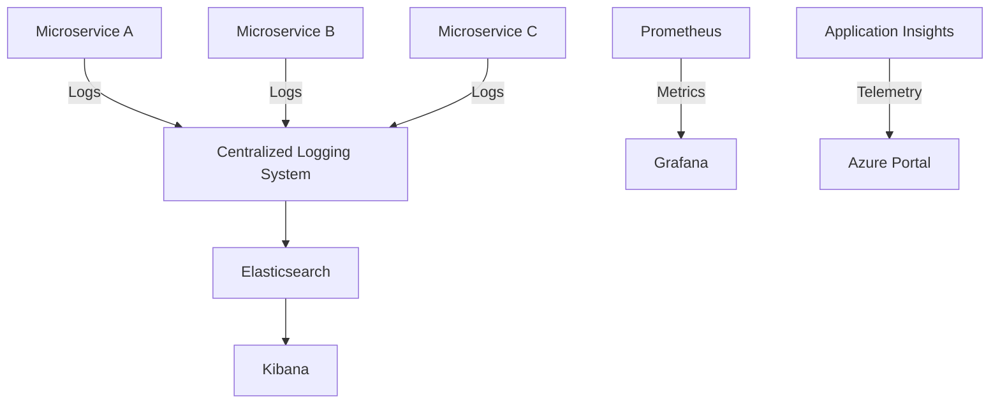

## 8.18 Distributed Logging and Monitoring

In the world of microservices, where applications are broken down into smaller, independent services, the need for effective logging and monitoring becomes paramount. Distributed logging and monitoring are crucial for maintaining the health, performance, and reliability of microservices architectures. This section will delve into the concepts, tools, and best practices for implementing distributed logging and monitoring in C# microservices.

### Understanding Distributed Logging

Distributed logging involves collecting and centralizing logs from multiple services to provide a cohesive view of the system's behavior. This is essential in microservices, where each service runs independently and may be deployed across different environments.

#### Importance of Distributed Logging

1. **Troubleshooting and Debugging**: Logs provide insights into the application's behavior, helping developers identify and fix issues quickly.
2. **Performance Monitoring**: By analyzing logs, you can detect performance bottlenecks and optimize resource usage.
3. **Security Auditing**: Logs can be used to track access and changes, ensuring compliance with security policies.
4. **Operational Insights**: Logs offer valuable data for understanding user behavior and system usage patterns.

#### Implementing Centralized Logging

Centralized logging aggregates logs from all services into a single location, making it easier to search, analyze, and visualize log data. Let's explore some popular tools for implementing centralized logging in C# microservices.

##### Using Serilog

Serilog is a popular logging library for .NET applications, known for its structured logging capabilities. It allows you to log data in a structured format, making it easier to query and analyze.

```csharp
using Serilog;

public class Program
{
    public static void Main(string[] args)
    {
        Log.Logger = new LoggerConfiguration()
            .WriteTo.Console()
            .WriteTo.File("logs/log.txt", rollingInterval: RollingInterval.Day)
            .CreateLogger();

        Log.Information("Application Starting");

        try
        {
            // Application code here
        }
        catch (Exception ex)
        {
            Log.Error(ex, "An error occurred");
        }
        finally
        {
            Log.CloseAndFlush();
        }
    }
}
```

**Key Features of Serilog**:
- **Structured Logging**: Log data in a structured format (e.g., JSON).
- **Sinks**: Output logs to various destinations, such as files, databases, or external services.
- **Enrichers**: Add additional context to log events, such as user information or request IDs.

##### Using NLog

NLog is another powerful logging library for .NET, offering flexibility and ease of use. It supports a wide range of targets and layouts, making it suitable for various logging scenarios.

```csharp
using NLog;

public class Program
{
    private static readonly Logger Logger = LogManager.GetCurrentClassLogger();

    public static void Main(string[] args)
    {
        Logger.Info("Application Starting");

        try
        {
            // Application code here
        }
        catch (Exception ex)
        {
            Logger.Error(ex, "An error occurred");
        }
    }
}
```

**Key Features of NLog**:
- **Configurable Targets**: Log to files, databases, email, and more.
- **Flexible Layouts**: Customize the format of log messages.
- **Rich Configuration**: Configure logging behavior using XML or JSON files.

##### Elasticsearch and Kibana

Elasticsearch and Kibana are often used together to create a powerful logging and visualization stack. Elasticsearch stores and indexes log data, while Kibana provides a web interface for searching and visualizing logs.

**Setting Up Elasticsearch and Kibana**:
1. **Install Elasticsearch**: Download and install Elasticsearch on your server.
2. **Configure Elasticsearch**: Set up indices and mappings for your log data.
3. **Install Kibana**: Download and install Kibana, and configure it to connect to your Elasticsearch instance.
4. **Visualize Logs**: Use Kibana's dashboards and visualizations to explore your log data.

**Benefits**:
- **Scalability**: Elasticsearch can handle large volumes of log data.
- **Real-Time Search**: Quickly search and filter logs using Kibana's interface.
- **Custom Dashboards**: Create custom visualizations to monitor specific metrics.

### Monitoring Tools for Microservices

Monitoring tools provide real-time insights into the health and performance of your microservices. They help you detect issues, track resource usage, and ensure that your services are running smoothly.

#### Application Insights

Application Insights is a powerful monitoring service from Microsoft, designed for .NET applications. It provides detailed telemetry data, including request rates, response times, and error rates.

**Integrating Application Insights**:
1. **Install the SDK**: Add the Application Insights SDK to your project.
2. **Configure Telemetry**: Set up telemetry collection for your application.
3. **Analyze Data**: Use the Azure portal to explore telemetry data and set up alerts.

**Key Features**:
- **Automatic Instrumentation**: Automatically collect telemetry data without modifying your code.
- **Custom Metrics**: Track custom metrics specific to your application.
- **Alerts and Notifications**: Set up alerts for specific conditions, such as high error rates or slow response times.

#### Prometheus

Prometheus is an open-source monitoring and alerting toolkit, widely used in microservices environments. It collects metrics from your services and stores them in a time-series database.

**Setting Up Prometheus**:
1. **Install Prometheus**: Download and install Prometheus on your server.
2. **Configure Scraping**: Set up Prometheus to scrape metrics from your services.
3. **Visualize Metrics**: Use Prometheus's built-in web interface or integrate with Grafana for advanced visualizations.

**Key Features**:
- **Multi-Dimensional Data Model**: Store metrics with labels for flexible querying.
- **Powerful Query Language**: Use PromQL to query and analyze metrics.
- **Alerting**: Set up alerts based on metric thresholds or conditions.

### Designing a Distributed Logging and Monitoring System

When designing a distributed logging and monitoring system, consider the following best practices:

1. **Centralized Log Aggregation**: Use tools like Elasticsearch and Kibana to aggregate logs from all services.
2. **Structured Logging**: Use structured logging libraries like Serilog to log data in a consistent format.
3. **Real-Time Monitoring**: Implement monitoring tools like Application Insights or Prometheus to track service health and performance.
4. **Alerting and Notifications**: Set up alerts for critical conditions, such as service downtime or high error rates.
5. **Scalability**: Ensure that your logging and monitoring system can handle the scale of your microservices architecture.
6. **Security and Compliance**: Protect log data and ensure compliance with security policies.

### Visualizing Distributed Logging and Monitoring

To better understand the flow of data in a distributed logging and monitoring system, let's visualize the architecture using Mermaid.js diagrams.



**Diagram Description**: This diagram illustrates a typical distributed logging and monitoring architecture. Microservices A, B, and C send logs to a centralized logging system, which stores them in Elasticsearch. Kibana provides a web interface for visualizing logs. Prometheus collects metrics from services and visualizes them using Grafana. Application Insights sends telemetry data to the Azure portal for analysis.

### Try It Yourself

To deepen your understanding of distributed logging and monitoring, try the following exercises:

1. **Set Up Serilog**: Implement Serilog in a sample C# microservice and log structured data to a file.
2. **Integrate NLog**: Use NLog to log messages to a database and explore different layout configurations.
3. **Deploy Elasticsearch and Kibana**: Set up Elasticsearch and Kibana on a local server and visualize log data from your microservices.
4. **Monitor with Application Insights**: Integrate Application Insights into a .NET application and analyze telemetry data in the Azure portal.
5. **Explore Prometheus**: Install Prometheus and configure it to scrape metrics from a sample microservice. Visualize the metrics using Grafana.

### Knowledge Check

Before moving on, let's review some key takeaways:

- Distributed logging and monitoring are essential for maintaining the health and performance of microservices.
- Centralized logging aggregates logs from all services, making it easier to search and analyze log data.
- Tools like Serilog, NLog, Elasticsearch, and Kibana are popular choices for implementing distributed logging.
- Monitoring tools like Application Insights and Prometheus provide real-time insights into service health and performance.
- Designing a distributed logging and monitoring system requires careful consideration of scalability, security, and compliance.

### Embrace the Journey

Remember, mastering distributed logging and monitoring is a journey. As you experiment with different tools and techniques, you'll gain valuable insights into your microservices architecture. Keep exploring, stay curious, and enjoy the process!

## Quiz Time!



### What is the primary purpose of distributed logging in microservices?

- [x] To collect and centralize logs from all microservices
- [ ] To increase the performance of microservices
- [ ] To reduce the number of microservices
- [ ] To enhance the security of microservices

> **Explanation:** Distributed logging collects and centralizes logs from all microservices to provide a cohesive view of the system's behavior.

### Which logging library is known for its structured logging capabilities in .NET?

- [x] Serilog
- [ ] Log4Net
- [ ] NLog
- [ ] ELK Stack

> **Explanation:** Serilog is known for its structured logging capabilities, allowing logs to be stored in a structured format like JSON.

### What is the role of Kibana in a logging system?

- [x] To provide a web interface for searching and visualizing logs
- [ ] To store and index log data
- [ ] To collect metrics from services
- [ ] To send telemetry data to the Azure portal

> **Explanation:** Kibana provides a web interface for searching and visualizing logs stored in Elasticsearch.

### Which tool is used for monitoring .NET applications and provides detailed telemetry data?

- [ ] Prometheus
- [ ] Grafana
- [x] Application Insights
- [ ] Elasticsearch

> **Explanation:** Application Insights is a monitoring service from Microsoft designed for .NET applications, providing detailed telemetry data.

### What is the primary function of Prometheus in a monitoring system?

- [x] To collect metrics from services and store them in a time-series database
- [ ] To visualize logs from microservices
- [ ] To send alerts and notifications
- [ ] To provide a web interface for telemetry data

> **Explanation:** Prometheus collects metrics from services and stores them in a time-series database for analysis.

### Which of the following is a best practice for designing a distributed logging and monitoring system?

- [x] Centralized Log Aggregation
- [ ] Decentralized Log Storage
- [ ] Manual Log Analysis
- [ ] Ignoring Security and Compliance

> **Explanation:** Centralized log aggregation is a best practice for designing a distributed logging and monitoring system, making it easier to search and analyze log data.

### What is the benefit of using structured logging?

- [x] Easier to query and analyze log data
- [ ] Reduces the size of log files
- [ ] Increases the speed of logging
- [ ] Enhances the security of logs

> **Explanation:** Structured logging makes it easier to query and analyze log data by storing it in a consistent format.

### Which tool is often used with Prometheus for advanced visualizations?

- [ ] Elasticsearch
- [ ] Kibana
- [x] Grafana
- [ ] Application Insights

> **Explanation:** Grafana is often used with Prometheus for advanced visualizations of metrics.

### True or False: Application Insights can automatically collect telemetry data without modifying your code.

- [x] True
- [ ] False

> **Explanation:** Application Insights can automatically collect telemetry data without modifying your code, thanks to its automatic instrumentation feature.

### Which diagramming tool is used to visualize distributed logging and monitoring architecture in this guide?

- [ ] UML
- [ ] Visio
- [x] Mermaid.js
- [ ] Lucidchart

> **Explanation:** Mermaid.js is used in this guide to visualize distributed logging and monitoring architecture.


