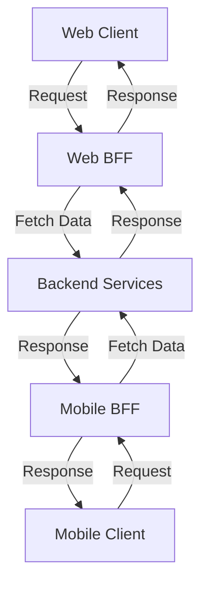

## 8.19 Backends for Frontends (BFF) Pattern

The Backends for Frontends (BFF) pattern is a microservices design pattern that creates specialized backend services tailored to different client types, such as web, mobile, and other clients. This pattern is particularly useful in scenarios where different clients have varying requirements for data and functionality, allowing for optimized performance and user experience.

### Introduction to the BFF Pattern

The BFF pattern addresses the challenge of serving multiple client applications with distinct needs from a single backend service. By creating separate backend services for each client type, developers can tailor the data and functionality provided to each client, ensuring optimal performance and user experience.

#### Key Concepts

- **Client-Specific Backends**: Each client type (e.g., web, mobile) has its own dedicated backend service.
- **Optimized Data Handling**: Tailor data responses to meet the specific needs of each client.
- **Improved User Experience**: Enhance performance and responsiveness by reducing unnecessary data transfer and processing.

### Implementing BFF in C#

Implementing the BFF pattern in C# involves developing separate backend services for different client types. This section will guide you through the process of creating and managing these services using C# and .NET technologies.

#### Developing Separate Backends

1. **Identify Client Needs**: Determine the specific requirements of each client type, including data formats, response times, and functionality.
2. **Design Client-Specific APIs**: Create APIs that cater to the unique needs of each client, ensuring efficient data handling and processing.
3. **Implement Backend Services**: Develop backend services using C# and .NET, leveraging frameworks like ASP.NET Core to build robust and scalable APIs.

##### Example: Web and Mobile Backends

Let's consider a scenario where we have a web application and a mobile application, each with different data requirements. We'll create separate BFF services for each client type.

```csharp
// Web Backend Service
public class WebBackendService
{
    public async Task<WebData> GetWebDataAsync()
    {
        // Fetch and process data specific to the web client
        return await FetchWebData();
    }
}

// Mobile Backend Service
public class MobileBackendService
{
    public async Task<MobileData> GetMobileDataAsync()
    {
        // Fetch and process data specific to the mobile client
        return await FetchMobileData();
    }
}
```

In this example, `WebBackendService` and `MobileBackendService` are tailored to the specific needs of web and mobile clients, respectively.

#### Use Cases and Examples

The BFF pattern is particularly useful in scenarios where different client types have distinct requirements. Here are some common use cases:

- **Enhanced Performance**: By tailoring data responses to each client, you can reduce unnecessary data transfer and processing, improving performance.
- **Improved User Experience**: Providing client-specific functionality and data can enhance the user experience by ensuring that each client receives exactly what it needs.
- **Simplified Development**: By separating backend logic for different clients, you can simplify development and maintenance, reducing complexity.

##### Example: E-commerce Platform

Consider an e-commerce platform with both web and mobile applications. The web application may require detailed product information and high-resolution images, while the mobile application may only need basic product details and thumbnail images.

```csharp
// Web Product Service
public class WebProductService
{
    public async Task<ProductDetails> GetProductDetailsAsync(int productId)
    {
        // Fetch detailed product information for web client
        return await FetchDetailedProductInfo(productId);
    }
}

// Mobile Product Service
public class MobileProductService
{
    public async Task<ProductSummary> GetProductSummaryAsync(int productId)
    {
        // Fetch basic product information for mobile client
        return await FetchBasicProductInfo(productId);
    }
}
```

In this example, `WebProductService` and `MobileProductService` provide tailored product information for web and mobile clients, respectively.

### Design Considerations

When implementing the BFF pattern, consider the following design considerations:

- **Scalability**: Ensure that each backend service can scale independently to handle varying loads from different clients.
- **Security**: Implement security measures to protect client-specific data and functionality.
- **Maintainability**: Design backend services to be maintainable and extensible, allowing for easy updates and modifications.

#### Differences and Similarities

The BFF pattern is often compared to other microservices patterns, such as the API Gateway pattern. While both patterns involve creating intermediaries between clients and backend services, the BFF pattern focuses on creating client-specific backends, whereas the API Gateway pattern typically involves a single gateway for all clients.

### Visualizing the BFF Pattern

To better understand the BFF pattern, let's visualize the architecture using a Mermaid.js diagram.



This diagram illustrates how web and mobile clients interact with their respective BFF services, which in turn communicate with shared backend services.

### Try It Yourself

To gain hands-on experience with the BFF pattern, try implementing your own BFF services for a simple application. Experiment with different data formats and response times to see how they affect performance and user experience.

### Knowledge Check

- What are the key benefits of using the BFF pattern?
- How does the BFF pattern differ from the API Gateway pattern?
- What are some common use cases for the BFF pattern?

### Embrace the Journey

Remember, mastering the BFF pattern is just one step in your journey to becoming an expert in C# design patterns and microservices architecture. Keep experimenting, stay curious, and enjoy the journey!

### References and Links

For further reading on the BFF pattern and microservices architecture, consider the following resources:

- [Microsoft Docs: Microservices Architecture](https://docs.microsoft.com/en-us/dotnet/architecture/microservices/)
- [Martin Fowler: Backends for Frontends](https://martinfowler.com/articles/bff.html)

## Quiz Time!



### What is the primary purpose of the BFF pattern?

- [x] To create specialized backend services tailored to different client types
- [ ] To provide a single gateway for all client requests
- [ ] To enhance security by isolating backend services
- [ ] To simplify database interactions

> **Explanation:** The BFF pattern focuses on creating specialized backend services for different client types, optimizing performance and user experience.

### Which of the following is a key benefit of the BFF pattern?

- [x] Enhanced performance and user experience
- [ ] Simplified database schema
- [ ] Reduced code duplication
- [ ] Increased security

> **Explanation:** The BFF pattern enhances performance and user experience by tailoring backend services to the specific needs of each client type.

### How does the BFF pattern differ from the API Gateway pattern?

- [x] The BFF pattern creates client-specific backends, while the API Gateway pattern uses a single gateway for all clients.
- [ ] The BFF pattern focuses on security, while the API Gateway pattern focuses on performance.
- [ ] The BFF pattern is used for mobile clients only, while the API Gateway pattern is used for web clients.
- [ ] The BFF pattern is a subset of the API Gateway pattern.

> **Explanation:** The BFF pattern creates separate backends for different client types, whereas the API Gateway pattern typically involves a single gateway for all clients.

### What is a common use case for the BFF pattern?

- [x] E-commerce platforms with both web and mobile applications
- [ ] Single-page applications with no backend
- [ ] Command-line tools with no user interface
- [ ] Desktop applications with local databases

> **Explanation:** The BFF pattern is commonly used in scenarios where different client types, such as web and mobile applications, have distinct requirements.

### Which C# framework is commonly used to implement BFF services?

- [x] ASP.NET Core
- [ ] Windows Forms
- [ ] Xamarin
- [ ] Unity

> **Explanation:** ASP.NET Core is a popular framework for building robust and scalable APIs, making it suitable for implementing BFF services.

### What should be considered when designing BFF services?

- [x] Scalability, security, and maintainability
- [ ] Database normalization, indexing, and sharding
- [ ] User interface design, accessibility, and localization
- [ ] Hardware compatibility, drivers, and firmware updates

> **Explanation:** When designing BFF services, it's important to consider scalability, security, and maintainability to ensure robust and efficient backend solutions.

### How can the BFF pattern improve user experience?

- [x] By providing client-specific functionality and data
- [ ] By reducing the number of backend services
- [ ] By increasing the complexity of client applications
- [ ] By enforcing strict data validation rules

> **Explanation:** The BFF pattern improves user experience by tailoring data and functionality to the specific needs of each client, ensuring optimal performance and responsiveness.

### What is a potential drawback of the BFF pattern?

- [x] Increased complexity in managing multiple backend services
- [ ] Reduced flexibility in client applications
- [ ] Limited scalability for backend services
- [ ] Decreased security for client data

> **Explanation:** The BFF pattern can increase complexity by requiring the management of multiple backend services, each tailored to different client types.

### What is the role of a BFF service in the BFF pattern?

- [x] To act as an intermediary between a specific client type and backend services
- [ ] To replace all backend services with a single service
- [ ] To handle database interactions for all clients
- [ ] To provide a user interface for client applications

> **Explanation:** A BFF service acts as an intermediary, providing tailored data and functionality to a specific client type, while communicating with shared backend services.

### True or False: The BFF pattern is only applicable to mobile applications.

- [ ] True
- [x] False

> **Explanation:** The BFF pattern is applicable to any client type, including web, mobile, and other clients, where tailored backend services can enhance performance and user experience.




