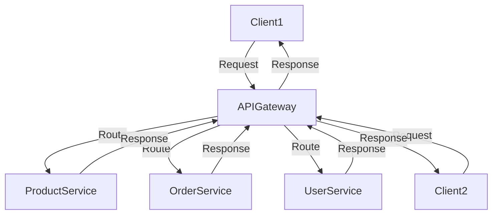

## 8.2 API Gateway Pattern

In the realm of microservices architecture, the API Gateway Pattern serves as a pivotal design strategy, acting as a single entry point for all client requests and routing them to the appropriate microservices. This pattern is instrumental in managing the complexity of microservices by centralizing access control, routing, and handling cross-cutting concerns such as authentication, logging, and rate limiting. In this section, we will delve into the intricacies of the API Gateway Pattern, its implementation in C# using Ocelot, and explore practical use cases and examples.

### Introduction to API Gateway Pattern

The API Gateway Pattern is a design pattern that provides a unified entry point for client requests in a microservices architecture. It acts as a reverse proxy, routing requests to the appropriate backend services. This pattern is essential for managing the complexity of microservices by centralizing access control, routing, and handling cross-cutting concerns.

#### Key Concepts

- **Single Entry Point**: The API Gateway serves as the single entry point for all client requests, simplifying the client-side architecture.
- **Routing**: It routes requests to the appropriate microservices based on the request path, headers, or other criteria.
- **Cross-Cutting Concerns**: The API Gateway handles cross-cutting concerns such as authentication, logging, rate limiting, and more.

### Implementing API Gateway in C#

Implementing an API Gateway in C# can be achieved using various libraries and frameworks. One of the most popular choices is Ocelot, a lightweight API Gateway built on .NET Core. Ocelot provides a range of features to facilitate the implementation of an API Gateway in a microservices architecture.

#### Using Ocelot API Gateway

Ocelot is a powerful and flexible API Gateway solution for .NET Core applications. It provides a range of features, including request routing, load balancing, authentication, and more. Let's explore how to implement an API Gateway using Ocelot in C#.

##### Setting Up Ocelot

To get started with Ocelot, you need to create a new .NET Core project and install the Ocelot NuGet package. Here's a step-by-step guide to setting up Ocelot:

1. **Create a New .NET Core Project**: Start by creating a new .NET Core Web API project using the following command:

   ```bash
   dotnet new webapi -n ApiGateway
   ```

2. **Install Ocelot NuGet Package**: Add the Ocelot NuGet package to your project using the following command:

   ```bash
   dotnet add package Ocelot
   ```

3. **Configure Ocelot**: Create a `ocelot.json` configuration file in the root of your project. This file defines the routing and other settings for your API Gateway. Here's an example configuration:

   ```json
   {
     "Routes": [
       {
         "DownstreamPathTemplate": "/api/products",
         "DownstreamScheme": "http",
         "DownstreamHostAndPorts": [
           {
             "Host": "localhost",
             "Port": 5001
           }
         ],
         "UpstreamPathTemplate": "/products",
         "UpstreamHttpMethod": [ "Get" ]
       }
     ],
     "GlobalConfiguration": {
       "BaseUrl": "http://localhost:5000"
     }
   }
   ```

4. **Configure Startup Class**: In the `Startup.cs` file, configure Ocelot in the `ConfigureServices` and `Configure` methods:

   ```csharp
   public class Startup
   {
       public void ConfigureServices(IServiceCollection services)
       {
           services.AddOcelot();
       }

       public void Configure(IApplicationBuilder app, IWebHostEnvironment env)
       {
           if (env.IsDevelopment())
           {
               app.UseDeveloperExceptionPage();
           }

           app.UseRouting();
           app.UseEndpoints(endpoints =>
           {
               endpoints.MapControllers();
           });

           app.UseOcelot().Wait();
       }
   }
   ```

5. **Run the API Gateway**: Start the API Gateway using the following command:

   ```bash
   dotnet run
   ```

With these steps, you have set up a basic API Gateway using Ocelot in C#. The API Gateway will route requests from `/products` to the downstream service running on `localhost:5001`.

##### Handling Cross-Cutting Concerns

One of the key benefits of using an API Gateway is the ability to handle cross-cutting concerns in a centralized manner. Ocelot provides various middleware components to address these concerns.

###### Authentication and Authorization

Ocelot supports authentication and authorization using JWT tokens. You can configure authentication in the `ocelot.json` file by adding the `AuthenticationOptions` section:

```json
{
  "Routes": [
    {
      "DownstreamPathTemplate": "/api/products",
      "DownstreamScheme": "http",
      "DownstreamHostAndPorts": [
        {
          "Host": "localhost",
          "Port": 5001
        }
      ],
      "UpstreamPathTemplate": "/products",
      "UpstreamHttpMethod": [ "Get" ],
      "AuthenticationOptions": {
        "AuthenticationProviderKey": "Bearer",
        "AllowedScopes": []
      }
    }
  ],
  "GlobalConfiguration": {
    "BaseUrl": "http://localhost:5000"
  }
}
```

In the `Startup.cs` file, configure the authentication middleware:

```csharp
public void ConfigureServices(IServiceCollection services)
{
    services.AddAuthentication("Bearer")
        .AddJwtBearer("Bearer", options =>
        {
            options.Authority = "https://your-auth-server";
            options.RequireHttpsMetadata = false;
            options.Audience = "api1";
        });

    services.AddOcelot();
}
```

###### Logging

Ocelot allows you to integrate logging using popular logging frameworks like Serilog or NLog. You can configure logging in the `ocelot.json` file by adding the `Logging` section:

```json
{
  "GlobalConfiguration": {
    "BaseUrl": "http://localhost:5000",
    "Logging": {
      "LogLevel": {
        "Default": "Information",
        "Microsoft": "Warning",
        "Ocelot": "Debug"
      }
    }
  }
}
```

###### Rate Limiting

Rate limiting is crucial for protecting your services from excessive requests. Ocelot provides rate limiting capabilities that can be configured in the `ocelot.json` file:

```json
{
  "Routes": [
    {
      "DownstreamPathTemplate": "/api/products",
      "DownstreamScheme": "http",
      "DownstreamHostAndPorts": [
        {
          "Host": "localhost",
          "Port": 5001
        }
      ],
      "UpstreamPathTemplate": "/products",
      "UpstreamHttpMethod": [ "Get" ],
      "RateLimitOptions": {
        "ClientWhitelist": [],
        "EnableRateLimiting": true,
        "Period": "1s",
        "PeriodTimespan": 1,
        "Limit": 5
      }
    }
  ],
  "GlobalConfiguration": {
    "BaseUrl": "http://localhost:5000"
  }
}
```

### Use Cases and Examples

The API Gateway Pattern is widely used in microservices architectures to address various challenges. Let's explore some common use cases and examples.

#### Centralizing Access Control and Routing

One of the primary use cases of the API Gateway Pattern is centralizing access control and routing. By acting as a single entry point, the API Gateway can enforce security policies, route requests to the appropriate services, and provide a consistent interface for clients.

##### Example: E-commerce Platform

Consider an e-commerce platform with multiple microservices, such as product, order, and user services. An API Gateway can be used to centralize access control and routing for these services.

- **Product Service**: Handles product-related operations, such as retrieving product details and managing inventory.
- **Order Service**: Manages order processing, including order creation, payment, and fulfillment.
- **User Service**: Manages user accounts, authentication, and authorization.

The API Gateway can route requests to the appropriate service based on the request path. For example, requests to `/products` are routed to the Product Service, while requests to `/orders` are routed to the Order Service.

##### Example Configuration

Here's an example `ocelot.json` configuration for an e-commerce platform:

```json
{
  "Routes": [
    {
      "DownstreamPathTemplate": "/api/products",
      "DownstreamScheme": "http",
      "DownstreamHostAndPorts": [
        {
          "Host": "localhost",
          "Port": 5001
        }
      ],
      "UpstreamPathTemplate": "/products",
      "UpstreamHttpMethod": [ "Get" ]
    },
    {
      "DownstreamPathTemplate": "/api/orders",
      "DownstreamScheme": "http",
      "DownstreamHostAndPorts": [
        {
          "Host": "localhost",
          "Port": 5002
        }
      ],
      "UpstreamPathTemplate": "/orders",
      "UpstreamHttpMethod": [ "Post" ]
    },
    {
      "DownstreamPathTemplate": "/api/users",
      "DownstreamScheme": "http",
      "DownstreamHostAndPorts": [
        {
          "Host": "localhost",
          "Port": 5003
        }
      ],
      "UpstreamPathTemplate": "/users",
      "UpstreamHttpMethod": [ "Get", "Post" ]
    }
  ],
  "GlobalConfiguration": {
    "BaseUrl": "http://localhost:5000"
  }
}
```

### Design Considerations

When implementing the API Gateway Pattern, there are several design considerations to keep in mind.

#### Performance and Scalability

The API Gateway can become a bottleneck if not designed for performance and scalability. Consider using load balancing and caching to improve performance and ensure the API Gateway can handle high traffic volumes.

#### Security

Security is a critical aspect of the API Gateway Pattern. Ensure that the API Gateway enforces authentication and authorization policies and protects against common security threats, such as DDoS attacks and SQL injection.

#### Fault Tolerance

Implement fault tolerance mechanisms, such as circuit breakers and retries, to ensure the API Gateway can handle failures gracefully and maintain service availability.

#### Monitoring and Logging

Monitoring and logging are essential for maintaining the health and performance of the API Gateway. Use logging frameworks and monitoring tools to track request metrics, identify issues, and optimize performance.

### Differences and Similarities

The API Gateway Pattern is often compared to other patterns, such as the Backend for Frontend (BFF) Pattern and the Service Mesh Pattern. Let's explore the differences and similarities between these patterns.

#### API Gateway vs. Backend for Frontend (BFF)

- **API Gateway**: Provides a single entry point for all client requests and routes them to the appropriate microservices. It handles cross-cutting concerns and provides a consistent interface for clients.
- **Backend for Frontend (BFF)**: Provides a tailored backend for each client type (e.g., web, mobile) to optimize performance and user experience. It focuses on client-specific needs and reduces the complexity of client-side code.

#### API Gateway vs. Service Mesh

- **API Gateway**: Focuses on routing and handling cross-cutting concerns at the application layer. It provides a centralized entry point for client requests.
- **Service Mesh**: Focuses on communication between microservices at the network layer. It provides features such as service discovery, load balancing, and traffic management.

### Try It Yourself

To deepen your understanding of the API Gateway Pattern, try implementing an API Gateway using Ocelot in a sample microservices project. Experiment with different configurations, such as adding authentication, logging, and rate limiting. Consider integrating additional features, such as caching and load balancing, to optimize performance.

### Visualizing API Gateway Pattern

To better understand the API Gateway Pattern, let's visualize its architecture using a Mermaid.js diagram.



**Diagram Description**: This diagram illustrates the API Gateway Pattern in a microservices architecture. The API Gateway acts as a single entry point for client requests, routing them to the appropriate microservices (ProductService, OrderService, UserService) and returning responses to the clients.

### Knowledge Check

To reinforce your understanding of the API Gateway Pattern, consider the following questions:

1. What are the key responsibilities of an API Gateway in a microservices architecture?
2. How does Ocelot facilitate the implementation of an API Gateway in C#?
3. What are some common cross-cutting concerns that an API Gateway can handle?
4. How does the API Gateway Pattern differ from the Backend for Frontend (BFF) Pattern?
5. What are some design considerations to keep in mind when implementing an API Gateway?

### Summary

In this section, we explored the API Gateway Pattern, a crucial design strategy for managing the complexity of microservices architectures. We discussed the implementation of an API Gateway in C# using Ocelot, handling cross-cutting concerns, and centralizing access control and routing. By understanding and applying the API Gateway Pattern, you can enhance the scalability, security, and maintainability of your microservices architecture.

### Embrace the Journey

As you continue your journey in mastering C# design patterns, remember that the API Gateway Pattern is just one of many tools in your toolkit. Keep experimenting, stay curious, and enjoy the journey of building scalable and maintainable applications in the .NET ecosystem.

## Quiz Time!



### What is the primary role of an API Gateway in a microservices architecture?

- [x] To act as a single entry point for client requests and route them to appropriate microservices.
- [ ] To directly connect clients to each microservice.
- [ ] To store data for microservices.
- [ ] To replace microservices with monolithic architecture.

> **Explanation:** The API Gateway serves as a single entry point for client requests, routing them to the appropriate microservices.

### Which library is commonly used to implement an API Gateway in C#?

- [x] Ocelot
- [ ] Dapper
- [ ] Entity Framework
- [ ] AutoMapper

> **Explanation:** Ocelot is a popular library for implementing API Gateways in C#.

### What is a key benefit of using an API Gateway?

- [x] Centralizing cross-cutting concerns such as authentication and logging.
- [ ] Increasing the number of microservices.
- [ ] Reducing the need for client-side code.
- [ ] Eliminating the need for load balancing.

> **Explanation:** An API Gateway centralizes cross-cutting concerns, simplifying the architecture and enhancing security.

### How does the API Gateway Pattern differ from the Backend for Frontend (BFF) Pattern?

- [x] API Gateway provides a single entry point for all clients, while BFF provides tailored backends for each client type.
- [ ] API Gateway is used only for mobile applications, while BFF is for web applications.
- [ ] API Gateway focuses on database management, while BFF focuses on UI design.
- [ ] API Gateway and BFF are the same.

> **Explanation:** The API Gateway provides a single entry point, while BFF provides client-specific backends.

### What is a common cross-cutting concern handled by an API Gateway?

- [x] Authentication
- [ ] Database indexing
- [ ] UI rendering
- [ ] File storage

> **Explanation:** Authentication is a common cross-cutting concern managed by an API Gateway.

### What is a design consideration when implementing an API Gateway?

- [x] Ensuring performance and scalability.
- [ ] Reducing the number of microservices.
- [ ] Increasing the complexity of client-side code.
- [ ] Avoiding the use of authentication.

> **Explanation:** Performance and scalability are crucial design considerations for an API Gateway.

### Which of the following is NOT a feature of Ocelot?

- [ ] Request routing
- [ ] Load balancing
- [x] Database management
- [ ] Authentication

> **Explanation:** Ocelot does not manage databases; it focuses on routing, load balancing, and authentication.

### What is the purpose of rate limiting in an API Gateway?

- [x] To protect services from excessive requests.
- [ ] To increase the number of requests.
- [ ] To store data in the database.
- [ ] To enhance UI design.

> **Explanation:** Rate limiting protects services from being overwhelmed by excessive requests.

### Which pattern focuses on communication between microservices at the network layer?

- [ ] API Gateway
- [x] Service Mesh
- [ ] Backend for Frontend (BFF)
- [ ] Singleton

> **Explanation:** Service Mesh focuses on network-layer communication between microservices.

### True or False: An API Gateway can handle logging and monitoring for microservices.

- [x] True
- [ ] False

> **Explanation:** An API Gateway can centralize logging and monitoring, providing insights into microservices' performance and health.


