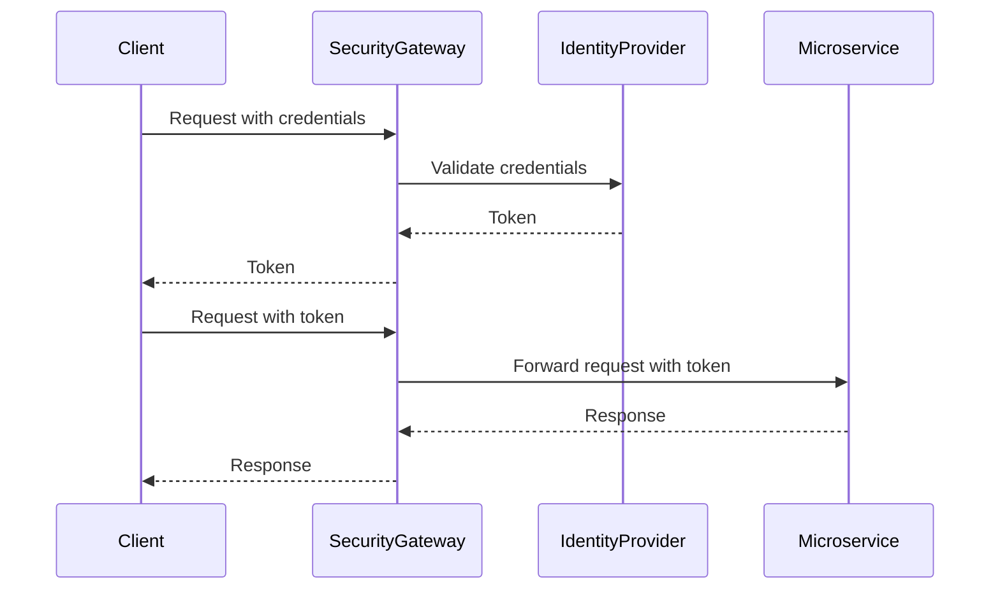

## 8.20 Security Gateway Pattern

In the realm of microservices architecture, managing security is a complex challenge. The Security Gateway Pattern emerges as a robust solution to centralize security concerns such as authentication and authorization at the gateway level. This pattern not only simplifies security management but also enhances the scalability and maintainability of your microservices ecosystem. In this section, we will delve into the intricacies of the Security Gateway Pattern, explore its implementation in C# using IdentityServer4 and OAuth, and provide practical insights for expert software engineers and enterprise architects.

### Intent

The Security Gateway Pattern aims to centralize security functions, such as authentication and authorization, at a single entry point in a microservices architecture. By doing so, it ensures that all incoming requests are validated and authorized before reaching the backend services. This pattern helps in maintaining a consistent security posture across the system and reduces the complexity of managing security in individual microservices.

### Key Participants

- **Security Gateway**: Acts as the central point for handling authentication and authorization. It intercepts incoming requests, validates credentials, and enforces security policies.
- **Identity Provider**: A service that authenticates users and issues security tokens. IdentityServer4 is a popular choice in the .NET ecosystem.
- **Microservices**: The backend services that perform business logic. They rely on the Security Gateway to ensure that only authorized requests are processed.
- **Clients**: Applications or users that interact with the microservices. They must authenticate through the Security Gateway to access the services.

### Applicability

The Security Gateway Pattern is applicable in scenarios where:

- You have a microservices architecture with multiple services requiring consistent security policies.
- You need to centralize authentication and authorization to simplify security management.
- You want to offload security concerns from individual microservices to a dedicated gateway.
- You are using OAuth or OpenID Connect for authentication and authorization.

### Implementing Security Gateways in C#

Implementing a Security Gateway in C# involves setting up a gateway service that handles authentication and authorization using IdentityServer4 and OAuth. Let's explore the steps involved in this process.

#### Setting Up IdentityServer4

IdentityServer4 is an open-source framework for implementing authentication and authorization in .NET applications. It supports OAuth 2.0 and OpenID Connect, making it an ideal choice for building a Security Gateway.

1. **Install IdentityServer4**: Start by creating a new ASP.NET Core project and install the IdentityServer4 NuGet package.

   ```bash
   dotnet new webapi -n SecurityGateway
   cd SecurityGateway
   dotnet add package IdentityServer4
   ```

2. **Configure IdentityServer4**: In the `Startup.cs` file, configure IdentityServer4 with clients, resources, and identity providers.

   ```csharp
   public void ConfigureServices(IServiceCollection services)
   {
       services.AddIdentityServer()
           .AddInMemoryClients(Config.GetClients())
           .AddInMemoryIdentityResources(Config.GetIdentityResources())
           .AddInMemoryApiResources(Config.GetApiResources())
           .AddDeveloperSigningCredential();
   }
   ```

   Here, `Config` is a static class that provides configuration for clients, identity resources, and API resources.

3. **Define Clients and Resources**: In the `Config` class, define the clients and resources that IdentityServer4 will manage.

   ```csharp
   public static IEnumerable<Client> GetClients()
   {
       return new List<Client>
       {
           new Client
           {
               ClientId = "client",
               AllowedGrantTypes = GrantTypes.ClientCredentials,
               ClientSecrets =
               {
                   new Secret("secret".Sha256())
               },
               AllowedScopes = { "api1" }
           }
       };
   }

   public static IEnumerable<ApiResource> GetApiResources()
   {
       return new List<ApiResource>
       {
           new ApiResource("api1", "My API")
       };
   }
   ```

4. **Run IdentityServer4**: Start the application and verify that IdentityServer4 is running. You can access the discovery document at `https://localhost:5001/.well-known/openid-configuration`.

#### Integrating OAuth with Microservices

Once IdentityServer4 is set up, the next step is to integrate OAuth with your microservices. This involves configuring each microservice to validate tokens issued by the Security Gateway.

1. **Install OAuth Middleware**: In each microservice, install the `Microsoft.AspNetCore.Authentication.JwtBearer` package to handle JWT authentication.

   ```bash
   dotnet add package Microsoft.AspNetCore.Authentication.JwtBearer
   ```

2. **Configure JWT Authentication**: In the `Startup.cs` file of each microservice, configure JWT authentication to validate tokens from IdentityServer4.

   ```csharp
   public void ConfigureServices(IServiceCollection services)
   {
       services.AddAuthentication("Bearer")
           .AddJwtBearer("Bearer", options =>
           {
               options.Authority = "https://localhost:5001";
               options.RequireHttpsMetadata = false;
               options.Audience = "api1";
           });

       services.AddControllers();
   }

   public void Configure(IApplicationBuilder app, IWebHostEnvironment env)
   {
       app.UseRouting();

       app.UseAuthentication();
       app.UseAuthorization();

       app.UseEndpoints(endpoints =>
       {
           endpoints.MapControllers();
       });
   }
   ```

3. **Secure Endpoints**: Use the `[Authorize]` attribute to secure endpoints in your microservices.

   ```csharp
   [ApiController]
   [Route("[controller]")]
   public class WeatherForecastController : ControllerBase
   {
       [HttpGet]
       [Authorize]
       public IEnumerable<WeatherForecast> Get()
       {
           // Implementation
       }
   }
   ```

#### Visualizing the Security Gateway Pattern

To better understand the flow of the Security Gateway Pattern, let's visualize the architecture using a sequence diagram.



**Diagram Description**: The sequence diagram illustrates the interaction between the client, security gateway, identity provider, and microservice. The client first authenticates with the security gateway, which validates the credentials with the identity provider. Upon successful authentication, the client receives a token, which is used for subsequent requests to the microservices.

### Design Considerations

When implementing the Security Gateway Pattern, consider the following:

- **Scalability**: Ensure that the security gateway can handle the load of authentication and authorization requests. Consider using load balancers and scaling out the gateway service.
- **Performance**: Minimize latency by optimizing token validation and caching frequently accessed data.
- **Security**: Protect the security gateway from common threats such as DDoS attacks and ensure secure communication using HTTPS.
- **Compliance**: Ensure that the implementation complies with relevant security standards and regulations, such as GDPR or HIPAA.

### Differences and Similarities

The Security Gateway Pattern is often compared with the API Gateway Pattern. While both patterns centralize certain functions at the gateway level, they serve different purposes:

- **Security Gateway**: Focuses on authentication and authorization, ensuring that only authorized requests reach the backend services.
- **API Gateway**: Manages API requests, routing, and other cross-cutting concerns such as logging and rate limiting.

### Try It Yourself

To gain hands-on experience with the Security Gateway Pattern, try modifying the code examples provided:

- **Experiment with Different Grant Types**: Modify the client configuration to use different OAuth grant types, such as `AuthorizationCode` or `ResourceOwnerPassword`.
- **Implement Custom Policies**: Create custom authorization policies in your microservices to enforce fine-grained access control.
- **Integrate with External Identity Providers**: Configure IdentityServer4 to integrate with external identity providers, such as Google or Azure AD.

### Knowledge Check

- **Question**: What is the primary purpose of the Security Gateway Pattern?
- **Exercise**: Implement a simple microservice that uses the Security Gateway Pattern for authentication and authorization.

### Embrace the Journey

Remember, mastering the Security Gateway Pattern is just one step in building secure and scalable microservices. As you progress, you'll encounter more complex scenarios and learn to adapt the pattern to meet your specific needs. Keep experimenting, stay curious, and enjoy the journey!

## Quiz Time!



### What is the primary purpose of the Security Gateway Pattern?

- [x] To centralize authentication and authorization
- [ ] To manage API routing and logging
- [ ] To handle data transformation
- [ ] To provide caching mechanisms

> **Explanation:** The Security Gateway Pattern centralizes authentication and authorization to ensure consistent security across microservices.

### Which framework is commonly used in C# to implement a Security Gateway?

- [x] IdentityServer4
- [ ] ASP.NET Core MVC
- [ ] Entity Framework Core
- [ ] SignalR

> **Explanation:** IdentityServer4 is an open-source framework for implementing authentication and authorization in .NET applications.

### What protocol does IdentityServer4 primarily support?

- [x] OAuth 2.0
- [ ] HTTP/2
- [ ] WebSockets
- [ ] SOAP

> **Explanation:** IdentityServer4 supports OAuth 2.0 and OpenID Connect for authentication and authorization.

### In the Security Gateway Pattern, who issues the security tokens?

- [ ] Client
- [x] Identity Provider
- [ ] Microservice
- [ ] Security Gateway

> **Explanation:** The Identity Provider is responsible for authenticating users and issuing security tokens.

### What attribute is used to secure endpoints in ASP.NET Core microservices?

- [ ] [HttpGet]
- [ ] [Route]
- [x] [Authorize]
- [ ] [HttpPost]

> **Explanation:** The [Authorize] attribute is used to secure endpoints by enforcing authentication and authorization.

### Which of the following is a key participant in the Security Gateway Pattern?

- [x] Security Gateway
- [ ] Load Balancer
- [ ] Database
- [ ] Cache

> **Explanation:** The Security Gateway is a central participant that handles authentication and authorization.

### What is the role of the Security Gateway in the pattern?

- [x] To validate credentials and enforce security policies
- [ ] To store user data
- [ ] To process business logic
- [ ] To manage database connections

> **Explanation:** The Security Gateway validates credentials and enforces security policies to protect backend services.

### How does the Security Gateway Pattern enhance security?

- [x] By centralizing authentication and authorization
- [ ] By distributing security checks across microservices
- [ ] By encrypting all data
- [ ] By using only HTTPS

> **Explanation:** Centralizing authentication and authorization at the gateway level ensures consistent security across the system.

### Which of the following is NOT a design consideration for the Security Gateway Pattern?

- [ ] Scalability
- [ ] Performance
- [ ] Security
- [x] User Interface Design

> **Explanation:** User Interface Design is not a direct concern of the Security Gateway Pattern, which focuses on backend security.

### True or False: The Security Gateway Pattern and API Gateway Pattern serve the same purpose.

- [ ] True
- [x] False

> **Explanation:** The Security Gateway Pattern focuses on authentication and authorization, while the API Gateway Pattern manages API requests and routing.


