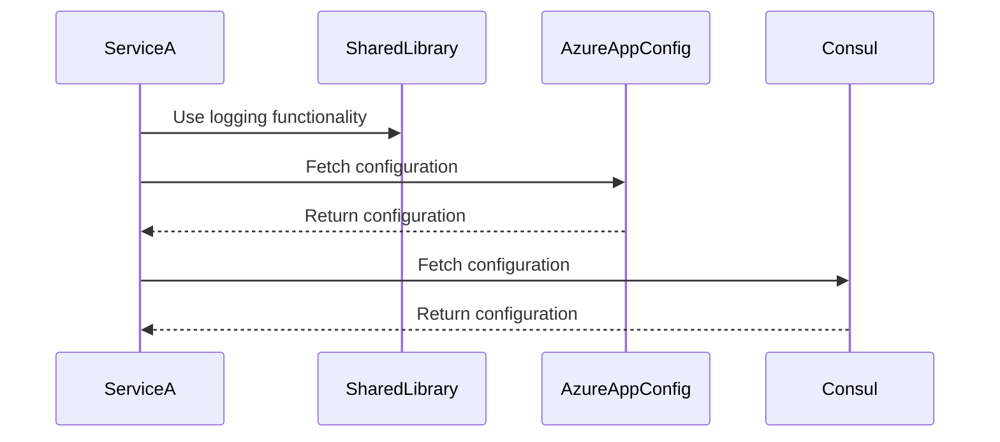

## 8.21 Shared Libraries and External Configuration

In the realm of microservices architecture, the concepts of shared libraries and external configuration play pivotal roles in ensuring efficient, scalable, and maintainable systems. As we delve into this topic, we'll explore how these elements contribute to the overall architecture and how they can be effectively implemented using C# and modern tools like Azure App Configuration and Consul.

### Introduction to Shared Libraries

Shared libraries are reusable code components that can be used across multiple microservices. They help in avoiding code duplication, ensuring consistency, and reducing maintenance overhead. In a microservices architecture, where services are often developed and deployed independently, shared libraries provide a way to centralize common functionality.

#### Benefits of Shared Libraries

1. **Code Reusability**: By encapsulating common logic in shared libraries, we can reuse code across different services, reducing redundancy.
2. **Consistency**: Shared libraries ensure that all services use the same version of a particular functionality, leading to consistent behavior.
3. **Ease of Maintenance**: Updates and bug fixes can be made in one place and propagated across all services using the library.
4. **Reduced Development Time**: Developers can focus on service-specific logic rather than reinventing the wheel for common functionalities.

#### Challenges with Shared Libraries

1. **Versioning**: Managing different versions of a shared library across multiple services can be challenging.
2. **Dependency Management**: Ensuring that all services have compatible dependencies can become complex.
3. **Coupling**: Over-reliance on shared libraries can lead to tight coupling between services, which contradicts the microservices principle of loose coupling.

### Implementing Shared Libraries in C#

In C#, shared libraries are typically implemented as class libraries. These libraries can be packaged as NuGet packages, which makes them easy to distribute and manage.

#### Creating a Shared Library

Let's create a simple shared library in C# that provides logging functionality.

```csharp
// File: SharedLibrary/Logger.cs
namespace SharedLibrary
{
    public class Logger
    {
        public void Log(string message)
        {
            Console.WriteLine($"Log: {message}");
        }
    }
}
```

#### Packaging as a NuGet Package

To distribute this library, we can package it as a NuGet package.

1. **Create a NuGet Package**: Use the `dotnet pack` command to create a NuGet package.
   ```bash
   dotnet pack -c Release
   ```

2. **Publish to NuGet Repository**: Use the `dotnet nuget push` command to publish the package.
   ```bash
   dotnet nuget push <package-name>.nupkg -k <api-key> -s <repository-url>
   ```

#### Using the Shared Library in a Microservice

To use the shared library in a microservice, add it as a dependency in the `csproj` file.

```xml
<ItemGroup>
  <PackageReference Include="SharedLibrary" Version="1.0.0" />
</ItemGroup>
```

### External Configuration in Microservices

External configuration refers to the practice of managing application settings outside the application code. This approach allows for dynamic configuration changes without redeploying the application, which is crucial in a microservices environment.

#### Benefits of External Configuration

1. **Flexibility**: Configuration changes can be made without redeploying services.
2. **Environment-Specific Settings**: Different configurations can be applied for different environments (e.g., development, staging, production).
3. **Centralized Management**: Configurations can be managed centrally, reducing the risk of configuration drift.

#### Tools for External Configuration

Two popular tools for managing external configuration in microservices are Azure App Configuration and Consul.

### Azure App Configuration

Azure App Configuration is a service that provides centralized management of application settings and feature flags.

#### Setting Up Azure App Configuration

1. **Create an Azure App Configuration Resource**: In the Azure portal, create a new App Configuration resource.
2. **Add Configuration Settings**: Use the Azure portal to add key-value pairs for configuration settings.

#### Accessing Configuration in C#

To access configuration settings from Azure App Configuration in a C# application, use the `Microsoft.Extensions.Configuration.AzureAppConfiguration` package.

```csharp
// File: Program.cs
using Microsoft.Extensions.Configuration;
using Microsoft.Extensions.Configuration.AzureAppConfiguration;

var builder = new ConfigurationBuilder();
builder.AddAzureAppConfiguration(options =>
{
    options.Connect("<connection-string>")
           .Select("AppSettings:*");
});

var configuration = builder.Build();
var settingValue = configuration["AppSettings:SettingKey"];
Console.WriteLine($"Setting Value: {settingValue}");
```

### Consul for Configuration Management

Consul is a tool for service discovery and configuration management. It provides a distributed key-value store that can be used for managing configuration settings.

#### Setting Up Consul

1. **Install Consul**: Follow the instructions on the [Consul website](https://www.consul.io/downloads) to install Consul.
2. **Start Consul Agent**: Use the `consul agent` command to start a Consul agent.

#### Storing Configuration in Consul

Use the Consul CLI or API to store configuration settings.

```bash
consul kv put app/config/settingKey settingValue
```

#### Accessing Configuration in C#

To access configuration settings from Consul in a C# application, use the `Winton.Extensions.Configuration.Consul` package.

```csharp
// File: Program.cs
using Microsoft.Extensions.Configuration;
using Winton.Extensions.Configuration.Consul;

var builder = new ConfigurationBuilder();
builder.AddConsul("app/config", options =>
{
    options.ConsulConfigurationOptions = cco =>
    {
        cco.Address = new Uri("http://localhost:8500");
    };
    options.Optional = true;
    options.ReloadOnChange = true;
});

var configuration = builder.Build();
var settingValue = configuration["settingKey"];
Console.WriteLine($"Setting Value: {settingValue}");
```

### Best Practices for Shared Libraries and External Configuration

1. **Versioning Strategy**: Implement a robust versioning strategy for shared libraries to manage updates and backward compatibility.
2. **Decouple Services**: Avoid tight coupling between services and shared libraries to maintain the independence of microservices.
3. **Secure Configuration**: Use secure methods to store and access sensitive configuration data, such as connection strings and API keys.
4. **Environment-Specific Configurations**: Use environment variables or configuration files to manage environment-specific settings.
5. **Monitor Configuration Changes**: Implement monitoring and alerting for configuration changes to detect and respond to issues quickly.

### Visualizing Shared Libraries and External Configuration

To better understand the interaction between shared libraries and external configuration in a microservices architecture, let's visualize the process using a sequence diagram.



### Try It Yourself

Experiment with the shared library and external configuration examples provided. Try modifying the code to:

- Add additional functionality to the shared library, such as error handling or logging levels.
- Use different configuration keys and values in Azure App Configuration and Consul.
- Implement a feature flag using Azure App Configuration to toggle functionality in your microservice.

### Knowledge Check

- Explain the benefits and challenges of using shared libraries in a microservices architecture.
- Describe how external configuration can improve the flexibility and maintainability of microservices.
- Demonstrate how to use Azure App Configuration and Consul for managing application settings in C#.

### Embrace the Journey

Remember, mastering shared libraries and external configuration is a journey. As you progress, you'll discover more advanced techniques and tools to enhance your microservices architecture. Keep experimenting, stay curious, and enjoy the journey!

## Quiz Time!



### What is a primary benefit of using shared libraries in microservices?

- [x] Code reusability
- [ ] Increased coupling
- [ ] Reduced flexibility
- [ ] Slower development

> **Explanation:** Shared libraries promote code reusability, allowing developers to use common functionality across multiple services without duplicating code.

### Which tool provides centralized management of application settings and feature flags in Azure?

- [x] Azure App Configuration
- [ ] Azure Blob Storage
- [ ] Azure Functions
- [ ] Azure Key Vault

> **Explanation:** Azure App Configuration is designed for centralized management of application settings and feature flags.

### What is a challenge associated with shared libraries?

- [ ] Increased flexibility
- [x] Versioning
- [ ] Simplified dependency management
- [ ] Reduced maintenance

> **Explanation:** Managing different versions of a shared library across multiple services can be challenging.

### How can configuration changes be made without redeploying services?

- [x] Using external configuration
- [ ] Hardcoding settings
- [ ] Recompiling the application
- [ ] Using static configuration files

> **Explanation:** External configuration allows for dynamic changes without redeploying services.

### Which package is used to access Azure App Configuration in a C# application?

- [x] Microsoft.Extensions.Configuration.AzureAppConfiguration
- [ ] Microsoft.Extensions.Logging
- [ ] Microsoft.AspNetCore.Mvc
- [ ] Microsoft.EntityFrameworkCore

> **Explanation:** The `Microsoft.Extensions.Configuration.AzureAppConfiguration` package is used to access Azure App Configuration.

### What is a key feature of Consul in microservices architecture?

- [x] Distributed key-value store
- [ ] Centralized logging
- [ ] Load balancing
- [ ] Database management

> **Explanation:** Consul provides a distributed key-value store for configuration management.

### Which command is used to store a configuration setting in Consul?

- [x] consul kv put
- [ ] consul config add
- [ ] consul store set
- [ ] consul key add

> **Explanation:** The `consul kv put` command is used to store a configuration setting in Consul.

### What is a best practice for managing sensitive configuration data?

- [x] Use secure methods for storage and access
- [ ] Store in plain text files
- [ ] Hardcode in application code
- [ ] Share openly across all services

> **Explanation:** Sensitive configuration data should be stored and accessed securely to prevent unauthorized access.

### What is the purpose of feature flags in Azure App Configuration?

- [x] Toggle functionality in applications
- [ ] Store application logs
- [ ] Manage user authentication
- [ ] Perform data backups

> **Explanation:** Feature flags are used to toggle functionality in applications without deploying new code.

### True or False: Shared libraries should always be tightly coupled with microservices.

- [ ] True
- [x] False

> **Explanation:** Shared libraries should not be tightly coupled with microservices to maintain their independence and flexibility.


