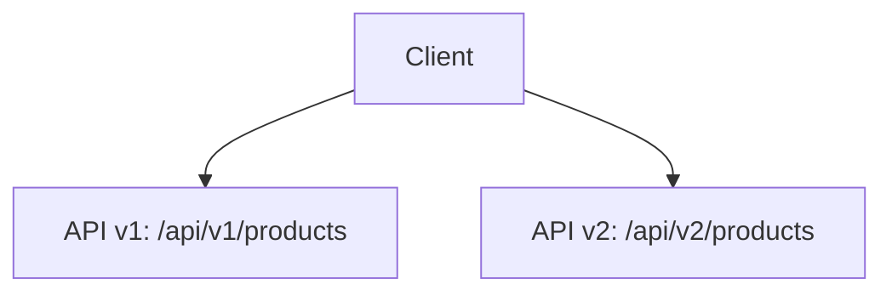
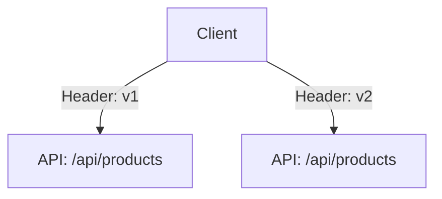
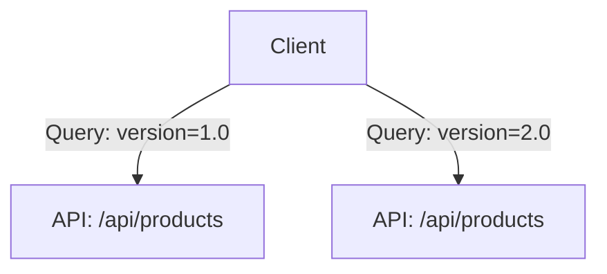

## 8.22 Versioning and Backward Compatibility in Microservices

In the realm of microservices architecture, managing API versions and ensuring backward compatibility are critical to maintaining a seamless user experience and minimizing disruptions. As systems evolve, APIs must adapt to new requirements while continuing to support existing clients. This section delves into the strategies and best practices for versioning and backward compatibility, providing expert insights for software engineers and enterprise architects.

### Understanding Versioning and Backward Compatibility

Versioning is the process of assigning unique identifiers to different states of an API, allowing developers to track changes and manage multiple versions simultaneously. Backward compatibility ensures that newer versions of an API do not break existing clients that rely on older versions. Together, these concepts enable smooth transitions and continuous evolution of software systems.

#### Key Concepts

- **Versioning**: Assigning unique identifiers to different API states.
- **Backward Compatibility**: Ensuring new API versions do not break existing clients.
- **API Evolution**: The process of updating and improving APIs over time.

### Strategies for Versioning

There are several strategies for managing API versions, each with its own advantages and trade-offs. Choosing the right strategy depends on the specific requirements and constraints of your system.

#### URL Versioning

URL versioning involves including the version number in the API endpoint URL. This approach is straightforward and easy to implement, making it a popular choice for many developers.

```csharp
// Example of URL versioning in C#
[Route("api/v1/products")]
public class ProductsV1Controller : ControllerBase
{
    [HttpGet]
    public IActionResult GetProducts()
    {
        // Logic for version 1 of the API
    }
}

[Route("api/v2/products")]
public class ProductsV2Controller : ControllerBase
{
    [HttpGet]
    public IActionResult GetProducts()
    {
        // Logic for version 2 of the API
    }
}
```

**Advantages**:
- Simple and intuitive.
- Easy to implement and understand.

**Disadvantages**:
- Can lead to URL clutter.
- Requires changes to client code when upgrading to a new version.

#### Header Versioning

Header versioning involves specifying the version number in the HTTP headers. This approach keeps URLs clean and allows for more flexible versioning schemes.

```csharp
// Example of header versioning in C#
[ApiController]
[Route("api/products")]
public class ProductsController : ControllerBase
{
    [HttpGet]
    [ApiVersion("1.0")]
    public IActionResult GetProductsV1()
    {
        // Logic for version 1 of the API
    }

    [HttpGet]
    [ApiVersion("2.0")]
    public IActionResult GetProductsV2()
    {
        // Logic for version 2 of the API
    }
}
```

**Advantages**:
- Keeps URLs clean and consistent.
- Allows for more flexible versioning schemes.

**Disadvantages**:
- Requires clients to modify HTTP headers.
- Can be less intuitive for developers unfamiliar with header-based versioning.

#### Query Parameter Versioning

Query parameter versioning involves including the version number as a query parameter in the API request. This approach is flexible and easy to implement.

```csharp
// Example of query parameter versioning in C#
[ApiController]
[Route("api/products")]
public class ProductsController : ControllerBase
{
    [HttpGet]
    public IActionResult GetProducts([FromQuery] string version)
    {
        if (version == "1.0")
        {
            // Logic for version 1 of the API
        }
        else if (version == "2.0")
        {
            // Logic for version 2 of the API
        }
        else
        {
            return BadRequest("Invalid API version");
        }
    }
}
```

**Advantages**:
- Flexible and easy to implement.
- Allows clients to specify versions dynamically.

**Disadvantages**:
- Can lead to inconsistent API usage.
- Requires clients to manage query parameters.

#### Content Negotiation

Content negotiation involves using the `Accept` header to specify the desired version of the API. This approach is flexible and allows for fine-grained control over API versions.

```csharp
// Example of content negotiation in C#
[ApiController]
[Route("api/products")]
public class ProductsController : ControllerBase
{
    [HttpGet]
    public IActionResult GetProducts([FromHeader(Name = "Accept")] string acceptHeader)
    {
        if (acceptHeader.Contains("application/vnd.myapi.v1+json"))
        {
            // Logic for version 1 of the API
        }
        else if (acceptHeader.Contains("application/vnd.myapi.v2+json"))
        {
            // Logic for version 2 of the API
        }
        else
        {
            return BadRequest("Invalid API version");
        }
    }
}
```

**Advantages**:
- Allows for fine-grained control over API versions.
- Supports multiple media types and formats.

**Disadvantages**:
- Can be complex to implement and manage.
- Requires clients to understand and use content negotiation.

### Ensuring Backward Compatibility

Backward compatibility is crucial for maintaining a seamless user experience and minimizing disruptions. Here are some strategies to ensure backward compatibility in your APIs.

#### Deprecation Policies

Establish clear deprecation policies to inform clients about upcoming changes and provide ample time for migration. Communicate deprecation timelines and offer support for transitioning to newer versions.

#### Semantic Versioning

Use semantic versioning to convey the nature and impact of changes. Semantic versioning uses a three-part version number (e.g., 1.0.0) to indicate major, minor, and patch changes.

- **Major**: Incompatible API changes.
- **Minor**: Backward-compatible functionality additions.
- **Patch**: Backward-compatible bug fixes.

#### Feature Toggles

Implement feature toggles to enable or disable features dynamically. This approach allows you to test new features with select clients before rolling them out to all users.

#### Contract Testing

Use contract testing to verify that your API meets the expectations of its clients. Contract tests ensure that changes do not break existing functionality and help maintain backward compatibility.

### Use Cases and Examples

Let's explore some real-world use cases and examples of versioning and backward compatibility in action.

#### E-commerce Platform

An e-commerce platform may need to evolve its API to support new payment methods or promotional features. By implementing versioning, the platform can introduce new features without disrupting existing clients.

```csharp
// Example of versioning in an e-commerce platform
[ApiController]
[Route("api/v1/orders")]
public class OrdersV1Controller : ControllerBase
{
    [HttpPost]
    public IActionResult CreateOrder(OrderV1 order)
    {
        // Logic for creating an order in version 1
    }
}

[ApiController]
[Route("api/v2/orders")]
public class OrdersV2Controller : ControllerBase
{
    [HttpPost]
    public IActionResult CreateOrder(OrderV2 order)
    {
        // Logic for creating an order in version 2
    }
}
```

#### Social Media Application

A social media application may need to update its API to support new content types or interaction models. By ensuring backward compatibility, the application can introduce new features without breaking existing clients.

```csharp
// Example of backward compatibility in a social media application
[ApiController]
[Route("api/posts")]
public class PostsController : ControllerBase
{
    [HttpGet]
    public IActionResult GetPosts([FromQuery] string version)
    {
        if (version == "1.0")
        {
            // Logic for retrieving posts in version 1
        }
        else if (version == "2.0")
        {
            // Logic for retrieving posts in version 2
        }
        else
        {
            return BadRequest("Invalid API version");
        }
    }
}
```

### Visualizing Versioning Strategies

To better understand the different versioning strategies, let's visualize them using Mermaid.js diagrams.

#### URL Versioning Diagram



**Description**: This diagram illustrates URL versioning, where different API versions are accessed through distinct URLs.

#### Header Versioning Diagram



**Description**: This diagram illustrates header versioning, where the version is specified in the HTTP headers.

#### Query Parameter Versioning Diagram



**Description**: This diagram illustrates query parameter versioning, where the version is specified as a query parameter.

### Design Considerations

When implementing versioning and backward compatibility, consider the following design considerations:

- **Consistency**: Ensure consistent versioning practices across all APIs.
- **Documentation**: Provide clear documentation for each API version and its changes.
- **Testing**: Implement thorough testing to verify backward compatibility.
- **Communication**: Communicate changes and deprecations to clients effectively.

### Differences and Similarities

Versioning and backward compatibility are often confused with other concepts, such as feature flags and A/B testing. While they share similarities, they serve different purposes:

- **Versioning**: Manages different API states and ensures backward compatibility.
- **Feature Flags**: Enable or disable features dynamically for testing and rollout.
- **A/B Testing**: Compares different versions of a feature to determine the best outcome.

### Try It Yourself

To gain hands-on experience with versioning and backward compatibility, try modifying the code examples provided in this section. Experiment with different versioning strategies and observe their impact on API clients.

### Knowledge Check

To reinforce your understanding of versioning and backward compatibility, consider the following questions:

1. What are the advantages and disadvantages of URL versioning?
2. How does header versioning differ from query parameter versioning?
3. What is the role of semantic versioning in API management?
4. How can feature toggles help ensure backward compatibility?
5. What are some design considerations when implementing versioning?

### Embrace the Journey

Remember, mastering versioning and backward compatibility is an ongoing journey. As you progress, you'll gain valuable insights into managing API evolution and ensuring seamless client experiences. Keep experimenting, stay curious, and enjoy the journey!

## Quiz Time!



### What is the primary purpose of versioning in APIs?

- [x] To manage different states of an API and ensure backward compatibility.
- [ ] To enable dynamic feature toggles.
- [ ] To conduct A/B testing.
- [ ] To optimize API performance.

> **Explanation:** Versioning is used to manage different states of an API and ensure backward compatibility with existing clients.

### Which versioning strategy involves specifying the version number in the API endpoint URL?

- [x] URL versioning
- [ ] Header versioning
- [ ] Query parameter versioning
- [ ] Content negotiation

> **Explanation:** URL versioning involves including the version number in the API endpoint URL.

### What is a disadvantage of header versioning?

- [ ] Requires changes to client code when upgrading to a new version.
- [x] Requires clients to modify HTTP headers.
- [ ] Can lead to URL clutter.
- [ ] Allows for more flexible versioning schemes.

> **Explanation:** Header versioning requires clients to modify HTTP headers, which can be less intuitive for developers.

### What is the role of semantic versioning in API management?

- [x] To convey the nature and impact of changes using a three-part version number.
- [ ] To enable dynamic feature toggles.
- [ ] To conduct A/B testing.
- [ ] To optimize API performance.

> **Explanation:** Semantic versioning uses a three-part version number to indicate major, minor, and patch changes.

### How can feature toggles help ensure backward compatibility?

- [x] By enabling or disabling features dynamically for testing and rollout.
- [ ] By managing different states of an API.
- [ ] By conducting A/B testing.
- [ ] By optimizing API performance.

> **Explanation:** Feature toggles allow features to be enabled or disabled dynamically, helping to ensure backward compatibility.

### What is a key design consideration when implementing versioning?

- [x] Consistency in versioning practices across all APIs.
- [ ] Conducting A/B testing.
- [ ] Enabling dynamic feature toggles.
- [ ] Optimizing API performance.

> **Explanation:** Consistency in versioning practices is crucial for maintaining a seamless user experience.

### What is the difference between versioning and feature flags?

- [x] Versioning manages different API states, while feature flags enable or disable features dynamically.
- [ ] Versioning enables dynamic feature toggles, while feature flags manage different API states.
- [ ] Versioning conducts A/B testing, while feature flags optimize API performance.
- [ ] Versioning optimizes API performance, while feature flags conduct A/B testing.

> **Explanation:** Versioning manages different API states, while feature flags enable or disable features dynamically.

### Which versioning strategy involves using the `Accept` header to specify the desired version of the API?

- [ ] URL versioning
- [ ] Header versioning
- [ ] Query parameter versioning
- [x] Content negotiation

> **Explanation:** Content negotiation involves using the `Accept` header to specify the desired version of the API.

### What is a benefit of using contract testing in API management?

- [x] It verifies that the API meets the expectations of its clients.
- [ ] It enables dynamic feature toggles.
- [ ] It conducts A/B testing.
- [ ] It optimizes API performance.

> **Explanation:** Contract testing ensures that the API meets the expectations of its clients, helping to maintain backward compatibility.

### True or False: Backward compatibility ensures that newer versions of an API do not break existing clients.

- [x] True
- [ ] False

> **Explanation:** Backward compatibility ensures that newer versions of an API do not break existing clients that rely on older versions.


