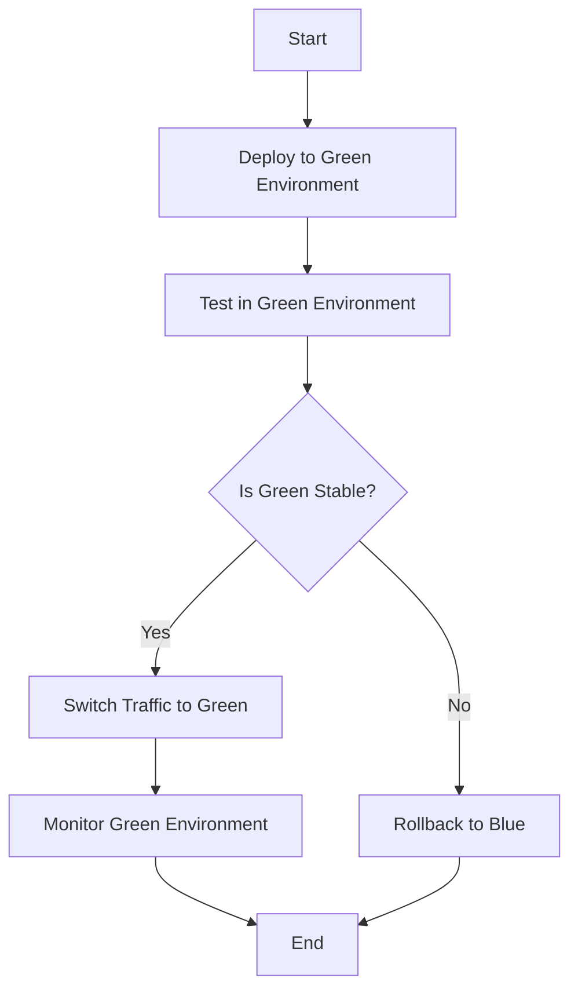

## 8.23 Blue-Green Deployment Pattern

In the fast-paced world of software development, deploying new features, bug fixes, and updates without disrupting the user experience is crucial. The Blue-Green Deployment Pattern is a strategy designed to achieve this by running two identical production environments, referred to as "Blue" and "Green." This pattern allows for seamless transitions between different versions of an application, minimizing downtime and reducing deployment risks.

### Intent

The primary intent of the Blue-Green Deployment Pattern is to ensure that new software versions can be deployed with minimal disruption to users. By maintaining two separate environments, developers can test new releases in a production-like setting before switching traffic from the old version to the new one.

### Key Participants

- **Blue Environment**: The current production environment serving live traffic.
- **Green Environment**: The new version of the application, ready to be tested and deployed.
- **Load Balancer**: Directs traffic to either the Blue or Green environment.
- **Continuous Integration/Continuous Deployment (CI/CD) Pipeline**: Automates the build, test, and deployment processes.

### Applicability

The Blue-Green Deployment Pattern is particularly useful in scenarios where:
- High availability is critical, and downtime must be minimized.
- There is a need to quickly roll back to a previous version in case of issues.
- Testing in a production-like environment is required before full deployment.

### Implementing Blue-Green Deployments

Implementing Blue-Green Deployments involves several steps, including setting up the environments, configuring the load balancer, and automating the deployment process. Let's explore these steps in detail, using Azure DevOps and feature flags as key components.

#### Setting Up Environments

1. **Create Two Identical Environments**: Set up two identical environments, Blue and Green, within your infrastructure. These environments should mirror each other in terms of configuration, resources, and dependencies.

2. **Configure Infrastructure as Code (IaC)**: Use tools like Azure Resource Manager (ARM) templates or Terraform to define and manage your infrastructure. This ensures consistency and repeatability in environment setup.

3. **Database Considerations**: Ensure that both environments have access to the same database or use database replication strategies to keep data in sync.

#### Configuring the Load Balancer

1. **Set Up a Load Balancer**: Use a load balancer to manage traffic between the Blue and Green environments. Azure Load Balancer or Azure Application Gateway can be used for this purpose.

2. **Traffic Switching**: Configure the load balancer to switch traffic from the Blue environment to the Green environment once the new version is ready for deployment.

3. **Health Checks**: Implement health checks to ensure that the Green environment is functioning correctly before directing traffic to it.

#### Automating the Deployment Process

1. **CI/CD Pipeline**: Set up a CI/CD pipeline using Azure DevOps to automate the build, test, and deployment processes. This pipeline should include steps for deploying to both the Blue and Green environments.

2. **Feature Flags**: Use feature flags to control the visibility of new features. This allows you to deploy new code without immediately exposing it to all users.

3. **Testing**: Conduct thorough testing in the Green environment to ensure that the new version is stable and performs as expected.

4. **Switch Traffic**: Once testing is complete and the Green environment is deemed stable, switch traffic from the Blue environment to the Green environment using the load balancer.

5. **Monitor and Rollback**: Monitor the Green environment for any issues. If problems arise, quickly switch back to the Blue environment to minimize user impact.

### Use Cases and Examples

The Blue-Green Deployment Pattern is widely used across various industries to achieve seamless deployments. Here are some common use cases and examples:

#### Minimizing Downtime During Deployments

In industries where uptime is critical, such as e-commerce and finance, minimizing downtime during deployments is essential. The Blue-Green Deployment Pattern allows companies to deploy new features and updates without interrupting the user experience.

#### Risk Mitigation

By maintaining two separate environments, organizations can test new releases in a production-like setting before going live. This reduces the risk of deploying faulty code and allows for quick rollbacks if issues are detected.

#### Real-World Example: E-Commerce Platform

Consider an e-commerce platform that wants to deploy a new payment gateway integration. Using the Blue-Green Deployment Pattern, the development team can set up the new integration in the Green environment, conduct thorough testing, and switch traffic only when they are confident in its stability.

### Sample Code Snippet

Below is a simplified example of how you might configure a Blue-Green deployment using Azure DevOps and feature flags in a C# application.

```csharp
using System;
using Microsoft.FeatureManagement;

namespace BlueGreenDeployment
{
    class Program
    {
        static void Main(string[] args)
        {
            var featureManager = new FeatureManager();

            if (featureManager.IsEnabled("NewFeature"))
            {
                Console.WriteLine("New Feature is enabled.");
                // Code for new feature
            }
            else
            {
                Console.WriteLine("Old Feature is running.");
                // Code for old feature
            }
        }
    }

    public class FeatureManager
    {
        public bool IsEnabled(string featureName)
        {
            // Logic to check if the feature flag is enabled
            return true; // Simulating an enabled feature flag
        }
    }
}
```

### Design Considerations

- **Database Changes**: Ensure that database schema changes are backward compatible to prevent issues when switching environments.
- **Environment Parity**: Maintain parity between the Blue and Green environments to avoid discrepancies during deployment.
- **Monitoring and Logging**: Implement robust monitoring and logging to quickly identify and resolve issues in the Green environment.

### Differences and Similarities

The Blue-Green Deployment Pattern is often compared to the Canary Deployment Pattern. While both aim to minimize deployment risks, they differ in approach. Blue-Green involves two separate environments, while Canary gradually rolls out changes to a subset of users.

### Visualizing Blue-Green Deployment

To better understand the Blue-Green Deployment Pattern, let's visualize the process using a flowchart.



**Diagram Description**: This flowchart illustrates the Blue-Green Deployment process, starting with deployment to the Green environment, testing, and switching traffic if stable. If issues arise, traffic is rolled back to the Blue environment.

### Knowledge Check

- **Question**: What is the primary benefit of using the Blue-Green Deployment Pattern?
- **Answer**: Minimizing downtime during deployments.

- **Question**: How does the Blue-Green Deployment Pattern handle database changes?
- **Answer**: By ensuring database schema changes are backward compatible.

### Try It Yourself

Experiment with the provided code snippet by modifying the feature flag logic to simulate different deployment scenarios. Try enabling and disabling features to see how the application behavior changes.

### Embrace the Journey

Remember, mastering the Blue-Green Deployment Pattern is just one step in your journey as a software engineer. As you continue to explore and implement design patterns, you'll build more robust and resilient applications. Keep experimenting, stay curious, and enjoy the journey!

## Quiz Time!



### What is the primary goal of the Blue-Green Deployment Pattern?

- [x] Minimize downtime during deployments
- [ ] Increase development speed
- [ ] Reduce code complexity
- [ ] Enhance user interface design

> **Explanation:** The primary goal of the Blue-Green Deployment Pattern is to minimize downtime during deployments by maintaining two separate environments.

### Which component is responsible for directing traffic between the Blue and Green environments?

- [ ] Database
- [x] Load Balancer
- [ ] CI/CD Pipeline
- [ ] Feature Manager

> **Explanation:** The Load Balancer is responsible for directing traffic between the Blue and Green environments.

### What tool can be used to automate the deployment process in a Blue-Green Deployment?

- [ ] GitHub
- [x] Azure DevOps
- [ ] Visual Studio Code
- [ ] Docker

> **Explanation:** Azure DevOps can be used to automate the deployment process in a Blue-Green Deployment.

### What is a key advantage of using feature flags in Blue-Green Deployments?

- [x] Control the visibility of new features
- [ ] Increase database performance
- [ ] Simplify code structure
- [ ] Enhance user authentication

> **Explanation:** Feature flags allow developers to control the visibility of new features, making it easier to test and deploy changes.

### How does the Blue-Green Deployment Pattern handle database schema changes?

- [x] Ensures changes are backward compatible
- [ ] Uses a separate database for each environment
- [ ] Disables database access during deployment
- [ ] Automatically migrates data

> **Explanation:** The Blue-Green Deployment Pattern ensures that database schema changes are backward compatible to prevent issues during environment switching.

### What is the role of the CI/CD Pipeline in Blue-Green Deployments?

- [x] Automate build, test, and deployment processes
- [ ] Manage database connections
- [ ] Monitor application performance
- [ ] Configure load balancers

> **Explanation:** The CI/CD Pipeline automates the build, test, and deployment processes in Blue-Green Deployments.

### What is a common use case for the Blue-Green Deployment Pattern?

- [x] Minimizing downtime during deployments
- [ ] Enhancing user interface design
- [ ] Increasing code readability
- [ ] Reducing development costs

> **Explanation:** A common use case for the Blue-Green Deployment Pattern is minimizing downtime during deployments.

### Which Azure service can be used as a load balancer in Blue-Green Deployments?

- [ ] Azure Functions
- [ ] Azure Blob Storage
- [x] Azure Application Gateway
- [ ] Azure Cosmos DB

> **Explanation:** Azure Application Gateway can be used as a load balancer in Blue-Green Deployments.

### What happens if the Green environment is not stable during a Blue-Green Deployment?

- [x] Traffic is rolled back to the Blue environment
- [ ] The deployment is canceled
- [ ] The application is shut down
- [ ] The database is reset

> **Explanation:** If the Green environment is not stable, traffic is rolled back to the Blue environment to minimize user impact.

### True or False: The Blue-Green Deployment Pattern requires two separate databases for each environment.

- [ ] True
- [x] False

> **Explanation:** False. The Blue-Green Deployment Pattern does not require two separate databases; it often uses a shared database with backward-compatible schema changes.


