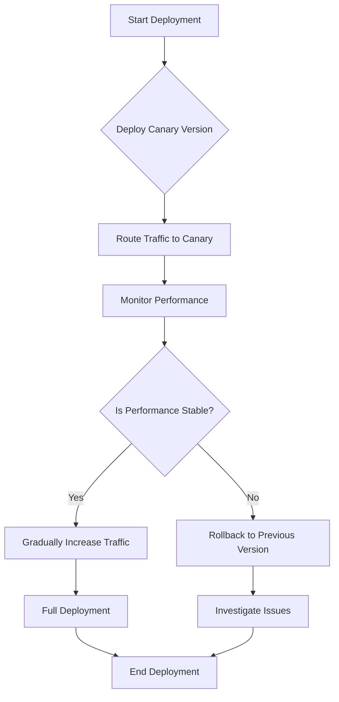

## 8.24 Canary Deployment Pattern

In the dynamic world of software development, deploying new features and updates without disrupting the user experience is crucial. The Canary Deployment Pattern offers a strategic approach to rolling out new service versions gradually, allowing you to test changes with a subset of users before a full-scale release. This pattern is particularly beneficial in microservices architectures, where services are independently deployable and scalable.

### Intent

The primary intent of the Canary Deployment Pattern is to minimize risk during the deployment of new software versions. By releasing changes incrementally to a small group of users, you can monitor the impact and ensure stability before a broader rollout. This approach helps in identifying potential issues early, reducing the chances of widespread disruption.

### Key Participants

1. **Feature Toggles**: Control which features are visible to users, allowing for dynamic enabling or disabling of new functionalities.
2. **Routing Rules**: Direct a specific percentage of traffic to the new version of the service.
3. **Monitoring Tools**: Track performance metrics and user feedback to detect anomalies.
4. **Rollback Mechanisms**: Quickly revert to the previous stable version if issues are detected.

### Applicability

The Canary Deployment Pattern is applicable in scenarios where:
- You want to test new features with real users without affecting the entire user base.
- You need to gather user feedback and performance data before a full-scale release.
- You aim to reduce the risk of deploying new versions in production environments.

### Implementing Canary Releases

Implementing a canary release involves several steps, each crucial for a successful deployment. Let's explore these steps in detail.

#### Using Feature Toggles

Feature toggles are a powerful tool in canary deployments. They allow you to control the visibility of new features without deploying new code. Here's how you can implement feature toggles in C#:

```csharp
public class FeatureToggle
{
    private readonly Dictionary<string, bool> _features;

    public FeatureToggle()
    {
        _features = new Dictionary<string, bool>
        {
            { "NewFeature", false }
        };
    }

    public bool IsFeatureEnabled(string featureName)
    {
        return _features.ContainsKey(featureName) && _features[featureName];
    }

    public void SetFeatureState(string featureName, bool isEnabled)
    {
        if (_features.ContainsKey(featureName))
        {
            _features[featureName] = isEnabled;
        }
    }
}

// Usage
var featureToggle = new FeatureToggle();
if (featureToggle.IsFeatureEnabled("NewFeature"))
{
    // Execute new feature code
}
```

**Explanation**: In this example, we define a `FeatureToggle` class that manages feature states using a dictionary. The `IsFeatureEnabled` method checks if a feature is enabled, while `SetFeatureState` allows toggling the feature state.

#### Routing Rules

Routing rules determine how traffic is distributed between the old and new versions of a service. You can implement routing rules using a load balancer or a service mesh. Here's a conceptual example using a load balancer:

```csharp
public class LoadBalancer
{
    private readonly List<string> _servers;
    private readonly Random _random;

    public LoadBalancer()
    {
        _servers = new List<string> { "Server1", "Server2" }; // Server2 is the canary
        _random = new Random();
    }

    public string GetServer()
    {
        // 90% traffic to Server1, 10% to Server2
        return _random.Next(100) < 10 ? "Server2" : "Server1";
    }
}

// Usage
var loadBalancer = new LoadBalancer();
string server = loadBalancer.GetServer();
Console.WriteLine($"Routing request to: {server}");
```

**Explanation**: This example simulates a simple load balancer that routes 10% of traffic to the canary server (`Server2`) and 90% to the stable server (`Server1`).

### Monitoring and Rollback Strategies

Effective monitoring and rollback strategies are essential components of the Canary Deployment Pattern. They ensure that any issues are quickly identified and resolved.

#### Monitoring

Monitoring tools provide insights into the performance and stability of the new version. Key metrics to monitor include response times, error rates, and user feedback. Tools like Prometheus, Grafana, and Application Insights can be integrated into your C# applications for comprehensive monitoring.

```csharp
// Example of using Application Insights in C#
using Microsoft.ApplicationInsights;
using Microsoft.ApplicationInsights.Extensibility;

var telemetryClient = new TelemetryClient(new TelemetryConfiguration("your_instrumentation_key"));
telemetryClient.TrackEvent("CanaryDeploymentStarted");

// Monitor performance metrics
telemetryClient.TrackMetric("ResponseTime", responseTime);
telemetryClient.TrackMetric("ErrorRate", errorRate);
```

**Explanation**: This code snippet demonstrates how to use Application Insights to track events and metrics during a canary deployment. Replace `"your_instrumentation_key"` with your actual instrumentation key.

#### Rollback Mechanisms

A robust rollback strategy is crucial for minimizing downtime and user impact. In C#, you can implement rollback mechanisms using version control and deployment scripts. Here's a simplified example using a deployment script:

```bash
#!/bin/bash

echo "Rolling back to previous version..."
git checkout previous_version
dotnet publish -c Release
dotnet deploy
echo "Rollback completed."
```

**Explanation**: This script checks out the previous version from version control, publishes the application, and deploys it. Ensure your deployment pipeline supports such scripts for quick rollbacks.

### Visualizing Canary Deployment

To better understand the Canary Deployment Pattern, let's visualize the process using a flowchart:



**Description**: This flowchart illustrates the canary deployment process, starting with deploying the canary version, routing traffic, monitoring performance, and deciding whether to proceed with a full deployment or rollback.

### Design Considerations

When implementing the Canary Deployment Pattern, consider the following:

- **Traffic Segmentation**: Carefully select the subset of users for the canary release to ensure a representative sample.
- **Automated Monitoring**: Automate monitoring to quickly detect anomalies and trigger alerts.
- **Rollback Speed**: Ensure rollback mechanisms are fast and reliable to minimize downtime.
- **User Feedback**: Collect user feedback during the canary phase to identify usability issues.

### Differences and Similarities

The Canary Deployment Pattern is often compared to the Blue-Green Deployment Pattern. While both aim to reduce deployment risks, they differ in execution:

- **Canary Deployment**: Gradually rolls out changes to a subset of users, allowing for incremental testing and feedback.
- **Blue-Green Deployment**: Maintains two identical environments (blue and green) and switches traffic between them for zero-downtime deployments.

### Try It Yourself

Experiment with the provided code examples by modifying the feature toggle states and routing rules. Observe how changes affect the deployment process and explore different monitoring tools to enhance your canary deployment strategy.

### References and Links

- [Microsoft Application Insights](https://docs.microsoft.com/en-us/azure/azure-monitor/app/app-insights-overview)
- [Prometheus Monitoring](https://prometheus.io/docs/introduction/overview/)
- [Grafana Visualization](https://grafana.com/docs/grafana/latest/getting-started/introduction/)

### Knowledge Check

- What is the primary intent of the Canary Deployment Pattern?
- How do feature toggles contribute to canary deployments?
- What are the key metrics to monitor during a canary deployment?
- How does the Canary Deployment Pattern differ from the Blue-Green Deployment Pattern?

### Embrace the Journey

Remember, mastering the Canary Deployment Pattern is a journey. As you implement and refine your deployment strategies, you'll gain valuable insights into ensuring seamless and stable software releases. Keep experimenting, stay curious, and enjoy the journey!

## Quiz Time!



### What is the primary goal of the Canary Deployment Pattern?

- [x] To minimize risk during software deployment by gradually rolling out changes.
- [ ] To deploy all changes at once to all users.
- [ ] To maintain two identical environments for zero-downtime deployments.
- [ ] To ensure all users receive updates simultaneously.

> **Explanation:** The Canary Deployment Pattern aims to minimize risk by gradually rolling out changes to a subset of users, allowing for testing and feedback before a full-scale release.

### Which tool can be used for monitoring performance during a canary deployment?

- [x] Microsoft Application Insights
- [ ] Git
- [ ] Docker
- [ ] Jenkins

> **Explanation:** Microsoft Application Insights is a monitoring tool that can track performance metrics and events during a canary deployment.

### What is a feature toggle?

- [x] A mechanism to control the visibility of new features without deploying new code.
- [ ] A tool for monitoring application performance.
- [ ] A method for routing traffic between servers.
- [ ] A version control system.

> **Explanation:** A feature toggle allows you to enable or disable features dynamically, providing control over feature visibility without code changes.

### How does the Canary Deployment Pattern differ from the Blue-Green Deployment Pattern?

- [x] Canary Deployment gradually rolls out changes to a subset of users, while Blue-Green Deployment switches traffic between two environments.
- [ ] Canary Deployment maintains two identical environments, while Blue-Green Deployment gradually rolls out changes.
- [ ] Both patterns are identical in execution.
- [ ] Canary Deployment is used for zero-downtime deployments, while Blue-Green Deployment is not.

> **Explanation:** Canary Deployment involves gradual rollouts to a subset of users, whereas Blue-Green Deployment switches traffic between two environments for zero-downtime.

### What is the purpose of routing rules in a canary deployment?

- [x] To direct a specific percentage of traffic to the new version of the service.
- [ ] To monitor application performance.
- [ ] To enable or disable features dynamically.
- [ ] To rollback to a previous version.

> **Explanation:** Routing rules determine how traffic is distributed between the old and new versions of a service, allowing for controlled testing.

### What should be done if performance issues are detected during a canary deployment?

- [x] Rollback to the previous stable version.
- [ ] Continue with the full deployment.
- [ ] Disable all features.
- [ ] Increase traffic to the canary version.

> **Explanation:** If performance issues are detected, it's crucial to rollback to the previous stable version to minimize user impact.

### Which of the following is a key participant in a canary deployment?

- [x] Feature Toggles
- [ ] Docker Containers
- [ ] Continuous Integration Tools
- [ ] Version Control Systems

> **Explanation:** Feature toggles are a key participant in canary deployments, allowing for dynamic control over feature visibility.

### What is the role of monitoring tools in a canary deployment?

- [x] To track performance metrics and user feedback.
- [ ] To deploy new code to production.
- [ ] To manage version control.
- [ ] To enable feature toggles.

> **Explanation:** Monitoring tools track performance metrics and user feedback, helping to detect anomalies during a canary deployment.

### How can rollback mechanisms be implemented in C#?

- [x] Using version control and deployment scripts.
- [ ] By disabling all features.
- [ ] By increasing traffic to the canary version.
- [ ] By maintaining two identical environments.

> **Explanation:** Rollback mechanisms can be implemented using version control and deployment scripts to quickly revert to a previous version.

### True or False: The Canary Deployment Pattern is only applicable in microservices architectures.

- [x] False
- [ ] True

> **Explanation:** While the Canary Deployment Pattern is particularly beneficial in microservices architectures, it can be applied in other architectures as well.


