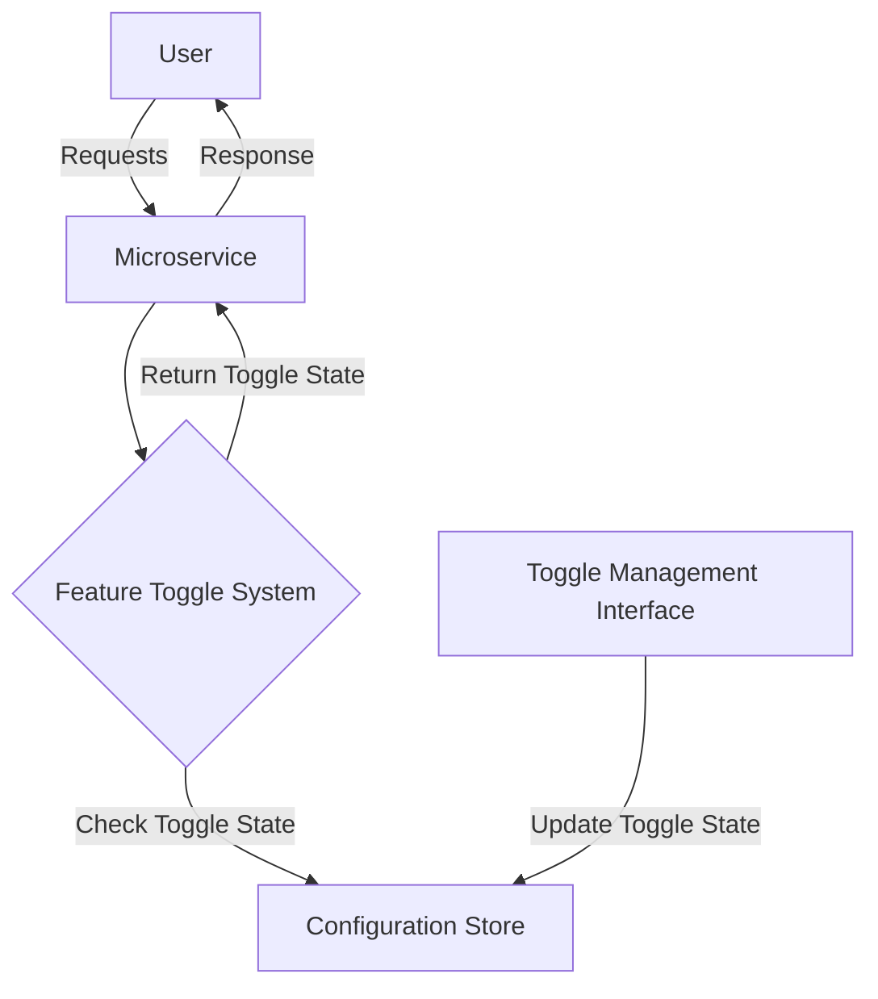

## 8.25 Feature Toggle Pattern

The Feature Toggle Pattern, also known as Feature Flags, is a powerful technique that allows software engineers to enable or disable features at runtime without deploying new code. This pattern is particularly useful in microservices architectures, where continuous delivery and deployment are essential. By using feature toggles, developers can manage feature rollouts, conduct A/B testing, and handle phased deployments seamlessly.

### Intent

The primary intent of the Feature Toggle Pattern is to provide a mechanism for controlling the availability of features in a software application dynamically. This control is achieved without the need for code changes or redeployment, thus enabling rapid experimentation and iterative development.

### Key Participants

1. **Feature Toggle System**: The core component responsible for managing feature states (enabled/disabled).
2. **Configuration Store**: A storage mechanism (e.g., database, configuration file) that holds the state of each feature toggle.
3. **Application Code**: The codebase that checks the state of feature toggles to determine which features to enable or disable.
4. **Toggle Management Interface**: A user interface or API that allows administrators to change the state of feature toggles.

### Applicability

Feature Toggles are applicable in scenarios where:

- **Continuous Deployment**: Teams need to deploy code frequently without exposing unfinished features.
- **A/B Testing**: Different user segments need to experience different versions of a feature.
- **Phased Rollouts**: Features are gradually rolled out to users to monitor performance and gather feedback.
- **Emergency Feature Kill**: Features can be quickly disabled in case of critical issues.

### Implementing Feature Toggles in C#

Implementing Feature Toggles in C# can be achieved using various libraries and frameworks. Two popular options are the FeatureToggle library and LaunchDarkly. Let's explore how to implement feature toggles using these tools.

#### Using the FeatureToggle Library

The FeatureToggle library is a simple and lightweight solution for implementing feature toggles in C#. It allows developers to define toggles in configuration files and check their states in the application code.

**Step-by-Step Implementation:**

1. **Install the FeatureToggle Library**: Add the FeatureToggle NuGet package to your project.

   ```shell
   Install-Package FeatureToggle
   ```

2. **Define Feature Toggles**: Create a configuration file (e.g., `appsettings.json`) to define your feature toggles.

   ```json
   {
     "FeatureToggles": {
       "NewFeature": true,
       "BetaFeature": false
     }
   }
   ```

3. **Create Toggle Classes**: Define classes for each feature toggle by inheriting from `SimpleFeatureToggle`.

   ```csharp
   using FeatureToggle;

   public class NewFeatureToggle : SimpleFeatureToggle { }
   public class BetaFeatureToggle : SimpleFeatureToggle { }
   ```

4. **Check Feature States**: Use the toggle classes in your application code to check the state of features.

   ```csharp
   var newFeatureToggle = new NewFeatureToggle();
   if (newFeatureToggle.FeatureEnabled)
   {
       // Execute code for the new feature
   }
   ```

5. **Manage Toggles**: Update the configuration file to enable or disable features as needed.

#### Using LaunchDarkly

LaunchDarkly is a more advanced feature management platform that provides a robust API and dashboard for managing feature toggles. It supports complex use cases like user segmentation and A/B testing.

**Step-by-Step Implementation:**

1. **Create a LaunchDarkly Account**: Sign up for a LaunchDarkly account and create a new project.

2. **Install the LaunchDarkly SDK**: Add the LaunchDarkly SDK to your C# project.

   ```shell
   Install-Package LaunchDarkly.ClientSdk
   ```

3. **Initialize the SDK**: Configure the SDK with your LaunchDarkly client-side ID.

   ```csharp
   using LaunchDarkly.Sdk;
   using LaunchDarkly.Sdk.Server;

   var client = new LdClient("YOUR_SDK_KEY");
   ```

4. **Define Feature Flags**: Create feature flags in the LaunchDarkly dashboard.

5. **Check Feature States**: Use the SDK to check the state of feature flags in your application code.

   ```csharp
   var user = User.WithKey("user-key");
   bool showFeature = client.BoolVariation("new-feature-flag", user, false);

   if (showFeature)
   {
       // Execute code for the new feature
   }
   ```

6. **Manage Flags**: Use the LaunchDarkly dashboard to enable or disable feature flags and configure targeting rules.

### Use Cases and Examples

Feature Toggles are versatile and can be used in various scenarios. Here are some common use cases:

#### A/B Testing

Feature Toggles can be used to conduct A/B testing by enabling different features for different user segments. This allows teams to compare user engagement and performance metrics to determine the best version of a feature.

**Example:**

```csharp
var user = User.WithKey("user-key");
bool isVariantA = client.BoolVariation("feature-variant-a", user, false);

if (isVariantA)
{
    // Show variant A of the feature
}
else
{
    // Show variant B of the feature
}
```

#### Phased Feature Rollouts

Gradually rolling out features to users can help identify issues early and reduce the impact of potential bugs. Feature Toggles allow for controlled rollouts by enabling features for a subset of users.

**Example:**

```csharp
var user = User.WithKey("user-key");
bool isFeatureEnabled = client.BoolVariation("phased-rollout-feature", user, false);

if (isFeatureEnabled)
{
    // Enable the new feature for the user
}
```

### Design Considerations

When implementing Feature Toggles, consider the following:

- **Toggle Lifecycle**: Plan for the lifecycle of feature toggles, including creation, usage, and removal. Avoid leaving unused toggles in the codebase.
- **Performance Impact**: Ensure that checking toggle states does not introduce significant performance overhead.
- **Security**: Protect sensitive features by ensuring that toggles cannot be easily manipulated by unauthorized users.
- **Configuration Management**: Use a centralized configuration management system to manage toggle states across environments.

### Differences and Similarities

Feature Toggles are often compared to other patterns like Branch by Abstraction and Blue-Green Deployment. Here are some key differences and similarities:

- **Branch by Abstraction**: Involves creating an abstraction layer to switch between different implementations. Unlike Feature Toggles, it requires code changes and redeployment.
- **Blue-Green Deployment**: Involves maintaining two identical production environments (blue and green) and switching traffic between them. Feature Toggles provide more granular control over individual features.

### Visualizing Feature Toggle Architecture

Below is a diagram illustrating the architecture of a Feature Toggle system in a microservices environment.



**Diagram Description:** This diagram shows how a user interacts with a microservice that checks the state of feature toggles using a Feature Toggle System. The system retrieves toggle states from a Configuration Store and allows administrators to update toggle states via a Toggle Management Interface.

### Try It Yourself

To get hands-on experience with Feature Toggles, try implementing a simple toggle system using the FeatureToggle library or LaunchDarkly. Experiment with enabling and disabling features dynamically and observe how it affects your application's behavior. Consider modifying the code examples to add new features or integrate with a different configuration store.

### Knowledge Check

- Explain the primary intent of the Feature Toggle Pattern.
- Describe how Feature Toggles can be used for A/B testing.
- Discuss the importance of managing the lifecycle of feature toggles.
- Compare Feature Toggles with Branch by Abstraction and Blue-Green Deployment.

### Embrace the Journey

Remember, mastering the Feature Toggle Pattern is just one step in your journey to becoming an expert in C# design patterns and microservices architecture. Keep experimenting, stay curious, and enjoy the process of building scalable and maintainable software.

## Quiz Time!



### What is the primary intent of the Feature Toggle Pattern?

- [x] To enable or disable features at runtime without deploying new code.
- [ ] To manage user authentication and authorization.
- [ ] To optimize database queries for performance.
- [ ] To handle error logging and monitoring.

> **Explanation:** The primary intent of the Feature Toggle Pattern is to control the availability of features dynamically without redeploying code.

### Which library can be used to implement Feature Toggles in C#?

- [x] FeatureToggle
- [ ] Entity Framework
- [ ] NUnit
- [ ] Serilog

> **Explanation:** The FeatureToggle library is a simple and lightweight solution for implementing feature toggles in C#.

### What is a common use case for Feature Toggles?

- [x] A/B testing
- [ ] Data encryption
- [ ] Memory management
- [ ] Network configuration

> **Explanation:** Feature Toggles are commonly used for A/B testing to compare different versions of a feature.

### How can Feature Toggles help in phased feature rollouts?

- [x] By enabling features for a subset of users to monitor performance and gather feedback.
- [ ] By encrypting user data during transmission.
- [ ] By optimizing CPU usage in the application.
- [ ] By managing database connections efficiently.

> **Explanation:** Feature Toggles allow for controlled rollouts by enabling features for a subset of users, helping identify issues early.

### What is the role of the Configuration Store in a Feature Toggle system?

- [x] To hold the state of each feature toggle.
- [ ] To manage user sessions and cookies.
- [ ] To store application logs and error messages.
- [ ] To handle network requests and responses.

> **Explanation:** The Configuration Store holds the state of each feature toggle, allowing the Feature Toggle System to check and update toggle states.

### What should be considered when implementing Feature Toggles?

- [x] Toggle Lifecycle
- [x] Performance Impact
- [x] Security
- [ ] Database Schema

> **Explanation:** When implementing Feature Toggles, consider the toggle lifecycle, performance impact, and security to ensure effective feature management.

### How do Feature Toggles differ from Branch by Abstraction?

- [x] Feature Toggles do not require code changes and redeployment.
- [ ] Feature Toggles require maintaining two identical production environments.
- [ ] Feature Toggles are used for database optimization.
- [ ] Feature Toggles are primarily for error handling.

> **Explanation:** Unlike Branch by Abstraction, Feature Toggles do not require code changes and redeployment, providing more flexibility in feature management.

### What is a potential pitfall of using Feature Toggles?

- [x] Leaving unused toggles in the codebase.
- [ ] Increasing database query complexity.
- [ ] Reducing application security.
- [ ] Complicating user authentication.

> **Explanation:** A potential pitfall of using Feature Toggles is leaving unused toggles in the codebase, which can lead to technical debt.

### How can Feature Toggles be used for emergency feature kill?

- [x] By quickly disabling features in case of critical issues.
- [ ] By encrypting sensitive data during transmission.
- [ ] By optimizing CPU usage in the application.
- [ ] By managing database connections efficiently.

> **Explanation:** Feature Toggles can be used for emergency feature kill by quickly disabling features in case of critical issues, minimizing the impact on users.

### True or False: Feature Toggles can only be used in microservices architectures.

- [ ] True
- [x] False

> **Explanation:** False. While Feature Toggles are particularly useful in microservices architectures, they can be used in any software application to manage feature availability dynamically.


