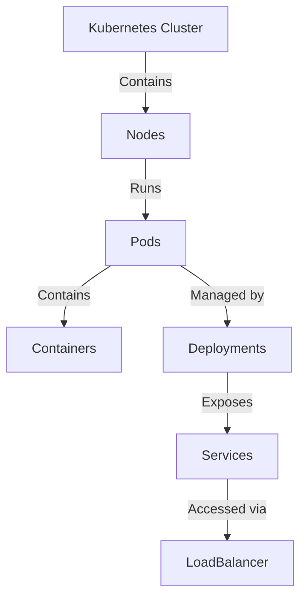

## 8.26 Immutable Infrastructure Pattern

In the realm of microservices architecture, the Immutable Infrastructure Pattern is a transformative approach that ensures consistency, reliability, and scalability. By deploying services as immutable units, this pattern minimizes configuration drift, reduces deployment errors, and simplifies rollback procedures. In this section, we will delve into the intricacies of the Immutable Infrastructure Pattern, focusing on its implementation in C# using containers and orchestration tools like Kubernetes.

### Understanding Immutable Infrastructure

**Immutable Infrastructure** refers to a paradigm where servers or components are never modified after deployment. Instead, any updates or changes necessitate the creation of a new version of the infrastructure. This approach contrasts with traditional mutable infrastructure, where updates are applied directly to existing systems, often leading to inconsistencies and configuration drift.

#### Key Concepts

- **Immutability**: Once a component is deployed, it remains unchanged. Any updates result in a new version.
- **Versioning**: Each deployment is a new version, allowing easy rollback to previous states if issues arise.
- **Consistency**: Ensures that all environments (development, testing, production) are identical, reducing "it works on my machine" issues.

### Benefits of Immutable Infrastructure

1. **Reliability**: By ensuring that infrastructure components are consistent across environments, the risk of deployment errors is significantly reduced.
2. **Scalability**: Immutable infrastructure can be easily scaled by deploying additional instances of the same version.
3. **Simplified Rollback**: If a deployment fails, reverting to a previous version is straightforward, as the previous version is still available.
4. **Security**: Reduces the attack surface by minimizing the need for SSH access and manual configuration changes.

### Implementing Immutable Infrastructure in C#

To implement immutable infrastructure in C#, we leverage containerization and orchestration technologies. Let's explore these components in detail.

#### Using Containers in C#

Containers encapsulate applications and their dependencies, ensuring that they run consistently across different environments. Docker is the most popular containerization platform, and it integrates seamlessly with .NET applications.

##### Dockerizing .NET Applications

**Docker** allows developers to package applications and their dependencies into a standardized unit called a container. This container can run on any system that supports Docker, ensuring consistency across development, testing, and production environments.

###### Steps to Dockerize a .NET Application

1. **Install Docker**: Ensure Docker is installed on your development machine. You can download it from [Docker's official website](https://www.docker.com/products/docker-desktop).

2. **Create a Dockerfile**: A Dockerfile is a script that contains instructions on how to build a Docker image for your application.

    ```dockerfile
    # Use the official .NET image as a base
    FROM mcr.microsoft.com/dotnet/aspnet:5.0 AS base
    WORKDIR /app
    EXPOSE 80

    # Build the application
    FROM mcr.microsoft.com/dotnet/sdk:5.0 AS build
    WORKDIR /src
    COPY ["MyApp/MyApp.csproj", "MyApp/"]
    RUN dotnet restore "MyApp/MyApp.csproj"
    COPY . .
    WORKDIR "/src/MyApp"
    RUN dotnet build "MyApp.csproj" -c Release -o /app/build

    # Publish the application
    FROM build AS publish
    RUN dotnet publish "MyApp.csproj" -c Release -o /app/publish

    # Create the final image
    FROM base AS final
    WORKDIR /app
    COPY --from=publish /app/publish .
    ENTRYPOINT ["dotnet", "MyApp.dll"]
    ```

    - **Base Image**: We use the official .NET runtime image as the base.
    - **Build Stage**: We restore dependencies and build the application.
    - **Publish Stage**: We publish the application to a folder.
    - **Final Image**: We copy the published output to the final image and set the entry point.

3. **Build the Docker Image**: Use the Docker CLI to build the image.

    ```bash
    docker build -t myapp:latest .
    ```

4. **Run the Docker Container**: Start a container from the image.

    ```bash
    docker run -d -p 8080:80 myapp:latest
    ```

5. **Test the Application**: Access the application via `http://localhost:8080`.

##### Try It Yourself

Experiment with the Dockerfile by changing the base image to a different .NET version or by adding environment variables. Observe how these changes affect the build and runtime behavior.

#### Orchestration with Kubernetes

While Docker provides the means to package and run applications, Kubernetes offers a robust platform for managing containerized applications at scale. It automates deployment, scaling, and operations of application containers across clusters of hosts.

##### Managing Containerized Microservices with Kubernetes

Kubernetes, often abbreviated as K8s, is an open-source system for automating the deployment, scaling, and management of containerized applications. It provides a framework to run distributed systems resiliently.

###### Key Components of Kubernetes

- **Pods**: The smallest deployable units in Kubernetes, which can contain one or more containers.
- **Services**: Abstractions that define a logical set of Pods and a policy to access them.
- **Deployments**: Controllers that manage stateless applications, ensuring the desired number of Pods are running.
- **ConfigMaps and Secrets**: Mechanisms to manage configuration data and sensitive information.

###### Deploying a .NET Application on Kubernetes

1. **Create a Kubernetes Cluster**: Use a cloud provider like Azure Kubernetes Service (AKS) or set up a local cluster with Minikube.

2. **Define a Deployment**: Create a YAML file to define the deployment of your .NET application.

    ```yaml
    apiVersion: apps/v1
    kind: Deployment
    metadata:
      name: myapp-deployment
    spec:
      replicas: 3
      selector:
        matchLabels:
          app: myapp
      template:
        metadata:
          labels:
            app: myapp
        spec:
          containers:
          - name: myapp
            image: myapp:latest
            ports:
            - containerPort: 80
    ```

    - **Replicas**: Specifies the number of Pods to run.
    - **Selector**: Identifies the Pods managed by the deployment.
    - **Template**: Defines the Pod's specifications.

3. **Apply the Deployment**: Use `kubectl` to apply the deployment.

    ```bash
    kubectl apply -f deployment.yaml
    ```

4. **Expose the Deployment**: Create a Service to expose the application.

    ```yaml
    apiVersion: v1
    kind: Service
    metadata:
      name: myapp-service
    spec:
      type: LoadBalancer
      selector:
        app: myapp
      ports:
      - protocol: TCP
        port: 80
        targetPort: 80
    ```

5. **Access the Application**: Use the external IP provided by the LoadBalancer to access the application.

##### Visualizing Kubernetes Architecture



**Description**: This diagram illustrates the hierarchy within a Kubernetes cluster, showing how nodes contain pods, which in turn contain containers. Deployments manage pods, and services expose them to external traffic.

##### Try It Yourself

Modify the deployment YAML to change the number of replicas or update the container image. Observe how Kubernetes handles these changes seamlessly.

### Design Considerations

When implementing the Immutable Infrastructure Pattern, consider the following:

- **Environment Parity**: Ensure that development, testing, and production environments are as similar as possible to avoid discrepancies.
- **Version Control**: Use version control systems to manage infrastructure as code, ensuring traceability and auditability.
- **Monitoring and Logging**: Implement robust monitoring and logging to quickly identify and resolve issues.
- **Security**: Regularly update base images and dependencies to mitigate vulnerabilities.

### Differences and Similarities with Other Patterns

The Immutable Infrastructure Pattern is often compared to the **Phoenix Server Pattern**, where servers are regularly destroyed and recreated to ensure consistency. However, immutable infrastructure emphasizes the immutability of the infrastructure itself, rather than the lifecycle of individual servers.

### Knowledge Check

- **Question**: What is the primary benefit of using immutable infrastructure?
  - **Answer**: Consistency across environments, reducing deployment errors.

- **Question**: How does Kubernetes help manage containerized applications?
  - **Answer**: By automating deployment, scaling, and operations across clusters.

### Embrace the Journey

Remember, adopting the Immutable Infrastructure Pattern is a journey towards greater reliability and scalability. As you implement these concepts, you'll gain deeper insights into the power of containers and orchestration. Keep experimenting, stay curious, and enjoy the journey!

## Quiz Time!



### What is the primary characteristic of immutable infrastructure?

- [x] Components are never modified after deployment
- [ ] Components are frequently updated in place
- [ ] Components are manually configured
- [ ] Components are only updated during business hours

> **Explanation:** Immutable infrastructure ensures that components remain unchanged after deployment, promoting consistency and reliability.

### Which tool is commonly used for containerizing .NET applications?

- [x] Docker
- [ ] Kubernetes
- [ ] Jenkins
- [ ] Terraform

> **Explanation:** Docker is the most popular tool for containerizing applications, including .NET applications.

### What is the role of a Kubernetes Deployment?

- [x] To manage stateless applications and ensure the desired number of Pods are running
- [ ] To store configuration data
- [ ] To provide network access to Pods
- [ ] To monitor application performance

> **Explanation:** Deployments in Kubernetes manage stateless applications, ensuring that the specified number of Pods are running.

### How does Kubernetes expose applications to external traffic?

- [x] Through Services and LoadBalancers
- [ ] Through ConfigMaps
- [ ] Through Secrets
- [ ] Through Pods

> **Explanation:** Kubernetes uses Services and LoadBalancers to expose applications to external traffic.

### What is a key benefit of using immutable infrastructure?

- [x] Simplified rollback procedures
- [ ] Increased manual configuration
- [ ] Reduced version control
- [ ] Increased SSH access

> **Explanation:** Immutable infrastructure simplifies rollback procedures by allowing easy reversion to previous versions.

### Which component in Kubernetes contains one or more containers?

- [x] Pod
- [ ] Node
- [ ] Service
- [ ] Deployment

> **Explanation:** A Pod is the smallest deployable unit in Kubernetes and can contain one or more containers.

### What is the purpose of a Dockerfile?

- [x] To define instructions for building a Docker image
- [ ] To store application logs
- [ ] To manage Kubernetes clusters
- [ ] To configure network settings

> **Explanation:** A Dockerfile contains instructions on how to build a Docker image for an application.

### How does Kubernetes ensure application resilience?

- [x] By automating deployment and scaling
- [ ] By increasing manual intervention
- [ ] By reducing the number of Pods
- [ ] By disabling monitoring

> **Explanation:** Kubernetes ensures application resilience by automating deployment, scaling, and management of containerized applications.

### What is the smallest deployable unit in Kubernetes?

- [x] Pod
- [ ] Node
- [ ] Service
- [ ] Deployment

> **Explanation:** A Pod is the smallest deployable unit in Kubernetes.

### True or False: Immutable infrastructure reduces the need for SSH access.

- [x] True
- [ ] False

> **Explanation:** Immutable infrastructure reduces the need for SSH access by minimizing manual configuration changes.


