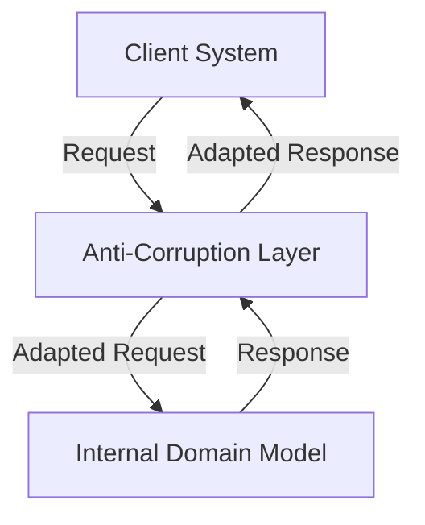

## 8.27 Anti-Corruption Layer Pattern

In the realm of software architecture, particularly within microservices, maintaining the integrity of your domain model is paramount. The Anti-Corruption Layer (ACL) pattern serves as a crucial design strategy to protect your internal systems from being tainted by external systems. This pattern acts as a boundary, ensuring that the core domain model remains pure and unaffected by external influences. In this comprehensive guide, we will delve into the intricacies of the Anti-Corruption Layer pattern, its implementation in C#, and its significance in microservices architecture.

### Understanding the Anti-Corruption Layer Pattern

#### Intent

The primary intent of the Anti-Corruption Layer pattern is to create a protective boundary between your internal domain model and external systems. This boundary prevents the external systems from polluting or corrupting the internal domain model, thereby maintaining its integrity and consistency.

#### Key Participants

- **Client System**: The external system or service that interacts with your application.
- **Anti-Corruption Layer (ACL)**: The intermediary layer that translates and adapts the communication between the client system and the internal domain model.
- **Internal Domain Model**: The core business logic and data structures that represent the internal state of your application.

#### Applicability

The Anti-Corruption Layer pattern is applicable in scenarios where:

- You need to integrate with legacy systems that have different data models or protocols.
- You want to protect your domain model from changes in external systems.
- You aim to maintain a clean and consistent domain model without external dependencies.

### Implementing Anti-Corruption Layers in C#

Implementing an Anti-Corruption Layer in C# involves creating adapters and translators that facilitate communication between the external systems and your internal domain model. Let's explore the steps involved in this implementation.

#### Creating Adapters and Translators

Adapters and translators are key components of the Anti-Corruption Layer. They are responsible for converting data and requests between the external systems and the internal domain model.

1. **Define Interfaces**: Start by defining interfaces that represent the external system's data and operations. This abstraction allows you to decouple the external system from your internal domain model.

2. **Implement Adapters**: Create adapter classes that implement the defined interfaces. These adapters act as intermediaries, translating requests and responses between the external system and the internal domain model.

3. **Develop Translators**: Implement translators to convert data formats and structures between the external system and the internal domain model. This ensures that the data remains consistent and compatible with your domain model.

4. **Integrate with Domain Model**: Finally, integrate the adapters and translators with your internal domain model, ensuring seamless communication and data exchange.

#### Sample Code Snippet

Let's consider a scenario where we need to integrate with a legacy billing system. We'll implement an Anti-Corruption Layer to protect our domain model from the legacy system's data structures.

```csharp
// Define the interface for the legacy billing system
public interface ILegacyBillingSystem
{
    string GetInvoiceData(int invoiceId);
}

// Implement the adapter for the legacy billing system
public class LegacyBillingAdapter : ILegacyBillingSystem
{
    private readonly LegacyBillingService _legacyService;

    public LegacyBillingAdapter(LegacyBillingService legacyService)
    {
        _legacyService = legacyService;
    }

    public string GetInvoiceData(int invoiceId)
    {
        // Translate the request to the legacy system's format
        var legacyInvoiceData = _legacyService.FetchInvoiceData(invoiceId);
        // Translate the response to the internal domain model's format
        return TranslateToDomainFormat(legacyInvoiceData);
    }

    private string TranslateToDomainFormat(string legacyData)
    {
        // Implement translation logic here
        return legacyData; // Simplified for illustration
    }
}

// Internal domain model representation
public class Invoice
{
    public int Id { get; set; }
    public string Data { get; set; }
}

// Usage in the domain model
public class InvoiceService
{
    private readonly ILegacyBillingSystem _billingSystem;

    public InvoiceService(ILegacyBillingSystem billingSystem)
    {
        _billingSystem = billingSystem;
    }

    public Invoice GetInvoice(int invoiceId)
    {
        var invoiceData = _billingSystem.GetInvoiceData(invoiceId);
        return new Invoice { Id = invoiceId, Data = invoiceData };
    }
}
```

In this example, the `LegacyBillingAdapter` acts as the Anti-Corruption Layer, translating requests and responses between the legacy billing system and the internal domain model.

### Use Cases and Examples

The Anti-Corruption Layer pattern is particularly useful in scenarios where you need to integrate with legacy systems or third-party services. Let's explore some common use cases and examples.

#### Integrating with Legacy Systems

Legacy systems often have outdated data models and protocols that can conflict with modern domain models. By implementing an Anti-Corruption Layer, you can ensure that your domain model remains consistent and unaffected by the legacy system's data structures.

#### Ensuring Domain Integrity

When integrating with third-party services, there is a risk of external data structures polluting your domain model. The Anti-Corruption Layer acts as a safeguard, translating and adapting external data to fit your domain model, thereby ensuring its integrity.

### Design Considerations

When implementing the Anti-Corruption Layer pattern, consider the following design considerations:

- **Performance**: The additional layer of translation and adaptation can introduce latency. Optimize the translation logic to minimize performance impact.
- **Scalability**: Ensure that the Anti-Corruption Layer can handle increased load and scale with your application.
- **Maintainability**: Keep the translation logic modular and maintainable to accommodate changes in external systems or domain models.

### Differences and Similarities

The Anti-Corruption Layer pattern is often compared to the Adapter pattern. While both patterns involve translation and adaptation, the Anti-Corruption Layer pattern focuses on protecting the domain model from external influences, whereas the Adapter pattern is primarily concerned with interface compatibility.

### Visualizing the Anti-Corruption Layer Pattern

To better understand the Anti-Corruption Layer pattern, let's visualize its components and interactions using a Mermaid.js diagram.



**Diagram Description**: This diagram illustrates the flow of requests and responses between the client system, the Anti-Corruption Layer, and the internal domain model. The Anti-Corruption Layer acts as a mediator, translating and adapting the communication between the client system and the domain model.

### Try It Yourself

To deepen your understanding of the Anti-Corruption Layer pattern, try implementing it in a sample project. Consider integrating with a mock legacy system and creating adapters and translators to protect your domain model. Experiment with different translation strategies and observe how they impact the performance and scalability of your application.

### Knowledge Check

- What is the primary intent of the Anti-Corruption Layer pattern?
- How does the Anti-Corruption Layer pattern differ from the Adapter pattern?
- What are some common use cases for the Anti-Corruption Layer pattern?
- How can you optimize the performance of an Anti-Corruption Layer?
- Why is it important to maintain the integrity of your domain model?

### Embrace the Journey

Remember, mastering the Anti-Corruption Layer pattern is just one step in your journey to becoming an expert in C# design patterns and microservices architecture. As you continue to explore and experiment with different patterns, you'll gain a deeper understanding of how to build scalable and maintainable applications. Keep pushing the boundaries of your knowledge, stay curious, and enjoy the journey!

## Quiz Time!



### What is the primary intent of the Anti-Corruption Layer pattern?

- [x] To create a boundary that prevents external systems from polluting the internal domain model.
- [ ] To enhance the performance of microservices.
- [ ] To simplify the user interface.
- [ ] To improve database access speed.

> **Explanation:** The Anti-Corruption Layer pattern is designed to protect the internal domain model from being affected by external systems.

### Which component acts as the intermediary in the Anti-Corruption Layer pattern?

- [x] Adapter
- [ ] Client System
- [ ] Internal Domain Model
- [ ] Database

> **Explanation:** The adapter acts as the intermediary, translating requests and responses between the external system and the internal domain model.

### What is a common use case for the Anti-Corruption Layer pattern?

- [x] Integrating with legacy systems
- [ ] Enhancing UI design
- [ ] Improving network security
- [ ] Reducing code complexity

> **Explanation:** The Anti-Corruption Layer pattern is commonly used to integrate with legacy systems while maintaining domain integrity.

### How can you optimize the performance of an Anti-Corruption Layer?

- [x] By optimizing the translation logic
- [ ] By increasing the number of adapters
- [ ] By simplifying the user interface
- [ ] By reducing the number of database queries

> **Explanation:** Optimizing the translation logic can help minimize the performance impact of the Anti-Corruption Layer.

### What is the difference between the Anti-Corruption Layer pattern and the Adapter pattern?

- [x] The Anti-Corruption Layer focuses on domain protection, while the Adapter focuses on interface compatibility.
- [ ] The Anti-Corruption Layer is used for UI design, while the Adapter is used for database access.
- [ ] The Anti-Corruption Layer is faster than the Adapter.
- [ ] The Anti-Corruption Layer is more complex than the Adapter.

> **Explanation:** The Anti-Corruption Layer pattern is concerned with protecting the domain model, whereas the Adapter pattern is about interface compatibility.

### Why is it important to maintain the integrity of your domain model?

- [x] To ensure consistency and reliability of business logic
- [ ] To improve user interface design
- [ ] To enhance network security
- [ ] To reduce code complexity

> **Explanation:** Maintaining domain model integrity ensures that the business logic remains consistent and reliable.

### What role does the translator play in the Anti-Corruption Layer pattern?

- [x] It converts data formats between external systems and the domain model.
- [ ] It manages user authentication.
- [ ] It handles database transactions.
- [ ] It improves network performance.

> **Explanation:** The translator is responsible for converting data formats to ensure compatibility between external systems and the domain model.

### How does the Anti-Corruption Layer pattern help with legacy system integration?

- [x] By translating and adapting data to fit the domain model
- [ ] By simplifying the user interface
- [ ] By enhancing network security
- [ ] By reducing code complexity

> **Explanation:** The Anti-Corruption Layer pattern translates and adapts data from legacy systems to ensure it fits the domain model.

### What is a potential drawback of implementing an Anti-Corruption Layer?

- [x] It can introduce latency due to additional translation.
- [ ] It simplifies the user interface.
- [ ] It enhances network security.
- [ ] It reduces code complexity.

> **Explanation:** The additional layer of translation can introduce latency, which is a potential drawback.

### True or False: The Anti-Corruption Layer pattern is only applicable in microservices architecture.

- [ ] True
- [x] False

> **Explanation:** While commonly used in microservices, the Anti-Corruption Layer pattern can be applied in various architectural styles where domain integrity needs protection.


