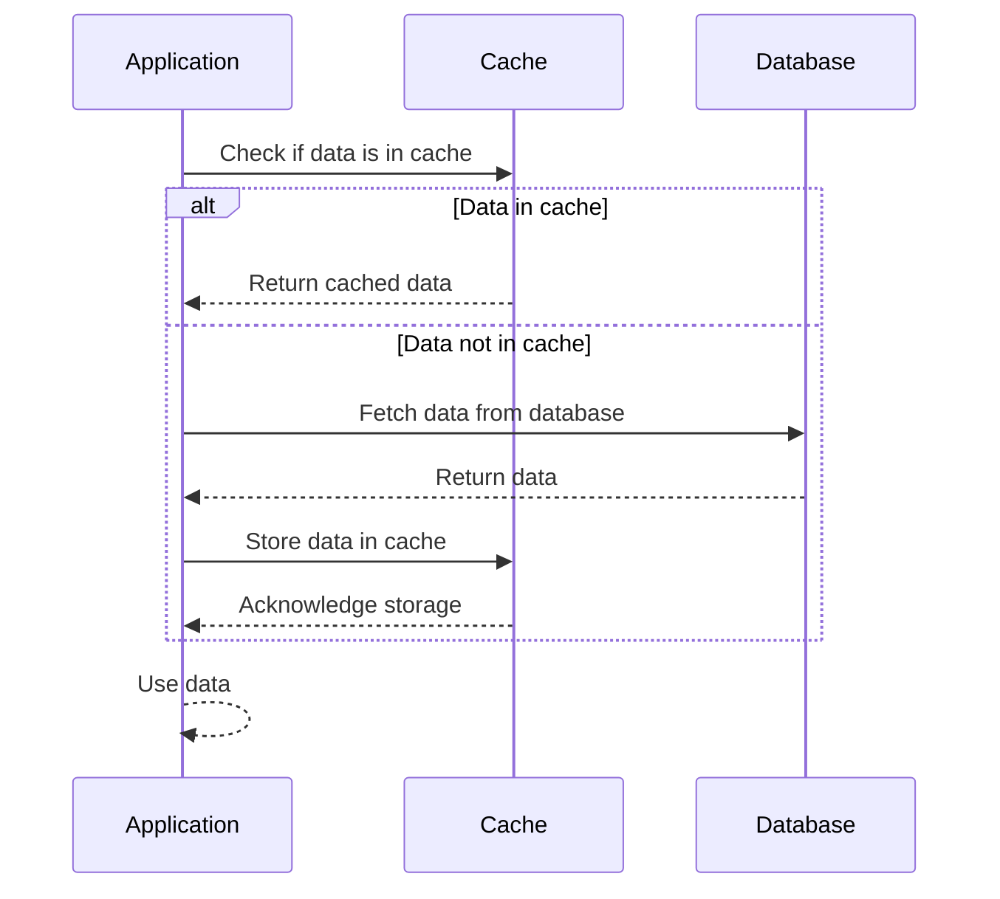

## 8.29 Cache-Aside Pattern

In the realm of microservices architecture, efficient data retrieval and reduced database load are critical for maintaining high performance and scalability. The Cache-Aside Pattern is a widely adopted strategy to achieve these goals by loading data into the cache only on demand. This pattern is particularly useful in scenarios where data is frequently read but infrequently updated, allowing for significant performance improvements.

### Intent

The Cache-Aside Pattern, also known as Lazy Loading, is designed to improve application performance by caching data that is expensive to fetch or compute. The pattern ensures that data is loaded into the cache only when it is requested, thereby reducing the load on the database and speeding up data retrieval.

### Key Participants

1. **Cache**: A storage layer that holds frequently accessed data to reduce database load.
2. **Database**: The primary data source where data is stored persistently.
3. **Application**: The consumer of data that interacts with both the cache and the database.

### Applicability

The Cache-Aside Pattern is applicable in scenarios where:
- Data is read frequently but updated infrequently.
- The cost of fetching data from the database is high.
- The application can tolerate eventual consistency.

### Implementing Caching in Microservices

Implementing caching in microservices involves selecting an appropriate caching strategy and technology. Redis is a popular choice for caching due to its high performance and support for various data structures.

#### Using Redis Cache

Redis is an in-memory data structure store that can be used as a cache, database, and message broker. It supports various data structures such as strings, hashes, lists, sets, and more, making it a versatile choice for caching in microservices.

**Steps to Implement Cache-Aside Pattern with Redis:**

1. **Check Cache**: When the application needs data, it first checks if the data is available in the cache.
2. **Fetch from Database**: If the data is not in the cache, the application fetches it from the database.
3. **Store in Cache**: The fetched data is then stored in the cache for future requests.
4. **Return Data**: The data is returned to the application.

```csharp
using StackExchange.Redis;
using System;

public class CacheAsideExample
{
    private static readonly ConnectionMultiplexer redis = ConnectionMultiplexer.Connect("localhost");
    private static readonly IDatabase cache = redis.GetDatabase();

    public static string GetData(string key)
    {
        // Step 1: Check Cache
        string cachedData = cache.StringGet(key);
        if (!string.IsNullOrEmpty(cachedData))
        {
            Console.WriteLine("Data retrieved from cache.");
            return cachedData;
        }

        // Step 2: Fetch from Database (Simulated)
        string databaseData = FetchFromDatabase(key);

        // Step 3: Store in Cache
        cache.StringSet(key, databaseData);

        // Step 4: Return Data
        Console.WriteLine("Data retrieved from database and stored in cache.");
        return databaseData;
    }

    private static string FetchFromDatabase(string key)
    {
        // Simulate database access
        return "DatabaseValueFor_" + key;
    }
}
```

### Design Considerations

- **Cache Expiration**: Implement cache expiration policies to ensure that stale data does not persist indefinitely.
- **Cache Invalidation**: Determine strategies for invalidating cache entries when data is updated in the database.
- **Consistency**: Consider the trade-offs between consistency and performance. The Cache-Aside Pattern may lead to eventual consistency.
- **Scalability**: Ensure that the caching solution can scale with the application.

### Differences and Similarities

The Cache-Aside Pattern is often compared to other caching strategies such as Write-Through and Write-Behind. Unlike these patterns, Cache-Aside does not automatically update the cache when data is written to the database, which can lead to stale data if not managed properly.

### Use Cases and Examples

#### Reducing Database Load

By caching frequently accessed data, the Cache-Aside Pattern reduces the number of database queries, thereby decreasing the load on the database and improving overall application performance.

#### Speeding Up Data Retrieval

Cached data can be retrieved much faster than data from a database, leading to improved response times and a better user experience.

### Visualizing the Cache-Aside Pattern

To better understand the flow of the Cache-Aside Pattern, let's visualize the process using a sequence diagram.



### Try It Yourself

Experiment with the provided code example by modifying the cache expiration policy or simulating database updates to observe how the cache behaves. Consider implementing cache invalidation strategies to ensure data consistency.

### References and Links

- [Redis Documentation](https://redis.io/documentation)
- [StackExchange.Redis GitHub Repository](https://github.com/StackExchange/StackExchange.Redis)
- [Microsoft Caching Guidance](https://docs.microsoft.com/en-us/azure/architecture/best-practices/caching)

### Knowledge Check

- Explain the Cache-Aside Pattern and its benefits.
- Describe how Redis can be used to implement caching in microservices.
- Discuss the trade-offs between consistency and performance in caching.

### Embrace the Journey

Remember, mastering caching strategies like the Cache-Aside Pattern is just one step in building efficient and scalable microservices. Keep exploring different patterns and technologies to enhance your skills and stay ahead in the ever-evolving world of software development. Enjoy the journey!

## Quiz Time!



### What is the primary intent of the Cache-Aside Pattern?

- [x] To load data into the cache only on demand
- [ ] To automatically update the cache when data is written to the database
- [ ] To ensure strong consistency between cache and database
- [ ] To store all data in the cache permanently

> **Explanation:** The Cache-Aside Pattern aims to load data into the cache only when it is requested, reducing database load and speeding up data retrieval.

### Which technology is commonly used for implementing the Cache-Aside Pattern in microservices?

- [x] Redis
- [ ] MongoDB
- [ ] SQL Server
- [ ] RabbitMQ

> **Explanation:** Redis is a popular choice for caching in microservices due to its high performance and support for various data structures.

### What is a key consideration when using the Cache-Aside Pattern?

- [x] Cache expiration and invalidation
- [ ] Automatic cache updates
- [ ] Strong consistency
- [ ] Permanent data storage in cache

> **Explanation:** Cache expiration and invalidation are important considerations to ensure that stale data does not persist in the cache.

### How does the Cache-Aside Pattern handle data updates?

- [x] It requires manual cache invalidation when data is updated in the database
- [ ] It automatically updates the cache when data is updated
- [ ] It does not allow data updates
- [ ] It stores updated data in a separate cache

> **Explanation:** The Cache-Aside Pattern requires manual cache invalidation to ensure consistency when data is updated in the database.

### What is a potential drawback of the Cache-Aside Pattern?

- [x] Eventual consistency
- [ ] High database load
- [ ] Slow data retrieval
- [ ] Complex implementation

> **Explanation:** The Cache-Aside Pattern may lead to eventual consistency, where the cache and database may not always be in sync.

### Which of the following is NOT a benefit of using the Cache-Aside Pattern?

- [ ] Reduced database load
- [ ] Faster data retrieval
- [x] Automatic cache updates
- [ ] Improved application performance

> **Explanation:** The Cache-Aside Pattern does not provide automatic cache updates; it requires manual invalidation.

### In the Cache-Aside Pattern, what happens if the data is not found in the cache?

- [x] The application fetches the data from the database
- [ ] The application returns an error
- [ ] The application waits for the cache to update
- [ ] The application uses default values

> **Explanation:** If the data is not found in the cache, the application fetches it from the database and stores it in the cache.

### What is the role of the cache in the Cache-Aside Pattern?

- [x] To store frequently accessed data for faster retrieval
- [ ] To permanently store all application data
- [ ] To replace the database
- [ ] To handle all data updates

> **Explanation:** The cache stores frequently accessed data to reduce database load and speed up data retrieval.

### How can you experiment with the Cache-Aside Pattern code example?

- [x] Modify the cache expiration policy
- [ ] Change the database schema
- [ ] Disable the cache
- [ ] Use a different programming language

> **Explanation:** Experimenting with the cache expiration policy can help you understand how the cache behaves and affects data consistency.

### True or False: The Cache-Aside Pattern ensures strong consistency between cache and database.

- [ ] True
- [x] False

> **Explanation:** The Cache-Aside Pattern may lead to eventual consistency, where the cache and database may not always be in sync.


