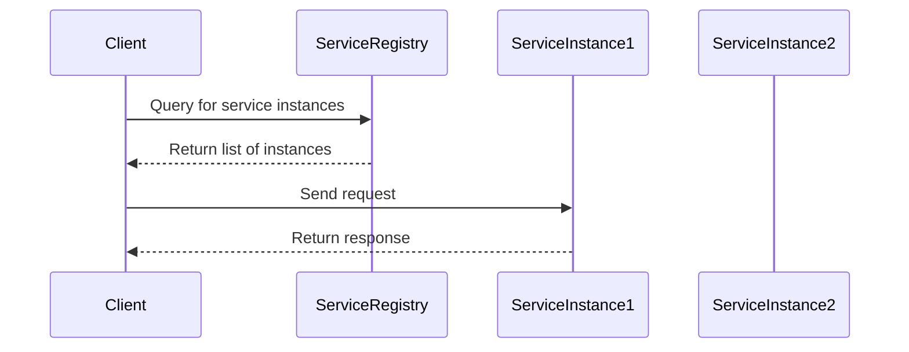
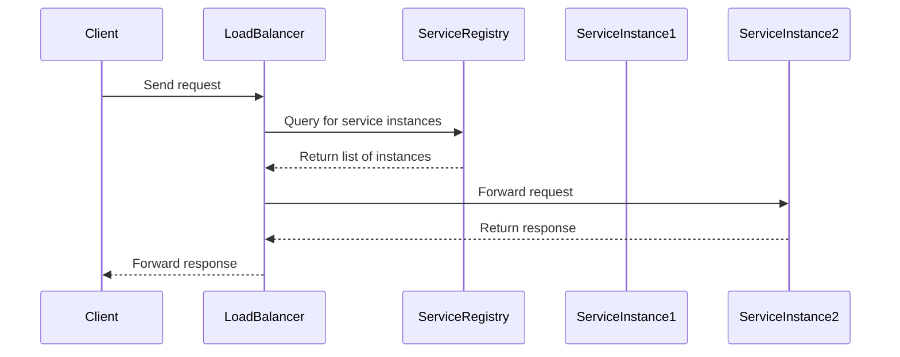

## 8.3 Service Discovery Patterns

In the world of microservices, service discovery is a critical component that enables services to dynamically find and communicate with each other. This is essential for maintaining the flexibility and scalability that microservices promise. In this section, we will explore the two primary service discovery patterns: Client-Side Discovery and Server-Side Discovery. We'll delve into their implementation in C#, using tools like Consul, Eureka, Azure Service Fabric, and Kubernetes. 

### Introduction to Service Discovery

Service discovery is the process by which a microservice identifies the network location of another service it needs to communicate with. In a microservices architecture, services are often deployed across multiple servers or containers, and their network locations can change dynamically due to scaling, failures, or updates. Service discovery patterns help manage these changes and ensure that services can reliably find and communicate with each other.

### Client-Side Discovery

Client-side discovery involves the client being responsible for determining the network locations of available service instances and load balancing requests across them. This pattern requires the client to query a service registry, which contains the network locations of all service instances.

#### Implementing Client-Side Discovery in C#

To implement client-side discovery in C#, we can use libraries and tools like Consul or Eureka. These tools provide a service registry that clients can query to discover service instances.

##### Using Consul for Client-Side Discovery

Consul is a popular tool for service discovery and configuration. It provides a distributed, highly available service registry that clients can query to discover service instances.

**Steps to Implement Client-Side Discovery with Consul:**

1. **Set Up Consul Server:**
   - Install and configure a Consul server to act as the service registry.

2. **Register Services with Consul:**
   - Each service instance registers itself with the Consul server, providing its network location and health check information.

3. **Implement Client Logic:**
   - Clients query the Consul server to get the list of available service instances.
   - Clients use this information to load balance requests across service instances.

**Example Code:**

```csharp
using Consul;
using System;
using System.Linq;
using System.Net.Http;
using System.Threading.Tasks;

public class ConsulServiceDiscovery
{
    private readonly ConsulClient _consulClient;

    public ConsulServiceDiscovery()
    {
        _consulClient = new ConsulClient(config => config.Address = new Uri("http://localhost:8500"));
    }

    public async Task<string> DiscoverServiceAsync(string serviceName)
    {
        var services = await _consulClient.Agent.Services();
        var service = services.Response.Values.FirstOrDefault(s => s.Service.Equals(serviceName, StringComparison.OrdinalIgnoreCase));

        if (service != null)
        {
            return $"http://{service.Address}:{service.Port}";
        }

        throw new Exception($"Service {serviceName} not found.");
    }
}
```

**Try It Yourself:**
- Modify the code to handle multiple instances of a service and implement a simple round-robin load balancing strategy.

##### Using Eureka for Client-Side Discovery

Eureka is another popular service registry, particularly in the Spring Cloud ecosystem. It provides similar functionality to Consul but is more tightly integrated with Java-based applications. However, it can still be used in C# applications with some additional setup.

**Steps to Implement Client-Side Discovery with Eureka:**

1. **Set Up Eureka Server:**
   - Deploy a Eureka server to act as the service registry.

2. **Register Services with Eureka:**
   - Service instances register themselves with the Eureka server.

3. **Implement Client Logic:**
   - Clients query the Eureka server to discover service instances.

**Example Code:**

```csharp
// Note: Using Steeltoe, a .NET library for Spring Cloud services
using Steeltoe.Discovery.Client;
using System;
using System.Net.Http;
using System.Threading.Tasks;

public class EurekaServiceDiscovery
{
    private readonly DiscoveryClient _discoveryClient;

    public EurekaServiceDiscovery(DiscoveryClient discoveryClient)
    {
        _discoveryClient = discoveryClient;
    }

    public async Task<string> DiscoverServiceAsync(string serviceName)
    {
        var instances = await _discoveryClient.GetInstancesAsync(serviceName);
        var instance = instances.FirstOrDefault();

        if (instance != null)
        {
            return $"{instance.Uri}";
        }

        throw new Exception($"Service {serviceName} not found.");
    }
}
```

**Try It Yourself:**
- Experiment with different load balancing strategies, such as random or least connections.

#### Use Cases and Examples

Client-side discovery is particularly useful in scenarios where the client needs to have control over the load balancing strategy. It is often used in environments where services are deployed in a dynamic and distributed manner, such as in cloud-native applications.

### Server-Side Discovery

Server-side discovery offloads the responsibility of service discovery and load balancing to a dedicated component, such as a load balancer or a service mesh. In this pattern, the client makes a request to a load balancer, which then queries the service registry and forwards the request to an appropriate service instance.

#### Implementing Server-Side Discovery with Load Balancers and Service Registries

Server-side discovery can be implemented using various tools and platforms, such as Azure Service Fabric or Kubernetes. These platforms provide built-in mechanisms for service discovery and load balancing.

##### Using Azure Service Fabric for Server-Side Discovery

Azure Service Fabric is a distributed systems platform that simplifies the development, deployment, and management of scalable and reliable microservices. It provides built-in service discovery and load balancing capabilities.

**Steps to Implement Server-Side Discovery with Azure Service Fabric:**

1. **Deploy Services to Service Fabric:**
   - Deploy your microservices to an Azure Service Fabric cluster.

2. **Use Service Fabric's Naming Service:**
   - Service Fabric provides a naming service that acts as a service registry.

3. **Implement Client Logic:**
   - Clients make requests to a service endpoint, and Service Fabric handles the discovery and load balancing.

**Example Code:**

```csharp
using Microsoft.ServiceFabric.Services.Client;
using Microsoft.ServiceFabric.Services.Remoting.Client;
using System;
using System.Threading.Tasks;

public class ServiceFabricDiscovery
{
    public async Task<string> CallServiceAsync(string serviceName)
    {
        var serviceUri = new Uri($"fabric:/{serviceName}");
        var serviceProxy = ServiceProxy.Create<IMyService>(serviceUri, new ServicePartitionKey(0));

        return await serviceProxy.MyServiceMethodAsync();
    }
}
```

**Try It Yourself:**
- Deploy multiple instances of a service and observe how Service Fabric handles load balancing.

##### Using Kubernetes for Server-Side Discovery

Kubernetes is a powerful container orchestration platform that provides robust service discovery and load balancing features. It uses a combination of DNS and environment variables to enable service discovery.

**Steps to Implement Server-Side Discovery with Kubernetes:**

1. **Deploy Services to Kubernetes:**
   - Deploy your microservices as Kubernetes pods.

2. **Use Kubernetes Services:**
   - Define Kubernetes services to expose your microservices.

3. **Implement Client Logic:**
   - Clients make requests to the Kubernetes service, which handles discovery and load balancing.

**Example Code:**

```yaml
apiVersion: v1
kind: Service
metadata:
  name: my-service
spec:
  selector:
    app: my-app
  ports:
    - protocol: TCP
      port: 80
      targetPort: 8080
```

**Try It Yourself:**
- Experiment with different service types in Kubernetes, such as ClusterIP, NodePort, and LoadBalancer.

#### Use Cases and Examples

Server-side discovery is ideal for environments where the infrastructure can handle the complexity of service discovery and load balancing. It is often used in large-scale deployments where centralized control is beneficial.

### Key Participants in Service Discovery Patterns

- **Service Registry:** A database of available service instances, including their network locations and health status.
- **Service Provider:** A microservice that registers itself with the service registry.
- **Service Consumer:** A client or another microservice that queries the service registry to discover service instances.
- **Load Balancer (Server-Side Discovery):** A component that forwards client requests to available service instances.

### Applicability

Service discovery patterns are applicable in any microservices architecture where services need to communicate with each other. They are particularly important in dynamic environments where services are frequently added, removed, or relocated.

### Design Considerations

- **Consistency and Availability:** Ensure that the service registry is highly available and consistent to prevent service discovery failures.
- **Scalability:** Choose a service discovery pattern that can scale with your application's needs.
- **Security:** Implement security measures to protect the service registry and communication between services.
- **Latency:** Minimize the latency introduced by service discovery to maintain application performance.

### Differences and Similarities

- **Client-Side vs. Server-Side Discovery:** The main difference lies in where the responsibility for service discovery and load balancing resides. Client-side discovery gives more control to the client, while server-side discovery centralizes these responsibilities.
- **Tools and Platforms:** Both patterns can be implemented using various tools and platforms, such as Consul, Eureka, Azure Service Fabric, and Kubernetes.

### Visualizing Service Discovery Patterns

To better understand the flow of service discovery, let's visualize the process using Mermaid.js diagrams.

#### Client-Side Discovery Diagram



#### Server-Side Discovery Diagram



### Conclusion

Service discovery patterns are essential for building scalable and resilient microservices architectures. By understanding and implementing these patterns, you can ensure that your services can dynamically find and communicate with each other, even in the face of changing network conditions and service instances. Whether you choose client-side or server-side discovery, tools like Consul, Eureka, Azure Service Fabric, and Kubernetes provide the necessary infrastructure to support your microservices.

Remember, mastering service discovery is just one step in your journey to becoming an expert in microservices architecture. Keep exploring, experimenting, and learning to build robust and scalable applications.

## Quiz Time!



### What is the primary role of a service registry in service discovery patterns?

- [x] To store and provide the network locations of service instances
- [ ] To handle client requests directly
- [ ] To perform data processing tasks
- [ ] To manage database connections

> **Explanation:** The service registry acts as a database of available service instances, providing their network locations and health status.

### In client-side discovery, who is responsible for load balancing?

- [x] The client
- [ ] The service registry
- [ ] The load balancer
- [ ] The service provider

> **Explanation:** In client-side discovery, the client is responsible for determining the network locations of available service instances and load balancing requests across them.

### Which tool is commonly used for client-side discovery in C# applications?

- [x] Consul
- [ ] Azure Service Fabric
- [ ] Kubernetes
- [ ] Docker

> **Explanation:** Consul is a popular tool for service discovery and configuration, often used for client-side discovery in C# applications.

### What is the main advantage of server-side discovery over client-side discovery?

- [x] Centralized control of service discovery and load balancing
- [ ] Simplicity of implementation
- [ ] Reduced network latency
- [ ] Increased client-side flexibility

> **Explanation:** Server-side discovery centralizes the responsibilities of service discovery and load balancing, which can be advantageous in large-scale deployments.

### Which platform provides built-in service discovery and load balancing capabilities?

- [x] Azure Service Fabric
- [ ] GitHub
- [ ] Visual Studio
- [ ] Microsoft Word

> **Explanation:** Azure Service Fabric is a distributed systems platform that provides built-in service discovery and load balancing capabilities.

### In server-side discovery, what component forwards client requests to service instances?

- [x] Load Balancer
- [ ] Service Registry
- [ ] Client
- [ ] Service Provider

> **Explanation:** In server-side discovery, the load balancer forwards client requests to available service instances.

### What is a key consideration when implementing service discovery patterns?

- [x] Consistency and availability of the service registry
- [ ] The color scheme of the user interface
- [ ] The type of database used
- [ ] The programming language syntax

> **Explanation:** Ensuring the consistency and availability of the service registry is crucial to prevent service discovery failures.

### Which tool is tightly integrated with Java-based applications but can be used in C# applications?

- [x] Eureka
- [ ] Consul
- [ ] Kubernetes
- [ ] Docker

> **Explanation:** Eureka is a service registry that is tightly integrated with Java-based applications but can also be used in C# applications with additional setup.

### What is the primary difference between client-side and server-side discovery?

- [x] Where the responsibility for service discovery and load balancing resides
- [ ] The programming language used
- [ ] The type of database used
- [ ] The color scheme of the user interface

> **Explanation:** The primary difference lies in where the responsibility for service discovery and load balancing resides. Client-side discovery gives more control to the client, while server-side discovery centralizes these responsibilities.

### True or False: Kubernetes uses a combination of DNS and environment variables for service discovery.

- [x] True
- [ ] False

> **Explanation:** Kubernetes uses a combination of DNS and environment variables to enable service discovery.




