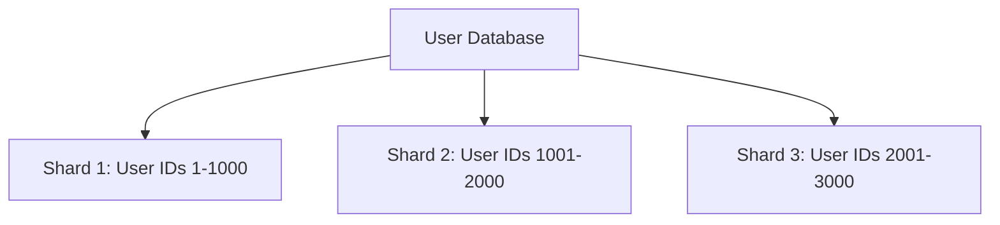
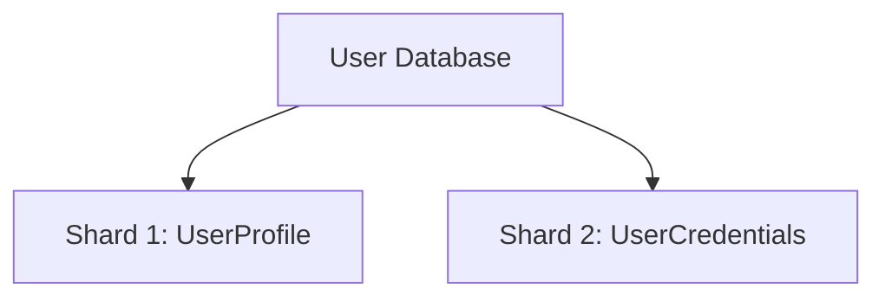

## 8.30 Data Sharding and Partitioning

Data sharding and partitioning are critical techniques for managing large-scale data systems and distributed databases. They are essential for achieving scalability and performance in modern applications, especially in microservices architectures. In this section, we will delve into the concepts of data sharding and partitioning, explore various strategies for implementation, and provide practical examples and use cases.

### Introduction to Data Sharding and Partitioning

Data sharding and partitioning involve dividing a dataset into smaller, more manageable pieces, known as shards or partitions. This division allows for parallel processing, improved performance, and scalability. By distributing data across multiple nodes or servers, applications can handle larger datasets and higher loads without compromising performance.

#### Key Concepts

- **Sharding**: The process of dividing a database into smaller, more manageable pieces called shards. Each shard is a separate database that can be stored on a different server or node.
- **Partitioning**: Similar to sharding, partitioning involves dividing data into segments. However, partitioning is often used within a single database instance, whereas sharding typically involves multiple instances.

### Implementing Sharding Strategies

Implementing an effective sharding strategy requires careful consideration of the application's data access patterns, scalability requirements, and performance goals. There are two primary sharding techniques: horizontal sharding and vertical sharding.

#### Horizontal Sharding

Horizontal sharding, also known as range-based sharding, involves dividing data based on a specific range of values. Each shard contains a subset of the data, typically based on a key or range of keys.

**Example:**

Consider a database of user accounts. We can shard the data based on the user's ID, with each shard containing a range of user IDs.

```csharp
public class User
{
    public int UserId { get; set; }
    public string Name { get; set; }
    public string Email { get; set; }
}

// Shard 1: User IDs 1-1000
// Shard 2: User IDs 1001-2000
// ...

// Function to determine shard based on UserId
public int GetShardId(int userId)
{
    return (userId - 1) / 1000 + 1;
}
```

#### Vertical Sharding

Vertical sharding involves dividing data based on columns rather than rows. Each shard contains a subset of the columns, often grouped by related data.

**Example:**

In a database with user profiles, we might separate personal information from login credentials into different shards.

```csharp
public class UserProfile
{
    public int UserId { get; set; }
    public string Name { get; set; }
    public string Email { get; set; }
}

public class UserCredentials
{
    public int UserId { get; set; }
    public string PasswordHash { get; set; }
    public string Salt { get; set; }
}
```

### Use Cases and Examples

Data sharding and partitioning are particularly useful in large-scale data systems and distributed databases. Let's explore some common use cases and examples.

#### Large-Scale Data Systems

In large-scale data systems, sharding allows for efficient data distribution and parallel processing. This is crucial for applications that handle massive amounts of data, such as social media platforms, e-commerce sites, and financial services.

**Example:**

A social media platform with millions of users can use sharding to distribute user data across multiple servers, ensuring fast access and updates.

```csharp
public class SocialMediaUser
{
    public int UserId { get; set; }
    public string Username { get; set; }
    public string Bio { get; set; }
    public List<Post> Posts { get; set; }
}

// Shard based on UserId
public int GetShardId(int userId)
{
    return (userId - 1) / 10000 + 1;
}
```

#### Distributed Databases

In distributed databases, sharding enables data to be stored across multiple nodes, improving fault tolerance and availability. This is essential for applications that require high availability and resilience.

**Example:**

An e-commerce platform can use sharding to distribute product and order data across different regions, ensuring fast access and redundancy.

```csharp
public class Product
{
    public int ProductId { get; set; }
    public string Name { get; set; }
    public decimal Price { get; set; }
}

// Shard based on ProductId
public int GetShardId(int productId)
{
    return (productId - 1) / 5000 + 1;
}
```

### Design Considerations

When implementing data sharding and partitioning, there are several design considerations to keep in mind:

- **Data Distribution**: Ensure that data is evenly distributed across shards to prevent hotspots and ensure balanced load.
- **Scalability**: Plan for future growth by designing a sharding strategy that can accommodate increased data volume and user load.
- **Consistency**: Consider the trade-offs between consistency and availability, especially in distributed systems.
- **Maintenance**: Implement tools and processes for managing and maintaining shards, including rebalancing and resharding.

### Differences and Similarities

Data sharding and partitioning are often used interchangeably, but there are key differences:

- **Scope**: Sharding typically involves multiple database instances, while partitioning is often within a single instance.
- **Purpose**: Sharding is primarily for scalability and performance, while partitioning can also be used for data organization and management.

### Visualizing Data Sharding and Partitioning

To better understand the concepts of data sharding and partitioning, let's visualize them using Mermaid.js diagrams.

#### Horizontal Sharding Diagram



*Figure 1: Horizontal Sharding of User Database*

#### Vertical Sharding Diagram



*Figure 2: Vertical Sharding of User Database*

### Try It Yourself

Experiment with the code examples provided by modifying the sharding logic. For instance, change the range of user IDs per shard or try implementing a different sharding strategy, such as hash-based sharding.

### References and Links

For further reading on data sharding and partitioning, consider the following resources:

- [Microsoft Docs: Sharding Pattern](https://docs.microsoft.com/en-us/azure/architecture/patterns/sharding)
- [AWS: Best Practices for Sharding](https://aws.amazon.com/blogs/database/best-practices-for-sharding-with-amazon-dynamodb/)
- [MongoDB: Sharding](https://docs.mongodb.com/manual/sharding/)

### Knowledge Check

Let's test your understanding of data sharding and partitioning with some questions and exercises.

## Quiz Time!



### What is the primary purpose of data sharding?

- [x] To improve scalability and performance
- [ ] To enhance data security
- [ ] To simplify data management
- [ ] To reduce data redundancy

> **Explanation:** Data sharding is primarily used to improve scalability and performance by distributing data across multiple nodes or servers.

### Which sharding technique involves dividing data based on columns?

- [ ] Horizontal sharding
- [x] Vertical sharding
- [ ] Range-based sharding
- [ ] Hash-based sharding

> **Explanation:** Vertical sharding involves dividing data based on columns, whereas horizontal sharding divides data based on rows.

### In a distributed database, what is a key benefit of sharding?

- [ ] Improved data security
- [x] Enhanced fault tolerance and availability
- [ ] Simplified data access
- [ ] Reduced storage costs

> **Explanation:** Sharding in distributed databases enhances fault tolerance and availability by distributing data across multiple nodes.

### What is a potential challenge when implementing data sharding?

- [ ] Increased data redundancy
- [x] Ensuring even data distribution
- [ ] Simplified data access
- [ ] Reduced data security

> **Explanation:** Ensuring even data distribution across shards is a challenge to prevent hotspots and ensure balanced load.

### Which of the following is a common use case for data sharding?

- [x] Large-scale data systems
- [ ] Small-scale applications
- [ ] Single-user databases
- [ ] Static websites

> **Explanation:** Data sharding is commonly used in large-scale data systems to handle massive amounts of data efficiently.

### What is the difference between sharding and partitioning?

- [x] Sharding involves multiple database instances, while partitioning is often within a single instance.
- [ ] Sharding is for data security, while partitioning is for performance.
- [ ] Sharding is for data redundancy, while partitioning is for data organization.
- [ ] Sharding is for small datasets, while partitioning is for large datasets.

> **Explanation:** Sharding typically involves multiple database instances, whereas partitioning is often within a single instance.

### Which diagram best represents horizontal sharding?

- [x] A diagram showing data divided into shards based on ranges
- [ ] A diagram showing data divided into shards based on columns
- [ ] A diagram showing a single database instance
- [ ] A diagram showing data redundancy

> **Explanation:** Horizontal sharding is represented by a diagram showing data divided into shards based on ranges.

### What is a key consideration when designing a sharding strategy?

- [ ] Data redundancy
- [x] Scalability and future growth
- [ ] Data security
- [ ] Simplified data access

> **Explanation:** Scalability and future growth are key considerations when designing a sharding strategy to accommodate increased data volume and user load.

### Which of the following is NOT a benefit of data sharding?

- [ ] Improved performance
- [ ] Enhanced scalability
- [ ] Increased fault tolerance
- [x] Simplified data management

> **Explanation:** While data sharding improves performance, scalability, and fault tolerance, it does not necessarily simplify data management.

### True or False: Vertical sharding involves dividing data based on rows.

- [ ] True
- [x] False

> **Explanation:** Vertical sharding involves dividing data based on columns, not rows.



Remember, mastering data sharding and partitioning is a journey. As you progress, you'll build more scalable and high-performance applications. Keep experimenting, stay curious, and enjoy the journey!
