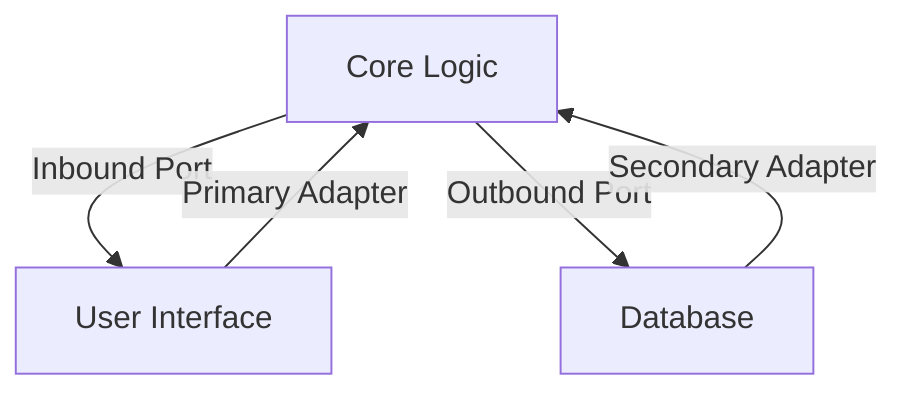

## 8.31 Hexagonal Architecture Pattern

The Hexagonal Architecture Pattern, also known as the Ports and Adapters Pattern, is a software design pattern that aims to decouple a system's core logic from external systems. This separation enhances modularity, facilitates testing, and improves maintainability. In this section, we will explore the Hexagonal Architecture Pattern in depth, focusing on its implementation in C#. We will cover the fundamental concepts, provide detailed code examples, and discuss real-world use cases.

### Introduction to Hexagonal Architecture

Hexagonal Architecture was introduced by Alistair Cockburn in 2005. The primary goal of this architecture is to create a system that is independent of external factors such as databases, user interfaces, or third-party services. By isolating the core business logic, developers can ensure that the system remains flexible and adaptable to changes.

#### Key Concepts

- **Core Logic**: The central part of the application that contains the business rules and logic.
- **Ports**: Interfaces that define the entry points to the core logic. They act as a contract between the core and the external world.
- **Adapters**: Implementations of the ports that connect the core logic to external systems such as databases, user interfaces, or APIs.

### Implementing Hexagonal Architecture in C#

To implement Hexagonal Architecture in C#, we need to define ports and create adapters for external systems. Let's break down the process step by step.

#### Defining Ports

Ports are interfaces that define how the core logic interacts with the outside world. They can be categorized into two types:

1. **Inbound Ports**: These ports define the operations that can be performed on the core logic. They are typically implemented by user interfaces or APIs.
2. **Outbound Ports**: These ports define the operations that the core logic needs from external systems, such as databases or external services.

```csharp
// Inbound Port
public interface IOrderService
{
    void PlaceOrder(Order order);
}

// Outbound Port
public interface IOrderRepository
{
    void SaveOrder(Order order);
}
```

#### Creating Adapters

Adapters are concrete implementations of the ports. They connect the core logic to external systems. There are two types of adapters:

1. **Primary Adapters**: These adapters implement inbound ports and are responsible for receiving input from external sources.
2. **Secondary Adapters**: These adapters implement outbound ports and are responsible for interacting with external systems.

```csharp
// Primary Adapter
public class OrderController : IOrderService
{
    private readonly IOrderRepository _orderRepository;

    public OrderController(IOrderRepository orderRepository)
    {
        _orderRepository = orderRepository;
    }

    public void PlaceOrder(Order order)
    {
        // Business logic
        _orderRepository.SaveOrder(order);
    }
}

// Secondary Adapter
public class SqlOrderRepository : IOrderRepository
{
    public void SaveOrder(Order order)
    {
        // Code to save order to SQL database
    }
}
```

### Use Cases and Examples

Hexagonal Architecture is particularly useful in scenarios where modularity, testing, and maintenance are critical. Let's explore some use cases and examples.

#### Modular Applications

Hexagonal Architecture promotes modularity by separating the core logic from external systems. This separation allows developers to modify or replace external systems without affecting the core logic.

```csharp
// Core Logic
public class OrderProcessor
{
    private readonly IOrderService _orderService;

    public OrderProcessor(IOrderService orderService)
    {
        _orderService = orderService;
    }

    public void ProcessOrder(Order order)
    {
        _orderService.PlaceOrder(order);
    }
}
```

#### Facilitating Easier Testing

By decoupling the core logic from external systems, Hexagonal Architecture makes it easier to test the core logic in isolation. Developers can use mock implementations of the ports to test the core logic without relying on external systems.

```csharp
// Mock Implementation for Testing
public class MockOrderRepository : IOrderRepository
{
    public void SaveOrder(Order order)
    {
        // Mock implementation
    }
}

// Unit Test
[TestClass]
public class OrderProcessorTests
{
    [TestMethod]
    public void TestProcessOrder()
    {
        var mockRepository = new MockOrderRepository();
        var orderService = new OrderController(mockRepository);
        var orderProcessor = new OrderProcessor(orderService);

        var order = new Order();
        orderProcessor.ProcessOrder(order);

        // Assert statements
    }
}
```

### Visualizing Hexagonal Architecture

To better understand the Hexagonal Architecture Pattern, let's visualize it using a diagram. The diagram below illustrates the core logic, ports, and adapters.



**Diagram Description**: The diagram shows the core logic at the center, surrounded by ports and adapters. The user interface and database are external systems connected to the core logic through primary and secondary adapters, respectively.

### Design Considerations

When implementing Hexagonal Architecture, consider the following design considerations:

- **Separation of Concerns**: Ensure that the core logic is independent of external systems. This separation allows for easier maintenance and testing.
- **Flexibility**: Design the system to be flexible and adaptable to changes. This flexibility is achieved by defining clear interfaces (ports) and implementing them with adapters.
- **Testability**: By decoupling the core logic from external systems, you can test the core logic in isolation using mock implementations of the ports.

### Differences and Similarities

Hexagonal Architecture is often compared to other architectural patterns such as Layered Architecture and Clean Architecture. Here are some key differences and similarities:

- **Layered Architecture**: While Layered Architecture organizes the system into layers, Hexagonal Architecture focuses on decoupling the core logic from external systems. Hexagonal Architecture provides more flexibility and modularity compared to Layered Architecture.
- **Clean Architecture**: Clean Architecture shares similarities with Hexagonal Architecture in terms of separating the core logic from external systems. Both architectures promote modularity and testability.

### Try It Yourself

To deepen your understanding of Hexagonal Architecture, try implementing a simple application using this pattern. Start by defining the core logic and ports, then create adapters for external systems. Experiment with different implementations and test the core logic in isolation.

### Knowledge Check

- What are the key components of Hexagonal Architecture?
- How does Hexagonal Architecture promote modularity and testability?
- What are the differences between Hexagonal Architecture and Layered Architecture?

### Embrace the Journey

Remember, mastering Hexagonal Architecture is a journey. As you progress, you'll build more modular and maintainable applications. Keep experimenting, stay curious, and enjoy the journey!

### References and Links

- [Alistair Cockburn's Hexagonal Architecture](https://alistair.cockburn.us/hexagonal-architecture/)
- [Martin Fowler's Article on Ports and Adapters](https://martinfowler.com/bliki/HexagonalArchitecture.html)

## Quiz Time!



### What is the primary goal of Hexagonal Architecture?

- [x] To decouple the core logic from external systems
- [ ] To integrate all components into a single layer
- [ ] To focus solely on database interactions
- [ ] To eliminate the need for interfaces

> **Explanation:** The primary goal of Hexagonal Architecture is to decouple the core logic from external systems, enhancing modularity and testability.

### What are the two types of ports in Hexagonal Architecture?

- [x] Inbound Ports
- [x] Outbound Ports
- [ ] Internal Ports
- [ ] External Ports

> **Explanation:** Inbound Ports define operations on the core logic, while Outbound Ports define operations needed from external systems.

### Which component connects the core logic to external systems?

- [ ] Ports
- [x] Adapters
- [ ] Controllers
- [ ] Services

> **Explanation:** Adapters are implementations of ports that connect the core logic to external systems.

### What is a primary adapter responsible for?

- [x] Implementing inbound ports
- [ ] Implementing outbound ports
- [ ] Directly accessing the database
- [ ] Handling user authentication

> **Explanation:** Primary adapters implement inbound ports and receive input from external sources.

### How does Hexagonal Architecture facilitate testing?

- [x] By allowing core logic to be tested in isolation
- [ ] By integrating all components into a single test
- [ ] By eliminating the need for mock implementations
- [ ] By focusing solely on UI testing

> **Explanation:** Hexagonal Architecture allows core logic to be tested in isolation using mock implementations of ports.

### What is a key difference between Hexagonal Architecture and Layered Architecture?

- [x] Hexagonal Architecture decouples core logic from external systems
- [ ] Layered Architecture focuses on modularity
- [ ] Hexagonal Architecture integrates all components into a single layer
- [ ] Layered Architecture eliminates the need for interfaces

> **Explanation:** Hexagonal Architecture focuses on decoupling core logic from external systems, providing more flexibility and modularity.

### What is the role of outbound ports in Hexagonal Architecture?

- [x] To define operations needed from external systems
- [ ] To define operations on the core logic
- [ ] To directly access the database
- [ ] To handle user authentication

> **Explanation:** Outbound ports define operations that the core logic needs from external systems.

### Which architectural pattern is often compared to Hexagonal Architecture?

- [x] Clean Architecture
- [ ] Monolithic Architecture
- [ ] Client-Server Architecture
- [ ] Event-Driven Architecture

> **Explanation:** Clean Architecture shares similarities with Hexagonal Architecture in terms of separating core logic from external systems.

### What is a secondary adapter responsible for?

- [x] Implementing outbound ports
- [ ] Implementing inbound ports
- [ ] Directly accessing the user interface
- [ ] Handling user authentication

> **Explanation:** Secondary adapters implement outbound ports and interact with external systems.

### True or False: Hexagonal Architecture eliminates the need for interfaces.

- [ ] True
- [x] False

> **Explanation:** Hexagonal Architecture relies on interfaces (ports) to define the contract between core logic and external systems.


