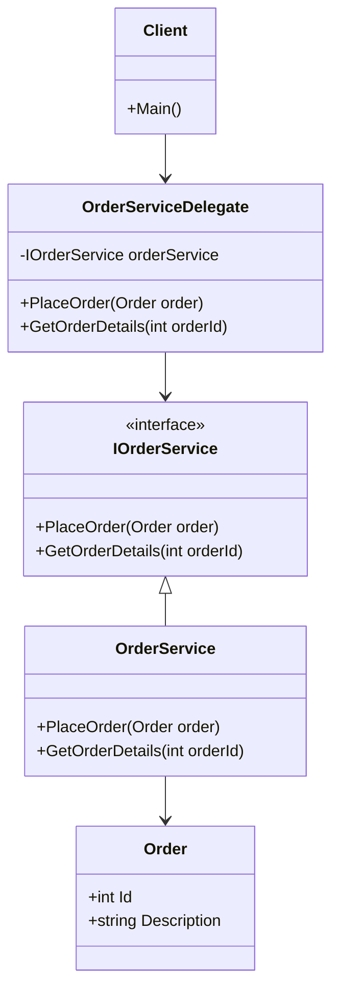

## 8.32 Business Delegate Pattern

In the realm of software architecture, particularly within enterprise applications, the separation of concerns is a fundamental principle that enhances maintainability, scalability, and flexibility. The Business Delegate Pattern is a design pattern that plays a crucial role in achieving this separation by decoupling the presentation layer from the business logic layer. This pattern introduces a delegate that acts as an intermediary between the client and the business services, thereby simplifying communication and reducing the coupling between layers.

### Intent

The primary intent of the Business Delegate Pattern is to provide a unified interface to the client tier for accessing business services. By doing so, it abstracts the complexities involved in interacting with the business logic, such as network communication, service lookup, and error handling. This pattern is particularly useful in applications where the business logic is distributed across multiple services or tiers, such as in microservices architectures.

### Key Participants

1. **Business Delegate**: The main component that acts as an intermediary between the client and the business services. It handles the communication with the business logic and provides a simplified interface to the client.
2. **Business Service**: The actual service that contains the business logic. This can be a remote service, a local service, or a combination of both.
3. **Client**: The consumer of the business services, typically part of the presentation layer.
4. **Service Locator**: An optional component that helps in locating and obtaining references to the business services.

### Applicability

The Business Delegate Pattern is applicable in scenarios where:

- There is a need to decouple the presentation layer from the business logic layer.
- The business logic is distributed across multiple services or tiers.
- There is a need to centralize error handling and service lookup logic.
- The application architecture follows a layered approach, such as in microservices or service-oriented architectures.

### Implementing Business Delegate in C#

Let's delve into the implementation of the Business Delegate Pattern in C#. We'll explore how to create delegate classes to manage service interactions and simplify communication in layered architectures.

#### Step 1: Define the Business Service Interface

First, define an interface for the business service. This interface will declare the operations that the business service provides.

```csharp
public interface IOrderService
{
    void PlaceOrder(Order order);
    Order GetOrderDetails(int orderId);
}
```

#### Step 2: Implement the Business Service

Next, implement the business service that contains the actual business logic.

```csharp
public class OrderService : IOrderService
{
    public void PlaceOrder(Order order)
    {
        // Business logic to place an order
        Console.WriteLine($"Order placed: {order.Id}");
    }

    public Order GetOrderDetails(int orderId)
    {
        // Business logic to retrieve order details
        return new Order { Id = orderId, Description = "Sample Order" };
    }
}
```

#### Step 3: Create the Business Delegate

Now, create the Business Delegate class that will act as an intermediary between the client and the business service.

```csharp
public class OrderServiceDelegate
{
    private readonly IOrderService _orderService;

    public OrderServiceDelegate()
    {
        // In a real-world scenario, use a service locator or dependency injection
        _orderService = new OrderService();
    }

    public void PlaceOrder(Order order)
    {
        try
        {
            _orderService.PlaceOrder(order);
        }
        catch (Exception ex)
        {
            // Handle exceptions and perform error logging
            Console.WriteLine($"Error placing order: {ex.Message}");
        }
    }

    public Order GetOrderDetails(int orderId)
    {
        try
        {
            return _orderService.GetOrderDetails(orderId);
        }
        catch (Exception ex)
        {
            // Handle exceptions and perform error logging
            Console.WriteLine($"Error retrieving order details: {ex.Message}");
            return null;
        }
    }
}
```

#### Step 4: Use the Business Delegate in the Client

Finally, use the Business Delegate in the client code to interact with the business services.

```csharp
public class Client
{
    public static void Main(string[] args)
    {
        OrderServiceDelegate orderDelegate = new OrderServiceDelegate();

        Order order = new Order { Id = 1, Description = "New Order" };
        orderDelegate.PlaceOrder(order);

        Order retrievedOrder = orderDelegate.GetOrderDetails(1);
        Console.WriteLine($"Retrieved Order: {retrievedOrder.Description}");
    }
}
```

### Diagrams

To better understand the flow of the Business Delegate Pattern, let's visualize it using a class diagram.



**Diagram Description**: The diagram illustrates the relationship between the client, the business delegate, the business service interface, and the concrete business service. The client interacts with the `OrderServiceDelegate`, which in turn communicates with the `OrderService` through the `IOrderService` interface.

### Design Considerations

When implementing the Business Delegate Pattern, consider the following:

- **Error Handling**: Centralize error handling within the business delegate to provide a consistent error management strategy.
- **Service Lookup**: Use a service locator or dependency injection to manage service references efficiently.
- **Performance**: Be mindful of the performance overhead introduced by the additional layer of abstraction.
- **Scalability**: The pattern supports scalability by allowing changes to the business logic without affecting the client code.

### Differences and Similarities

The Business Delegate Pattern is often compared to the Facade Pattern. While both patterns provide a simplified interface to a set of interfaces in a subsystem, the Business Delegate Pattern is specifically designed for separating the presentation layer from the business logic layer in enterprise applications. It also focuses on handling service lookup and error management, which are not primary concerns of the Facade Pattern.

### Use Cases and Examples

The Business Delegate Pattern is widely used in enterprise applications, particularly in scenarios involving:

- **Microservices Architectures**: Simplifying communication between microservices and the client tier.
- **Service-Oriented Architectures (SOA)**: Decoupling the presentation layer from the business logic layer.
- **Layered Architectures**: Providing a consistent interface for accessing business services across different layers.

#### Example: Simplifying Communication in a Layered Architecture

Consider an e-commerce application with a layered architecture. The application has a presentation layer, a business logic layer, and a data access layer. The Business Delegate Pattern can be used to simplify communication between the presentation layer and the business logic layer.

```csharp
public class ProductServiceDelegate
{
    private readonly IProductService _productService;

    public ProductServiceDelegate()
    {
        // Use a service locator or dependency injection in real-world scenarios
        _productService = new ProductService();
    }

    public void AddProduct(Product product)
    {
        try
        {
            _productService.AddProduct(product);
        }
        catch (Exception ex)
        {
            // Handle exceptions and perform error logging
            Console.WriteLine($"Error adding product: {ex.Message}");
        }
    }

    public Product GetProductDetails(int productId)
    {
        try
        {
            return _productService.GetProductDetails(productId);
        }
        catch (Exception ex)
        {
            // Handle exceptions and perform error logging
            Console.WriteLine($"Error retrieving product details: {ex.Message}");
            return null;
        }
    }
}
```

### Try It Yourself

To gain a deeper understanding of the Business Delegate Pattern, try modifying the code examples provided. Here are a few suggestions:

- Implement additional business services and delegates for different entities, such as customers and orders.
- Introduce a service locator to manage service references dynamically.
- Experiment with different error handling strategies within the business delegate.

### Knowledge Check

Before we conclude, let's reinforce our understanding of the Business Delegate Pattern with a few questions:

- What is the primary intent of the Business Delegate Pattern?
- How does the Business Delegate Pattern enhance maintainability in layered architectures?
- What are the key participants in the Business Delegate Pattern?
- How does the Business Delegate Pattern differ from the Facade Pattern?

### Embrace the Journey

Remember, mastering design patterns is a journey. As you continue to explore and implement the Business Delegate Pattern, you'll gain valuable insights into building scalable and maintainable applications. Keep experimenting, stay curious, and enjoy the journey!

## Quiz Time!



### What is the primary role of the Business Delegate Pattern?

- [x] To decouple the presentation layer from the business logic layer
- [ ] To manage database connections
- [ ] To handle user authentication
- [ ] To optimize network communication

> **Explanation:** The Business Delegate Pattern is designed to decouple the presentation layer from the business logic layer, providing a simplified interface for accessing business services.

### Which component acts as an intermediary in the Business Delegate Pattern?

- [x] Business Delegate
- [ ] Client
- [ ] Business Service
- [ ] Service Locator

> **Explanation:** The Business Delegate acts as an intermediary between the client and the business services, handling communication and error management.

### What is a key benefit of using the Business Delegate Pattern?

- [x] Centralized error handling
- [ ] Increased database performance
- [ ] Simplified user interface design
- [ ] Enhanced data encryption

> **Explanation:** The Business Delegate Pattern centralizes error handling, providing a consistent strategy for managing exceptions and errors.

### How does the Business Delegate Pattern differ from the Facade Pattern?

- [x] It focuses on separating presentation and business logic layers
- [ ] It provides a simplified interface to a subsystem
- [ ] It manages database transactions
- [ ] It handles user input validation

> **Explanation:** The Business Delegate Pattern specifically focuses on separating the presentation layer from the business logic layer, unlike the Facade Pattern, which provides a simplified interface to a subsystem.

### In which architecture is the Business Delegate Pattern particularly useful?

- [x] Microservices Architecture
- [ ] Monolithic Architecture
- [ ] Client-Server Architecture
- [ ] Peer-to-Peer Architecture

> **Explanation:** The Business Delegate Pattern is particularly useful in microservices architectures, where it simplifies communication between services and the client tier.

### What is the role of the Service Locator in the Business Delegate Pattern?

- [x] To locate and obtain references to business services
- [ ] To manage user sessions
- [ ] To handle data encryption
- [ ] To optimize query performance

> **Explanation:** The Service Locator helps in locating and obtaining references to business services, facilitating dynamic service management.

### Which of the following is NOT a key participant in the Business Delegate Pattern?

- [ ] Business Delegate
- [ ] Business Service
- [x] Database Manager
- [ ] Client

> **Explanation:** The Database Manager is not a key participant in the Business Delegate Pattern. The pattern involves the Business Delegate, Business Service, and Client.

### What is a common use case for the Business Delegate Pattern?

- [x] Simplifying communication in layered architectures
- [ ] Enhancing user interface design
- [ ] Managing database transactions
- [ ] Optimizing network protocols

> **Explanation:** A common use case for the Business Delegate Pattern is simplifying communication in layered architectures by decoupling the presentation and business logic layers.

### How can the Business Delegate Pattern improve scalability?

- [x] By allowing changes to business logic without affecting client code
- [ ] By increasing database throughput
- [ ] By reducing network latency
- [ ] By enhancing user interface responsiveness

> **Explanation:** The Business Delegate Pattern improves scalability by allowing changes to the business logic without affecting the client code, facilitating easier updates and maintenance.

### True or False: The Business Delegate Pattern is primarily used for user interface design.

- [ ] True
- [x] False

> **Explanation:** False. The Business Delegate Pattern is not primarily used for user interface design; it is used to decouple the presentation layer from the business logic layer.


