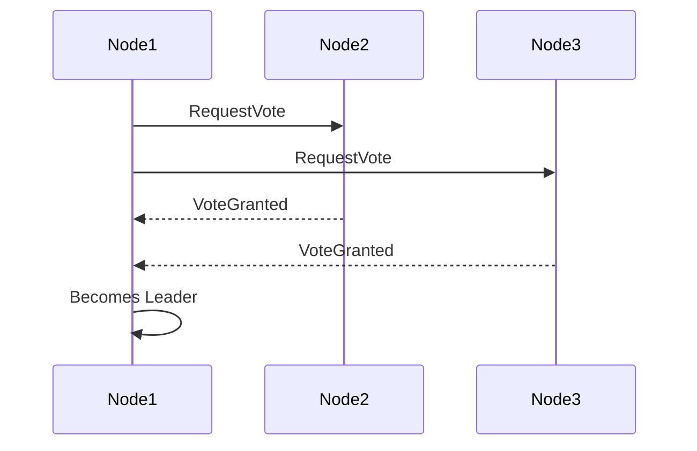
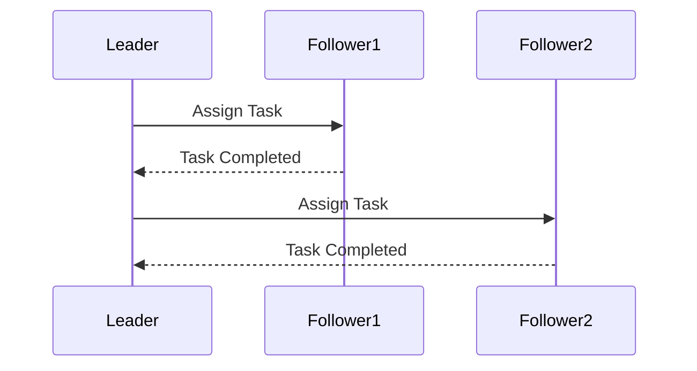

## 8.33 Leader Election and Leader-Followers Patterns

In the realm of distributed systems, managing roles effectively is crucial to ensure system reliability and performance. Two significant patterns that address this challenge are the Leader Election Pattern and the Leader-Followers Pattern. These patterns help in organizing distributed components to work cohesively, thereby enhancing the overall system's robustness and efficiency.

### Leader Election Pattern

#### Intent

The Leader Election Pattern is designed to dynamically elect a leader among a group of distributed nodes. This leader is responsible for coordinating tasks, making decisions, and ensuring consistency across the system. The pattern is particularly useful in scenarios where a single point of control is necessary to manage distributed resources or operations.

#### Key Participants

- **Candidates**: Nodes that are eligible to become the leader.
- **Leader**: The node that is elected to coordinate tasks.
- **Followers**: Nodes that follow the leader's instructions.

#### Applicability

Use the Leader Election Pattern when:
- You need a single point of control in a distributed system.
- Coordination and consistency are required across distributed nodes.
- You want to avoid conflicts and ensure that only one node acts as the leader at any given time.

#### Implementing Leader Election in C#

Implementing Leader Election in C# can be achieved using consensus algorithms like Raft or tools like Apache ZooKeeper. These tools help in managing distributed consensus and ensuring that a leader is elected efficiently.

##### Using Raft Consensus Algorithm

The Raft algorithm is a popular choice for leader election due to its simplicity and understandability. It divides the consensus problem into three sub-problems: leader election, log replication, and safety.

```csharp
public class RaftNode
{
    private enum NodeState { Follower, Candidate, Leader }
    private NodeState _state;
    private int _currentTerm;
    private int _votedFor;
    private List<int> _log;

    public RaftNode()
    {
        _state = NodeState.Follower;
        _currentTerm = 0;
        _votedFor = -1;
        _log = new List<int>();
    }

    public void StartElection()
    {
        _state = NodeState.Candidate;
        _currentTerm++;
        _votedFor = GetNodeId();
        int votes = 1;

        foreach (var node in GetOtherNodes())
        {
            if (RequestVote(node))
            {
                votes++;
            }
        }

        if (votes > GetOtherNodes().Count / 2)
        {
            _state = NodeState.Leader;
            Console.WriteLine("Node elected as leader for term " + _currentTerm);
        }
    }

    private bool RequestVote(int nodeId)
    {
        // Simulate vote request logic
        return true;
    }

    private int GetNodeId()
    {
        // Return the current node's ID
        return 1;
    }

    private List<int> GetOtherNodes()
    {
        // Return a list of other node IDs
        return new List<int> { 2, 3, 4 };
    }
}
```

**Explanation**: In this example, a node starts an election by transitioning to the Candidate state, incrementing its term, and requesting votes from other nodes. If it receives a majority of votes, it becomes the leader.

##### Using Apache ZooKeeper

Apache ZooKeeper is another tool that can be used for leader election. It provides a simple and reliable way to manage distributed consensus.

```csharp
using Org.Apache.Zookeeper;
using System;
using System.Threading.Tasks;

public class LeaderElection : Watcher
{
    private ZooKeeper _zooKeeper;
    private string _electionNode = "/election";

    public LeaderElection(string connectString)
    {
        _zooKeeper = new ZooKeeper(connectString, 3000, this);
    }

    public async Task ElectLeader()
    {
        var nodePath = await _zooKeeper.CreateAsync(_electionNode + "/n_", new byte[0], ZooDefs.Ids.OPEN_ACL_UNSAFE, CreateMode.EphemeralSequential);
        var children = await _zooKeeper.GetChildrenAsync(_electionNode, false);

        children.Children.Sort();
        if (nodePath.EndsWith(children.Children[0]))
        {
            Console.WriteLine("I am the leader");
        }
        else
        {
            Console.WriteLine("I am a follower");
        }
    }

    public override Task Process(WatchedEvent @event)
    {
        // Handle ZooKeeper events
        return Task.CompletedTask;
    }
}
```

**Explanation**: This example demonstrates how to use ZooKeeper for leader election. Nodes create ephemeral sequential nodes under a designated election node. The node with the smallest sequence number becomes the leader.

#### Use Cases and Examples

- **Distributed Database Management**: Ensuring a single node coordinates database writes to maintain consistency.
- **Coordination Services**: Managing distributed locks or barriers in a cluster.

### Leader-Followers Pattern

#### Intent

The Leader-Followers Pattern is designed to efficiently distribute tasks among a group of worker nodes, where one node acts as the leader to assign tasks, and the rest follow by executing the tasks. This pattern is particularly useful in high-performance servers and load balancing scenarios.

#### Key Participants

- **Leader**: The node responsible for assigning tasks.
- **Followers**: Nodes that execute tasks assigned by the leader.
- **Task Queue**: A queue that holds tasks to be processed by followers.

#### Applicability

Use the Leader-Followers Pattern when:
- You need to distribute tasks efficiently among multiple nodes.
- Load balancing is required to optimize resource utilization.
- You want to separate task assignment from task execution.

#### Implementing Leader-Followers in C#

Implementing the Leader-Followers Pattern in C# involves using task queues and coordination mechanisms to manage task distribution and execution.

##### Using Task Queues

A task queue can be implemented using a concurrent collection to hold tasks, with the leader assigning tasks to followers.

```csharp
using System;
using System.Collections.Concurrent;
using System.Threading;
using System.Threading.Tasks;

public class LeaderFollowers
{
    private ConcurrentQueue<Action> _taskQueue = new ConcurrentQueue<Action>();
    private CancellationTokenSource _cancellationTokenSource = new CancellationTokenSource();

    public void StartLeader()
    {
        Task.Run(() =>
        {
            while (!_cancellationTokenSource.Token.IsCancellationRequested)
            {
                if (_taskQueue.TryDequeue(out var task))
                {
                    Console.WriteLine("Leader assigning task");
                    Task.Run(task);
                }
            }
        });
    }

    public void AddTask(Action task)
    {
        _taskQueue.Enqueue(task);
    }

    public void Stop()
    {
        _cancellationTokenSource.Cancel();
    }
}

public class Follower
{
    public void ExecuteTask(Action task)
    {
        Console.WriteLine("Follower executing task");
        task();
    }
}
```

**Explanation**: In this example, the leader continuously checks the task queue and assigns tasks to followers for execution. Followers execute tasks as they are assigned.

#### Use Cases and Examples

- **High-Performance Servers**: Distributing incoming requests among multiple worker threads.
- **Load Balancing Scenarios**: Balancing computational tasks across a cluster of nodes.

### Visualizing the Patterns

#### Leader Election Pattern



**Description**: This sequence diagram illustrates the leader election process where Node1 requests votes from Node2 and Node3. Upon receiving a majority of votes, Node1 becomes the leader.

#### Leader-Followers Pattern



**Description**: This sequence diagram shows the leader assigning tasks to followers. Each follower executes the task and reports completion back to the leader.

### Design Considerations

- **Leader Election**: Ensure that the election process is fault-tolerant and can handle node failures gracefully. Consider using established consensus algorithms or tools to simplify implementation.
- **Leader-Followers**: Design the task queue and coordination mechanisms to handle high concurrency and avoid bottlenecks. Consider using asynchronous programming techniques to improve performance.

### Differences and Similarities

- **Leader Election vs. Leader-Followers**: While both patterns involve a leader, the Leader Election Pattern focuses on electing a leader among peers, whereas the Leader-Followers Pattern focuses on task distribution by a designated leader.
- **Common Confusions**: These patterns are often confused due to their similar naming, but their purposes and implementations differ significantly.

### Try It Yourself

Experiment with the provided code examples by modifying the number of nodes or tasks. Try implementing additional features such as fault tolerance or dynamic task prioritization. This hands-on approach will deepen your understanding of these patterns and their applications.

### Knowledge Check

- Explain the purpose of the Leader Election Pattern.
- Describe a scenario where the Leader-Followers Pattern would be beneficial.
- What are the key differences between the Leader Election and Leader-Followers Patterns?

### Embrace the Journey

Remember, mastering these patterns is just the beginning. As you continue to explore distributed systems, you'll encounter more complex scenarios that require innovative solutions. Keep experimenting, stay curious, and enjoy the journey!

## Quiz Time!



### What is the primary purpose of the Leader Election Pattern?

- [x] To elect a single leader among distributed nodes for coordination.
- [ ] To distribute tasks among multiple nodes.
- [ ] To balance load across a cluster.
- [ ] To manage task queues efficiently.

> **Explanation:** The Leader Election Pattern is used to elect a single leader among distributed nodes to coordinate tasks and ensure consistency.

### Which algorithm is commonly used for implementing Leader Election?

- [x] Raft
- [ ] Dijkstra's Algorithm
- [ ] QuickSort
- [ ] A* Algorithm

> **Explanation:** The Raft consensus algorithm is commonly used for implementing Leader Election due to its simplicity and effectiveness.

### In the Leader-Followers Pattern, what is the role of the leader?

- [x] To assign tasks to followers.
- [ ] To execute tasks assigned by followers.
- [ ] To balance load across nodes.
- [ ] To elect a new leader.

> **Explanation:** In the Leader-Followers Pattern, the leader is responsible for assigning tasks to followers for execution.

### What tool can be used for Leader Election in C#?

- [x] Apache ZooKeeper
- [ ] Microsoft Excel
- [ ] Adobe Photoshop
- [ ] Google Chrome

> **Explanation:** Apache ZooKeeper is a tool that can be used for Leader Election in distributed systems.

### How does the Leader-Followers Pattern improve performance?

- [x] By distributing tasks among multiple nodes.
- [ ] By electing a single leader for coordination.
- [ ] By using a single node for all tasks.
- [ ] By avoiding task queues.

> **Explanation:** The Leader-Followers Pattern improves performance by distributing tasks among multiple nodes, optimizing resource utilization.

### What is a key consideration when implementing Leader Election?

- [x] Fault tolerance
- [ ] Color scheme
- [ ] User interface design
- [ ] Marketing strategy

> **Explanation:** Fault tolerance is a key consideration when implementing Leader Election to handle node failures gracefully.

### Which pattern is suitable for high-performance servers?

- [x] Leader-Followers Pattern
- [ ] Singleton Pattern
- [ ] Factory Pattern
- [ ] Observer Pattern

> **Explanation:** The Leader-Followers Pattern is suitable for high-performance servers as it efficiently distributes tasks among worker nodes.

### What is a common confusion between the Leader Election and Leader-Followers Patterns?

- [x] Their similar naming
- [ ] Their implementation in Java
- [ ] Their use in web development
- [ ] Their focus on user interfaces

> **Explanation:** The Leader Election and Leader-Followers Patterns are often confused due to their similar naming, but they serve different purposes.

### What is the role of followers in the Leader-Followers Pattern?

- [x] To execute tasks assigned by the leader.
- [ ] To assign tasks to the leader.
- [ ] To elect a new leader.
- [ ] To manage task queues.

> **Explanation:** In the Leader-Followers Pattern, followers execute tasks assigned by the leader.

### True or False: The Leader Election Pattern is used to distribute tasks among nodes.

- [ ] True
- [x] False

> **Explanation:** False. The Leader Election Pattern is used to elect a leader among nodes, not to distribute tasks.


