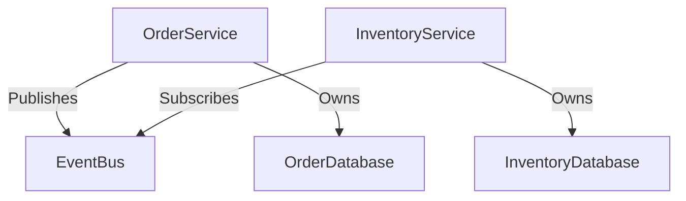

## 8.4 Database per Service Pattern

In the realm of microservices architecture, the **Database per Service Pattern** stands as a fundamental principle that advocates for each microservice to maintain its own dedicated database. This pattern is pivotal in achieving the autonomy and scalability that microservices promise. In this section, we will delve into the intricacies of this pattern, exploring its advantages, challenges, and strategies for maintaining data consistency and integrity. We will also provide practical examples and use cases to illustrate its application in C#.

### Understanding the Database per Service Pattern

The Database per Service Pattern is a design principle where each microservice in an architecture has its own database. This pattern is a departure from traditional monolithic architectures where a single database is shared across multiple services or components. By isolating databases, microservices can operate independently, allowing for greater flexibility, scalability, and resilience.

#### Key Concepts

- **Service Autonomy**: Each microservice is responsible for its own data, leading to increased independence and reduced coupling between services.
- **Scalability**: Services can be scaled independently based on their specific data needs and load requirements.
- **Resilience**: Failures in one service's database do not directly impact others, enhancing the overall system's fault tolerance.

### Pros and Cons of Database per Service

#### Pros

1. **Independent Scaling**: Each service can be scaled independently, allowing for optimized resource allocation based on specific service demands.
2. **Technology Diversity**: Services can choose the most appropriate database technology for their needs, whether it's SQL, NoSQL, or in-memory databases.
3. **Fault Isolation**: Issues in one service's database do not affect others, improving system reliability.
4. **Simplified Deployment**: Services can be deployed independently, facilitating continuous delivery and integration.

#### Cons

1. **Data Consistency Challenges**: Maintaining consistency across distributed databases can be complex.
2. **Increased Complexity**: Managing multiple databases increases operational overhead.
3. **Data Duplication**: Data may need to be duplicated across services, leading to potential synchronization issues.
4. **Cross-Service Queries**: Performing queries that span multiple services can be challenging and may require additional design considerations.

### Strategies for Data Consistency and Integrity

Maintaining data consistency and integrity across multiple databases is one of the most significant challenges in a microservices architecture. Here are some strategies to address these challenges:

#### Event-Driven Architecture

Implement an event-driven architecture where services communicate through events. This approach allows services to react to changes in other services' data without direct coupling.

```csharp
public class OrderService
{
    private readonly IEventBus _eventBus;

    public OrderService(IEventBus eventBus)
    {
        _eventBus = eventBus;
    }

    public void CreateOrder(Order order)
    {
        // Save order to the database
        SaveOrder(order);

        // Publish an event to notify other services
        _eventBus.Publish(new OrderCreatedEvent(order.Id, order.TotalAmount));
    }
}
```

#### Saga Pattern

Use the Saga Pattern to manage distributed transactions. A saga is a sequence of local transactions where each transaction updates the database and publishes an event or message.

```csharp
public class OrderSaga
{
    public void Handle(OrderCreatedEvent orderCreatedEvent)
    {
        // Perform local transaction
        ReserveInventory(orderCreatedEvent.OrderId);

        // Publish event for the next step in the saga
        _eventBus.Publish(new InventoryReservedEvent(orderCreatedEvent.OrderId));
    }
}
```

#### CQRS (Command Query Responsibility Segregation)

Separate the read and write operations into different models. This separation allows for optimized data access patterns and can help manage consistency.

```csharp
public class OrderCommandHandler
{
    public void Handle(CreateOrderCommand command)
    {
        // Write operation
        SaveOrder(command.Order);
    }
}

public class OrderQueryHandler
{
    public Order GetOrderById(Guid orderId)
    {
        // Read operation
        return FetchOrderFromDatabase(orderId);
    }
}
```

#### Data Replication

Replicate data across services where necessary. This approach can help reduce the need for cross-service queries but requires careful management to ensure consistency.

### Use Cases and Examples

#### E-commerce Platform

In an e-commerce platform, different services such as Order, Inventory, and Payment can have their own databases. This separation allows each service to scale independently based on its load, such as high read operations for Inventory and high write operations for Orders.

#### Social Media Application

A social media application can benefit from the Database per Service Pattern by having separate databases for User Profiles, Posts, and Comments. This separation allows for optimized data storage and retrieval strategies tailored to each service's needs.

#### IoT Systems

In IoT systems, different sensors and devices can have their own databases to store data locally. This approach reduces latency and allows for real-time processing and analysis.

### Implementing the Database per Service Pattern in C#

Let's explore how to implement the Database per Service Pattern in a C# microservices architecture. We will use a simple example of an e-commerce platform with Order and Inventory services.

#### Order Service

The Order Service is responsible for managing orders and has its own database.

```csharp
public class OrderService
{
    private readonly OrderDbContext _dbContext;

    public OrderService(OrderDbContext dbContext)
    {
        _dbContext = dbContext;
    }

    public void CreateOrder(Order order)
    {
        _dbContext.Orders.Add(order);
        _dbContext.SaveChanges();
    }

    public Order GetOrderById(Guid orderId)
    {
        return _dbContext.Orders.Find(orderId);
    }
}
```

#### Inventory Service

The Inventory Service manages inventory data and maintains its own database.

```csharp
public class InventoryService
{
    private readonly InventoryDbContext _dbContext;

    public InventoryService(InventoryDbContext dbContext)
    {
        _dbContext = dbContext;
    }

    public void UpdateInventory(Guid productId, int quantity)
    {
        var inventoryItem = _dbContext.InventoryItems.Find(productId);
        if (inventoryItem != null)
        {
            inventoryItem.Quantity -= quantity;
            _dbContext.SaveChanges();
        }
    }

    public InventoryItem GetInventoryItem(Guid productId)
    {
        return _dbContext.InventoryItems.Find(productId);
    }
}
```

#### Communication Between Services

To maintain data consistency, the Order Service can publish events when an order is created, and the Inventory Service can subscribe to these events to update inventory data.

```csharp
public class OrderCreatedEvent
{
    public Guid OrderId { get; }
    public decimal TotalAmount { get; }

    public OrderCreatedEvent(Guid orderId, decimal totalAmount)
    {
        OrderId = orderId;
        TotalAmount = totalAmount;
    }
}

public class InventoryEventHandler
{
    private readonly InventoryService _inventoryService;

    public InventoryEventHandler(InventoryService inventoryService)
    {
        _inventoryService = inventoryService;
    }

    public void Handle(OrderCreatedEvent orderCreatedEvent)
    {
        // Update inventory based on the order
        _inventoryService.UpdateInventory(orderCreatedEvent.OrderId, 1);
    }
}
```

### Visualizing the Database per Service Pattern

To better understand the Database per Service Pattern, let's visualize the architecture using a Mermaid.js diagram.



**Diagram Description**: This diagram illustrates the interaction between the Order Service and Inventory Service. Each service owns its own database and communicates through an event bus to maintain data consistency.

### Design Considerations

When implementing the Database per Service Pattern, consider the following:

- **Data Consistency**: Choose appropriate strategies for maintaining consistency across services, such as event-driven architecture or the Saga Pattern.
- **Database Technology**: Select the most suitable database technology for each service based on its specific needs and workload.
- **Operational Complexity**: Be prepared to manage the increased complexity of operating multiple databases.
- **Cross-Service Queries**: Design your system to minimize the need for cross-service queries, which can be challenging to implement efficiently.

### Differences and Similarities with Other Patterns

The Database per Service Pattern is often compared to the Shared Database Pattern, where multiple services share a single database. The key difference is that the Database per Service Pattern promotes service autonomy and scalability, while the Shared Database Pattern can lead to tighter coupling and potential bottlenecks.

### Try It Yourself

To deepen your understanding of the Database per Service Pattern, try implementing a simple microservices architecture with two services, each having its own database. Experiment with different strategies for maintaining data consistency, such as event-driven communication or the Saga Pattern.

### Knowledge Check

- What are the main advantages of the Database per Service Pattern?
- How can you maintain data consistency across multiple databases in a microservices architecture?
- What are some challenges associated with the Database per Service Pattern?
- How does the Database per Service Pattern differ from the Shared Database Pattern?

### Embrace the Journey

Remember, mastering the Database per Service Pattern is just one step in your journey to becoming an expert in microservices architecture. Keep experimenting, stay curious, and enjoy the process of building scalable and resilient systems.

## Quiz Time!



### What is the primary benefit of the Database per Service Pattern?

- [x] Service autonomy and scalability
- [ ] Simplified data management
- [ ] Reduced operational complexity
- [ ] Easier cross-service queries

> **Explanation:** The Database per Service Pattern allows each service to operate independently, enhancing autonomy and scalability.

### Which strategy helps maintain data consistency in a microservices architecture?

- [x] Event-driven architecture
- [ ] Shared database
- [ ] Monolithic design
- [ ] Direct database access

> **Explanation:** Event-driven architecture allows services to communicate through events, maintaining consistency without direct coupling.

### What is a potential drawback of the Database per Service Pattern?

- [x] Increased operational complexity
- [ ] Reduced service autonomy
- [ ] Limited scalability
- [ ] Simplified deployment

> **Explanation:** Managing multiple databases increases operational complexity compared to a single shared database.

### How does the Saga Pattern help in a microservices architecture?

- [x] Manages distributed transactions
- [ ] Simplifies database management
- [ ] Reduces data duplication
- [ ] Enhances cross-service queries

> **Explanation:** The Saga Pattern coordinates distributed transactions across services, ensuring consistency.

### What is a common challenge with cross-service queries in microservices?

- [x] Complexity and inefficiency
- [ ] Simplified data access
- [ ] Reduced data duplication
- [ ] Enhanced fault tolerance

> **Explanation:** Cross-service queries can be complex and inefficient, requiring careful design considerations.

### Which pattern is often compared to the Database per Service Pattern?

- [x] Shared Database Pattern
- [ ] Singleton Pattern
- [ ] Factory Pattern
- [ ] Observer Pattern

> **Explanation:** The Shared Database Pattern is often compared to the Database per Service Pattern due to their differing approaches to data management.

### What is a key consideration when choosing database technology for a service?

- [x] Service-specific needs and workload
- [ ] Simplified deployment
- [ ] Reduced operational complexity
- [ ] Enhanced cross-service queries

> **Explanation:** Selecting the right database technology depends on the specific needs and workload of each service.

### How can data replication help in a microservices architecture?

- [x] Reduces the need for cross-service queries
- [ ] Simplifies database management
- [ ] Enhances service autonomy
- [ ] Reduces data consistency challenges

> **Explanation:** Data replication can reduce the need for cross-service queries by providing local access to necessary data.

### What is a benefit of using CQRS in a microservices architecture?

- [x] Optimized data access patterns
- [ ] Simplified database management
- [ ] Reduced data duplication
- [ ] Enhanced cross-service queries

> **Explanation:** CQRS separates read and write operations, optimizing data access patterns for each.

### True or False: The Database per Service Pattern simplifies cross-service queries.

- [ ] True
- [x] False

> **Explanation:** The Database per Service Pattern can complicate cross-service queries, requiring additional design considerations.


