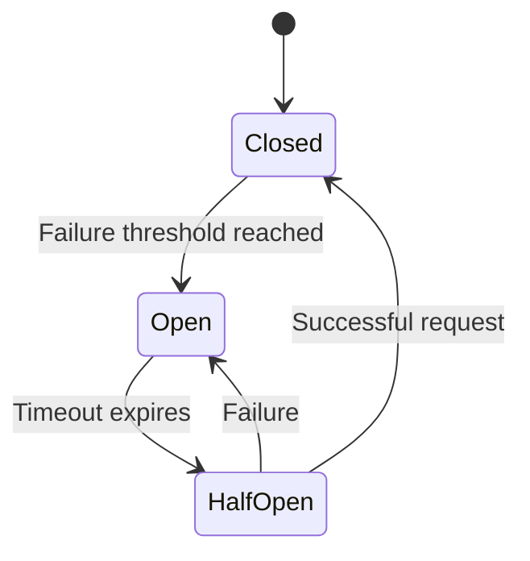

## 8.5 Circuit Breaker Pattern

In the world of microservices, where applications are composed of multiple interconnected services, ensuring resilience and fault tolerance is crucial. The Circuit Breaker Pattern is a design pattern that helps prevent a service from making requests to a failing service, allowing the system to degrade gracefully. This pattern is inspired by electrical circuit breakers, which stop the flow of electricity when a fault is detected.

### Intent

The primary intent of the Circuit Breaker Pattern is to detect failures and encapsulate the logic of preventing a failure from constantly recurring during maintenance, temporary external system failure, or unexpected system difficulties. It allows the system to handle faults gracefully and provide a fallback mechanism to maintain system stability.

### Key Participants

1. **Client**: The component that makes requests to a service.
2. **Circuit Breaker**: Monitors the requests and responses to determine the state of the service.
3. **Service**: The target service that the client is trying to access.
4. **Fallback Mechanism**: Provides an alternative response when the service is unavailable.

### Applicability

- Use the Circuit Breaker Pattern when:
  - You have a distributed system with multiple services interacting with each other.
  - You need to handle transient faults and prevent cascading failures.
  - You want to provide a fallback mechanism to ensure system stability.

### Implementing Circuit Breaker in C#

One of the most popular libraries for implementing the Circuit Breaker Pattern in C# is Polly. Polly is a .NET resilience and transient-fault-handling library that allows developers to express policies such as Retry, Circuit Breaker, Timeout, Bulkhead Isolation, and Fallback.

#### Using Polly Library

To implement a Circuit Breaker using Polly, follow these steps:

1. **Install Polly**: First, add the Polly library to your project using NuGet Package Manager.

   ```shell
   Install-Package Polly
   ```

2. **Define a Circuit Breaker Policy**: Create a circuit breaker policy that specifies the conditions under which the circuit breaker should open, close, or remain half-open.

   ```csharp
   using Polly;
   using Polly.CircuitBreaker;
   using System;
   using System.Net.Http;
   using System.Threading.Tasks;

   class Program
   {
       static async Task Main(string[] args)
       {
           // Define a Circuit Breaker Policy
           var circuitBreakerPolicy = Policy
               .Handle<HttpRequestException>()
               .CircuitBreakerAsync(
                   exceptionsAllowedBeforeBreaking: 2,
                   durationOfBreak: TimeSpan.FromSeconds(30),
                   onBreak: (exception, timespan) =>
                   {
                       Console.WriteLine($"Circuit broken! Exception: {exception.Message}");
                   },
                   onReset: () => Console.WriteLine("Circuit reset!"),
                   onHalfOpen: () => Console.WriteLine("Circuit in half-open state.")
               );

           // Simulate making requests
           for (int i = 0; i < 5; i++)
           {
               try
               {
                   await circuitBreakerPolicy.ExecuteAsync(() => MakeRequest());
               }
               catch (Exception ex)
               {
                   Console.WriteLine($"Request failed: {ex.Message}");
               }
           }
       }

       static async Task MakeRequest()
       {
           // Simulate a request that may fail
           Console.WriteLine("Making a request...");
           throw new HttpRequestException("Simulated request failure.");
       }
   }
   ```

   In this example, the circuit breaker allows two exceptions before breaking the circuit for 30 seconds. The `onBreak`, `onReset`, and `onHalfOpen` callbacks provide hooks to log or take action when the circuit state changes.

3. **Execute Requests with the Circuit Breaker**: Use the `ExecuteAsync` method to wrap the logic that makes requests to the service. This ensures that the circuit breaker policy is applied to each request.

#### Handling Transient Faults

Transient faults are temporary issues that can occur in distributed systems, such as network glitches or temporary unavailability of a service. The Circuit Breaker Pattern helps manage these faults by preventing repeated attempts to access a failing service.

##### Strategies for Managing Temporary Failures

1. **Retry Policy**: Combine the Circuit Breaker Pattern with a Retry Policy to handle transient faults. Retry a failed request a specified number of times before breaking the circuit.

   ```csharp
   var retryPolicy = Policy
       .Handle<HttpRequestException>()
       .RetryAsync(3, onRetry: (exception, retryCount) =>
       {
           Console.WriteLine($"Retry {retryCount} for exception: {exception.Message}");
       });

   var combinedPolicy = Policy.WrapAsync(retryPolicy, circuitBreakerPolicy);
   ```

2. **Timeout Policy**: Use a Timeout Policy to limit the time spent waiting for a response from a service. This prevents the client from hanging indefinitely.

   ```csharp
   var timeoutPolicy = Policy.TimeoutAsync<HttpResponseMessage>(TimeSpan.FromSeconds(10));
   ```

3. **Fallback Policy**: Provide a fallback mechanism to return a default response or perform an alternative action when the circuit is open.

   ```csharp
   var fallbackPolicy = Policy<HttpResponseMessage>
       .Handle<BrokenCircuitException>()
       .FallbackAsync(new HttpResponseMessage(HttpStatusCode.OK)
       {
           Content = new StringContent("Fallback response")
       });
   ```

### Use Cases and Examples

The Circuit Breaker Pattern is widely used in microservices architectures to ensure resilient communication between services. Here are some practical use cases:

1. **API Gateway**: Implement a circuit breaker in an API Gateway to prevent cascading failures when backend services are unavailable.

2. **Service-to-Service Communication**: Use a circuit breaker to manage communication between microservices, ensuring that a failure in one service does not affect others.

3. **External API Calls**: Apply a circuit breaker when making calls to external APIs to handle downtime or rate limiting gracefully.

#### Example: Resilient Communication Between Services

Consider a scenario where a microservice needs to communicate with an external payment gateway. Implementing a circuit breaker ensures that the service can handle failures gracefully and provide a fallback mechanism.

```csharp
public class PaymentService
{
    private readonly HttpClient _httpClient;
    private readonly AsyncCircuitBreakerPolicy<HttpResponseMessage> _circuitBreakerPolicy;

    public PaymentService(HttpClient httpClient)
    {
        _httpClient = httpClient;
        _circuitBreakerPolicy = Policy
            .Handle<HttpRequestException>()
            .OrResult<HttpResponseMessage>(r => !r.IsSuccessStatusCode)
            .CircuitBreakerAsync(2, TimeSpan.FromMinutes(1));
    }

    public async Task<HttpResponseMessage> ProcessPaymentAsync(PaymentRequest request)
    {
        return await _circuitBreakerPolicy.ExecuteAsync(async () =>
        {
            var response = await _httpClient.PostAsJsonAsync("https://api.paymentgateway.com/pay", request);
            response.EnsureSuccessStatusCode();
            return response;
        });
    }
}
```

In this example, the `PaymentService` uses a circuit breaker to handle failures when processing payments. If the payment gateway is unavailable, the circuit breaker prevents further requests and allows the system to degrade gracefully.

### Visualizing the Circuit Breaker Pattern

To better understand the Circuit Breaker Pattern, let's visualize the state transitions using a Mermaid.js state diagram.



**Diagram Description**: This state diagram illustrates the transitions between the three states of a circuit breaker: Closed, Open, and Half-Open. In the Closed state, requests are allowed to pass through. If the failure threshold is reached, the circuit breaker transitions to the Open state, where requests are blocked. After a timeout, the circuit breaker moves to the Half-Open state to test if the service has recovered. A successful request closes the circuit, while a failure reopens it.

### Design Considerations

When implementing the Circuit Breaker Pattern, consider the following:

- **Failure Threshold**: Determine the number of failures allowed before opening the circuit. This threshold should balance between allowing transient faults and preventing cascading failures.
- **Timeout Duration**: Set an appropriate timeout duration for the Open state. This duration should be long enough to allow the service to recover but short enough to avoid prolonged downtime.
- **Fallback Mechanism**: Design a fallback mechanism to provide an alternative response when the circuit is open. This could be a default response, cached data, or a message indicating the service is unavailable.
- **Monitoring and Logging**: Implement monitoring and logging to track the state of the circuit breaker and diagnose issues. This helps in understanding the system's behavior and making informed decisions.

### Differences and Similarities

The Circuit Breaker Pattern is often compared to the Retry Pattern. While both patterns aim to handle transient faults, they differ in their approach:

- **Circuit Breaker vs. Retry**: The Retry Pattern attempts to retry a failed request a specified number of times, while the Circuit Breaker Pattern prevents further requests once a failure threshold is reached.
- **Complementary Patterns**: The Circuit Breaker and Retry Patterns can be used together to handle transient faults effectively. The Retry Pattern can be applied first, followed by the Circuit Breaker Pattern to prevent repeated failures.

### Try It Yourself

Experiment with the Circuit Breaker Pattern by modifying the code examples provided. Try changing the failure threshold, timeout duration, and fallback mechanism to see how they affect the system's behavior. Implement the pattern in a real-world scenario, such as an API Gateway or a microservice communication layer, to gain hands-on experience.

### References and Links

- [Polly Documentation](https://github.com/App-vNext/Polly): Official documentation for the Polly library.
- [Microsoft Docs: Circuit Breaker Pattern](https://docs.microsoft.com/en-us/azure/architecture/patterns/circuit-breaker): Detailed explanation of the Circuit Breaker Pattern in the context of cloud applications.
- [Resilience in .NET with Polly](https://www.pluralsight.com/courses/resilience-dotnet-polly): A Pluralsight course on implementing resilience in .NET applications using Polly.

### Knowledge Check

- What is the primary intent of the Circuit Breaker Pattern?
- How does the Circuit Breaker Pattern differ from the Retry Pattern?
- What are the key participants in the Circuit Breaker Pattern?
- How can the Polly library be used to implement a Circuit Breaker in C#?
- What are some strategies for handling transient faults in distributed systems?

### Embrace the Journey

Remember, mastering the Circuit Breaker Pattern is just one step in building resilient microservices. As you progress, you'll encounter more complex scenarios and patterns. Keep experimenting, stay curious, and enjoy the journey of enhancing your software design skills!

## Quiz Time!



### What is the primary intent of the Circuit Breaker Pattern?

- [x] To detect failures and prevent a failure from constantly recurring
- [ ] To retry failed requests indefinitely
- [ ] To ensure all requests are processed regardless of failures
- [ ] To log all requests and responses

> **Explanation:** The Circuit Breaker Pattern is designed to detect failures and prevent a failure from constantly recurring, allowing the system to degrade gracefully.

### Which library is commonly used to implement the Circuit Breaker Pattern in C#?

- [x] Polly
- [ ] Newtonsoft.Json
- [ ] Entity Framework
- [ ] Dapper

> **Explanation:** Polly is a popular .NET library used for implementing resilience patterns, including the Circuit Breaker Pattern.

### What is the role of the Circuit Breaker in the pattern?

- [x] To monitor requests and determine the state of the service
- [ ] To execute all requests without interruption
- [ ] To log errors without taking action
- [ ] To retry requests indefinitely

> **Explanation:** The Circuit Breaker monitors requests and responses to determine the state of the service and decide whether to allow or block requests.

### How does the Circuit Breaker Pattern differ from the Retry Pattern?

- [x] Circuit Breaker prevents further requests after a failure threshold, while Retry attempts to retry failed requests
- [ ] Circuit Breaker retries requests indefinitely, while Retry blocks requests
- [ ] Circuit Breaker logs requests, while Retry executes them
- [ ] Circuit Breaker and Retry are the same

> **Explanation:** The Circuit Breaker Pattern prevents further requests once a failure threshold is reached, while the Retry Pattern attempts to retry failed requests a specified number of times.

### What is a common use case for the Circuit Breaker Pattern?

- [x] Resilient communication between microservices
- [ ] Logging all requests and responses
- [ ] Ensuring all requests are processed
- [ ] Caching data indefinitely

> **Explanation:** The Circuit Breaker Pattern is commonly used for resilient communication between microservices to prevent cascading failures.

### What is the purpose of the Half-Open state in a Circuit Breaker?

- [x] To test if the service has recovered
- [ ] To block all requests indefinitely
- [ ] To log all requests and responses
- [ ] To retry requests indefinitely

> **Explanation:** The Half-Open state allows the circuit breaker to test if the service has recovered by allowing a limited number of requests to pass through.

### What should be considered when designing a Circuit Breaker?

- [x] Failure threshold, timeout duration, and fallback mechanism
- [ ] Logging all requests and responses
- [ ] Retrying requests indefinitely
- [ ] Caching data indefinitely

> **Explanation:** When designing a Circuit Breaker, consider the failure threshold, timeout duration, and fallback mechanism to ensure effective fault handling.

### How can the Circuit Breaker Pattern be visualized?

- [x] Using a state diagram with Closed, Open, and Half-Open states
- [ ] Using a flowchart with retry loops
- [ ] Using a sequence diagram with infinite loops
- [ ] Using a class diagram with inheritance

> **Explanation:** The Circuit Breaker Pattern can be visualized using a state diagram that shows the transitions between Closed, Open, and Half-Open states.

### What is a strategy for handling transient faults in distributed systems?

- [x] Combining Circuit Breaker with Retry and Timeout Policies
- [ ] Logging all requests and responses
- [ ] Retrying requests indefinitely
- [ ] Caching data indefinitely

> **Explanation:** Combining the Circuit Breaker Pattern with Retry and Timeout Policies is an effective strategy for handling transient faults in distributed systems.

### True or False: The Circuit Breaker Pattern can be used to provide a fallback mechanism.

- [x] True
- [ ] False

> **Explanation:** True. The Circuit Breaker Pattern can be used to provide a fallback mechanism, such as a default response or cached data, when the circuit is open.


