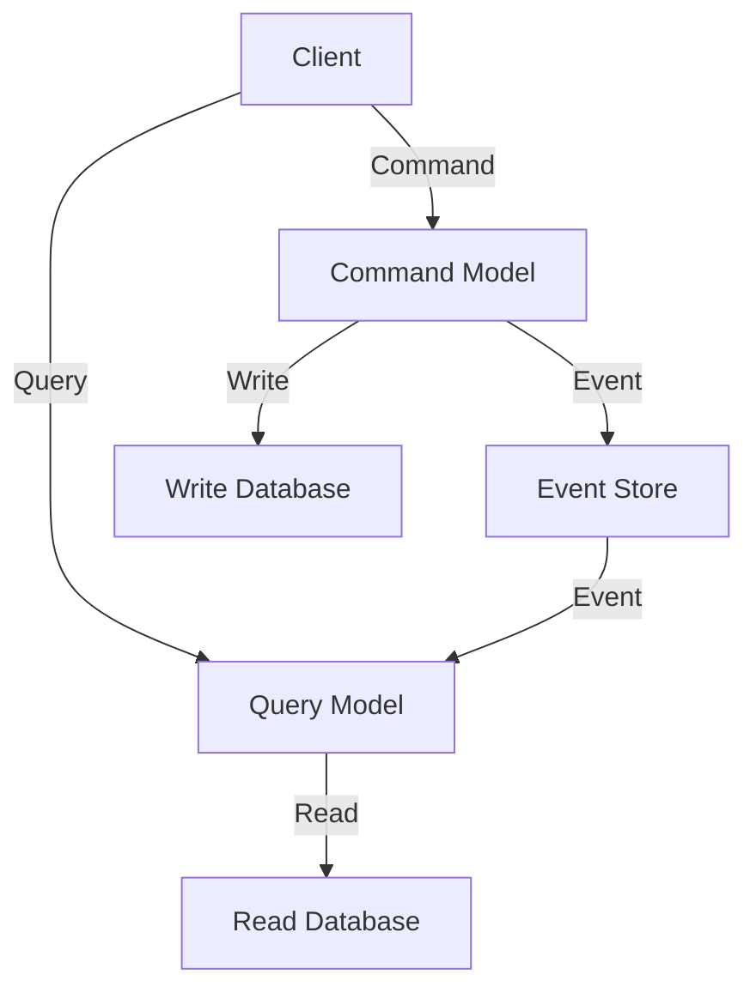

## 8.7 CQRS (Command Query Responsibility Segregation) Pattern

In the realm of software architecture, the CQRS (Command Query Responsibility Segregation) pattern stands out as a powerful approach for handling complex business domains. By separating read and write operations into distinct models, CQRS enables scalable, maintainable, and robust applications. In this section, we will delve into the intricacies of implementing CQRS in C#, explore its integration with Event Sourcing, and examine practical use cases.

### Understanding CQRS

CQRS is a pattern that divides the responsibilities of reading and writing data into separate models. This separation allows for optimized handling of queries and commands, leading to improved performance and scalability. Let's break down the core components of CQRS:

- **Command Model**: Responsible for handling write operations. It processes commands that change the state of the application.
- **Query Model**: Handles read operations. It retrieves data without altering the application's state.

By decoupling these responsibilities, CQRS allows each model to be optimized for its specific task, resulting in a more efficient system.

### Implementing CQRS in C#

Implementing CQRS in C# involves creating separate models for commands and queries. This can be achieved using various libraries and frameworks, with MediatR being a popular choice for managing command and query handlers.

#### Using MediatR Library

MediatR is a lightweight library that facilitates the implementation of CQRS by providing a mediator pattern for handling requests. Here's how you can implement CQRS using MediatR in C#:

1. **Install MediatR**: Add the MediatR package to your project via NuGet.

   ```shell
   Install-Package MediatR
   ```

2. **Define Commands and Queries**: Create classes for your commands and queries. Commands represent actions that change the state, while queries fetch data.

   ```csharp
   public class CreateOrderCommand : IRequest<Guid>
   {
       public string ProductName { get; set; }
       public int Quantity { get; set; }
   }

   public class GetOrderQuery : IRequest<OrderDto>
   {
       public Guid OrderId { get; set; }
   }
   ```

3. **Implement Handlers**: Create handlers for each command and query. Handlers contain the logic for processing requests.

   ```csharp
   public class CreateOrderHandler : IRequestHandler<CreateOrderCommand, Guid>
   {
       private readonly IOrderRepository _orderRepository;

       public CreateOrderHandler(IOrderRepository orderRepository)
       {
           _orderRepository = orderRepository;
       }

       public async Task<Guid> Handle(CreateOrderCommand request, CancellationToken cancellationToken)
       {
           var order = new Order { ProductName = request.ProductName, Quantity = request.Quantity };
           await _orderRepository.AddAsync(order);
           return order.Id;
       }
   }

   public class GetOrderHandler : IRequestHandler<GetOrderQuery, OrderDto>
   {
       private readonly IOrderRepository _orderRepository;

       public GetOrderHandler(IOrderRepository orderRepository)
       {
           _orderRepository = orderRepository;
       }

       public async Task<OrderDto> Handle(GetOrderQuery request, CancellationToken cancellationToken)
       {
           var order = await _orderRepository.GetByIdAsync(request.OrderId);
           return new OrderDto { Id = order.Id, ProductName = order.ProductName, Quantity = order.Quantity };
       }
   }
   ```

4. **Configure MediatR**: Register MediatR services in your application's dependency injection container.

   ```csharp
   services.AddMediatR(typeof(Startup));
   ```

5. **Use MediatR**: Inject `IMediator` into your controllers or services to send commands and queries.

   ```csharp
   public class OrdersController : ControllerBase
   {
       private readonly IMediator _mediator;

       public OrdersController(IMediator mediator)
       {
           _mediator = mediator;
       }

       [HttpPost]
       public async Task<IActionResult> CreateOrder(CreateOrderCommand command)
       {
           var orderId = await _mediator.Send(command);
           return Ok(orderId);
       }

       [HttpGet("{id}")]
       public async Task<IActionResult> GetOrder(Guid id)
       {
           var order = await _mediator.Send(new GetOrderQuery { OrderId = id });
           return Ok(order);
       }
   }
   ```

By using MediatR, we can easily implement CQRS in C#, ensuring a clean separation of concerns and a scalable architecture.

### Integrating with Event Sourcing

Event Sourcing is a pattern that complements CQRS by storing the state of an application as a sequence of events. When combined with CQRS, Event Sourcing provides a robust architecture that captures every change to the application's state.

#### Combining CQRS with Event Sourcing

To integrate CQRS with Event Sourcing, follow these steps:

1. **Define Events**: Create classes for each event that represents a change in the application's state.

   ```csharp
   public class OrderCreatedEvent
   {
       public Guid OrderId { get; set; }
       public string ProductName { get; set; }
       public int Quantity { get; set; }
   }
   ```

2. **Store Events**: Implement an event store to persist events. This can be a database or a specialized event store.

3. **Rebuild State**: Use events to rebuild the application's state. This is typically done in the command model.

4. **Project Read Models**: Use events to update read models. This ensures that the query model reflects the current state of the application.

By combining CQRS with Event Sourcing, we can achieve a system that is both scalable and auditable, with a complete history of state changes.

### Read Model and Write Model Patterns

In CQRS, the read and write models can be further optimized to enhance performance and scalability.

#### Implementing Separate Read and Write Models in C#

To implement separate read and write models, follow these steps:

1. **Design Write Model**: Focus on capturing commands and applying business logic. The write model should be optimized for handling state changes.

2. **Design Read Model**: Optimize for querying data. The read model can use denormalized data structures to improve query performance.

3. **Synchronize Models**: Use events to keep the read model in sync with the write model. This can be done asynchronously to improve performance.

#### Use Cases and Examples

CQRS is particularly useful in complex business domains where scalability and performance are critical. Here are some use cases:

- **E-commerce Platforms**: Handle high volumes of transactions and queries with separate models.
- **Financial Systems**: Ensure data consistency and auditability with event sourcing.
- **Real-time Applications**: Optimize read performance for real-time data retrieval.

### Visualizing CQRS Architecture

To better understand the CQRS architecture, let's visualize the separation of command and query models using a diagram.



**Diagram Description**: This diagram illustrates the flow of commands and queries in a CQRS architecture. The command model processes commands and generates events, which are stored in an event store. The query model uses these events to update the read database, ensuring that it reflects the current state of the application.

### Design Considerations

When implementing CQRS, consider the following:

- **Consistency**: Ensure eventual consistency between the read and write models.
- **Complexity**: Be aware of the increased complexity due to separate models and event handling.
- **Performance**: Optimize each model for its specific task to achieve the best performance.

### Differences and Similarities

CQRS is often compared to other patterns, such as:

- **Event Sourcing**: While CQRS focuses on separating read and write models, Event Sourcing captures state changes as events. They complement each other well.
- **CRUD**: Unlike CRUD, which uses a single model for all operations, CQRS separates concerns for better scalability.

### Try It Yourself

To deepen your understanding of CQRS, try modifying the code examples provided. Experiment with different command and query handlers, and explore integrating Event Sourcing into your application.

### Knowledge Check

- What are the key components of CQRS?
- How does MediatR facilitate CQRS implementation in C#?
- What are the benefits of combining CQRS with Event Sourcing?

### Embrace the Journey

Implementing CQRS can be challenging, but it offers significant benefits for complex applications. Remember, this is just the beginning. As you progress, you'll build more scalable and maintainable systems. Keep experimenting, stay curious, and enjoy the journey!

## Quiz Time!



### What is the primary purpose of the CQRS pattern?

- [x] To separate read and write operations into different models
- [ ] To combine read and write operations into a single model
- [ ] To optimize database queries
- [ ] To simplify application architecture

> **Explanation:** CQRS separates read and write operations into different models to optimize performance and scalability.

### Which library is commonly used to implement CQRS in C#?

- [x] MediatR
- [ ] Entity Framework
- [ ] AutoMapper
- [ ] Dapper

> **Explanation:** MediatR is a popular library for implementing CQRS in C# by providing a mediator pattern for handling requests.

### What is the role of the command model in CQRS?

- [x] To handle write operations and process commands
- [ ] To handle read operations and process queries
- [ ] To store events
- [ ] To synchronize read and write models

> **Explanation:** The command model in CQRS is responsible for handling write operations and processing commands that change the application's state.

### How does Event Sourcing complement CQRS?

- [x] By storing state changes as events
- [ ] By combining read and write models
- [ ] By optimizing database queries
- [ ] By simplifying application architecture

> **Explanation:** Event Sourcing complements CQRS by storing state changes as events, providing a complete history of state changes.

### What is a key consideration when implementing CQRS?

- [x] Ensuring eventual consistency between read and write models
- [ ] Combining read and write models for simplicity
- [ ] Optimizing database queries
- [ ] Simplifying application architecture

> **Explanation:** Ensuring eventual consistency between read and write models is crucial when implementing CQRS.

### What is the main benefit of using separate read and write models in CQRS?

- [x] Improved performance and scalability
- [ ] Simplified application architecture
- [ ] Reduced complexity
- [ ] Easier database management

> **Explanation:** Using separate read and write models in CQRS improves performance and scalability by optimizing each model for its specific task.

### Which pattern is often used in conjunction with CQRS?

- [x] Event Sourcing
- [ ] CRUD
- [ ] Singleton
- [ ] Factory

> **Explanation:** Event Sourcing is often used in conjunction with CQRS to capture state changes as events.

### What is a common use case for CQRS?

- [x] Complex business domains requiring scalable read/write operations
- [ ] Simple CRUD applications
- [ ] Static websites
- [ ] Single-page applications

> **Explanation:** CQRS is commonly used in complex business domains where scalable read/write operations are required.

### What is the role of the query model in CQRS?

- [x] To handle read operations and retrieve data
- [ ] To handle write operations and process commands
- [ ] To store events
- [ ] To synchronize read and write models

> **Explanation:** The query model in CQRS is responsible for handling read operations and retrieving data without altering the application's state.

### True or False: CQRS combines read and write operations into a single model.

- [ ] True
- [x] False

> **Explanation:** False. CQRS separates read and write operations into different models to optimize performance and scalability.




