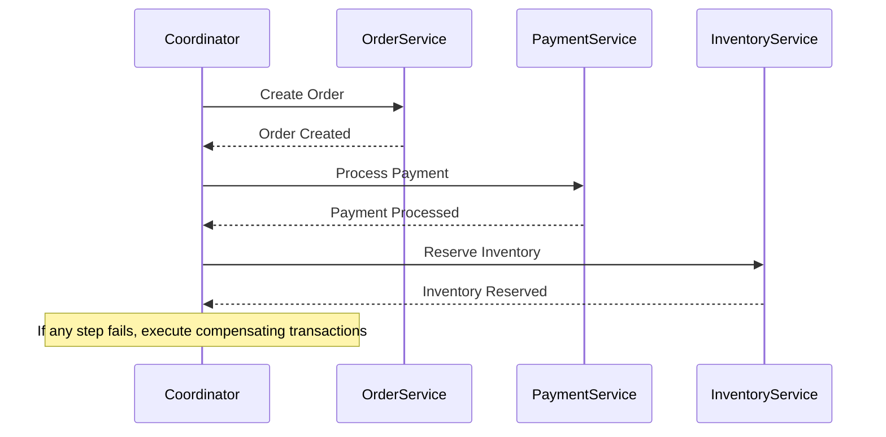
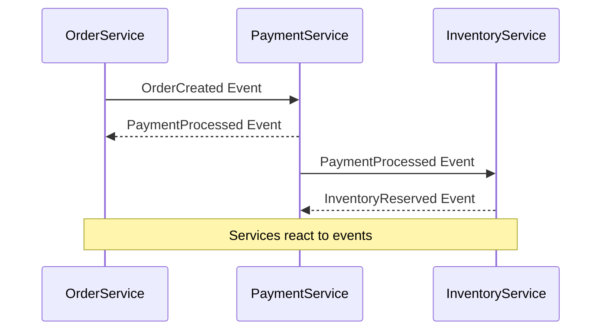

## 8.8 Saga Pattern

In the realm of microservices architecture, managing distributed transactions is a complex challenge. The Saga Pattern emerges as a powerful solution to handle these transactions, ensuring data consistency across multiple services. In this section, we will delve into the intricacies of the Saga Pattern, explore its implementation in C#, and examine its applicability through practical use cases and examples.

### Understanding the Saga Pattern

The Saga Pattern is a design pattern used to manage distributed transactions across multiple microservices. Unlike traditional monolithic applications where a single transaction can ensure data consistency, microservices architectures require a different approach due to their distributed nature. The Saga Pattern addresses this by breaking down a transaction into a series of smaller, isolated transactions, each handled by a different microservice. If one of these transactions fails, compensating transactions are executed to undo the changes made by the previous transactions, thereby maintaining data consistency.

#### Key Concepts

- **Distributed Transactions**: Transactions that span multiple microservices, each responsible for a part of the overall transaction.
- **Compensating Transactions**: Transactions that are executed to undo the effects of a previous transaction in case of failure.
- **Coordination vs. Choreography**: Two approaches to implementing the Saga Pattern, each with its own advantages and trade-offs.

### Implementing Saga in C#

Implementing the Saga Pattern in C# involves choosing between two primary approaches: coordination and choreography. Each approach has its own set of characteristics and is suitable for different scenarios.

#### Coordination Approach

In the coordination approach, a central coordinator manages the execution of the saga. This coordinator is responsible for initiating each transaction and handling failures by triggering compensating transactions. This approach provides a clear and centralized control over the saga execution but can introduce a single point of failure.

##### Example: Order Processing Saga

Consider an e-commerce application where an order processing saga involves multiple services: Order Service, Payment Service, and Inventory Service. The coordinator manages the sequence of transactions:

1. **Order Service**: Create an order.
2. **Payment Service**: Process payment.
3. **Inventory Service**: Reserve inventory.

If the payment fails, the coordinator triggers compensating transactions to cancel the order and release the reserved inventory.

```csharp
public class OrderSagaCoordinator
{
    public async Task ExecuteOrderSaga(Order order)
    {
        try
        {
            await OrderService.CreateOrder(order);
            await PaymentService.ProcessPayment(order);
            await InventoryService.ReserveInventory(order);
        }
        catch (Exception ex)
        {
            await Compensate(order);
            throw;
        }
    }

    private async Task Compensate(Order order)
    {
        await InventoryService.ReleaseInventory(order);
        await OrderService.CancelOrder(order);
    }
}
```

#### Choreography Approach

In the choreography approach, there is no central coordinator. Instead, each service involved in the saga listens for events and reacts accordingly. This approach promotes loose coupling and scalability but can lead to complex event management.

##### Example: Order Processing Saga with Choreography

In the choreography approach, each service publishes events and listens for events from other services:

1. **Order Service**: Publishes `OrderCreated` event.
2. **Payment Service**: Listens for `OrderCreated` event and publishes `PaymentProcessed` event.
3. **Inventory Service**: Listens for `PaymentProcessed` event and publishes `InventoryReserved` event.

If the payment fails, the Payment Service publishes a `PaymentFailed` event, and other services react accordingly.

```csharp
public class OrderService
{
    public void OnOrderCreated(Order order)
    {
        // Publish OrderCreated event
        EventBus.Publish(new OrderCreatedEvent(order));
    }

    public void OnPaymentFailed(Order order)
    {
        // Handle payment failure
        CancelOrder(order);
    }
}

public class PaymentService
{
    public void OnOrderCreated(Order order)
    {
        try
        {
            ProcessPayment(order);
            // Publish PaymentProcessed event
            EventBus.Publish(new PaymentProcessedEvent(order));
        }
        catch
        {
            // Publish PaymentFailed event
            EventBus.Publish(new PaymentFailedEvent(order));
        }
    }
}
```

### Use Cases and Examples

The Saga Pattern is particularly useful in scenarios where data consistency across multiple services is critical. Let's explore some common use cases and examples.

#### Use Case 1: E-commerce Order Management

In an e-commerce application, managing orders involves multiple services such as order management, payment processing, and inventory management. The Saga Pattern ensures that all these services work together to maintain data consistency. If any service fails, compensating transactions are executed to roll back the changes.

#### Use Case 2: Travel Booking System

In a travel booking system, booking a trip involves multiple services such as flight booking, hotel reservation, and car rental. The Saga Pattern coordinates these services to ensure that all bookings are successful. If a flight booking fails, compensating transactions are executed to cancel the hotel reservation and car rental.

#### Example: Travel Booking Saga

```csharp
public class TravelBookingSaga
{
    public async Task ExecuteBookingSaga(Trip trip)
    {
        try
        {
            await FlightService.BookFlight(trip);
            await HotelService.BookHotel(trip);
            await CarRentalService.BookCar(trip);
        }
        catch (Exception ex)
        {
            await Compensate(trip);
            throw;
        }
    }

    private async Task Compensate(Trip trip)
    {
        await CarRentalService.CancelCar(trip);
        await HotelService.CancelHotel(trip);
        await FlightService.CancelFlight(trip);
    }
}
```

### Visualizing the Saga Pattern

To better understand the Saga Pattern, let's visualize the coordination and choreography approaches using Mermaid.js diagrams.

#### Coordination Approach Diagram



#### Choreography Approach Diagram



### Design Considerations

When implementing the Saga Pattern, consider the following design considerations:

- **Consistency vs. Availability**: The Saga Pattern prioritizes eventual consistency over immediate consistency. Ensure that your application can tolerate temporary inconsistencies.
- **Error Handling**: Implement robust error handling to manage failures and execute compensating transactions effectively.
- **Scalability**: The choreography approach promotes scalability by eliminating the central coordinator, but it requires careful event management.
- **Complexity**: The choreography approach can lead to complex event-driven architectures. Ensure that your team is equipped to handle this complexity.

### Differences and Similarities

The Saga Pattern is often compared to other patterns such as the Two-Phase Commit (2PC) and Event Sourcing. Here are some key differences and similarities:

- **Saga vs. Two-Phase Commit**: The Saga Pattern provides eventual consistency, while 2PC provides strong consistency. Sagas are more suitable for microservices due to their asynchronous nature.
- **Saga vs. Event Sourcing**: Both patterns use events to manage state changes. However, Event Sourcing focuses on capturing all changes as events, while the Saga Pattern focuses on managing distributed transactions.

### Try It Yourself

To gain hands-on experience with the Saga Pattern, try implementing a simple order processing saga in C#. Experiment with both coordination and choreography approaches. Modify the code to handle different failure scenarios and observe how compensating transactions are executed.

### Knowledge Check

Before we conclude, let's reinforce your understanding of the Saga Pattern with a few questions:

- What are the key differences between the coordination and choreography approaches?
- How does the Saga Pattern ensure data consistency across multiple services?
- What are some common use cases for the Saga Pattern?

### Embrace the Journey

Remember, mastering the Saga Pattern is just one step in your journey to becoming an expert in microservices architecture. As you continue to explore and experiment with different design patterns, you'll gain a deeper understanding of how to build scalable and maintainable applications. Keep experimenting, stay curious, and enjoy the journey!

## Quiz Time!



### What is the primary purpose of the Saga Pattern in microservices?

- [x] To manage distributed transactions across multiple microservices
- [ ] To enhance the performance of microservices
- [ ] To simplify the deployment process
- [ ] To improve the security of microservices

> **Explanation:** The Saga Pattern is designed to manage distributed transactions across multiple microservices, ensuring data consistency.

### Which approach in the Saga Pattern involves a central coordinator?

- [x] Coordination
- [ ] Choreography
- [ ] Event Sourcing
- [ ] Two-Phase Commit

> **Explanation:** The coordination approach involves a central coordinator that manages the execution of the saga.

### In the choreography approach, how do services communicate?

- [ ] Through a central coordinator
- [x] By listening for and reacting to events
- [ ] Through direct method calls
- [ ] By using a shared database

> **Explanation:** In the choreography approach, services communicate by listening for and reacting to events, promoting loose coupling.

### What is a compensating transaction?

- [x] A transaction that undoes the effects of a previous transaction in case of failure
- [ ] A transaction that enhances the performance of a service
- [ ] A transaction that simplifies the deployment process
- [ ] A transaction that improves the security of a service

> **Explanation:** A compensating transaction is executed to undo the effects of a previous transaction in case of failure, maintaining data consistency.

### Which pattern provides strong consistency?

- [ ] Saga Pattern
- [x] Two-Phase Commit
- [ ] Event Sourcing
- [ ] Choreography

> **Explanation:** The Two-Phase Commit (2PC) pattern provides strong consistency, unlike the Saga Pattern, which provides eventual consistency.

### What is a common use case for the Saga Pattern?

- [x] E-commerce order management
- [ ] Enhancing microservices performance
- [ ] Simplifying deployment processes
- [ ] Improving microservices security

> **Explanation:** A common use case for the Saga Pattern is e-commerce order management, where multiple services need to work together to maintain data consistency.

### How does the Saga Pattern handle failures?

- [ ] By ignoring them
- [x] By executing compensating transactions
- [ ] By restarting the entire process
- [ ] By logging the errors

> **Explanation:** The Saga Pattern handles failures by executing compensating transactions to undo the effects of previous transactions.

### What is a key advantage of the choreography approach?

- [ ] Centralized control
- [x] Loose coupling and scalability
- [ ] Strong consistency
- [ ] Simplified error handling

> **Explanation:** The choreography approach promotes loose coupling and scalability by eliminating the need for a central coordinator.

### Which pattern is often compared to the Saga Pattern?

- [ ] Singleton Pattern
- [ ] Factory Pattern
- [x] Two-Phase Commit
- [ ] Adapter Pattern

> **Explanation:** The Saga Pattern is often compared to the Two-Phase Commit (2PC) pattern, as both deal with managing transactions.

### True or False: The Saga Pattern is suitable for monolithic applications.

- [ ] True
- [x] False

> **Explanation:** The Saga Pattern is designed for microservices architectures, not monolithic applications, due to its focus on managing distributed transactions.




