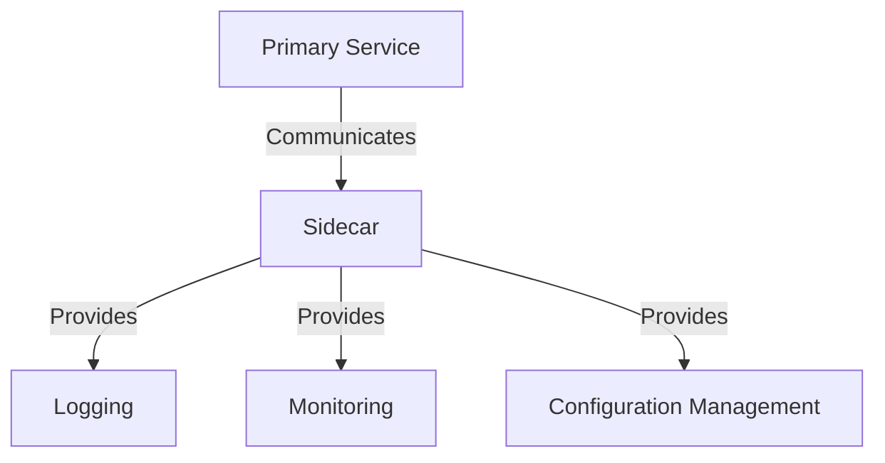

## 8.9 Sidecar Pattern

In the realm of microservices architecture, the Sidecar Pattern emerges as a pivotal design pattern that facilitates the deployment of auxiliary components alongside primary microservices. This pattern is instrumental in enhancing the functionality of microservices by offloading certain responsibilities to a sidecar, thereby promoting modularity and separation of concerns. In this comprehensive guide, we will delve into the intricacies of the Sidecar Pattern, its implementation in C# and .NET applications, and explore real-world use cases such as monitoring, logging, and configuration.

### Understanding the Sidecar Pattern

#### Intent

The Sidecar Pattern is designed to augment a microservice by deploying auxiliary components in a separate process or container, yet within the same host environment. This auxiliary component, known as the "sidecar," runs alongside the primary service and provides additional capabilities such as logging, monitoring, configuration management, and more.

#### Key Participants

- **Primary Service**: The main microservice that performs the core business logic.
- **Sidecar**: An auxiliary component that runs alongside the primary service, providing additional functionalities.

#### Applicability

The Sidecar Pattern is applicable in scenarios where:
- There is a need to extend the functionality of a microservice without altering its codebase.
- Cross-cutting concerns such as logging, monitoring, and configuration management need to be handled separately.
- There is a requirement for a modular architecture where auxiliary services can be independently deployed and managed.

### Implementing Sidecar in .NET Applications

#### Using Dapr

Dapr (Distributed Application Runtime) is a portable, event-driven runtime that simplifies building resilient, stateless, and stateful microservices. It provides a set of building blocks for common microservice patterns, including the Sidecar Pattern.

##### Setting Up Dapr

To implement the Sidecar Pattern using Dapr in a .NET application, follow these steps:

1. **Install Dapr CLI**: Begin by installing the Dapr CLI on your development machine. This tool is essential for initializing and managing Dapr applications.

   ```bash
   # Install Dapr CLI
   wget -q https://raw.githubusercontent.com/dapr/cli/master/install/install.sh -O - | /bin/bash
   ```

2. **Initialize Dapr**: Once the CLI is installed, initialize Dapr in your local environment.

   ```bash
   # Initialize Dapr
   dapr init
   ```

3. **Create a .NET Microservice**: Develop a simple .NET microservice that will serve as the primary service.

   ```csharp
   using Microsoft.AspNetCore.Builder;
   using Microsoft.AspNetCore.Hosting;
   using Microsoft.Extensions.DependencyInjection;
   using Microsoft.Extensions.Hosting;

   var builder = WebApplication.CreateBuilder(args);
   builder.Services.AddControllers();

   var app = builder.Build();
   app.MapControllers();
   app.Run();
   ```

4. **Configure Dapr Sidecar**: Define the Dapr sidecar configuration to enable features such as state management, pub/sub messaging, and service invocation.

   ```yaml
   apiVersion: dapr.io/v1alpha1
   kind: Configuration
   metadata:
     name: myappconfig
   spec:
     tracing:
       samplingRate: "1"
   ```

5. **Run the Application with Dapr**: Launch the .NET application with the Dapr sidecar.

   ```bash
   # Run the application with Dapr
   dapr run --app-id myapp --app-port 5000 -- dotnet run
   ```

##### Code Example: Logging with Dapr

Let's enhance our .NET microservice with logging capabilities using Dapr's sidecar:

```csharp
using Microsoft.AspNetCore.Mvc;
using Microsoft.Extensions.Logging;

namespace MyApp.Controllers
{
    [ApiController]
    [Route("[controller]")]
    public class WeatherForecastController : ControllerBase
    {
        private readonly ILogger<WeatherForecastController> _logger;

        public WeatherForecastController(ILogger<WeatherForecastController> logger)
        {
            _logger = logger;
        }

        [HttpGet]
        public IEnumerable<WeatherForecast> Get()
        {
            _logger.LogInformation("Fetching weather forecast data.");
            // Logic to fetch weather data
            return new List<WeatherForecast>();
        }
    }
}
```

In this example, the `ILogger` interface is used to log information, which can be captured and processed by the Dapr sidecar.

### Use Cases and Examples

#### Monitoring

The Sidecar Pattern is particularly effective for monitoring microservices. By deploying a monitoring agent as a sidecar, you can collect metrics and logs without modifying the primary service.

##### Example: Prometheus Sidecar

Prometheus is a popular monitoring tool that can be deployed as a sidecar to collect metrics from a .NET microservice.

```yaml
apiVersion: v1
kind: Pod
metadata:
  name: myapp
spec:
  containers:
  - name: myapp
    image: myapp:latest
  - name: prometheus-sidecar
    image: prom/prometheus
    args:
    - "--config.file=/etc/prometheus/prometheus.yml"
```

#### Logging

Logging is another common use case for the Sidecar Pattern. By offloading logging to a sidecar, you can centralize log management and analysis.

##### Example: Fluentd Sidecar

Fluentd is a log collector that can be used as a sidecar to aggregate logs from a .NET microservice.

```yaml
apiVersion: v1
kind: Pod
metadata:
  name: myapp
spec:
  containers:
  - name: myapp
    image: myapp:latest
  - name: fluentd-sidecar
    image: fluent/fluentd
    volumeMounts:
    - name: varlog
      mountPath: /var/log
  volumes:
  - name: varlog
    hostPath:
      path: /var/log
```

#### Configuration Management

The Sidecar Pattern can also be used for configuration management, allowing dynamic configuration changes without restarting the primary service.

##### Example: Consul Sidecar

Consul is a service mesh solution that can be used as a sidecar for configuration management.

```yaml
apiVersion: v1
kind: Pod
metadata:
  name: myapp
spec:
  containers:
  - name: myapp
    image: myapp:latest
  - name: consul-sidecar
    image: consul
    args:
    - "agent"
    - "-config-dir=/consul/config"
```

### Design Considerations

When implementing the Sidecar Pattern, consider the following:

- **Resource Management**: Ensure that the sidecar does not consume excessive resources, which could impact the performance of the primary service.
- **Communication**: Establish a reliable communication mechanism between the primary service and the sidecar, such as HTTP or gRPC.
- **Security**: Implement security measures to protect data exchanged between the primary service and the sidecar.
- **Scalability**: Design the sidecar to scale independently of the primary service, if necessary.

### Differences and Similarities

The Sidecar Pattern is often compared to other microservices patterns such as the Ambassador and Adapter patterns. Here are some distinctions:

- **Ambassador Pattern**: Focuses on handling network-related tasks such as routing and authentication, whereas the Sidecar Pattern can handle a broader range of auxiliary tasks.
- **Adapter Pattern**: Primarily used to convert interfaces, while the Sidecar Pattern is used to augment service functionality without altering the service itself.

### Visualizing the Sidecar Pattern

To better understand the Sidecar Pattern, let's visualize its architecture using a Mermaid.js diagram:



**Diagram Description**: This diagram illustrates the relationship between the primary service and the sidecar. The sidecar provides additional functionalities such as logging, monitoring, and configuration management.

### Try It Yourself

To deepen your understanding of the Sidecar Pattern, try modifying the code examples provided:

- **Experiment with Different Sidecars**: Replace the Dapr sidecar with another tool, such as Envoy or Linkerd, and observe the differences in functionality.
- **Enhance Logging**: Add more detailed logging to the .NET microservice and configure the sidecar to process and analyze these logs.
- **Implement Security**: Introduce security features such as encryption or authentication between the primary service and the sidecar.

### Knowledge Check

Before we conclude, let's reinforce our understanding of the Sidecar Pattern with some questions:

- What are the primary benefits of using the Sidecar Pattern in microservices architecture?
- How does the Sidecar Pattern promote modularity and separation of concerns?
- What are some common use cases for the Sidecar Pattern in .NET applications?

### Embrace the Journey

Remember, mastering the Sidecar Pattern is just one step in your journey towards becoming an expert in microservices architecture. As you continue to explore and experiment with different patterns, you'll gain a deeper understanding of how to build scalable and maintainable applications. Keep pushing the boundaries, stay curious, and enjoy the journey!

## Quiz Time!



### What is the primary purpose of the Sidecar Pattern?

- [x] To deploy auxiliary components alongside microservices for additional functionalities.
- [ ] To handle network-related tasks such as routing and authentication.
- [ ] To convert interfaces between incompatible systems.
- [ ] To manage database connections for microservices.

> **Explanation:** The Sidecar Pattern is designed to deploy auxiliary components alongside microservices to provide additional functionalities such as logging, monitoring, and configuration management.

### Which tool is commonly used to implement the Sidecar Pattern in .NET applications?

- [x] Dapr
- [ ] Kubernetes
- [ ] Docker
- [ ] Jenkins

> **Explanation:** Dapr (Distributed Application Runtime) is a tool commonly used to implement the Sidecar Pattern in .NET applications, providing building blocks for common microservice patterns.

### What is a key benefit of using the Sidecar Pattern?

- [x] It promotes modularity and separation of concerns.
- [ ] It simplifies database management.
- [ ] It enhances user interface design.
- [ ] It improves network latency.

> **Explanation:** The Sidecar Pattern promotes modularity and separation of concerns by offloading auxiliary tasks to a sidecar, allowing the primary service to focus on core business logic.

### Which of the following is NOT a common use case for the Sidecar Pattern?

- [ ] Logging
- [ ] Monitoring
- [ ] Configuration Management
- [x] User Authentication

> **Explanation:** While the Sidecar Pattern can handle various auxiliary tasks, user authentication is typically managed by the Ambassador Pattern, which focuses on network-related tasks.

### How does the Sidecar Pattern differ from the Ambassador Pattern?

- [x] The Sidecar Pattern handles a broader range of auxiliary tasks, while the Ambassador Pattern focuses on network-related tasks.
- [ ] The Sidecar Pattern is used for database management, while the Ambassador Pattern is used for logging.
- [ ] The Sidecar Pattern is implemented in Java, while the Ambassador Pattern is implemented in C#.
- [ ] The Sidecar Pattern is used for user interface design, while the Ambassador Pattern is used for backend services.

> **Explanation:** The Sidecar Pattern handles a broader range of auxiliary tasks, such as logging and monitoring, while the Ambassador Pattern focuses on network-related tasks like routing and authentication.

### What is a potential design consideration when implementing the Sidecar Pattern?

- [x] Ensuring the sidecar does not consume excessive resources.
- [ ] Simplifying user interface design.
- [ ] Enhancing database query performance.
- [ ] Improving network bandwidth.

> **Explanation:** When implementing the Sidecar Pattern, it's important to ensure that the sidecar does not consume excessive resources, which could impact the performance of the primary service.

### Which of the following tools can be used as a sidecar for logging in a .NET application?

- [x] Fluentd
- [ ] Kubernetes
- [ ] Docker
- [ ] Jenkins

> **Explanation:** Fluentd is a log collector that can be used as a sidecar to aggregate logs from a .NET microservice.

### What is the role of the primary service in the Sidecar Pattern?

- [x] To perform the core business logic.
- [ ] To manage network-related tasks.
- [ ] To handle database connections.
- [ ] To convert interfaces between incompatible systems.

> **Explanation:** In the Sidecar Pattern, the primary service is responsible for performing the core business logic, while the sidecar handles auxiliary tasks.

### True or False: The Sidecar Pattern can be used for configuration management.

- [x] True
- [ ] False

> **Explanation:** True. The Sidecar Pattern can be used for configuration management, allowing dynamic configuration changes without restarting the primary service.

### Which of the following is a common communication mechanism between the primary service and the sidecar?

- [x] HTTP
- [ ] FTP
- [ ] SMTP
- [ ] POP3

> **Explanation:** HTTP is a common communication mechanism between the primary service and the sidecar, providing a reliable way to exchange data.


