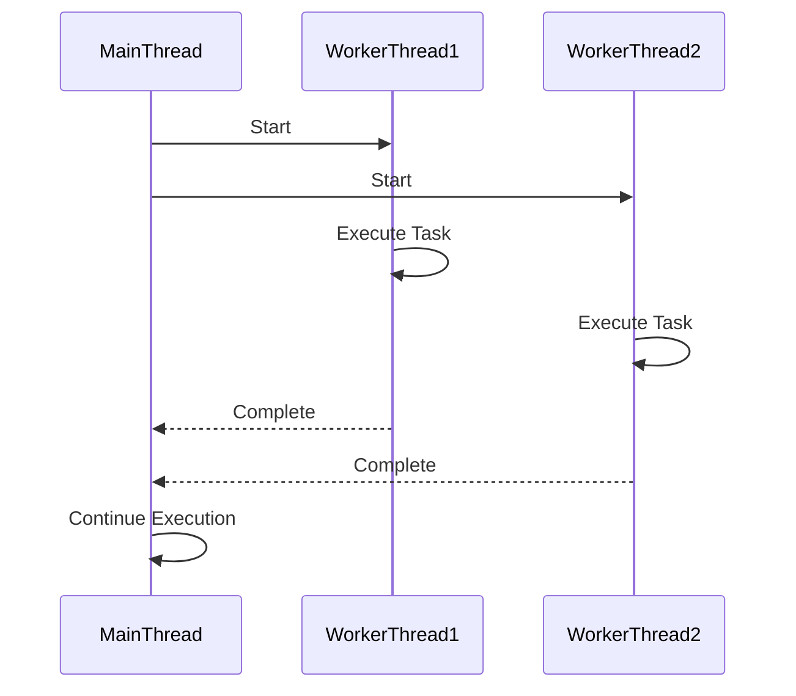

## 9.1 Introduction to Concurrency in C#

Concurrency is a fundamental concept in modern software development, enabling applications to perform multiple operations simultaneously. In C#, concurrency is achieved through multithreading and asynchronous programming, allowing developers to build responsive and efficient applications. This section will delve into the evolution of concurrency features in C# and .NET, explore the challenges and considerations in concurrent programming, and provide practical insights for expert developers.

### Understanding Multithreading and Asynchronous Programming

Concurrency in C# can be broadly categorized into two paradigms: multithreading and asynchronous programming. Both approaches aim to improve application performance and responsiveness but differ in their implementation and use cases.

#### Multithreading

Multithreading involves executing multiple threads concurrently within a single process. Each thread represents a separate path of execution, allowing multiple operations to run simultaneously. This is particularly useful for CPU-bound tasks, where parallel execution can significantly reduce processing time.

**Key Concepts in Multithreading:**

- **Thread:** The smallest unit of execution within a process. In C#, threads can be created using the `Thread` class from the `System.Threading` namespace.
- **Thread Pool:** A collection of reusable threads managed by the .NET runtime, which can be used to execute tasks without the overhead of creating new threads.
- **Synchronization:** Mechanisms to coordinate access to shared resources, preventing race conditions and ensuring data consistency. Common synchronization primitives include locks, mutexes, and semaphores.

**Example: Creating and Managing Threads**

```csharp
using System;
using System.Threading;

class Program
{
    static void Main()
    {
        // Create a new thread
        Thread thread = new Thread(new ThreadStart(DoWork));
        thread.Start();

        // Main thread continues to execute
        Console.WriteLine("Main thread is running.");

        // Wait for the created thread to complete
        thread.Join();
    }

    static void DoWork()
    {
        Console.WriteLine("Worker thread is executing.");
    }
}
```

In this example, a new thread is created to execute the `DoWork` method, while the main thread continues its execution. The `Join` method ensures that the main thread waits for the worker thread to complete before exiting.

#### Asynchronous Programming

Asynchronous programming, on the other hand, is designed to improve the responsiveness of applications, particularly for I/O-bound operations such as file access, network communication, and database queries. It allows tasks to be executed without blocking the main thread, enabling applications to remain responsive to user interactions.

**Key Concepts in Asynchronous Programming:**

- **Task:** Represents an asynchronous operation. In C#, tasks are created using the `Task` class from the `System.Threading.Tasks` namespace.
- **Async/Await:** Keywords that simplify asynchronous programming by allowing developers to write code that appears synchronous while executing asynchronously.
- **Continuation:** A mechanism to specify actions to be performed after a task completes, enabling chaining of asynchronous operations.

**Example: Asynchronous File Reading**

```csharp
using System;
using System.IO;
using System.Threading.Tasks;

class Program
{
    static async Task Main()
    {
        string filePath = "example.txt";
        string content = await ReadFileAsync(filePath);
        Console.WriteLine(content);
    }

    static async Task<string> ReadFileAsync(string filePath)
    {
        using (StreamReader reader = new StreamReader(filePath))
        {
            return await reader.ReadToEndAsync();
        }
    }
}
```

In this example, the `ReadFileAsync` method reads a file asynchronously, allowing the main thread to remain responsive while the file is being read.

### Evolution of Concurrency Features in C# and .NET

The evolution of concurrency features in C# and .NET reflects the growing need for efficient and scalable applications. Let's explore the key milestones in this evolution:

#### .NET Framework

The .NET Framework introduced basic multithreading capabilities through the `Thread` class and synchronization primitives. However, managing threads manually was complex and error-prone, leading to the development of higher-level abstractions.

#### .NET 4.0

With the release of .NET 4.0, the Task Parallel Library (TPL) was introduced, providing a more intuitive and efficient way to manage concurrent operations. The TPL abstracts the complexity of thread management, allowing developers to focus on the logic of their applications.

#### C# 5.0

C# 5.0 introduced the `async` and `await` keywords, revolutionizing asynchronous programming. These keywords simplify the implementation of asynchronous operations, making it easier to write non-blocking code.

#### .NET Core and .NET 5+

The transition to .NET Core and the subsequent releases of .NET 5 and beyond have further enhanced concurrency features. The introduction of `IAsyncEnumerable` enables asynchronous iteration over collections, while improvements to the TPL and the addition of new synchronization primitives provide greater flexibility and performance.

### Challenges and Considerations in Concurrent Programming

Concurrent programming presents several challenges that developers must address to build robust and efficient applications. Let's explore some of these challenges and considerations:

#### Race Conditions

Race conditions occur when multiple threads access shared resources concurrently, leading to unpredictable behavior. To prevent race conditions, developers must use synchronization mechanisms to coordinate access to shared resources.

**Example: Race Condition**

```csharp
using System;
using System.Threading;

class Program
{
    static int counter = 0;

    static void Main()
    {
        Thread thread1 = new Thread(IncrementCounter);
        Thread thread2 = new Thread(IncrementCounter);

        thread1.Start();
        thread2.Start();

        thread1.Join();
        thread2.Join();

        Console.WriteLine($"Final counter value: {counter}");
    }

    static void IncrementCounter()
    {
        for (int i = 0; i < 1000; i++)
        {
            counter++;
        }
    }
}
```

In this example, two threads increment a shared counter variable. Without synchronization, the final counter value may not be as expected due to race conditions.

#### Deadlocks

Deadlocks occur when two or more threads are blocked indefinitely, waiting for each other to release resources. To avoid deadlocks, developers must carefully design their synchronization logic and avoid circular dependencies.

**Example: Deadlock**

```csharp
using System;
using System.Threading;

class Program
{
    static object lock1 = new object();
    static object lock2 = new object();

    static void Main()
    {
        Thread thread1 = new Thread(Method1);
        Thread thread2 = new Thread(Method2);

        thread1.Start();
        thread2.Start();

        thread1.Join();
        thread2.Join();
    }

    static void Method1()
    {
        lock (lock1)
        {
            Thread.Sleep(100); // Simulate work
            lock (lock2)
            {
                Console.WriteLine("Method1 acquired both locks.");
            }
        }
    }

    static void Method2()
    {
        lock (lock2)
        {
            Thread.Sleep(100); // Simulate work
            lock (lock1)
            {
                Console.WriteLine("Method2 acquired both locks.");
            }
        }
    }
}
```

In this example, two threads attempt to acquire locks in different orders, leading to a deadlock.

#### Thread Safety

Ensuring thread safety is crucial in concurrent programming. Thread-safe code can be safely executed by multiple threads without causing data corruption or inconsistent results. Developers must use synchronization mechanisms and design patterns to achieve thread safety.

**Example: Thread-Safe Counter**

```csharp
using System;
using System.Threading;

class Program
{
    static int counter = 0;
    static object lockObject = new object();

    static void Main()
    {
        Thread thread1 = new Thread(IncrementCounter);
        Thread thread2 = new Thread(IncrementCounter);

        thread1.Start();
        thread2.Start();

        thread1.Join();
        thread2.Join();

        Console.WriteLine($"Final counter value: {counter}");
    }

    static void IncrementCounter()
    {
        for (int i = 0; i < 1000; i++)
        {
            lock (lockObject)
            {
                counter++;
            }
        }
    }
}
```

In this example, a lock is used to ensure that only one thread can increment the counter at a time, preventing race conditions.

### Visualizing Concurrency in C#

To better understand concurrency in C#, let's visualize the flow of a multithreaded application using a sequence diagram.



This sequence diagram illustrates the interaction between the main thread and two worker threads. The main thread starts the worker threads, which execute their tasks concurrently. Once the tasks are complete, the worker threads notify the main thread, allowing it to continue execution.

### Try It Yourself

To deepen your understanding of concurrency in C#, try modifying the code examples provided in this section. Experiment with different synchronization mechanisms, such as `Monitor`, `Mutex`, and `Semaphore`, to see how they affect the behavior of concurrent applications. Additionally, explore the use of the `Task` class and the `async` and `await` keywords to implement asynchronous operations.

### References and Further Reading

- [Microsoft Docs: Multithreading in C#](https://docs.microsoft.com/en-us/dotnet/standard/threading/)
- [Microsoft Docs: Asynchronous Programming with Async and Await](https://docs.microsoft.com/en-us/dotnet/csharp/programming-guide/concepts/async/)
- [Concurrency in .NET: Modern Patterns of Concurrent and Parallel Programming](https://www.amazon.com/Concurrency-NET-Modern-Patterns-Parallel/dp/1617292992)

### Knowledge Check

To reinforce your understanding of concurrency in C#, consider the following questions:

1. What is the difference between multithreading and asynchronous programming in C#?
2. How does the Task Parallel Library (TPL) simplify concurrent programming?
3. What are race conditions, and how can they be prevented?
4. What is a deadlock, and how can it be avoided?
5. How do the `async` and `await` keywords improve asynchronous programming in C#?

### Embrace the Journey

Concurrency is a powerful tool in the developer's arsenal, enabling the creation of responsive and efficient applications. As you continue your journey in mastering concurrency in C#, remember that practice and experimentation are key to building a deep understanding of these concepts. Keep exploring, stay curious, and enjoy the process of becoming an expert in concurrent programming.

## Quiz Time!



### What is the primary purpose of multithreading in C#?

- [x] To execute multiple operations simultaneously
- [ ] To improve code readability
- [ ] To simplify error handling
- [ ] To enhance security

> **Explanation:** Multithreading allows multiple operations to run concurrently, improving application performance and responsiveness.

### Which keyword pair simplifies asynchronous programming in C#?

- [x] async/await
- [ ] lock/unlock
- [ ] start/stop
- [ ] begin/end

> **Explanation:** The `async` and `await` keywords simplify asynchronous programming by allowing developers to write non-blocking code that appears synchronous.

### What is a race condition?

- [x] A situation where multiple threads access shared resources concurrently, leading to unpredictable behavior
- [ ] A method of optimizing code execution speed
- [ ] A technique for improving memory management
- [ ] A type of error related to input validation

> **Explanation:** Race conditions occur when multiple threads access shared resources concurrently, leading to unpredictable behavior and potential data corruption.

### How can deadlocks be avoided in concurrent programming?

- [x] By carefully designing synchronization logic and avoiding circular dependencies
- [ ] By using more threads
- [ ] By increasing memory allocation
- [ ] By simplifying code structure

> **Explanation:** Deadlocks can be avoided by designing synchronization logic carefully and avoiding circular dependencies between threads.

### What is the role of the Task Parallel Library (TPL) in .NET?

- [x] To provide a more intuitive and efficient way to manage concurrent operations
- [ ] To enhance graphical user interfaces
- [ ] To simplify database interactions
- [ ] To improve network communication

> **Explanation:** The TPL provides a more intuitive and efficient way to manage concurrent operations, abstracting the complexity of thread management.

### Which synchronization mechanism is used to prevent race conditions?

- [x] Locks
- [ ] Events
- [ ] Delegates
- [ ] Interfaces

> **Explanation:** Locks are used to coordinate access to shared resources, preventing race conditions and ensuring data consistency.

### What is the benefit of using a thread pool?

- [x] It reduces the overhead of creating new threads
- [ ] It simplifies error handling
- [ ] It enhances security
- [ ] It improves code readability

> **Explanation:** A thread pool reduces the overhead of creating new threads by reusing existing threads for executing tasks.

### What is the purpose of the `Join` method in multithreading?

- [x] To wait for a thread to complete before continuing execution
- [ ] To start a new thread
- [ ] To terminate a thread
- [ ] To synchronize data access

> **Explanation:** The `Join` method is used to wait for a thread to complete before continuing execution, ensuring that the main thread does not exit prematurely.

### How does asynchronous programming improve application responsiveness?

- [x] By allowing tasks to be executed without blocking the main thread
- [ ] By increasing memory allocation
- [ ] By simplifying code structure
- [ ] By enhancing security

> **Explanation:** Asynchronous programming improves application responsiveness by allowing tasks to be executed without blocking the main thread, enabling applications to remain responsive to user interactions.

### True or False: The `async` keyword is used to define a method that can be awaited.

- [x] True
- [ ] False

> **Explanation:** The `async` keyword is used to define a method that can be awaited, indicating that the method contains asynchronous operations.




