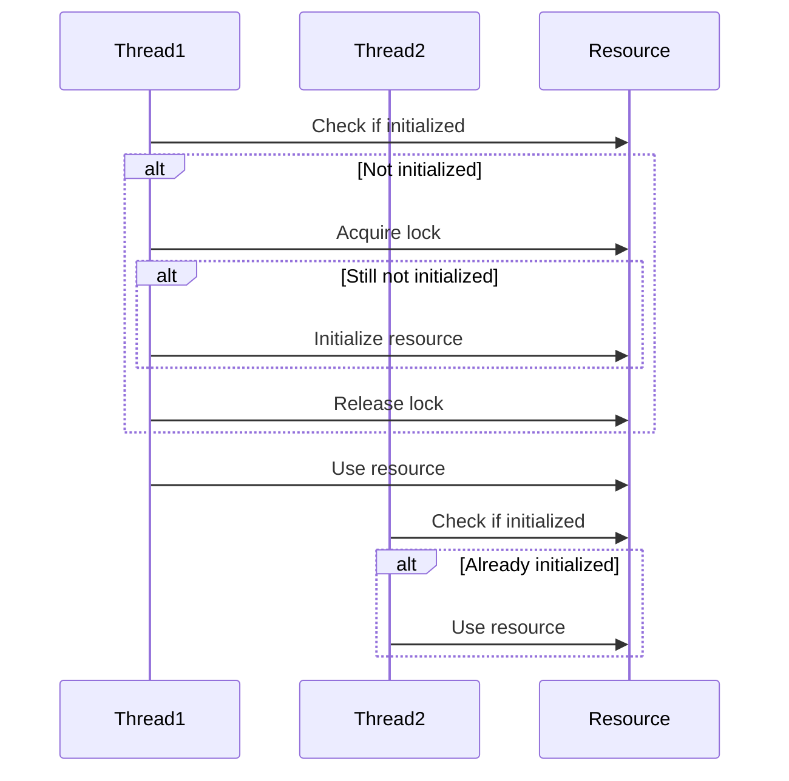
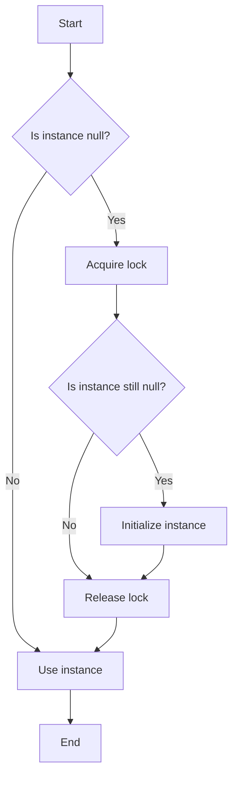

## 9.10 Double-Checked Locking Pattern

Concurrency is a critical aspect of modern software development, especially in a multi-threaded environment where resources are shared among different threads. The Double-Checked Locking Pattern is a widely used concurrency pattern that aims to reduce the overhead of acquiring a lock by first testing the locking criterion (the "double-check") without actually acquiring the lock. This pattern is particularly useful in the context of lazy initialization of resources, such as the Singleton design pattern.

### Design Pattern Name

**Double-Checked Locking Pattern**

### Category

Concurrency Patterns

### Intent

The primary intent of the Double-Checked Locking Pattern is to minimize the performance cost associated with acquiring locks by first checking the locking condition without locking. This pattern is often used to ensure that a resource is initialized only once and is thread-safe, without incurring the overhead of locking every time the resource is accessed.

### Diagrams

To better understand the Double-Checked Locking Pattern, let's visualize its workflow using a sequence diagram.



**Diagram Description:** This sequence diagram illustrates two threads attempting to access a shared resource. Thread1 checks if the resource is initialized, acquires a lock, and initializes it if necessary. Thread2 checks if the resource is initialized and uses it directly if it is.

### Key Participants

- **Resource:** The shared resource that needs to be initialized in a thread-safe manner.
- **Lock:** A synchronization mechanism used to ensure that only one thread can initialize the resource at a time.
- **Threads:** Multiple threads that attempt to access the shared resource.

### Applicability

The Double-Checked Locking Pattern is applicable in scenarios where:

- You need to ensure that a resource is initialized only once.
- The resource initialization is costly, and you want to avoid unnecessary locking overhead.
- You are working in a multi-threaded environment where performance is a concern.

### Sample Code Snippet

Let's explore a practical implementation of the Double-Checked Locking Pattern in C# using the Singleton design pattern as an example.

```csharp
public class Singleton
{
    private static Singleton _instance;
    private static readonly object _lock = new object();

    // Private constructor to prevent instantiation
    private Singleton() { }

    public static Singleton Instance
    {
        get
        {
            // First check without locking
            if (_instance == null)
            {
                lock (_lock)
                {
                    // Double-check with locking
                    if (_instance == null)
                    {
                        _instance = new Singleton();
                    }
                }
            }
            return _instance;
        }
    }
}
```

**Code Explanation:**

- **_instance:** A private static variable that holds the singleton instance.
- **_lock:** A private static readonly object used for locking.
- **Instance Property:** Provides access to the singleton instance. It first checks if the instance is null without locking. If it is null, it acquires a lock and performs a second check before initializing the instance.

### Design Considerations

When implementing the Double-Checked Locking Pattern, consider the following:

- **Volatile Keyword:** In some languages, the `volatile` keyword is used to prevent compiler optimizations that could lead to incorrect behavior. In C#, the `volatile` keyword is not needed for reference types, but it is crucial to understand its role in other languages.
- **Memory Barriers:** Ensure that memory barriers are in place to prevent reordering of instructions, which can lead to incorrect initialization.
- **Performance:** While the pattern reduces locking overhead, it introduces complexity. Ensure that the performance benefits outweigh the added complexity.

### Differences and Similarities

The Double-Checked Locking Pattern is often confused with other synchronization patterns. Here are some key differences and similarities:

- **Singleton Pattern:** The Double-Checked Locking Pattern is commonly used in the Singleton pattern to ensure thread-safe lazy initialization.
- **Lazy Initialization:** Both patterns aim to delay the initialization of a resource until it is needed, but the Double-Checked Locking Pattern adds thread safety.
- **Locking Mechanisms:** Unlike simple locking mechanisms that acquire a lock every time, the Double-Checked Locking Pattern minimizes locking by performing an initial check without locking.

### Try It Yourself

Experiment with the provided code by:

- Removing the lock and observing the behavior in a multi-threaded environment.
- Adding logging statements to track the initialization process.
- Modifying the code to use a different synchronization mechanism, such as `Monitor` or `Mutex`.

### Visualizing the Double-Checked Locking Pattern

Let's visualize the Double-Checked Locking Pattern using a flowchart to better understand its decision-making process.



**Flowchart Description:** This flowchart illustrates the decision-making process of the Double-Checked Locking Pattern. It starts by checking if the instance is null, acquires a lock if necessary, performs a second check, initializes the instance if needed, and finally uses the instance.

### References and Links

- [MSDN: Threading in C#](https://docs.microsoft.com/en-us/dotnet/csharp/programming-guide/concepts/threading/)
- [Wikipedia: Double-Checked Locking](https://en.wikipedia.org/wiki/Double-checked_locking)
- [C# Singleton Pattern](https://www.c-sharpcorner.com/article/singleton-design-pattern-in-c-sharp/)

### Knowledge Check

- Explain the primary intent of the Double-Checked Locking Pattern.
- Describe the role of the `lock` keyword in the pattern.
- Discuss the potential pitfalls of using the Double-Checked Locking Pattern.

### Embrace the Journey

Remember, mastering concurrency patterns like Double-Checked Locking is a journey. As you progress, you'll gain a deeper understanding of thread safety and performance optimization. Keep experimenting, stay curious, and enjoy the journey!

### Quiz Time!



### What is the primary intent of the Double-Checked Locking Pattern?

- [x] To minimize the performance cost associated with acquiring locks
- [ ] To ensure a resource is initialized multiple times
- [ ] To increase the complexity of code
- [ ] To prevent any form of resource initialization

> **Explanation:** The Double-Checked Locking Pattern aims to reduce the overhead of acquiring locks by first testing the locking criterion without actually acquiring the lock.

### In the Double-Checked Locking Pattern, what is the purpose of the initial check without locking?

- [x] To avoid unnecessary locking overhead
- [ ] To ensure the lock is always acquired
- [ ] To initialize the resource immediately
- [ ] To prevent any thread from accessing the resource

> **Explanation:** The initial check without locking is performed to avoid the performance cost of acquiring a lock if the resource is already initialized.

### Which keyword is sometimes used in other languages to prevent compiler optimizations in the Double-Checked Locking Pattern?

- [x] volatile
- [ ] static
- [ ] synchronized
- [ ] transient

> **Explanation:** The `volatile` keyword is used in some languages to prevent compiler optimizations that could lead to incorrect behavior in the Double-Checked Locking Pattern.

### What is a common use case for the Double-Checked Locking Pattern?

- [x] Singleton pattern for thread-safe lazy initialization
- [ ] Implementing a complex algorithm
- [ ] Ensuring multiple initializations of a resource
- [ ] Preventing any form of locking

> **Explanation:** The Double-Checked Locking Pattern is commonly used in the Singleton pattern to ensure thread-safe lazy initialization.

### What is a potential pitfall of the Double-Checked Locking Pattern?

- [x] Complexity and potential for incorrect implementation
- [ ] Guaranteed performance improvement
- [ ] Simplicity and ease of use
- [ ] Lack of thread safety

> **Explanation:** The Double-Checked Locking Pattern introduces complexity and can be incorrectly implemented, leading to potential issues.

### How does the Double-Checked Locking Pattern differ from simple locking mechanisms?

- [x] It minimizes locking by performing an initial check without locking
- [ ] It always acquires a lock
- [ ] It never acquires a lock
- [ ] It increases the number of locks

> **Explanation:** Unlike simple locking mechanisms that acquire a lock every time, the Double-Checked Locking Pattern minimizes locking by performing an initial check without locking.

### What is the role of the `lock` keyword in the Double-Checked Locking Pattern?

- [x] To ensure that only one thread can initialize the resource at a time
- [ ] To prevent any thread from accessing the resource
- [ ] To initialize the resource multiple times
- [ ] To increase the complexity of the code

> **Explanation:** The `lock` keyword is used to ensure that only one thread can initialize the resource at a time, providing thread safety.

### What should you consider when implementing the Double-Checked Locking Pattern?

- [x] Memory barriers and performance benefits
- [ ] Avoiding any form of locking
- [ ] Ensuring multiple initializations
- [ ] Increasing code complexity

> **Explanation:** When implementing the Double-Checked Locking Pattern, consider memory barriers to prevent instruction reordering and ensure that the performance benefits outweigh the added complexity.

### What is the purpose of the second check with locking in the Double-Checked Locking Pattern?

- [x] To ensure the resource is still uninitialized before initializing it
- [ ] To initialize the resource immediately
- [ ] To prevent any thread from accessing the resource
- [ ] To increase the complexity of the code

> **Explanation:** The second check with locking ensures that the resource is still uninitialized before initializing it, providing thread safety.

### True or False: The Double-Checked Locking Pattern is only applicable in single-threaded environments.

- [ ] True
- [x] False

> **Explanation:** The Double-Checked Locking Pattern is specifically designed for multi-threaded environments to ensure thread-safe lazy initialization.




