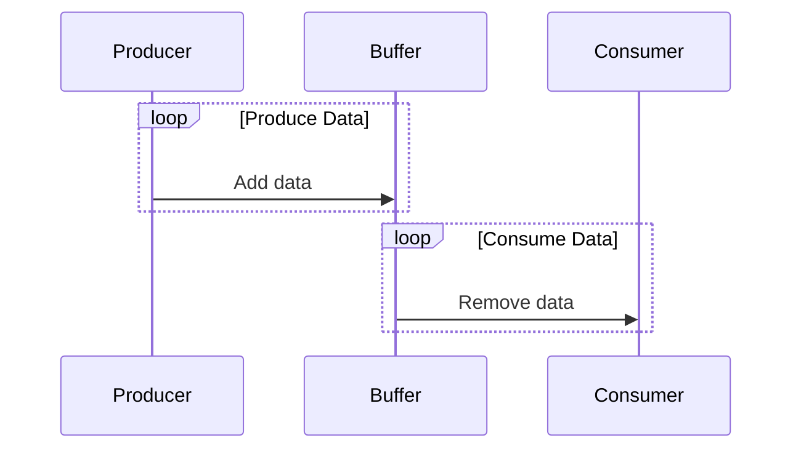

## 9.11 Producer-Consumer Pattern

Concurrency is a critical aspect of modern software development, especially in applications that require high performance and responsiveness. The Producer-Consumer pattern is a classic concurrency design pattern that helps manage the flow of data between two entities: producers and consumers. In this section, we will explore the Producer-Consumer pattern in C#, its implementation, and its significance in building efficient and scalable applications.

### Design Pattern Name

**Producer-Consumer Pattern**

### Category

Concurrency Patterns

### Intent

The Producer-Consumer pattern aims to decouple the production of data from its consumption, allowing both processes to operate independently and concurrently. This pattern is particularly useful in scenarios where the rate of data production and consumption varies, enabling efficient resource utilization and improved application performance.

### Key Participants

- **Producer**: The entity responsible for generating data or tasks.
- **Consumer**: The entity responsible for processing data or tasks.
- **Buffer**: A shared resource that holds data produced by the producer until it is consumed by the consumer. This can be implemented using various data structures such as queues or stacks.

### Applicability

Use the Producer-Consumer pattern when:

- You need to manage the flow of data between two asynchronous processes.
- The rate of data production and consumption is unpredictable or varies over time.
- You want to improve application responsiveness and resource utilization.
- You need to decouple the production and consumption logic for better maintainability.

### Sample Code Snippet

Let's dive into a practical implementation of the Producer-Consumer pattern in C#. We'll use a `BlockingCollection<T>` to manage the buffer, which provides thread-safe operations for adding and removing items.

```csharp
using System;
using System.Collections.Concurrent;
using System.Threading;
using System.Threading.Tasks;

class ProducerConsumerExample
{
    private static BlockingCollection<int> _buffer = new BlockingCollection<int>(boundedCapacity: 10);

    static void Main()
    {
        // Start the producer and consumer tasks
        Task producerTask = Task.Run(() => Producer());
        Task consumerTask = Task.Run(() => Consumer());

        // Wait for both tasks to complete
        Task.WaitAll(producerTask, consumerTask);
    }

    static void Producer()
    {
        for (int i = 0; i < 20; i++)
        {
            // Simulate data production
            Thread.Sleep(100);
            _buffer.Add(i);
            Console.WriteLine($"Produced: {i}");
        }
        _buffer.CompleteAdding();
    }

    static void Consumer()
    {
        foreach (var item in _buffer.GetConsumingEnumerable())
        {
            // Simulate data consumption
            Thread.Sleep(150);
            Console.WriteLine($"Consumed: {item}");
        }
    }
}
```

### Design Considerations

- **Thread Safety**: Ensure that the buffer is thread-safe to prevent race conditions and data corruption. Using `BlockingCollection<T>` is a common approach in C#.
- **Bounded vs. Unbounded Buffers**: Decide whether to use a bounded or unbounded buffer based on your application's requirements. A bounded buffer can prevent memory overflow but may lead to blocking if the buffer is full.
- **Error Handling**: Implement robust error handling to manage exceptions that may occur during data production or consumption.
- **Performance**: Monitor and optimize the performance of your producer and consumer tasks to ensure they operate efficiently.

### Differences and Similarities

The Producer-Consumer pattern is often compared to other concurrency patterns such as the **Pipeline** and **Observer** patterns. While all these patterns deal with data flow and concurrency, the Producer-Consumer pattern specifically focuses on decoupling the production and consumption processes, whereas the Pipeline pattern emphasizes sequential processing stages, and the Observer pattern deals with event-driven data propagation.

### Visualizing the Producer-Consumer Pattern

To better understand the Producer-Consumer pattern, let's visualize the interaction between producers, consumers, and the buffer using a sequence diagram.



**Diagram Description**: This sequence diagram illustrates the interaction between the producer, buffer, and consumer. The producer continuously adds data to the buffer, while the consumer removes data from the buffer for processing.

### Try It Yourself

Experiment with the provided code example by modifying the following aspects:

- Change the `boundedCapacity` of the `BlockingCollection` to observe how it affects the producer and consumer behavior.
- Introduce multiple producers and consumers to simulate a more complex scenario.
- Adjust the `Thread.Sleep` durations to see how varying production and consumption rates impact the system.

### Knowledge Check

- Explain the role of the buffer in the Producer-Consumer pattern.
- What are the benefits of using a bounded buffer?
- How does the Producer-Consumer pattern improve application responsiveness?

### Embrace the Journey

Remember, mastering concurrency patterns like the Producer-Consumer pattern is a journey. As you experiment with different implementations and scenarios, you'll gain a deeper understanding of how to build efficient and scalable applications. Keep exploring, stay curious, and enjoy the process!

### References and Links

- [BlockingCollection<T> Class - Microsoft Docs](https://docs.microsoft.com/en-us/dotnet/api/system.collections.concurrent.blockingcollection-1)
- [Concurrency in C# - Microsoft Docs](https://docs.microsoft.com/en-us/dotnet/csharp/programming-guide/concepts/concurrency/)

## Quiz Time!



### What is the primary purpose of the Producer-Consumer pattern?

- [x] To decouple the production and consumption of data
- [ ] To ensure data is processed in a specific order
- [ ] To manage memory allocation
- [ ] To handle user input

> **Explanation:** The Producer-Consumer pattern is designed to decouple the production and consumption of data, allowing both processes to operate independently.

### Which C# class is commonly used to implement the buffer in the Producer-Consumer pattern?

- [x] BlockingCollection<T>
- [ ] List<T>
- [ ] Dictionary<TKey, TValue>
- [ ] Array<T>

> **Explanation:** `BlockingCollection<T>` is a thread-safe collection class commonly used to implement the buffer in the Producer-Consumer pattern.

### What is a key benefit of using a bounded buffer?

- [x] It prevents memory overflow
- [ ] It speeds up data processing
- [ ] It simplifies code maintenance
- [ ] It enhances user interface design

> **Explanation:** A bounded buffer prevents memory overflow by limiting the number of items it can hold, which can help manage resource usage.

### How can you simulate varying production and consumption rates in the provided code example?

- [x] By adjusting the Thread.Sleep durations
- [ ] By changing the data type of the buffer
- [ ] By modifying the buffer's capacity
- [ ] By altering the number of tasks

> **Explanation:** Adjusting the `Thread.Sleep` durations in the producer and consumer methods can simulate varying production and consumption rates.

### What is the role of the consumer in the Producer-Consumer pattern?

- [x] To process data or tasks
- [ ] To generate data or tasks
- [ ] To manage the buffer
- [ ] To handle exceptions

> **Explanation:** The consumer is responsible for processing data or tasks that have been produced and stored in the buffer.

### What is the main advantage of decoupling production and consumption processes?

- [x] Improved application responsiveness
- [ ] Simplified code structure
- [ ] Enhanced user experience
- [ ] Reduced memory usage

> **Explanation:** Decoupling production and consumption processes can improve application responsiveness by allowing both processes to operate independently.

### Which pattern is often compared to the Producer-Consumer pattern?

- [x] Pipeline pattern
- [ ] Singleton pattern
- [ ] Factory pattern
- [ ] Adapter pattern

> **Explanation:** The Pipeline pattern is often compared to the Producer-Consumer pattern as both deal with data flow and concurrency.

### What should you consider when implementing error handling in the Producer-Consumer pattern?

- [x] Robust error handling to manage exceptions
- [ ] Simplifying the buffer implementation
- [ ] Increasing the number of consumers
- [ ] Reducing the buffer capacity

> **Explanation:** Implementing robust error handling is crucial to manage exceptions that may occur during data production or consumption.

### True or False: The Producer-Consumer pattern is only applicable in multithreaded applications.

- [x] True
- [ ] False

> **Explanation:** The Producer-Consumer pattern is primarily used in multithreaded applications to manage concurrent data production and consumption.

### What is a common pitfall when using an unbounded buffer?

- [x] Memory overflow
- [ ] Data corruption
- [ ] Increased processing speed
- [ ] Simplified error handling

> **Explanation:** An unbounded buffer can lead to memory overflow if the rate of data production exceeds the rate of consumption.




