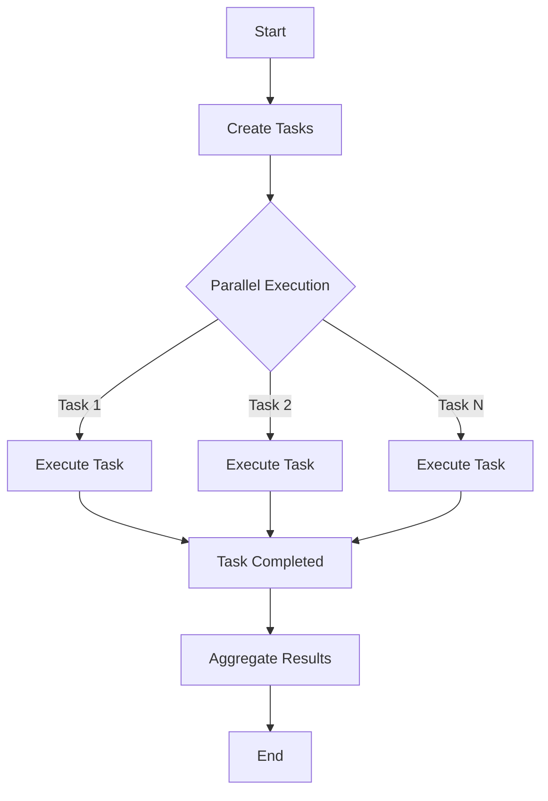

## 9.2 Task Parallel Library (TPL)

The Task Parallel Library (TPL) is a powerful framework in C# that simplifies parallel programming by providing a higher-level abstraction over traditional threading mechanisms. It is designed to efficiently utilize multi-core processors, allowing developers to write scalable and responsive applications. In this section, we will delve into the core concepts of TPL, explore its features, and demonstrate how to implement parallelism effectively.

### Introduction to Task Parallel Library (TPL)

The Task Parallel Library (TPL) is part of the .NET Framework, introduced in .NET 4.0, to facilitate parallel programming. It abstracts the complexities of thread management, enabling developers to focus on the logic of parallel tasks rather than the intricacies of thread synchronization and scheduling.

#### Key Features of TPL

- **Task-Based Programming Model**: TPL introduces the `Task` class, which represents an asynchronous operation. Tasks can be created, started, and managed easily.
- **Parallel Loops**: TPL provides `Parallel.For` and `Parallel.ForEach` for parallel execution of loops, enhancing performance for CPU-bound operations.
- **Parallel LINQ (PLINQ)**: PLINQ extends LINQ to support parallel query execution, optimizing data processing tasks.
- **Task Schedulers**: TPL includes task schedulers that manage the execution of tasks, allowing for custom scheduling policies.
- **Cancellation and Continuation**: TPL supports task cancellation and continuation, enabling developers to build responsive applications.

### Implementing Parallelism with TPL

#### Using `Parallel.For` and `Parallel.ForEach`

The `Parallel.For` and `Parallel.ForEach` methods are designed to execute iterations of a loop in parallel, distributing the workload across multiple threads.

##### Example: Using `Parallel.For`

```csharp
using System;
using System.Threading.Tasks;

class Program
{
    static void Main()
    {
        // Define the range for the loop
        int start = 0;
        int end = 100;

        // Execute the loop in parallel
        Parallel.For(start, end, i =>
        {
            Console.WriteLine($"Processing item {i} on thread {Task.CurrentId}");
        });

        Console.WriteLine("Parallel.For loop completed.");
    }
}
```

In this example, the `Parallel.For` method divides the loop iterations among available threads, improving performance for CPU-bound tasks.

##### Example: Using `Parallel.ForEach`

```csharp
using System;
using System.Collections.Generic;
using System.Threading.Tasks;

class Program
{
    static void Main()
    {
        // Create a list of items to process
        List<int> items = new List<int> { 1, 2, 3, 4, 5 };

        // Execute the loop in parallel
        Parallel.ForEach(items, item =>
        {
            Console.WriteLine($"Processing item {item} on thread {Task.CurrentId}");
        });

        Console.WriteLine("Parallel.ForEach loop completed.");
    }
}
```

The `Parallel.ForEach` method is similar to `Parallel.For`, but it operates on collections, making it ideal for processing lists, arrays, and other enumerable data structures.

#### Utilizing Parallel LINQ (PLINQ) for Data Processing

Parallel LINQ (PLINQ) extends LINQ by enabling parallel query execution. It automatically partitions the data source and processes the partitions concurrently.

##### Example: Using PLINQ

```csharp
using System;
using System.Linq;

class Program
{
    static void Main()
    {
        // Create a large data set
        int[] numbers = Enumerable.Range(1, 1000000).ToArray();

        // Process the data in parallel using PLINQ
        var evenNumbers = numbers.AsParallel()
                                 .Where(n => n % 2 == 0)
                                 .ToArray();

        Console.WriteLine($"Found {evenNumbers.Length} even numbers.");
    }
}
```

In this example, PLINQ processes the array of numbers in parallel, filtering out even numbers efficiently.

### Managing Concurrency

Concurrency management is crucial when working with parallel programming to ensure thread safety and avoid race conditions.

#### Synchronization Contexts and Thread Safety

Synchronization contexts provide a mechanism to manage the execution context of tasks, ensuring that operations are performed in a thread-safe manner.

##### Example: Using `lock` for Thread Safety

```csharp
using System;
using System.Threading;
using System.Threading.Tasks;

class Program
{
    static int counter = 0;
    static object lockObject = new object();

    static void Main()
    {
        // Execute tasks in parallel
        Parallel.For(0, 1000, i =>
        {
            // Ensure thread safety using lock
            lock (lockObject)
            {
                counter++;
            }
        });

        Console.WriteLine($"Counter value: {counter}");
    }
}
```

In this example, the `lock` statement ensures that only one thread can increment the counter at a time, preventing race conditions.

#### Handling Shared Resources Appropriately

When multiple tasks access shared resources, it's essential to manage access to prevent data corruption.

##### Example: Using `ConcurrentDictionary`

```csharp
using System;
using System.Collections.Concurrent;
using System.Threading.Tasks;

class Program
{
    static void Main()
    {
        // Create a concurrent dictionary
        ConcurrentDictionary<int, int> dictionary = new ConcurrentDictionary<int, int>();

        // Execute tasks in parallel
        Parallel.For(0, 1000, i =>
        {
            // Safely add items to the dictionary
            dictionary.TryAdd(i, i * i);
        });

        Console.WriteLine($"Dictionary contains {dictionary.Count} items.");
    }
}
```

The `ConcurrentDictionary` class provides a thread-safe collection for managing shared resources in parallel tasks.

### Use Cases and Examples

#### CPU-Bound Operations

TPL is particularly effective for CPU-bound operations, where tasks can be distributed across multiple cores to enhance performance.

##### Example: Calculating Factorials in Parallel

```csharp
using System;
using System.Numerics;
using System.Threading.Tasks;

class Program
{
    static void Main()
    {
        int[] numbers = { 10, 20, 30, 40, 50 };

        // Calculate factorials in parallel
        Parallel.ForEach(numbers, number =>
        {
            BigInteger factorial = CalculateFactorial(number);
            Console.WriteLine($"Factorial of {number} is {factorial}");
        });
    }

    static BigInteger CalculateFactorial(int number)
    {
        BigInteger result = 1;
        for (int i = 1; i <= number; i++)
        {
            result *= i;
        }
        return result;
    }
}
```

In this example, the factorial of each number is calculated in parallel, leveraging multiple cores for improved performance.

#### Processing Large Data Sets in Parallel

TPL can significantly reduce processing time for large data sets by distributing the workload across multiple threads.

##### Example: Image Processing with TPL

```csharp
using System;
using System.Drawing;
using System.Threading.Tasks;

class Program
{
    static void Main()
    {
        string[] imageFiles = { "image1.jpg", "image2.jpg", "image3.jpg" };

        // Process images in parallel
        Parallel.ForEach(imageFiles, file =>
        {
            using (Bitmap bitmap = new Bitmap(file))
            {
                // Apply a grayscale filter
                for (int y = 0; y < bitmap.Height; y++)
                {
                    for (int x = 0; x < bitmap.Width; x++)
                    {
                        Color pixel = bitmap.GetPixel(x, y);
                        int gray = (int)(pixel.R * 0.3 + pixel.G * 0.59 + pixel.B * 0.11);
                        Color grayColor = Color.FromArgb(gray, gray, gray);
                        bitmap.SetPixel(x, y, grayColor);
                    }
                }
                bitmap.Save($"grayscale_{file}");
            }
        });

        Console.WriteLine("Image processing completed.");
    }
}
```

In this example, images are processed in parallel, applying a grayscale filter to each image concurrently.

### Visualizing Task Parallel Library (TPL)

To better understand how TPL manages tasks and parallel execution, let's visualize the process using a flowchart.



**Figure 1: Visualizing Task Parallel Library (TPL) Execution Flow**

This flowchart illustrates the process of creating tasks, executing them in parallel, and aggregating the results.

### Best Practices for Using TPL

- **Avoid Over-Parallelization**: Creating too many tasks can lead to overhead and reduced performance. Balance the number of tasks with available resources.
- **Use Cancellation Tokens**: Implement cancellation tokens to allow graceful termination of tasks when necessary.
- **Monitor Performance**: Use profiling tools to monitor the performance of parallel tasks and identify bottlenecks.
- **Handle Exceptions**: Use try-catch blocks within tasks to handle exceptions and ensure robust error handling.

### Try It Yourself

Experiment with the code examples provided in this section. Try modifying the range of numbers in the `Parallel.For` example or adding more complex operations to the image processing example. Observe how changes impact performance and behavior.

### Knowledge Check

- What is the primary purpose of the Task Parallel Library (TPL)?
- How does `Parallel.ForEach` differ from a traditional `foreach` loop?
- What are some common use cases for TPL in real-world applications?
- How can you ensure thread safety when accessing shared resources in parallel tasks?

### Conclusion

The Task Parallel Library (TPL) is a powerful tool for simplifying parallel programming in C#. By leveraging TPL, developers can efficiently utilize multi-core processors, manage concurrency, and build responsive applications. As you continue to explore TPL, remember to experiment with different scenarios and apply best practices to optimize performance.

## Quiz Time!



### What is the primary purpose of the Task Parallel Library (TPL)?

- [x] To simplify parallel programming by abstracting thread management.
- [ ] To replace all traditional threading mechanisms.
- [ ] To provide a GUI framework for C# applications.
- [ ] To handle database connections in parallel.

> **Explanation:** The Task Parallel Library (TPL) simplifies parallel programming by providing a higher-level abstraction over traditional threading mechanisms, allowing developers to focus on the logic of parallel tasks.

### How does `Parallel.ForEach` differ from a traditional `foreach` loop?

- [x] It executes iterations in parallel, distributing workload across multiple threads.
- [ ] It only works with arrays, not other collections.
- [ ] It requires a specific number of iterations to function.
- [ ] It is slower than a traditional `foreach` loop.

> **Explanation:** `Parallel.ForEach` executes iterations in parallel, distributing the workload across multiple threads, which can enhance performance for CPU-bound tasks.

### What is PLINQ?

- [x] Parallel LINQ, which extends LINQ to support parallel query execution.
- [ ] A new version of LINQ for database operations.
- [ ] A library for handling network requests in parallel.
- [ ] A GUI toolkit for C# applications.

> **Explanation:** PLINQ (Parallel LINQ) extends LINQ by enabling parallel query execution, optimizing data processing tasks.

### Which class provides a thread-safe collection for managing shared resources in parallel tasks?

- [x] ConcurrentDictionary
- [ ] Dictionary
- [ ] List
- [ ] Hashtable

> **Explanation:** The `ConcurrentDictionary` class provides a thread-safe collection for managing shared resources in parallel tasks.

### What is a common use case for TPL?

- [x] CPU-bound operations
- [ ] GUI design
- [ ] Database schema design
- [ ] File I/O operations

> **Explanation:** TPL is particularly effective for CPU-bound operations, where tasks can be distributed across multiple cores to enhance performance.

### What should you use to allow graceful termination of tasks?

- [x] Cancellation tokens
- [ ] Exception handling
- [ ] Thread.Sleep
- [ ] Task.Delay

> **Explanation:** Implementing cancellation tokens allows for the graceful termination of tasks when necessary.

### What is a potential downside of creating too many tasks?

- [x] Overhead and reduced performance
- [ ] Increased memory usage
- [ ] Improved performance
- [ ] Simplified code

> **Explanation:** Creating too many tasks can lead to overhead and reduced performance, as the system may spend more time managing tasks than executing them.

### How can you handle exceptions within tasks?

- [x] Use try-catch blocks within tasks
- [ ] Ignore exceptions
- [ ] Use global exception handlers
- [ ] Use `Task.Wait()`

> **Explanation:** Using try-catch blocks within tasks ensures robust error handling and prevents unhandled exceptions from crashing the application.

### What is the role of task schedulers in TPL?

- [x] They manage the execution of tasks, allowing for custom scheduling policies.
- [ ] They replace the need for task creation.
- [ ] They handle database connections.
- [ ] They provide a GUI for task management.

> **Explanation:** Task schedulers in TPL manage the execution of tasks, allowing for custom scheduling policies and efficient resource utilization.

### True or False: TPL can only be used for CPU-bound operations.

- [ ] True
- [x] False

> **Explanation:** While TPL is particularly effective for CPU-bound operations, it can also be used for I/O-bound tasks and other parallel processing scenarios.


