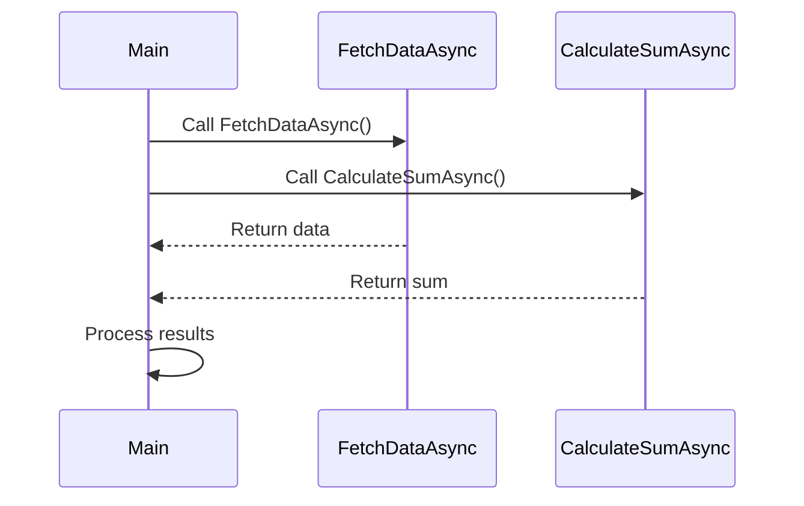

## 9.3 Asynchronous Programming Patterns

In the modern software development landscape, asynchronous programming has become a cornerstone for building responsive and efficient applications. Asynchronous programming patterns in C# allow developers to perform non-blocking operations, enabling applications to remain responsive while performing time-consuming tasks. This section delves into various asynchronous programming patterns in C#, including the `async/await` pattern, Task-Based Asynchronous Pattern (TAP), Async Method Invocation, error handling, and techniques for cancellation and progress reporting.

### Strategies for Non-Blocking Operations

Asynchronous programming is essential for applications that require high responsiveness, such as UI applications, web services, and real-time systems. By leveraging asynchronous patterns, developers can execute long-running operations without freezing the application, thus enhancing user experience and system performance.

### Async/Await Pattern

The `async/await` pattern is a powerful feature in C# that simplifies writing asynchronous code. It allows developers to write asynchronous code that looks similar to synchronous code, making it easier to read and maintain.

#### Simplifying Asynchronous Code with `async` and `await`

The `async` keyword is used to define an asynchronous method, while the `await` keyword is used to pause the execution of the method until the awaited task completes. Here's a simple example:

```csharp
public async Task<string> FetchDataAsync()
{
    HttpClient client = new HttpClient();
    // The await keyword pauses the method execution until the task is complete
    string data = await client.GetStringAsync("https://example.com/data");
    return data;
}
```

In this example, `FetchDataAsync` is an asynchronous method that fetches data from a URL. The `await` keyword ensures that the method waits for the `GetStringAsync` task to complete before proceeding.

#### Understanding the Async State Machine

When a method is marked with `async`, the C# compiler transforms it into a state machine. This state machine handles the suspension and resumption of the method, allowing it to be paused and resumed as tasks complete. This transformation is transparent to the developer, but understanding it can help in debugging and optimizing asynchronous code.

### Task-Based Asynchronous Pattern (TAP)

The Task-Based Asynchronous Pattern (TAP) is the recommended pattern for asynchronous programming in .NET. It uses the `Task` and `Task<T>` types to represent asynchronous operations.

#### Working with `Task` and `Task<T>`

The `Task` class represents an asynchronous operation that does not return a value, while `Task<T>` represents an operation that returns a value of type `T`. Here's an example of using `Task` and `Task<T>`:

```csharp
public Task PerformOperationAsync()
{
    return Task.Run(() =>
    {
        // Perform a time-consuming operation
        Thread.Sleep(2000);
    });
}

public Task<int> CalculateSumAsync(int a, int b)
{
    return Task.Run(() =>
    {
        // Simulate a calculation
        Thread.Sleep(1000);
        return a + b;
    });
}
```

In these examples, `PerformOperationAsync` returns a `Task`, while `CalculateSumAsync` returns a `Task<int>`.

#### Converting Older Asynchronous Patterns to TAP

Older asynchronous patterns, such as the Asynchronous Programming Model (APM) and Event-based Asynchronous Pattern (EAP), can be converted to TAP for consistency and ease of use. This involves wrapping the older patterns in `Task` objects. Here's an example of converting an APM method to TAP:

```csharp
public Task<int> ReadFileAsync(string filePath)
{
    FileStream fs = new FileStream(filePath, FileMode.Open, FileAccess.Read, FileShare.Read, 4096, true);
    byte[] buffer = new byte[fs.Length];
    return Task<int>.Factory.FromAsync(fs.BeginRead, fs.EndRead, buffer, 0, buffer.Length, null);
}
```

### Async Method Invocation Pattern

The Async Method Invocation Pattern involves implementing asynchronous method calls to perform non-blocking operations. This pattern is particularly useful in scenarios where multiple asynchronous operations need to be initiated and managed concurrently.

#### Implementing Asynchronous Method Calls

Asynchronous method calls can be implemented using the `Task` class and the `async/await` pattern. Here's an example of invoking multiple asynchronous methods:

```csharp
public async Task ProcessDataAsync()
{
    Task<string> fetchDataTask = FetchDataAsync();
    Task<int> calculateTask = CalculateSumAsync(5, 10);

    // Await both tasks
    string data = await fetchDataTask;
    int sum = await calculateTask;

    Console.WriteLine($"Data: {data}, Sum: {sum}");
}
```

In this example, `ProcessDataAsync` initiates two asynchronous operations and waits for both to complete.

### Error Handling in Async Methods

Error handling in asynchronous methods is crucial for building robust applications. Exceptions in asynchronous methods are propagated through the `Task` object and can be handled using `try-catch` blocks.

#### Exception Propagation in Asynchronous Code

When an exception occurs in an asynchronous method, it is captured and stored in the `Task` object. The exception is re-thrown when the task is awaited. Here's an example:

```csharp
public async Task HandleErrorsAsync()
{
    try
    {
        await Task.Run(() => throw new InvalidOperationException("An error occurred"));
    }
    catch (InvalidOperationException ex)
    {
        Console.WriteLine($"Caught exception: {ex.Message}");
    }
}
```

In this example, the exception is caught and handled in the `try-catch` block.

#### Best Practices for Robust Error Handling

- **Use `try-catch` blocks**: Always use `try-catch` blocks around `await` statements to handle exceptions.
- **Log exceptions**: Log exceptions for debugging and monitoring purposes.
- **Use `Task.Exception` property**: Access the `Exception` property of a `Task` to inspect exceptions without awaiting the task.

### Cancellation and Progress Reporting

Cancellation and progress reporting are essential features for managing long-running asynchronous operations. They allow users to cancel operations and receive updates on progress.

#### Implementing `CancellationToken`

The `CancellationToken` structure is used to signal cancellation requests to asynchronous operations. Here's an example of using `CancellationToken`:

```csharp
public async Task PerformCancellableOperationAsync(CancellationToken cancellationToken)
{
    for (int i = 0; i < 10; i++)
    {
        // Check for cancellation
        cancellationToken.ThrowIfCancellationRequested();

        // Simulate work
        await Task.Delay(500);
        Console.WriteLine($"Iteration {i}");
    }
}
```

In this example, the operation checks for cancellation requests and throws an exception if cancellation is requested.

#### Reporting Progress with `IProgress<T>`

The `IProgress<T>` interface is used to report progress from asynchronous operations. Here's an example:

```csharp
public async Task DownloadFileAsync(IProgress<int> progress)
{
    for (int i = 0; i <= 100; i += 10)
    {
        // Simulate download
        await Task.Delay(100);
        // Report progress
        progress.Report(i);
    }
}
```

In this example, the `DownloadFileAsync` method reports progress in increments of 10.

### Visualizing Asynchronous Programming Patterns

To better understand the flow of asynchronous programming patterns, let's visualize the process using a sequence diagram.



This diagram illustrates the sequence of asynchronous method calls and the flow of data between them.

### Try It Yourself

Experiment with the code examples provided in this section. Try modifying the `FetchDataAsync` method to fetch data from a different URL or change the delay in `PerformCancellableOperationAsync` to see how it affects cancellation. Implement additional progress reporting in `DownloadFileAsync` to provide more granular updates.

### References and Links

For further reading on asynchronous programming in C#, consider the following resources:

- [Microsoft Docs: Asynchronous Programming with Async and Await](https://docs.microsoft.com/en-us/dotnet/csharp/programming-guide/concepts/async/)
- [Task-Based Asynchronous Pattern (TAP)](https://docs.microsoft.com/en-us/dotnet/standard/asynchronous-programming-patterns/task-based-asynchronous-pattern-tap)
- [Cancellation in Managed Threads](https://docs.microsoft.com/en-us/dotnet/standard/threading/cancellation-in-managed-threads)

### Knowledge Check

- What is the purpose of the `async` keyword in C#?
- How does the `await` keyword affect the execution of an asynchronous method?
- What is the difference between `Task` and `Task<T>`?
- How can older asynchronous patterns be converted to TAP?
- What is the role of `CancellationToken` in asynchronous programming?

### Embrace the Journey

Remember, mastering asynchronous programming patterns in C# is a journey. As you experiment with these patterns, you'll gain a deeper understanding of how to build responsive and efficient applications. Keep exploring, stay curious, and enjoy the process of learning and applying these powerful techniques.

## Quiz Time!



### What is the primary purpose of the `async` keyword in C#?

- [x] To define an asynchronous method
- [ ] To pause the execution of a method
- [ ] To handle exceptions in asynchronous code
- [ ] To report progress in asynchronous operations

> **Explanation:** The `async` keyword is used to define an asynchronous method, allowing it to use the `await` keyword to pause execution until a task completes.

### How does the `await` keyword affect the execution of an asynchronous method?

- [x] It pauses the method execution until the awaited task is complete
- [ ] It converts a synchronous method to asynchronous
- [ ] It handles exceptions in asynchronous code
- [ ] It reports progress in asynchronous operations

> **Explanation:** The `await` keyword pauses the execution of an asynchronous method until the awaited task is complete, allowing the method to resume once the task finishes.

### What is the difference between `Task` and `Task<T>`?

- [x] `Task` represents an asynchronous operation that does not return a value, while `Task<T>` returns a value of type `T`
- [ ] `Task` is used for synchronous operations, while `Task<T>` is for asynchronous operations
- [ ] `Task` handles exceptions, while `Task<T>` reports progress
- [ ] `Task` is for UI operations, while `Task<T>` is for background operations

> **Explanation:** `Task` represents an asynchronous operation that does not return a value, while `Task<T>` represents an operation that returns a value of type `T`.

### How can older asynchronous patterns be converted to TAP?

- [x] By wrapping them in `Task` objects
- [ ] By using `async` and `await` keywords
- [ ] By implementing `IProgress<T>`
- [ ] By using `CancellationToken`

> **Explanation:** Older asynchronous patterns can be converted to TAP by wrapping them in `Task` objects, allowing them to be used consistently with modern asynchronous programming techniques.

### What is the role of `CancellationToken` in asynchronous programming?

- [x] To signal cancellation requests to asynchronous operations
- [ ] To handle exceptions in asynchronous code
- [ ] To report progress in asynchronous operations
- [ ] To convert synchronous methods to asynchronous

> **Explanation:** `CancellationToken` is used to signal cancellation requests to asynchronous operations, allowing them to be cancelled gracefully.

### Which interface is used for reporting progress in asynchronous operations?

- [x] `IProgress<T>`
- [ ] `ICancellationToken`
- [ ] `IAsyncResult`
- [ ] `IAsyncOperation`

> **Explanation:** The `IProgress<T>` interface is used to report progress from asynchronous operations, providing updates to the caller.

### What happens when an exception occurs in an asynchronous method?

- [x] It is captured and stored in the `Task` object
- [ ] It is immediately thrown and stops the application
- [ ] It is ignored and the method continues
- [ ] It is logged automatically

> **Explanation:** When an exception occurs in an asynchronous method, it is captured and stored in the `Task` object, and can be re-thrown when the task is awaited.

### What is the benefit of using `async/await` over older asynchronous patterns?

- [x] It simplifies writing asynchronous code that looks like synchronous code
- [ ] It automatically handles exceptions
- [ ] It provides better performance
- [ ] It is compatible with all .NET versions

> **Explanation:** The `async/await` pattern simplifies writing asynchronous code by making it look like synchronous code, improving readability and maintainability.

### What is the purpose of the `Task.Run` method?

- [x] To execute a method asynchronously on a separate thread
- [ ] To handle exceptions in asynchronous code
- [ ] To report progress in asynchronous operations
- [ ] To convert synchronous methods to asynchronous

> **Explanation:** The `Task.Run` method is used to execute a method asynchronously on a separate thread, allowing for non-blocking operations.

### True or False: The `async` keyword automatically makes a method run on a separate thread.

- [ ] True
- [x] False

> **Explanation:** False. The `async` keyword does not automatically make a method run on a separate thread. It allows the method to use `await` for asynchronous operations, but the method itself runs on the calling thread unless explicitly moved to another thread using `Task.Run` or similar.


