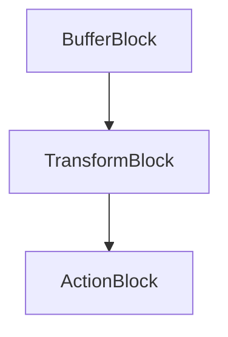

## 9.4 Dataflow and Pipelines

In the ever-evolving landscape of software development, managing data processing workflows efficiently is crucial for building scalable and responsive applications. This section delves into the concepts of Dataflow and Pipelines in C#, focusing on how these patterns can be leveraged to handle concurrency and data processing tasks effectively. We will explore the implementation of pipelines using the Task Parallel Library (TPL) Dataflow, design dataflow networks, and apply the Pipeline Pattern to structure processing in stages.

### Introduction to Dataflow and Pipelines

Dataflow and Pipelines are powerful paradigms for managing data processing workflows. They allow developers to break down complex tasks into smaller, manageable stages, each responsible for a specific part of the processing. This modular approach not only enhances scalability but also improves maintainability and responsiveness.

#### Key Concepts

- **Dataflow**: A programming model that focuses on the flow of data between operations, allowing for concurrent execution of tasks.
- **Pipelines**: A series of processing stages connected by channels, where the output of one stage serves as the input to the next.

### Implementing Pipelines with TPL Dataflow

The Task Parallel Library (TPL) Dataflow is a library in .NET that provides a set of building blocks for creating dataflow networks. It is designed to simplify the development of concurrent applications by abstracting the complexities of threading and synchronization.

#### Core Components of TPL Dataflow

1. **BufferBlock**: A simple block that stores messages and passes them to the next block in the pipeline.
2. **TransformBlock**: A block that processes input messages and produces output messages.
3. **ActionBlock**: A block that performs an action on each message it receives.

#### Designing Dataflow Networks

Designing a dataflow network involves connecting various blocks to form a pipeline. Each block performs a specific task, and the data flows through the network, being transformed or acted upon at each stage.

```csharp
using System;
using System.Threading.Tasks;
using System.Threading.Tasks.Dataflow;

class DataflowExample
{
    static async Task Main()
    {
        // Create a BufferBlock to store incoming data
        var bufferBlock = new BufferBlock<int>();

        // Create a TransformBlock to process data
        var transformBlock = new TransformBlock<int, int>(n => n * 2);

        // Create an ActionBlock to perform an action on the processed data
        var actionBlock = new ActionBlock<int>(n => Console.WriteLine($"Processed: {n}"));

        // Link the blocks to form a pipeline
        bufferBlock.LinkTo(transformBlock);
        transformBlock.LinkTo(actionBlock);

        // Post data to the pipeline
        for (int i = 0; i < 10; i++)
        {
            bufferBlock.Post(i);
        }

        // Signal completion
        bufferBlock.Complete();

        // Wait for the pipeline to process all data
        await actionBlock.Completion;
    }
}
```

In this example, we create a simple dataflow network with three blocks: a `BufferBlock` to store data, a `TransformBlock` to double the data, and an `ActionBlock` to print the processed data. The blocks are linked together to form a pipeline, and data is posted to the `BufferBlock`, flowing through the network until it reaches the `ActionBlock`.

### Pipeline Pattern

The Pipeline Pattern is a design pattern that structures processing in stages, where each stage is responsible for a specific part of the processing. This pattern is particularly useful for building scalable workflows, as it allows for parallel processing of data.

#### Structuring Processing in Stages

Each stage in a pipeline can be implemented as a separate block in a dataflow network. By dividing the processing into stages, we can achieve greater flexibility and scalability.

```csharp
using System;
using System.Threading.Tasks;
using System.Threading.Tasks.Dataflow;

class PipelinePatternExample
{
    static async Task Main()
    {
        // Create a TransformBlock for stage 1
        var stage1 = new TransformBlock<int, int>(n => n + 1);

        // Create a TransformBlock for stage 2
        var stage2 = new TransformBlock<int, int>(n => n * 2);

        // Create an ActionBlock for the final stage
        var finalStage = new ActionBlock<int>(n => Console.WriteLine($"Final Output: {n}"));

        // Link the stages to form a pipeline
        stage1.LinkTo(stage2);
        stage2.LinkTo(finalStage);

        // Post data to the pipeline
        for (int i = 0; i < 10; i++)
        {
            stage1.Post(i);
        }

        // Signal completion
        stage1.Complete();

        // Wait for the pipeline to process all data
        await finalStage.Completion;
    }
}
```

In this example, we implement a pipeline with two processing stages and a final action stage. Each stage performs a specific transformation on the data, and the stages are linked together to form a complete pipeline.

### Use Cases and Examples

Dataflow and Pipelines are versatile patterns that can be applied to a wide range of scenarios. Here are some common use cases:

#### Streaming Data Processing

In streaming data processing, data is continuously generated and needs to be processed in real-time. Pipelines can be used to handle the data as it arrives, ensuring that each piece of data is processed efficiently.

```csharp
using System;
using System.Threading.Tasks;
using System.Threading.Tasks.Dataflow;

class StreamingDataProcessing
{
    static async Task Main()
    {
        var bufferBlock = new BufferBlock<int>();
        var transformBlock = new TransformBlock<int, int>(n => n * 2);
        var actionBlock = new ActionBlock<int>(n => Console.WriteLine($"Processed: {n}"));

        bufferBlock.LinkTo(transformBlock);
        transformBlock.LinkTo(actionBlock);

        // Simulate streaming data
        for (int i = 0; i < 100; i++)
        {
            bufferBlock.Post(i);
            await Task.Delay(100); // Simulate data arrival delay
        }

        bufferBlock.Complete();
        await actionBlock.Completion;
    }
}
```

In this example, we simulate streaming data by posting data to the pipeline at regular intervals. The pipeline processes each piece of data as it arrives, demonstrating how pipelines can be used for real-time data processing.

#### Building Responsive Applications

Responsive applications need to handle user interactions and background tasks concurrently. Pipelines can be used to offload processing tasks to background threads, ensuring that the application remains responsive to user input.

```csharp
using System;
using System.Threading.Tasks;
using System.Threading.Tasks.Dataflow;

class ResponsiveApplication
{
    static async Task Main()
    {
        var bufferBlock = new BufferBlock<int>();
        var transformBlock = new TransformBlock<int, int>(n => n * 2);
        var actionBlock = new ActionBlock<int>(n => Console.WriteLine($"Processed: {n}"));

        bufferBlock.LinkTo(transformBlock);
        transformBlock.LinkTo(actionBlock);

        // Simulate user input
        Task.Run(async () =>
        {
            for (int i = 0; i < 10; i++)
            {
                bufferBlock.Post(i);
                await Task.Delay(500); // Simulate user input delay
            }

            bufferBlock.Complete();
        });

        await actionBlock.Completion;
    }
}
```

In this example, we simulate user input by posting data to the pipeline from a background task. The pipeline processes the data concurrently, allowing the application to remain responsive to user interactions.

### Visualizing Dataflow and Pipelines

To better understand the flow of data through a pipeline, we can use diagrams to visualize the dataflow network. Below is a simple diagram representing a dataflow network with three blocks: a `BufferBlock`, a `TransformBlock`, and an `ActionBlock`.



This diagram illustrates the flow of data from the `BufferBlock` to the `TransformBlock`, and finally to the `ActionBlock`. Each block represents a stage in the pipeline, and the arrows indicate the direction of data flow.

### Design Considerations

When designing dataflow networks and pipelines, there are several important considerations to keep in mind:

- **Concurrency**: Ensure that the pipeline can handle concurrent processing of data. TPL Dataflow provides built-in support for concurrency, but it's important to design the pipeline to take advantage of this feature.
- **Error Handling**: Implement robust error handling to manage exceptions that may occur during processing. TPL Dataflow provides mechanisms for handling errors, such as faulted blocks and completion tasks.
- **Performance**: Optimize the performance of the pipeline by minimizing bottlenecks and ensuring efficient data flow between blocks. Consider using parallel processing techniques to improve throughput.

### Differences and Similarities

Dataflow and Pipelines share similarities with other concurrency patterns, such as the Producer-Consumer pattern. However, there are key differences:

- **Dataflow vs. Producer-Consumer**: While both patterns involve the flow of data between producers and consumers, Dataflow provides a more flexible and scalable approach by allowing for multiple stages of processing and concurrent execution.
- **Pipelines vs. Chain of Responsibility**: Both patterns involve processing data in stages, but Pipelines focus on the flow of data through a series of processing stages, while the Chain of Responsibility pattern focuses on passing a request through a chain of handlers.

### Try It Yourself

To gain a deeper understanding of Dataflow and Pipelines, try modifying the code examples provided in this section. Experiment with different block types, data transformations, and error handling strategies. Consider implementing a more complex dataflow network with multiple stages and parallel processing.

### Knowledge Check

To reinforce your understanding of Dataflow and Pipelines, consider the following questions:

- What are the key components of a dataflow network in TPL Dataflow?
- How can pipelines be used to improve the scalability and responsiveness of an application?
- What are some common use cases for Dataflow and Pipelines?

### Embrace the Journey

Remember, mastering Dataflow and Pipelines is just one step in your journey as a software engineer. As you continue to explore the world of design patterns and concurrency, you'll discover new ways to build scalable and responsive applications. Keep experimenting, stay curious, and enjoy the journey!

## Quiz Time!



### What is the primary purpose of using Dataflow and Pipelines in C#?

- [x] To manage data processing workflows efficiently
- [ ] To simplify user interface design
- [ ] To enhance database connectivity
- [ ] To improve file handling operations

> **Explanation:** Dataflow and Pipelines are used to manage data processing workflows efficiently by breaking down tasks into smaller stages.

### Which component of TPL Dataflow is responsible for storing messages?

- [x] BufferBlock
- [ ] TransformBlock
- [ ] ActionBlock
- [ ] LinkBlock

> **Explanation:** The BufferBlock is responsible for storing messages in a dataflow network.

### What is the role of a TransformBlock in a dataflow network?

- [x] To process input messages and produce output messages
- [ ] To store messages
- [ ] To perform an action on each message
- [ ] To link blocks together

> **Explanation:** A TransformBlock processes input messages and produces output messages in a dataflow network.

### How can pipelines improve the scalability of an application?

- [x] By structuring processing in stages for parallel execution
- [ ] By reducing the number of database connections
- [ ] By simplifying user interface design
- [ ] By minimizing file I/O operations

> **Explanation:** Pipelines improve scalability by structuring processing in stages, allowing for parallel execution of tasks.

### What is a common use case for Dataflow and Pipelines?

- [x] Streaming data processing
- [ ] User interface design
- [ ] Database schema design
- [ ] File encryption

> **Explanation:** Streaming data processing is a common use case for Dataflow and Pipelines, as they handle data efficiently in real-time.

### Which pattern is similar to Pipelines but focuses on passing a request through a chain of handlers?

- [x] Chain of Responsibility
- [ ] Producer-Consumer
- [ ] Singleton
- [ ] Observer

> **Explanation:** The Chain of Responsibility pattern is similar to Pipelines but focuses on passing a request through a chain of handlers.

### What is an important consideration when designing dataflow networks?

- [x] Concurrency
- [ ] User interface aesthetics
- [ ] Database normalization
- [ ] File path management

> **Explanation:** Concurrency is an important consideration when designing dataflow networks to ensure efficient processing.

### How does TPL Dataflow handle errors in a dataflow network?

- [x] Through faulted blocks and completion tasks
- [ ] By ignoring them
- [ ] By logging them to a file
- [ ] By displaying a message box

> **Explanation:** TPL Dataflow handles errors through faulted blocks and completion tasks, allowing for robust error management.

### What is the benefit of using ActionBlock in a dataflow network?

- [x] To perform an action on each message
- [ ] To store messages
- [ ] To transform messages
- [ ] To link blocks together

> **Explanation:** An ActionBlock performs an action on each message it receives in a dataflow network.

### True or False: Dataflow and Pipelines can only be used for batch processing.

- [ ] True
- [x] False

> **Explanation:** False. Dataflow and Pipelines can be used for both batch and real-time processing, making them versatile for various scenarios.


