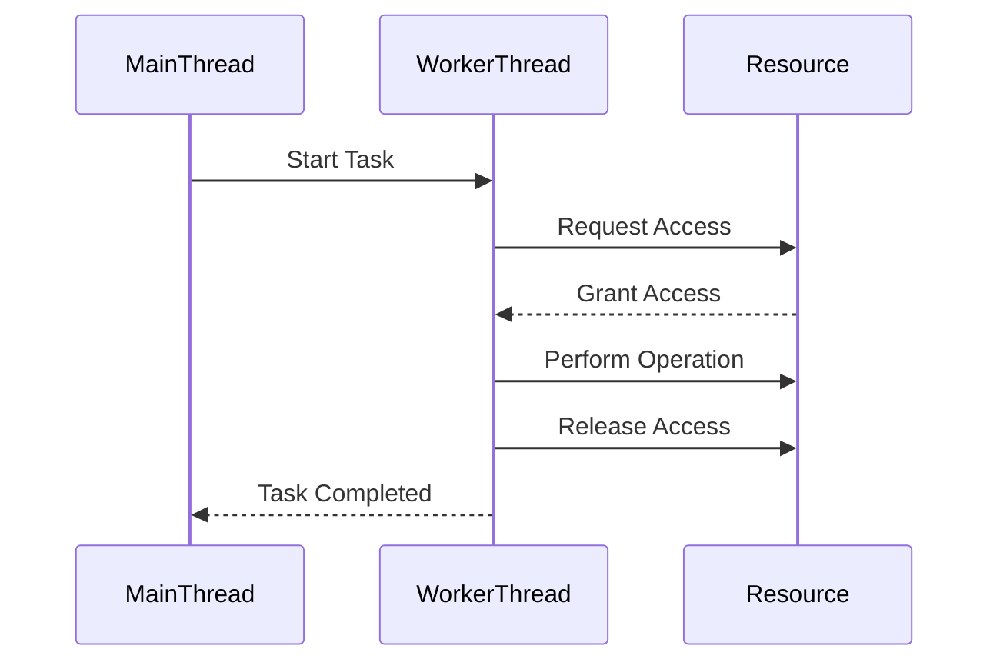

## 9.5 Concurrency Utilities

Concurrency is a cornerstone of modern software development, especially in C#, where applications often need to perform multiple tasks simultaneously to improve performance and responsiveness. In this section, we will delve into the concurrency utilities available in C# that help manage concurrent operations effectively. We will explore synchronization primitives, concurrent collections, and blocking and signaling constructs, providing you with the tools necessary to build robust multithreaded applications.

### Synchronization Primitives

Synchronization primitives are essential tools for managing access to shared resources in a multithreaded environment. They help prevent race conditions and ensure data consistency. Let's explore some of the key synchronization primitives in C#.

#### Using `lock`

The `lock` statement is one of the simplest and most commonly used synchronization primitives in C#. It is used to ensure that a block of code is executed by only one thread at a time.

```csharp
public class Counter
{
    private int _count;
    private readonly object _lockObject = new object();

    public void Increment()
    {
        lock (_lockObject)
        {
            _count++;
        }
    }

    public int GetCount()
    {
        lock (_lockObject)
        {
            return _count;
        }
    }
}
```

In this example, the `lock` statement ensures that the `_count` variable is incremented safely by only one thread at a time.

#### Using `SemaphoreSlim`

`SemaphoreSlim` is a lightweight semaphore used to limit the number of threads that can access a resource concurrently. It is particularly useful when you need to control access to a limited resource.

```csharp
public class ResourcePool
{
    private readonly SemaphoreSlim _semaphore = new SemaphoreSlim(3);

    public async Task UseResourceAsync()
    {
        await _semaphore.WaitAsync();
        try
        {
            // Access the resource
        }
        finally
        {
            _semaphore.Release();
        }
    }
}
```

Here, `SemaphoreSlim` allows up to three threads to access the resource concurrently.

#### Using `Mutex`

A `Mutex` is a synchronization primitive that can be used across processes. It is more heavyweight than `lock` and `SemaphoreSlim`, but it is necessary when you need to synchronize access to resources across multiple applications.

```csharp
public class CrossProcessResource
{
    private readonly Mutex _mutex = new Mutex(false, "Global\\MyMutex");

    public void AccessResource()
    {
        _mutex.WaitOne();
        try
        {
            // Access the resource
        }
        finally
        {
            _mutex.ReleaseMutex();
        }
    }
}
```

In this example, the `Mutex` ensures that only one process can access the resource at a time.

#### Using `Monitor`

The `Monitor` class provides a more flexible synchronization mechanism than `lock`, allowing you to wait for a condition to be met before proceeding.

```csharp
public class SharedResource
{
    private int _resource;
    private readonly object _lockObject = new object();

    public void AccessResource()
    {
        Monitor.Enter(_lockObject);
        try
        {
            // Access the resource
        }
        finally
        {
            Monitor.Exit(_lockObject);
        }
    }
}
```

The `Monitor` class provides methods like `Wait` and `Pulse` for more complex synchronization scenarios.

### When and How to Use Different Primitives

Choosing the right synchronization primitive depends on your specific use case:

- Use `lock` for simple, single-threaded access control within the same process.
- Use `SemaphoreSlim` when you need to limit the number of concurrent accesses to a resource.
- Use `Mutex` for cross-process synchronization.
- Use `Monitor` when you need more control over the synchronization process, such as waiting for conditions.

### Concurrent Collections

Concurrent collections are designed to handle multithreaded scenarios efficiently. They provide thread-safe operations without the need for explicit synchronization.

#### Utilizing `ConcurrentDictionary`

`ConcurrentDictionary` is a thread-safe dictionary implementation that allows concurrent read and write operations.

```csharp
public class Inventory
{
    private readonly ConcurrentDictionary<string, int> _stock = new ConcurrentDictionary<string, int>();

    public void AddOrUpdateStock(string item, int quantity)
    {
        _stock.AddOrUpdate(item, quantity, (key, oldValue) => oldValue + quantity);
    }

    public int GetStock(string item)
    {
        _stock.TryGetValue(item, out int quantity);
        return quantity;
    }
}
```

`ConcurrentDictionary` handles concurrent updates efficiently, making it ideal for scenarios where multiple threads need to update a shared dictionary.

#### Utilizing `ConcurrentQueue`

`ConcurrentQueue` is a thread-safe FIFO (first-in, first-out) collection that allows multiple threads to enqueue and dequeue items concurrently.

```csharp
public class TaskQueue
{
    private readonly ConcurrentQueue<Action> _tasks = new ConcurrentQueue<Action>();

    public void EnqueueTask(Action task)
    {
        _tasks.Enqueue(task);
    }

    public void ProcessTasks()
    {
        while (_tasks.TryDequeue(out Action task))
        {
            task();
        }
    }
}
```

`ConcurrentQueue` is perfect for producer-consumer scenarios where tasks are enqueued by one or more threads and processed by others.

#### Utilizing `ConcurrentBag`

`ConcurrentBag` is a thread-safe, unordered collection designed for scenarios where the order of items is not important.

```csharp
public class Logger
{
    private readonly ConcurrentBag<string> _logMessages = new ConcurrentBag<string>();

    public void Log(string message)
    {
        _logMessages.Add(message);
    }

    public IEnumerable<string> GetLogMessages()
    {
        return _logMessages;
    }
}
```

`ConcurrentBag` is useful when you need to collect items from multiple threads without worrying about the order.

### Benefits Over Traditional Collections in Multithreaded Scenarios

Concurrent collections provide several advantages over traditional collections in multithreaded scenarios:

- **Thread Safety**: They handle synchronization internally, reducing the risk of race conditions.
- **Performance**: They are optimized for concurrent access, often outperforming traditional collections with manual synchronization.
- **Simplicity**: They simplify code by eliminating the need for explicit locks and synchronization logic.

### Blocking and Signaling Constructs

Blocking and signaling constructs are used to coordinate tasks and threads, allowing them to wait for certain conditions or events before proceeding.

#### Implementing `AutoResetEvent`

`AutoResetEvent` is a signaling construct that automatically resets after a single waiting thread is released.

```csharp
public class Worker
{
    private readonly AutoResetEvent _signal = new AutoResetEvent(false);

    public void DoWork()
    {
        Console.WriteLine("Waiting for signal...");
        _signal.WaitOne();
        Console.WriteLine("Signal received, proceeding with work.");
    }

    public void Signal()
    {
        _signal.Set();
    }
}
```

In this example, `AutoResetEvent` is used to signal a worker thread to start processing.

#### Implementing `ManualResetEvent`

`ManualResetEvent` is similar to `AutoResetEvent`, but it remains signaled until it is manually reset.

```csharp
public class Coordinator
{
    private readonly ManualResetEvent _signal = new ManualResetEvent(false);

    public void WaitForSignal()
    {
        Console.WriteLine("Waiting for signal...");
        _signal.WaitOne();
        Console.WriteLine("Signal received, proceeding with work.");
    }

    public void Signal()
    {
        _signal.Set();
    }

    public void ResetSignal()
    {
        _signal.Reset();
    }
}
```

`ManualResetEvent` is useful when you need to release multiple threads simultaneously.

#### Implementing `CountdownEvent`

`CountdownEvent` is a signaling construct that allows threads to wait until a specified number of signals have been received.

```csharp
public class TaskManager
{
    private readonly CountdownEvent _countdown = new CountdownEvent(3);

    public void PerformTask()
    {
        Console.WriteLine("Performing task...");
        _countdown.Signal();
    }

    public void WaitForAllTasks()
    {
        _countdown.Wait();
        Console.WriteLine("All tasks completed.");
    }
}
```

`CountdownEvent` is ideal for scenarios where you need to wait for multiple tasks to complete before proceeding.

### Coordinating Tasks and Threads

Blocking and signaling constructs are essential for coordinating tasks and threads in complex applications. They allow you to:

- **Synchronize**: Ensure that tasks start or complete in a specific order.
- **Coordinate**: Manage dependencies between tasks, ensuring that certain tasks wait for others to complete.
- **Control**: Implement complex workflows where tasks need to be paused and resumed based on external events.

### Visualizing Concurrency Utilities

To better understand how these concurrency utilities work together, let's visualize their interactions using a sequence diagram.



This diagram illustrates a typical interaction where a main thread starts a worker thread, which then requests access to a shared resource, performs an operation, and releases the resource before notifying the main thread of completion.

### Try It Yourself

To deepen your understanding of concurrency utilities, try modifying the code examples provided:

- **Experiment with `SemaphoreSlim`**: Change the number of concurrent accesses allowed and observe the behavior.
- **Modify `ConcurrentDictionary`**: Add more complex operations, such as removing items or iterating over the dictionary.
- **Use `ManualResetEvent`**: Implement a scenario where multiple threads wait for a signal and are released simultaneously.

### Knowledge Check

Before we conclude, let's reinforce what we've learned with some key takeaways:

- **Synchronization Primitives**: Essential for managing access to shared resources and preventing race conditions.
- **Concurrent Collections**: Provide thread-safe operations and improve performance in multithreaded scenarios.
- **Blocking and Signaling Constructs**: Coordinate tasks and threads, allowing for complex workflows and dependencies.

### Embrace the Journey

Remember, mastering concurrency utilities is a journey. As you continue to explore and experiment with these tools, you'll gain a deeper understanding of how to build efficient and robust multithreaded applications. Keep experimenting, stay curious, and enjoy the journey!

## Quiz Time!



### Which synchronization primitive is best for simple, single-threaded access control within the same process?

- [x] lock
- [ ] SemaphoreSlim
- [ ] Mutex
- [ ] Monitor

> **Explanation:** The `lock` statement is ideal for simple, single-threaded access control within the same process.

### What is the primary advantage of using `ConcurrentDictionary` over a traditional dictionary in multithreaded scenarios?

- [x] Thread safety
- [ ] Faster lookups
- [ ] Smaller memory footprint
- [ ] Easier syntax

> **Explanation:** `ConcurrentDictionary` provides thread-safe operations, making it suitable for multithreaded scenarios.

### Which construct allows multiple threads to wait until a specified number of signals have been received?

- [ ] AutoResetEvent
- [ ] ManualResetEvent
- [x] CountdownEvent
- [ ] SemaphoreSlim

> **Explanation:** `CountdownEvent` allows threads to wait until a specified number of signals have been received.

### What is the main difference between `AutoResetEvent` and `ManualResetEvent`?

- [x] AutoResetEvent automatically resets after releasing a thread, while ManualResetEvent remains signaled until manually reset.
- [ ] AutoResetEvent is used for cross-process synchronization, while ManualResetEvent is not.
- [ ] AutoResetEvent is faster than ManualResetEvent.
- [ ] AutoResetEvent is only available in .NET Core.

> **Explanation:** `AutoResetEvent` automatically resets after releasing a thread, while `ManualResetEvent` remains signaled until manually reset.

### Which concurrent collection is best suited for scenarios where the order of items is not important?

- [ ] ConcurrentDictionary
- [ ] ConcurrentQueue
- [x] ConcurrentBag
- [ ] ConcurrentStack

> **Explanation:** `ConcurrentBag` is an unordered collection, making it suitable for scenarios where the order of items is not important.

### What is the primary use case for `SemaphoreSlim`?

- [x] Limiting the number of concurrent accesses to a resource
- [ ] Synchronizing access across processes
- [ ] Providing thread-safe dictionary operations
- [ ] Coordinating tasks and threads

> **Explanation:** `SemaphoreSlim` is used to limit the number of concurrent accesses to a resource.

### Which synchronization primitive is necessary for cross-process synchronization?

- [ ] lock
- [ ] SemaphoreSlim
- [x] Mutex
- [ ] Monitor

> **Explanation:** `Mutex` is necessary for cross-process synchronization.

### What is the main benefit of using concurrent collections in multithreaded scenarios?

- [x] They handle synchronization internally, reducing the risk of race conditions.
- [ ] They are easier to use than traditional collections.
- [ ] They have a smaller memory footprint.
- [ ] They provide faster lookups.

> **Explanation:** Concurrent collections handle synchronization internally, reducing the risk of race conditions.

### Which signaling construct is used to release multiple threads simultaneously?

- [ ] AutoResetEvent
- [x] ManualResetEvent
- [ ] CountdownEvent
- [ ] SemaphoreSlim

> **Explanation:** `ManualResetEvent` can release multiple threads simultaneously.

### True or False: `Monitor` provides more flexibility than `lock` by allowing you to wait for a condition to be met before proceeding.

- [x] True
- [ ] False

> **Explanation:** `Monitor` provides methods like `Wait` and `Pulse` for more complex synchronization scenarios, offering more flexibility than `lock`.


