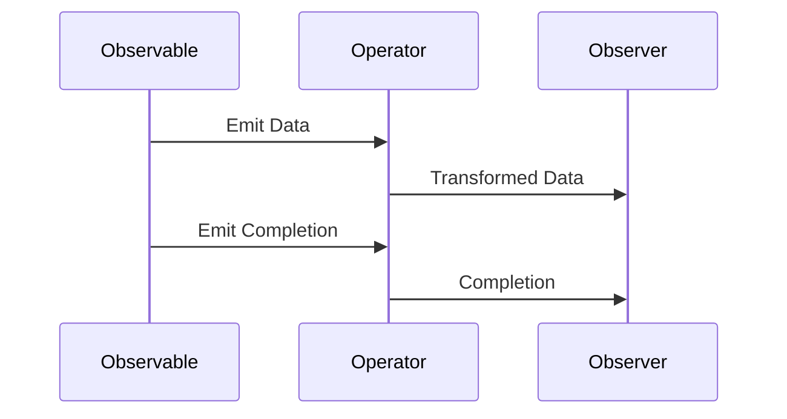

## 9.6 Reactive Extensions (Rx.NET)

Reactive Extensions (Rx.NET) is a powerful library for composing asynchronous and event-based programs using observable sequences and LINQ-style query operators. It provides a robust framework for handling asynchronous data streams, making it an essential tool for expert software engineers and enterprise architects working with C#. In this section, we will delve into the core concepts of Rx.NET, explore how to implement observables, manage subscriptions, and examine practical use cases.

### Introduction to Reactive Extensions

Reactive Extensions (Rx) is a library that enables developers to work with asynchronous data streams in a declarative manner. It is based on the observer pattern, where an observable emits data, and observers subscribe to receive notifications. Rx.NET is the .NET implementation of Reactive Extensions, providing a rich set of operators for transforming, filtering, and combining data streams.

#### Key Concepts

- **Observable**: Represents a data stream that can emit zero or more items over time.
- **Observer**: Consumes the data emitted by an observable.
- **Subscription**: Represents the connection between an observer and an observable.
- **Operators**: Functions that allow you to manipulate and transform data streams.

### Implementing Observables with Rx.NET

To harness the power of Rx.NET, we need to understand how to create and subscribe to observables. Observables are the core building blocks in Rx.NET, and they can be created from various sources, such as events, tasks, or custom logic.

#### Creating Observables

There are several ways to create observables in Rx.NET:

1. **Using `Observable.Create`**: This method allows you to define custom logic for emitting data.

```csharp
var observable = Observable.Create<int>(observer =>
{
    for (int i = 0; i < 5; i++)
    {
        observer.OnNext(i); // Emit data
    }
    observer.OnCompleted(); // Signal completion
    return Disposable.Empty;
});
```

2. **Using `Observable.FromEventPattern`**: This method converts .NET events into observables.

```csharp
var buttonClickObservable = Observable.FromEventPattern<EventArgs>(
    handler => button.Click += handler,
    handler => button.Click -= handler);
```

3. **Using `Observable.Interval`**: This method creates an observable that emits a sequence of integers spaced by a specified time interval.

```csharp
var intervalObservable = Observable.Interval(TimeSpan.FromSeconds(1));
```

#### Subscribing to Observables

Once an observable is created, you can subscribe to it using the `Subscribe` method. This method takes an observer or a set of callbacks for handling emitted data, errors, and completion.

```csharp
observable.Subscribe(
    onNext: value => Console.WriteLine($"Received: {value}"),
    onError: error => Console.WriteLine($"Error: {error.Message}"),
    onCompleted: () => Console.WriteLine("Completed"));
```

### Writing LINQ-style Queries Over Events

Rx.NET provides a rich set of operators that allow you to write LINQ-style queries over observable sequences. These operators enable you to filter, transform, and combine data streams in a declarative manner.

#### Example: Filtering and Transforming Data

Consider a scenario where you want to filter even numbers and transform them by multiplying by two.

```csharp
var numbers = Observable.Range(1, 10);

var evenNumbers = numbers
    .Where(n => n % 2 == 0)
    .Select(n => n * 2);

evenNumbers.Subscribe(Console.WriteLine);
```

### Subscription Management

Managing subscriptions is crucial to avoid memory leaks and ensure efficient resource usage. Rx.NET provides mechanisms to manage the lifecycle of subscriptions using disposables.

#### Managing Resource Lifetimes with Disposables

When you subscribe to an observable, it returns a disposable object that you can use to unsubscribe and release resources.

```csharp
var subscription = observable.Subscribe(Console.WriteLine);

// Dispose the subscription when no longer needed
subscription.Dispose();
```

#### Avoiding Memory Leaks in Event Streams

To prevent memory leaks, it's essential to dispose of subscriptions when they are no longer needed. This can be achieved using the `using` statement or by explicitly calling `Dispose`.

```csharp
using (var subscription = observable.Subscribe(Console.WriteLine))
{
    // Use the subscription
}
// Subscription is automatically disposed here
```

### Use Cases and Examples

Rx.NET is particularly useful in scenarios involving event-driven systems and real-time data processing. Let's explore some practical use cases.

#### Event-Driven Systems

In event-driven systems, Rx.NET can be used to handle user interactions, sensor data, or any other event-based data source.

```csharp
var mouseMoves = Observable.FromEventPattern<MouseEventArgs>(
    handler => this.MouseMove += handler,
    handler => this.MouseMove -= handler);

mouseMoves
    .Select(eventPattern => eventPattern.EventArgs.Location)
    .Subscribe(location => Console.WriteLine($"Mouse moved to: {location}"));
```

#### Real-Time Data Feeds

Rx.NET excels in processing real-time data feeds, such as stock prices or IoT sensor data.

```csharp
var stockPrices = Observable.Interval(TimeSpan.FromSeconds(1))
    .Select(_ => GetRandomStockPrice());

stockPrices.Subscribe(price => Console.WriteLine($"Stock price: {price}"));
```

### Visualizing Rx.NET Concepts

To better understand the flow of data in Rx.NET, let's visualize the interaction between observables, observers, and operators.



### Try It Yourself

Experiment with the following code examples to deepen your understanding of Rx.NET. Try modifying the code to create custom observables, apply different operators, and manage subscriptions effectively.

### References and Further Reading

- [Reactive Extensions (Rx.NET) Documentation](https://reactivex.io/)
- [Rx.NET GitHub Repository](https://github.com/dotnet/reactive)
- [Introduction to Reactive Programming](https://www.reactivemanifesto.org/)

### Knowledge Check

1. What is an observable in Rx.NET?
2. How do you create an observable from a .NET event?
3. What is the purpose of the `Subscribe` method in Rx.NET?
4. How can you manage the lifecycle of a subscription in Rx.NET?
5. Describe a use case where Rx.NET would be beneficial.

### Embrace the Journey

Remember, mastering Rx.NET is a journey. As you explore its capabilities, you'll discover new ways to handle asynchronous data streams and build responsive applications. Keep experimenting, stay curious, and enjoy the process!

## Quiz Time!



### What is the primary purpose of Rx.NET?

- [x] To handle asynchronous data streams
- [ ] To manage database connections
- [ ] To perform synchronous computations
- [ ] To create graphical user interfaces

> **Explanation:** Rx.NET is designed to handle asynchronous data streams using observables and observers.

### Which method is used to create a custom observable in Rx.NET?

- [x] Observable.Create
- [ ] Observable.FromEventPattern
- [ ] Observable.Interval
- [ ] Observable.Range

> **Explanation:** `Observable.Create` allows you to define custom logic for emitting data in an observable.

### How do you convert a .NET event into an observable?

- [ ] Using Observable.Create
- [x] Using Observable.FromEventPattern
- [ ] Using Observable.Interval
- [ ] Using Observable.Range

> **Explanation:** `Observable.FromEventPattern` is used to convert .NET events into observables.

### What is the role of the `Subscribe` method in Rx.NET?

- [x] To connect an observer to an observable
- [ ] To create a new observable
- [ ] To transform data streams
- [ ] To dispose of resources

> **Explanation:** The `Subscribe` method connects an observer to an observable, allowing it to receive data.

### How can you manage the lifecycle of a subscription in Rx.NET?

- [x] Using disposables
- [ ] Using events
- [ ] Using tasks
- [ ] Using threads

> **Explanation:** Disposables are used to manage the lifecycle of subscriptions, allowing you to release resources when no longer needed.

### Which operator is used to filter data in an observable sequence?

- [x] Where
- [ ] Select
- [ ] Merge
- [ ] Zip

> **Explanation:** The `Where` operator is used to filter data in an observable sequence based on a predicate.

### What is a common use case for Rx.NET?

- [x] Real-time data processing
- [ ] Static website development
- [ ] Database schema design
- [ ] File system management

> **Explanation:** Rx.NET is commonly used for real-time data processing, such as handling stock prices or sensor data.

### How do you prevent memory leaks in Rx.NET?

- [x] By disposing of subscriptions
- [ ] By using static variables
- [ ] By creating new threads
- [ ] By using global variables

> **Explanation:** Disposing of subscriptions ensures that resources are released and prevents memory leaks.

### What does the `Select` operator do in Rx.NET?

- [x] Transforms data in an observable sequence
- [ ] Filters data in an observable sequence
- [ ] Combines multiple observables
- [ ] Splits an observable into multiple streams

> **Explanation:** The `Select` operator transforms data in an observable sequence by applying a function to each element.

### True or False: Rx.NET can only be used for handling UI events.

- [ ] True
- [x] False

> **Explanation:** Rx.NET is versatile and can be used for various asynchronous data streams, not just UI events.


