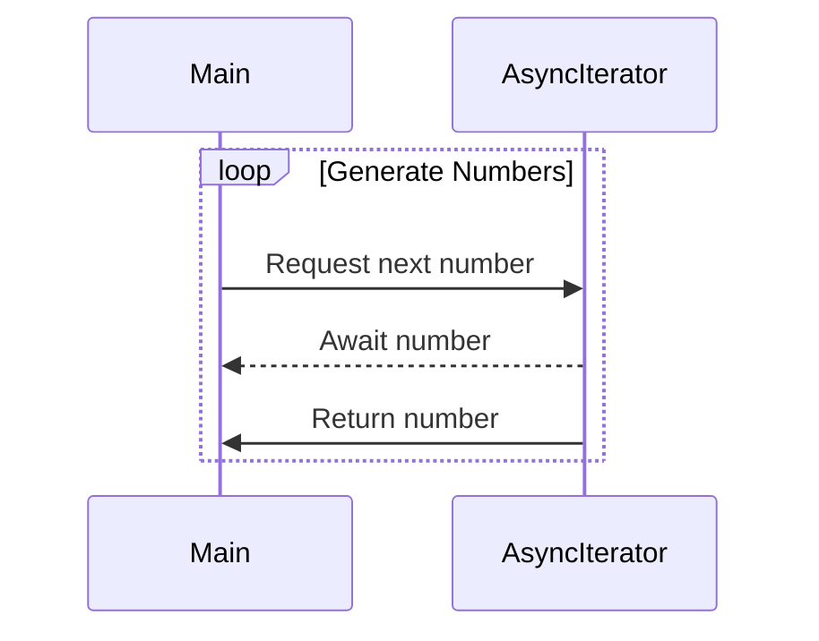

## 9.7 Asynchronous Streams with IAsyncEnumerable

Asynchronous programming is a cornerstone of modern software development, enabling applications to remain responsive and efficient even when dealing with long-running operations. In C#, the introduction of `IAsyncEnumerable<T>` has revolutionized how we handle streams of data asynchronously. This section will delve into the intricacies of asynchronous streams, guiding you through the implementation of asynchronous iterators and the consumption of data as it becomes available.

### Understanding Asynchronous Streams

Asynchronous streams allow you to process data as it arrives, rather than waiting for the entire dataset to be available. This is particularly useful in scenarios where data is produced over time, such as reading from a network socket, processing files, or handling user input.

#### Key Concepts

- **Asynchronous Iteration**: Iterating over data that is produced asynchronously.
- **IAsyncEnumerable<T>**: An interface representing an asynchronous stream of data.
- **await foreach**: A construct used to consume asynchronous streams.

### Implementing Asynchronous Iterators

To implement asynchronous streams in C#, you use the `IAsyncEnumerable<T>` interface along with the `await foreach` loop. This combination allows you to create and consume asynchronous data streams efficiently.

#### Using `IAsyncEnumerable<T>` and `await foreach`

The `IAsyncEnumerable<T>` interface is central to asynchronous streams. It provides a way to iterate over data asynchronously, using the `await foreach` loop to consume the data as it becomes available.

```csharp
using System;
using System.Collections.Generic;
using System.Threading.Tasks;

public class AsyncStreamExample
{
    public static async Task Main()
    {
        await foreach (var number in GenerateNumbersAsync())
        {
            Console.WriteLine(number);
        }
    }

    public static async IAsyncEnumerable<int> GenerateNumbersAsync()
    {
        for (int i = 0; i < 10; i++)
        {
            await Task.Delay(1000); // Simulate asynchronous work
            yield return i;
        }
    }
}
```

**Explanation:**

- **`IAsyncEnumerable<int>`**: Defines an asynchronous stream of integers.
- **`await foreach`**: Consumes the asynchronous stream, awaiting each element as it becomes available.
- **`yield return`**: Produces elements of the stream one at a time.

#### Creating Asynchronous Iterators with `yield return`

Asynchronous iterators are created using the `yield return` statement within an `async` method that returns `IAsyncEnumerable<T>`. This allows you to produce elements of the stream asynchronously.

```csharp
public static async IAsyncEnumerable<int> GenerateNumbersAsync()
{
    for (int i = 0; i < 10; i++)
    {
        await Task.Delay(1000); // Simulate asynchronous work
        yield return i;
    }
}
```

**Key Points:**

- **Asynchronous Work**: Use `await` to perform asynchronous operations within the iterator.
- **Yielding Results**: Use `yield return` to produce each element of the stream.

### Use Cases and Examples

Asynchronous streams are particularly useful in scenarios where data is produced over time or when dealing with IO-bound operations. Let's explore some common use cases.

#### Processing IO-bound Streams

Asynchronous streams excel in processing IO-bound data, such as reading from a file or network socket. By processing data as it arrives, you can improve the responsiveness and efficiency of your application.

```csharp
public static async IAsyncEnumerable<string> ReadLinesAsync(string filePath)
{
    using var reader = new StreamReader(filePath);
    while (!reader.EndOfStream)
    {
        yield return await reader.ReadLineAsync();
    }
}
```

**Explanation:**

- **StreamReader**: Used to read lines from a file asynchronously.
- **`await reader.ReadLineAsync()`**: Asynchronously reads each line from the file.

#### Consuming Data as It Becomes Available

In real-time applications, such as chat applications or live data feeds, consuming data as it becomes available is crucial. Asynchronous streams provide an elegant solution for handling such scenarios.

```csharp
public static async IAsyncEnumerable<string> GetLiveDataAsync()
{
    while (true)
    {
        await Task.Delay(1000); // Simulate data arrival
        yield return DateTime.Now.ToString();
    }
}
```

**Explanation:**

- **Infinite Stream**: Continuously produces data as it becomes available.
- **Simulated Data Arrival**: Uses `Task.Delay` to simulate the arrival of new data.

### Visualizing Asynchronous Streams

To better understand the flow of data in asynchronous streams, let's visualize the process using a sequence diagram.



**Diagram Explanation:**

- **Main**: Represents the consumer of the asynchronous stream.
- **AsyncIterator**: Represents the asynchronous iterator producing data.
- **Loop**: Illustrates the repeated process of requesting and receiving data.

### Design Considerations

When implementing asynchronous streams, consider the following:

- **Error Handling**: Ensure robust error handling within asynchronous iterators.
- **Cancellation**: Support cancellation tokens to allow consumers to cancel the iteration.
- **Performance**: Optimize performance by minimizing unnecessary asynchronous operations.

### Differences and Similarities

Asynchronous streams are often compared to traditional synchronous streams. Here are some key differences and similarities:

- **Differences**:
  - Asynchronous streams use `IAsyncEnumerable<T>` and `await foreach`, while synchronous streams use `IEnumerable<T>` and `foreach`.
  - Asynchronous streams can handle IO-bound operations more efficiently.

- **Similarities**:
  - Both provide a way to iterate over collections of data.
  - Both can be used to process data in a sequential manner.

### Try It Yourself

To deepen your understanding of asynchronous streams, try modifying the code examples provided. Experiment with different data sources, such as network sockets or user input, and observe how asynchronous streams handle the data.

### References and Links

For further reading on asynchronous programming and streams in C#, consider the following resources:

- [Microsoft Docs: Asynchronous Streams](https://docs.microsoft.com/en-us/dotnet/csharp/whats-new/csharp-8#asynchronous-streams)
- [C# Programming Guide: Iterators](https://docs.microsoft.com/en-us/dotnet/csharp/programming-guide/concepts/iterators)
- [Asynchronous Programming with Async and Await](https://docs.microsoft.com/en-us/dotnet/csharp/programming-guide/concepts/async/)

### Knowledge Check

Before moving on, let's review some key concepts:

- What is `IAsyncEnumerable<T>` and how is it used?
- How do you implement an asynchronous iterator in C#?
- What are some common use cases for asynchronous streams?

### Embrace the Journey

Remember, mastering asynchronous streams is a journey. As you continue to explore and experiment with these concepts, you'll gain a deeper understanding of how to build responsive and efficient applications. Keep experimenting, stay curious, and enjoy the journey!

## Quiz Time!



### What is the primary purpose of `IAsyncEnumerable<T>` in C#?

- [x] To handle streams of data asynchronously
- [ ] To perform synchronous data processing
- [ ] To replace `IEnumerable<T>` in all scenarios
- [ ] To improve synchronous iteration performance

> **Explanation:** `IAsyncEnumerable<T>` is designed to handle streams of data asynchronously, allowing for efficient processing of data as it becomes available.

### Which C# construct is used to consume asynchronous streams?

- [ ] foreach
- [x] await foreach
- [ ] async foreach
- [ ] parallel foreach

> **Explanation:** The `await foreach` construct is used to consume asynchronous streams in C#.

### How do you produce elements in an asynchronous iterator?

- [ ] Using return
- [x] Using yield return
- [ ] Using async return
- [ ] Using await return

> **Explanation:** In an asynchronous iterator, elements are produced using the `yield return` statement.

### What is a common use case for asynchronous streams?

- [x] Processing IO-bound data
- [ ] Performing CPU-bound calculations
- [ ] Synchronous data processing
- [ ] Static data analysis

> **Explanation:** Asynchronous streams are commonly used for processing IO-bound data, such as reading from files or network sockets.

### What is the role of `Task.Delay` in asynchronous iterators?

- [x] To simulate asynchronous work
- [ ] To pause execution indefinitely
- [ ] To perform synchronous operations
- [ ] To replace `await`

> **Explanation:** `Task.Delay` is often used in examples to simulate asynchronous work, such as waiting for data to arrive.

### How can you support cancellation in asynchronous streams?

- [x] By using cancellation tokens
- [ ] By using break statements
- [ ] By using return statements
- [ ] By using exception handling

> **Explanation:** Cancellation tokens are used to support cancellation in asynchronous streams, allowing consumers to cancel the iteration.

### What is a key difference between synchronous and asynchronous streams?

- [x] Asynchronous streams use `IAsyncEnumerable<T>` and `await foreach`
- [ ] Synchronous streams are always faster
- [ ] Asynchronous streams cannot handle IO-bound operations
- [ ] Synchronous streams use `IAsyncEnumerable<T>`

> **Explanation:** Asynchronous streams use `IAsyncEnumerable<T>` and `await foreach`, while synchronous streams use `IEnumerable<T>` and `foreach`.

### What should you consider when implementing asynchronous streams?

- [x] Error handling and performance optimization
- [ ] Only performance optimization
- [ ] Only error handling
- [ ] Ignoring performance considerations

> **Explanation:** When implementing asynchronous streams, it's important to consider both error handling and performance optimization.

### What is the benefit of consuming data as it becomes available?

- [x] Improved responsiveness and efficiency
- [ ] Increased memory usage
- [ ] Slower data processing
- [ ] Reduced application complexity

> **Explanation:** Consuming data as it becomes available improves the responsiveness and efficiency of applications.

### True or False: Asynchronous streams can only be used with network sockets.

- [ ] True
- [x] False

> **Explanation:** Asynchronous streams can be used with various data sources, not just network sockets.


