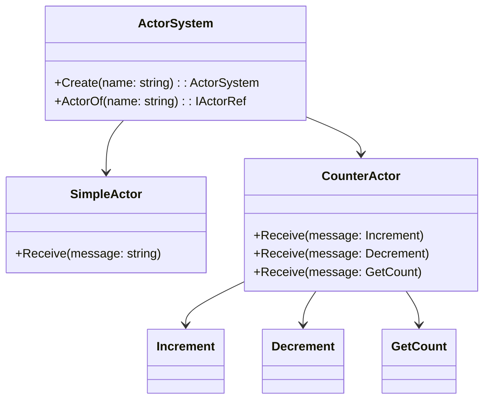

## 9.8 Actor Model and Akka.NET

Concurrency is a fundamental aspect of modern software systems, especially in the era of multi-core processors and distributed computing. The Actor Model is a powerful paradigm for managing state and behavior in concurrent systems. In this section, we will explore the Actor Model and how Akka.NET facilitates building actor-based systems in C#. We will delve into actor-based design patterns, message passing, and state management, and provide use cases and examples to illustrate the concepts.

### Understanding the Actor Model Principles

The Actor Model is a conceptual model that treats "actors" as the fundamental units of computation. An actor is an independent entity that encapsulates state and behavior, and interacts with other actors through message passing. This model provides a natural way to build concurrent and distributed systems by isolating state and ensuring that actors do not share state directly.

#### Key Principles of the Actor Model

1. **Encapsulation**: Actors encapsulate their state and behavior, ensuring that state is not shared directly between actors. This reduces the risk of race conditions and simplifies reasoning about concurrency.

2. **Message Passing**: Actors communicate with each other exclusively through asynchronous message passing. This decouples actors and allows them to operate independently.

3. **Isolation**: Each actor processes messages sequentially, maintaining its own state. This isolation ensures that actors do not interfere with each other, even in a concurrent environment.

4. **Dynamic Creation**: Actors can create other actors dynamically, forming a hierarchy or network of actors that can scale and adapt to changing workloads.

5. **Failure Handling**: Actors can supervise other actors, allowing for robust error handling and recovery strategies.

### Using Akka.NET for Building Actor-Based Systems

Akka.NET is a powerful toolkit for building concurrent, distributed, and fault-tolerant systems using the Actor Model. It provides a comprehensive framework for implementing actors, managing their lifecycle, and facilitating communication between them.

#### Getting Started with Akka.NET

To use Akka.NET in your C# projects, you need to install the Akka.NET NuGet package. You can do this using the following command:

```bash
dotnet add package Akka
```

Once installed, you can start defining actors and building your actor system.

#### Defining Actors in Akka.NET

In Akka.NET, actors are defined by creating classes that inherit from the `UntypedActor` or `ReceiveActor` base classes. The `ReceiveActor` class is more commonly used as it provides a more intuitive way to define message handlers.

Here's a simple example of an actor that handles string messages:

```csharp
using Akka.Actor;

public class SimpleActor : ReceiveActor
{
    public SimpleActor()
    {
        Receive<string>(message => HandleStringMessage(message));
    }

    private void HandleStringMessage(string message)
    {
        Console.WriteLine($"Received message: {message}");
    }
}
```

In this example, the `SimpleActor` class defines a constructor that sets up a message handler for string messages. The `Receive` method is used to specify the type of message and the corresponding handler method.

#### Creating an Actor System

An actor system is a container for actors and provides the infrastructure for creating, managing, and supervising actors. You can create an actor system using the `ActorSystem` class:

```csharp
using Akka.Actor;

var actorSystem = ActorSystem.Create("MyActorSystem");
var simpleActorRef = actorSystem.ActorOf<SimpleActor>("simpleActor");

simpleActorRef.Tell("Hello, Actor!");
```

In this example, we create an actor system named "MyActorSystem" and instantiate an actor of type `SimpleActor`. We then send a message to the actor using the `Tell` method.

### Actor-Based Design Patterns

The Actor Model introduces several design patterns that leverage message passing and isolation to build robust systems.

#### Designing for Message Passing and Isolation

1. **Message Protocols**: Define clear message protocols for communication between actors. This involves specifying the types of messages each actor can handle and the expected responses.

2. **Stateless Actors**: Use stateless actors for tasks that do not require maintaining state between messages. Stateless actors can be easily scaled and reused.

3. **Stateful Actors**: For tasks that require maintaining state, use stateful actors that encapsulate their state and provide methods for updating it in response to messages.

4. **Supervisor Hierarchies**: Implement supervisor hierarchies to manage actor failures. Supervisors can restart or replace child actors in case of errors, ensuring system resilience.

5. **Actor Pools**: Use actor pools to distribute work across multiple instances of an actor. This can improve performance and scalability by parallelizing tasks.

#### Managing State Within Actors

Managing state within actors involves encapsulating state variables and providing methods for updating them in response to messages. Here's an example of a stateful actor that maintains a counter:

```csharp
using Akka.Actor;

public class CounterActor : ReceiveActor
{
    private int _count;

    public CounterActor()
    {
        Receive<Increment>(message => _count++);
        Receive<Decrement>(message => _count--);
        Receive<GetCount>(message => Sender.Tell(_count));
    }
}

public class Increment { }
public class Decrement { }
public class GetCount { }
```

In this example, the `CounterActor` maintains an integer counter and provides handlers for `Increment`, `Decrement`, and `GetCount` messages. The `GetCount` message handler sends the current count back to the sender.

### Use Cases and Examples

The Actor Model and Akka.NET are well-suited for high-concurrency applications, real-time systems, and distributed computing.

#### High-Concurrency Applications

In high-concurrency applications, actors can be used to manage concurrent tasks without the complexity of traditional thread-based concurrency. For example, a web server can use actors to handle incoming requests, with each request being processed by a separate actor.

#### Real-Time Systems

Real-time systems, such as online gaming platforms or financial trading systems, require low-latency and high-throughput processing. Actors can be used to model real-time entities and manage their interactions efficiently.

#### Distributed Computing

In distributed computing environments, actors can be deployed across multiple nodes, allowing for scalable and fault-tolerant systems. Akka.NET provides tools for remote actor communication and clustering, enabling seamless distribution of actors.

### Visualizing Actor Systems

To better understand the structure and interactions within an actor system, we can use a class diagram to visualize the relationships between actors and messages.



This diagram illustrates the relationships between the `ActorSystem`, `SimpleActor`, `CounterActor`, and the messages they handle.

### Design Considerations

When using the Actor Model and Akka.NET, consider the following design considerations:

1. **Message Size**: Keep messages small to reduce overhead and improve performance. Large messages can increase latency and memory usage.

2. **Actor Granularity**: Choose an appropriate level of granularity for actors. Too many actors can lead to overhead, while too few can limit concurrency.

3. **Error Handling**: Implement robust error handling strategies using supervisor hierarchies. Define clear policies for restarting or replacing failed actors.

4. **Scalability**: Design actor systems to scale horizontally by distributing actors across multiple nodes. Use clustering and remote communication features in Akka.NET to facilitate distribution.

5. **Testing**: Test actor systems thoroughly to ensure correct behavior under concurrent conditions. Use Akka.NET's testing tools to simulate message passing and actor interactions.

### Differences and Similarities

The Actor Model shares similarities with other concurrency models, such as the thread-based model and the message-passing model used in Erlang. However, it differs in its emphasis on encapsulation, isolation, and dynamic actor creation.

- **Similarities**: Like the thread-based model, the Actor Model supports concurrent execution. Like Erlang, it uses message passing for communication.

- **Differences**: Unlike the thread-based model, the Actor Model encapsulates state within actors, reducing the risk of race conditions. Unlike Erlang, Akka.NET provides a rich set of tools for building actor systems in C#.

### Try It Yourself

To gain hands-on experience with the Actor Model and Akka.NET, try modifying the code examples provided in this section. Experiment with different message types, actor hierarchies, and error handling strategies. Consider building a simple chat application or a task processing system using actors.

### Knowledge Check

Before moving on, take a moment to review the key concepts covered in this section:

- What are the key principles of the Actor Model?
- How does Akka.NET facilitate building actor-based systems in C#?
- What are some design patterns associated with the Actor Model?
- How can actors be used in high-concurrency applications and distributed computing?

### Embrace the Journey

Remember, mastering the Actor Model and Akka.NET is a journey. As you continue to explore these concepts, you'll gain a deeper understanding of concurrency and distributed systems. Keep experimenting, stay curious, and enjoy the journey!

## Quiz Time!



### What is the primary communication method between actors in the Actor Model?

- [x] Message Passing
- [ ] Shared Memory
- [ ] Direct Method Calls
- [ ] Global Variables

> **Explanation:** In the Actor Model, actors communicate exclusively through asynchronous message passing, ensuring isolation and decoupling.

### Which Akka.NET class is used to create an actor system?

- [x] ActorSystem
- [ ] ActorContext
- [ ] ActorRef
- [ ] ActorBase

> **Explanation:** The `ActorSystem` class is used to create and manage actor systems in Akka.NET.

### What is a key advantage of using the Actor Model for concurrency?

- [x] Isolation of State
- [ ] Direct Access to Shared Memory
- [ ] Synchronous Communication
- [ ] Global State Management

> **Explanation:** The Actor Model isolates state within actors, reducing the risk of race conditions and simplifying concurrency management.

### How do actors handle errors in Akka.NET?

- [x] Supervisor Hierarchies
- [ ] Global Exception Handlers
- [ ] Try-Catch Blocks
- [ ] Error Logs

> **Explanation:** Akka.NET uses supervisor hierarchies to manage actor errors, allowing supervisors to restart or replace failed actors.

### What is a common use case for the Actor Model?

- [x] High-Concurrency Applications
- [ ] Single-Threaded Applications
- [ ] Static Web Pages
- [ ] Batch Processing

> **Explanation:** The Actor Model is well-suited for high-concurrency applications, where it can manage concurrent tasks efficiently.

### Which of the following is NOT a principle of the Actor Model?

- [ ] Encapsulation
- [x] Shared State
- [ ] Message Passing
- [ ] Isolation

> **Explanation:** The Actor Model emphasizes encapsulation and isolation, avoiding shared state to prevent race conditions.

### What is the purpose of the `Receive` method in Akka.NET actors?

- [x] Define Message Handlers
- [ ] Send Messages
- [ ] Create Actors
- [ ] Terminate Actors

> **Explanation:** The `Receive` method is used to define message handlers in Akka.NET actors, specifying how they respond to different message types.

### How can actors be scaled in Akka.NET?

- [x] Actor Pools
- [ ] Global Variables
- [ ] Synchronous Execution
- [ ] Static Methods

> **Explanation:** Actor pools allow multiple instances of an actor to handle tasks concurrently, improving scalability.

### What is a benefit of using stateless actors?

- [x] Easy Scalability
- [ ] Complex State Management
- [ ] Direct State Sharing
- [ ] Synchronous Execution

> **Explanation:** Stateless actors can be easily scaled and reused, as they do not maintain state between messages.

### True or False: Akka.NET supports remote actor communication.

- [x] True
- [ ] False

> **Explanation:** Akka.NET provides tools for remote actor communication, enabling actors to interact across different nodes.


