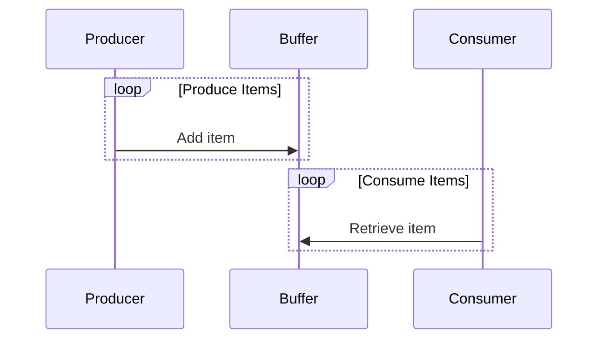

## 9.9 Concurrency Best Practices

Concurrency in software development is a powerful tool that allows applications to perform multiple operations simultaneously, improving performance and responsiveness. However, writing concurrent code can be challenging due to potential issues like deadlocks, race conditions, and resource contention. In this section, we will explore best practices for writing safe and efficient concurrent code in C#. We'll cover strategies to avoid common pitfalls, leverage immutable data structures, and utilize design patterns that enhance concurrency management.

### Avoiding Deadlocks and Race Conditions

Concurrency issues such as deadlocks and race conditions can lead to unpredictable behavior and system failures. Understanding these problems and implementing strategies to prevent them is crucial for building robust concurrent applications.

#### Identifying Common Concurrency Issues

- **Deadlocks** occur when two or more threads are blocked forever, each waiting for the other to release a resource. This situation can arise when multiple locks are acquired in different orders by different threads.
- **Race Conditions** happen when the outcome of a program depends on the sequence or timing of uncontrollable events, such as thread scheduling. This can lead to inconsistent data states.

#### Techniques to Prevent and Resolve Conflicts

1. **Lock Hierarchy**: Establish a global order in which locks must be acquired to prevent deadlocks. Always acquire locks in the same order across all threads.

2. **Timeouts**: Use timeouts when acquiring locks to avoid indefinite blocking. If a lock cannot be acquired within a specified time, handle the situation gracefully.

3. **Atomic Operations**: Use atomic operations provided by the `Interlocked` class for simple operations like incrementing counters, which can eliminate the need for locks.

4. **Volatile Keyword**: Use the `volatile` keyword to ensure that a variable is always read from and written to the main memory, preventing compiler optimizations that could lead to race conditions.

5. **Lock-Free Data Structures**: Consider using lock-free data structures like `ConcurrentQueue` and `ConcurrentDictionary` that are designed for safe concurrent access.

### Immutable Data Structures

Immutability is a powerful concept in concurrent programming that can greatly simplify thread safety. Immutable objects cannot be modified after they are created, eliminating the need for synchronization.

#### Leveraging Immutability for Thread Safety

- **Immutable Objects**: Design objects that do not change state after creation. This ensures that multiple threads can safely read the object without synchronization.
  
- **Functional Programming**: Adopt functional programming principles, which emphasize immutability and pure functions, to reduce side effects and improve concurrency.

#### Using `ImmutableCollection` Classes

C# provides a set of immutable collection classes in the `System.Collections.Immutable` namespace, such as `ImmutableList`, `ImmutableDictionary`, and `ImmutableArray`. These collections are thread-safe and can be shared across threads without locking.

```csharp
using System.Collections.Immutable;

ImmutableList<int> numbers = ImmutableList.Create(1, 2, 3, 4, 5);

// Adding an element returns a new list
ImmutableList<int> newNumbers = numbers.Add(6);

// Original list remains unchanged
Console.WriteLine(string.Join(", ", numbers)); // Output: 1, 2, 3, 4, 5
Console.WriteLine(string.Join(", ", newNumbers)); // Output: 1, 2, 3, 4, 5, 6
```

### Double-Checked Locking Pattern

The Double-Checked Locking pattern is a technique used to reduce the overhead of acquiring a lock by first testing the locking criterion without actually acquiring the lock. This pattern is commonly used in the implementation of the Singleton pattern.

#### Optimizing Thread-Safe Singleton Initialization

```csharp
public class Singleton
{
    private static Singleton _instance;
    private static readonly object _lock = new object();

    private Singleton() { }

    public static Singleton Instance
    {
        get
        {
            if (_instance == null)
            {
                lock (_lock)
                {
                    if (_instance == null)
                    {
                        _instance = new Singleton();
                    }
                }
            }
            return _instance;
        }
    }
}
```

In this example, the lock is only acquired when the instance is `null`, reducing the performance overhead of locking.

### Producer-Consumer Pattern

The Producer-Consumer pattern is a classic concurrency pattern that decouples data production from consumption, allowing for better scalability and resource management.

#### Decoupling Data Production from Consumption

- **Producers** generate data and place it into a shared buffer or queue.
- **Consumers** retrieve data from the buffer and process it.

This pattern is useful in scenarios where the rate of data production and consumption varies.

```csharp
using System;
using System.Collections.Concurrent;
using System.Threading;
using System.Threading.Tasks;

public class ProducerConsumer
{
    private BlockingCollection<int> _buffer = new BlockingCollection<int>(boundedCapacity: 10);

    public void Start()
    {
        Task producer = Task.Run(() => Produce());
        Task consumer = Task.Run(() => Consume());

        Task.WaitAll(producer, consumer);
    }

    private void Produce()
    {
        for (int i = 0; i < 20; i++)
        {
            _buffer.Add(i);
            Console.WriteLine($"Produced: {i}");
            Thread.Sleep(100); // Simulate work
        }
        _buffer.CompleteAdding();
    }

    private void Consume()
    {
        foreach (var item in _buffer.GetConsumingEnumerable())
        {
            Console.WriteLine($"Consumed: {item}");
            Thread.Sleep(150); // Simulate work
        }
    }
}
```

### Read-Write Lock Pattern

The Read-Write Lock pattern allows multiple threads to read a resource concurrently while ensuring exclusive access for write operations. This is particularly useful in scenarios with a high read-to-write ratio.

#### Managing Concurrent Access with Differentiated Read and Write Locks

- **ReaderWriterLockSlim**: Use this class to implement read-write locks efficiently. It provides methods for acquiring and releasing read and write locks.

```csharp
using System;
using System.Threading;

public class ReadWriteExample
{
    private ReaderWriterLockSlim _lock = new ReaderWriterLockSlim();
    private int _resource = 0;

    public void ReadResource()
    {
        _lock.EnterReadLock();
        try
        {
            Console.WriteLine($"Read: {_resource}");
        }
        finally
        {
            _lock.ExitReadLock();
        }
    }

    public void WriteResource(int value)
    {
        _lock.EnterWriteLock();
        try
        {
            _resource = value;
            Console.WriteLine($"Written: {_resource}");
        }
        finally
        {
            _lock.ExitWriteLock();
        }
    }
}
```

#### Scenarios with High Read-to-Write Ratio

In applications where read operations are frequent and write operations are rare, using a read-write lock can significantly improve performance by allowing multiple threads to read data simultaneously.

### Reactor Pattern

The Reactor pattern is used to handle service requests that are delivered concurrently to an application. It is particularly effective for high-performance network servers.

#### Handling Concurrent Service Requests Effectively

- **Asynchronous Event Handling**: Use asynchronous event handling to manage multiple service requests without blocking threads.

#### Using Asynchronous Event Handling with `SocketAsyncEventArgs`

The `SocketAsyncEventArgs` class in .NET provides a way to perform asynchronous socket operations efficiently.

```csharp
using System;
using System.Net;
using System.Net.Sockets;
using System.Text;

public class ReactorServer
{
    private Socket _listener;

    public void Start()
    {
        _listener = new Socket(AddressFamily.InterNetwork, SocketType.Stream, ProtocolType.Tcp);
        _listener.Bind(new IPEndPoint(IPAddress.Any, 11000));
        _listener.Listen(100);

        StartAccept(null);
    }

    private void StartAccept(SocketAsyncEventArgs acceptEventArg)
    {
        if (acceptEventArg == null)
        {
            acceptEventArg = new SocketAsyncEventArgs();
            acceptEventArg.Completed += AcceptCompleted;
        }
        else
        {
            acceptEventArg.AcceptSocket = null;
        }

        bool willRaiseEvent = _listener.AcceptAsync(acceptEventArg);
        if (!willRaiseEvent)
        {
            ProcessAccept(acceptEventArg);
        }
    }

    private void AcceptCompleted(object sender, SocketAsyncEventArgs e)
    {
        ProcessAccept(e);
    }

    private void ProcessAccept(SocketAsyncEventArgs e)
    {
        Socket clientSocket = e.AcceptSocket;
        Console.WriteLine("Client connected.");

        // Handle client connection
        StartAccept(e);
    }
}
```

### Performance Considerations

When writing concurrent applications, it's essential to balance performance with responsiveness. Here are some key considerations:

#### Balancing Overhead with Responsiveness

- **Minimize Lock Contention**: Reduce the time locks are held to minimize contention and improve throughput.
- **Avoid Over-Synchronization**: Only synchronize critical sections of code to avoid unnecessary performance overhead.

#### Profiling and Tuning Concurrent Applications

- **Use Profiling Tools**: Tools like Visual Studio Profiler and dotTrace can help identify performance bottlenecks in concurrent applications.
- **Measure and Optimize**: Continuously measure performance and optimize code to ensure efficient resource utilization.

### Try It Yourself

Experiment with the code examples provided in this section. Try modifying the `ProducerConsumer` example to adjust the production and consumption rates. Observe how the system behaves under different conditions and consider how you might optimize it further.

### Visualizing Concurrency Patterns

To better understand the flow of concurrency patterns, let's visualize the Producer-Consumer pattern using a sequence diagram.



This diagram illustrates the interaction between the producer, buffer, and consumer, highlighting the decoupling of production and consumption.

### Knowledge Check

- What are the key differences between deadlocks and race conditions?
- How can immutable data structures improve thread safety?
- When should you use the Double-Checked Locking pattern?
- What are the benefits of using the Producer-Consumer pattern?
- How does the Read-Write Lock pattern improve performance in high read-to-write ratio scenarios?

### Embrace the Journey

Concurrency can be complex, but with practice and the right strategies, you can master it. Remember, this is just the beginning. As you progress, you'll build more complex and efficient concurrent applications. Keep experimenting, stay curious, and enjoy the journey!

## Quiz Time!



### What is a deadlock in concurrent programming?

- [x] A situation where two or more threads are blocked forever, each waiting for the other to release a resource.
- [ ] A condition where multiple threads try to access the same resource simultaneously.
- [ ] A method to optimize thread-safe singleton initialization.
- [ ] A pattern to decouple data production from consumption.

> **Explanation:** A deadlock occurs when two or more threads are blocked forever, each waiting for the other to release a resource.

### How can immutable data structures improve thread safety?

- [x] By ensuring that objects cannot be modified after creation, eliminating the need for synchronization.
- [ ] By allowing multiple threads to modify data simultaneously.
- [ ] By providing a mechanism to lock resources during access.
- [ ] By using atomic operations for data manipulation.

> **Explanation:** Immutable data structures ensure that objects cannot be modified after creation, eliminating the need for synchronization and improving thread safety.

### When should you use the Double-Checked Locking pattern?

- [x] When you need to reduce the overhead of acquiring a lock by first testing the locking criterion without actually acquiring the lock.
- [ ] When you want to handle multiple service requests concurrently.
- [ ] When you need to decouple data production from consumption.
- [ ] When you want to manage concurrent access with differentiated read and write locks.

> **Explanation:** The Double-Checked Locking pattern is used to reduce the overhead of acquiring a lock by first testing the locking criterion without actually acquiring the lock.

### What are the benefits of using the Producer-Consumer pattern?

- [x] It decouples data production from consumption, allowing for better scalability and resource management.
- [ ] It provides a mechanism to handle multiple service requests concurrently.
- [ ] It ensures that objects cannot be modified after creation.
- [ ] It optimizes thread-safe singleton initialization.

> **Explanation:** The Producer-Consumer pattern decouples data production from consumption, allowing for better scalability and resource management.

### How does the Read-Write Lock pattern improve performance in high read-to-write ratio scenarios?

- [x] By allowing multiple threads to read a resource concurrently while ensuring exclusive access for write operations.
- [ ] By providing a mechanism to handle multiple service requests concurrently.
- [ ] By reducing the overhead of acquiring a lock.
- [ ] By ensuring that objects cannot be modified after creation.

> **Explanation:** The Read-Write Lock pattern improves performance by allowing multiple threads to read a resource concurrently while ensuring exclusive access for write operations.

### What is the purpose of using timeouts when acquiring locks?

- [x] To avoid indefinite blocking if a lock cannot be acquired within a specified time.
- [ ] To ensure that objects cannot be modified after creation.
- [ ] To handle multiple service requests concurrently.
- [ ] To decouple data production from consumption.

> **Explanation:** Timeouts are used when acquiring locks to avoid indefinite blocking if a lock cannot be acquired within a specified time.

### Which class in .NET provides a way to perform asynchronous socket operations efficiently?

- [x] SocketAsyncEventArgs
- [ ] ReaderWriterLockSlim
- [ ] BlockingCollection
- [ ] ImmutableList

> **Explanation:** The `SocketAsyncEventArgs` class in .NET provides a way to perform asynchronous socket operations efficiently.

### What is the main advantage of using lock-free data structures?

- [x] They are designed for safe concurrent access without the need for locks.
- [ ] They ensure that objects cannot be modified after creation.
- [ ] They provide a mechanism to handle multiple service requests concurrently.
- [ ] They optimize thread-safe singleton initialization.

> **Explanation:** Lock-free data structures are designed for safe concurrent access without the need for locks.

### How can profiling tools help in concurrent applications?

- [x] By identifying performance bottlenecks and helping optimize code for efficient resource utilization.
- [ ] By ensuring that objects cannot be modified after creation.
- [ ] By providing a mechanism to handle multiple service requests concurrently.
- [ ] By reducing the overhead of acquiring a lock.

> **Explanation:** Profiling tools help identify performance bottlenecks and optimize code for efficient resource utilization in concurrent applications.

### True or False: The `volatile` keyword ensures that a variable is always read from and written to the main memory.

- [x] True
- [ ] False

> **Explanation:** The `volatile` keyword ensures that a variable is always read from and written to the main memory, preventing compiler optimizations that could lead to race conditions.


