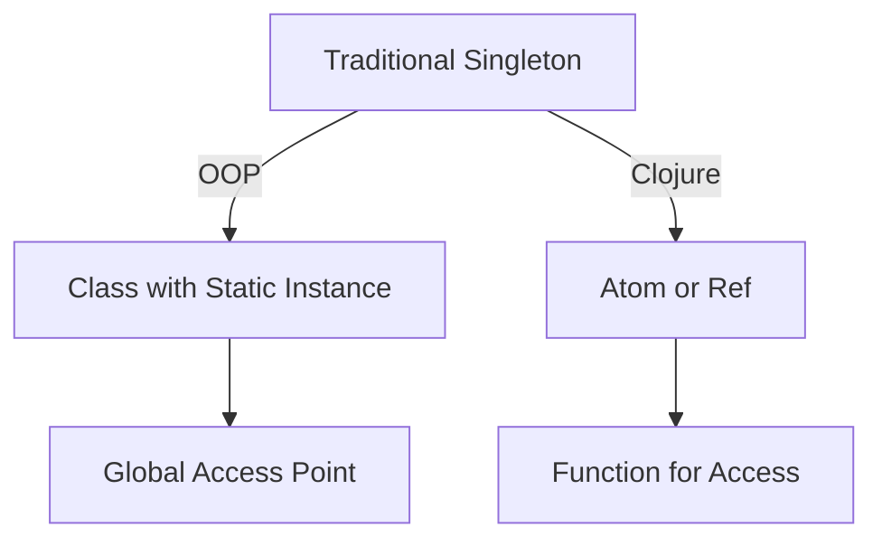

## 1.1. What Are Design Patterns in Clojure?

### Introduction

Design patterns are a fundamental concept in software development, providing reusable solutions to common problems. They serve as templates that can be applied to various situations, helping developers create robust, maintainable, and efficient code. In the context of Clojure, a functional programming language, design patterns take on a unique form due to Clojure's emphasis on immutability, first-class functions, and its Lisp syntax. This section explores how traditional design patterns are adapted or reimagined in Clojure, highlighting the benefits of understanding these patterns to improve code quality and maintainability.

### What Are Design Patterns?

Design patterns are established solutions to recurring design problems in software development. They encapsulate best practices and provide a shared language for developers to communicate complex ideas succinctly. Originating from the book "Design Patterns: Elements of Reusable Object-Oriented Software" by Gamma et al., these patterns have traditionally been associated with object-oriented programming (OOP). However, their principles are applicable across various programming paradigms, including functional programming.

#### Purpose of Design Patterns

- **Reusability**: Design patterns promote code reuse, reducing redundancy and improving efficiency.
- **Maintainability**: By providing a clear structure, design patterns make code easier to understand and maintain.
- **Scalability**: Patterns help in designing systems that can grow and evolve without significant refactoring.
- **Communication**: They offer a common vocabulary for developers, facilitating better collaboration and understanding.

### The Significance of Design Patterns in Clojure

Clojure, as a functional programming language, offers a distinct approach to design patterns. Its features, such as immutability, first-class functions, and a powerful macro system, influence how design patterns are implemented and utilized.

#### Clojure's Unique Features

- **Immutability**: Clojure's data structures are immutable by default, which simplifies reasoning about code and enhances concurrency.
- **First-Class Functions**: Functions in Clojure are first-class citizens, allowing them to be passed as arguments, returned from other functions, and stored in data structures.
- **Lisp Syntax**: Clojure's Lisp heritage provides a simple, consistent syntax that facilitates metaprogramming and code manipulation.

#### Impact on Design Patterns

- **Functional Paradigm**: Clojure's functional nature shifts the focus from objects and classes to functions and data transformations.
- **Concurrency Models**: Immutability and functional programming make it easier to implement concurrent and parallel systems.
- **Macro System**: Clojure's macros enable powerful abstractions, allowing developers to create domain-specific languages and custom control structures.

### Comparing Object-Oriented and Functional Design Patterns

In Clojure, traditional object-oriented design patterns are often reimagined to fit the functional paradigm. Let's explore some examples:

#### Singleton Pattern

**Object-Oriented Approach**: In OOP, the Singleton pattern ensures a class has only one instance and provides a global point of access to it.

**Clojure Equivalent**: In Clojure, the Singleton pattern can be implemented using atoms or refs to manage state.

```clojure
(defonce singleton-instance (atom nil))

(defn get-instance []
  (if (nil? @singleton-instance)
    (reset! singleton-instance (create-instance)))
  @singleton-instance)
```

#### Strategy Pattern

**Object-Oriented Approach**: The Strategy pattern defines a family of algorithms, encapsulates each one, and makes them interchangeable.

**Clojure Equivalent**: In Clojure, the Strategy pattern can be implemented using higher-order functions.

```clojure
(defn execute-strategy [strategy data]
  (strategy data))

(defn strategy-a [data]
  ;; implementation of strategy A
  )

(defn strategy-b [data]
  ;; implementation of strategy B
  )

(execute-strategy strategy-a some-data)
```

### Benefits of Understanding Design Patterns in Clojure

Understanding design patterns in Clojure offers several advantages:

- **Enhanced Code Quality**: Patterns provide proven solutions that improve the quality and reliability of code.
- **Improved Maintainability**: By following established patterns, code becomes easier to read, understand, and modify.
- **Increased Productivity**: Patterns reduce the need to reinvent the wheel, allowing developers to focus on solving unique problems.
- **Better Concurrency**: Clojure's design patterns leverage immutability and functional programming to simplify concurrent programming.

### Visualizing Design Patterns in Clojure

To better understand how design patterns are adapted in Clojure, let's visualize the transformation of a traditional pattern into its functional equivalent.



**Caption**: This diagram illustrates the transformation of the Singleton pattern from an object-oriented approach to a functional approach in Clojure.

### Try It Yourself

To deepen your understanding of design patterns in Clojure, try modifying the code examples provided. Experiment with different strategies or implement additional patterns using Clojure's unique features.

### Knowledge Check

- How does Clojure's immutability affect the implementation of design patterns?
- What are the benefits of using first-class functions in design patterns?
- How can macros be used to create custom design patterns in Clojure?

### Summary

Design patterns are a vital tool in software development, providing reusable solutions to common problems. In Clojure, these patterns are adapted to fit the functional paradigm, leveraging features like immutability, first-class functions, and Lisp syntax. Understanding these patterns enhances code quality, maintainability, and productivity, making them an essential part of any Clojure developer's toolkit.

Remember, this is just the beginning. As you progress, you'll discover more complex patterns and techniques that will further enhance your Clojure applications. Keep experimenting, stay curious, and enjoy the journey!

## **Ready to Test Your Knowledge?**



### What is a primary benefit of using design patterns in Clojure?

- [x] They provide reusable solutions to common problems.
- [ ] They enforce strict typing.
- [ ] They eliminate the need for testing.
- [ ] They replace the need for documentation.

> **Explanation:** Design patterns offer reusable solutions to common problems, improving code quality and maintainability.

### How does Clojure's immutability impact design patterns?

- [x] It simplifies reasoning about code and enhances concurrency.
- [ ] It complicates state management.
- [ ] It requires more memory.
- [ ] It limits the use of functions.

> **Explanation:** Immutability simplifies reasoning about code and enhances concurrency by preventing shared state mutations.

### Which feature of Clojure allows functions to be passed as arguments?

- [x] First-class functions
- [ ] Macros
- [ ] Immutability
- [ ] Namespaces

> **Explanation:** First-class functions in Clojure can be passed as arguments, returned from functions, and stored in data structures.

### What is a common use of macros in Clojure?

- [x] Creating domain-specific languages
- [ ] Enforcing type safety
- [ ] Managing memory
- [ ] Compiling code

> **Explanation:** Macros in Clojure are often used to create domain-specific languages and custom control structures.

### How can the Strategy pattern be implemented in Clojure?

- [x] Using higher-order functions
- [ ] Using classes and interfaces
- [ ] Using global variables
- [ ] Using macros

> **Explanation:** The Strategy pattern in Clojure can be implemented using higher-order functions to encapsulate algorithms.

### What is the role of design patterns in improving code maintainability?

- [x] They provide a clear structure and common vocabulary.
- [ ] They increase code complexity.
- [ ] They enforce strict coding standards.
- [ ] They reduce the need for comments.

> **Explanation:** Design patterns provide a clear structure and common vocabulary, making code easier to understand and maintain.

### How does Clojure's Lisp syntax influence design patterns?

- [x] It facilitates metaprogramming and code manipulation.
- [ ] It enforces strict typing.
- [ ] It limits the use of functions.
- [ ] It complicates syntax.

> **Explanation:** Clojure's Lisp syntax facilitates metaprogramming and code manipulation, allowing for powerful abstractions.

### What is a benefit of using first-class functions in design patterns?

- [x] They allow for flexible and reusable code.
- [ ] They enforce strict typing.
- [ ] They increase memory usage.
- [ ] They complicate function calls.

> **Explanation:** First-class functions allow for flexible and reusable code by enabling functions to be passed as arguments and returned from other functions.

### How does the Singleton pattern differ in Clojure compared to OOP?

- [x] It uses atoms or refs to manage state.
- [ ] It uses classes and static methods.
- [ ] It relies on global variables.
- [ ] It eliminates the need for state management.

> **Explanation:** In Clojure, the Singleton pattern uses atoms or refs to manage state, unlike the class-based approach in OOP.

### True or False: Design patterns in Clojure are identical to those in object-oriented programming.

- [ ] True
- [x] False

> **Explanation:** Design patterns in Clojure are adapted to fit the functional paradigm, leveraging features like immutability and first-class functions.




