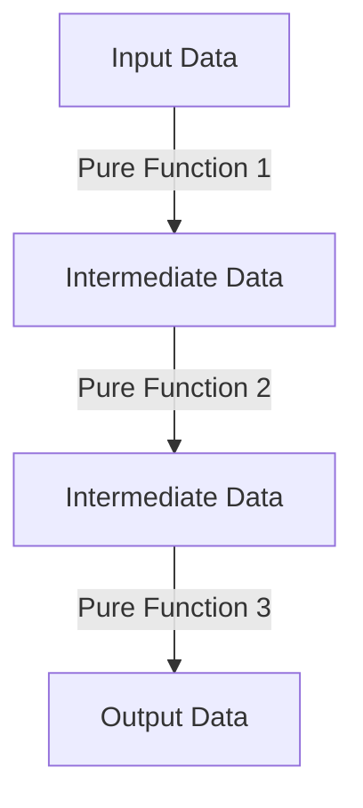

## 1.2. The Functional Programming Paradigm

Functional Programming (FP) is a programming paradigm that treats computation as the evaluation of mathematical functions and avoids changing state or mutable data. In this section, we will delve into the core principles of functional programming, how it differs from other paradigms, and how Clojure, a modern Lisp dialect, embodies these principles to offer a robust platform for software development.

### Defining Functional Programming

Functional programming is centered around the idea of building software by composing pure functions, avoiding shared state, mutable data, and side-effects. This paradigm emphasizes the application of functions, in contrast to the imperative programming paradigm, which emphasizes changes in state and the execution of sequences of commands.

#### Core Principles of Functional Programming

1. **Immutability**: Data is immutable, meaning once a data structure is created, it cannot be changed. This leads to safer and more predictable code.

2. **Pure Functions**: Functions that, given the same input, will always return the same output and have no side effects. This makes reasoning about code easier and enables powerful optimizations.

3. **First-Class and Higher-Order Functions**: Functions are first-class citizens in FP, meaning they can be passed as arguments, returned from other functions, and assigned to variables. Higher-order functions take other functions as arguments or return them as results.

4. **Function Composition**: Building complex functions by combining simpler ones. This promotes code reuse and modularity.

5. **Declarative Code**: FP emphasizes what to do, rather than how to do it, leading to more concise and readable code.

### How FP Differs from Imperative and Object-Oriented Paradigms

In contrast to functional programming, imperative programming focuses on how to perform tasks, using statements that change a program's state. Object-oriented programming (OOP), on the other hand, organizes code around objects that combine data and behavior.

- **State Management**: Imperative and OOP paradigms often involve mutable state, which can lead to complex state management and bugs. FP's immutability simplifies state management.

- **Concurrency**: FP's immutability and pure functions make it easier to write concurrent programs, as there are no shared states to manage.

- **Code Reuse**: FP's emphasis on pure functions and composition leads to more reusable and modular code compared to OOP's reliance on inheritance and polymorphism.

### Clojure's Embodiment of Functional Programming Concepts

Clojure is a functional programming language that runs on the Java Virtual Machine (JVM). It is designed to be a practical language for building real-world applications, with a focus on simplicity and robustness.

#### Immutability in Clojure

Clojure's data structures are immutable by default. This means that any "modification" of a data structure results in a new data structure being created, leaving the original unchanged. This immutability is achieved through structural sharing, which makes it efficient.

```clojure
(def original-vector [1 2 3])
(def new-vector (conj original-vector 4))

;; original-vector remains unchanged
(println original-vector) ; => [1 2 3]
(println new-vector)      ; => [1 2 3 4]
```

#### Pure Functions in Clojure

Clojure encourages the use of pure functions. These functions are deterministic and do not cause side effects, making them easier to test and reason about.

```clojure
(defn add [x y]
  (+ x y))

(println (add 2 3)) ; => 5
```

#### First-Class and Higher-Order Functions in Clojure

In Clojure, functions are first-class citizens. This means you can pass them as arguments, return them from other functions, and store them in data structures.

```clojure
(defn apply-function [f x]
  (f x))

(defn square [n]
  (* n n))

(println (apply-function square 5)) ; => 25
```

#### Function Composition in Clojure

Clojure provides the `comp` function to compose multiple functions into a single function.

```clojure
(defn inc [x] (+ x 1))
(defn double [x] (* x 2))

(def inc-and-double (comp double inc))

(println (inc-and-double 3)) ; => 8
```

### Benefits of Functional Programming

Functional programming offers several benefits that make it an attractive choice for modern software development:

1. **Easier Reasoning About Code**: Pure functions and immutability make it easier to understand and predict the behavior of code.

2. **Improved Concurrency Support**: Immutability eliminates the need for locks and other synchronization mechanisms, making concurrent programming simpler and less error-prone.

3. **Modularity and Reusability**: FP encourages the creation of small, reusable functions that can be easily composed to build complex functionality.

4. **Testability**: Pure functions are easier to test because they do not depend on external state.

5. **Maintainability**: FP's emphasis on immutability and pure functions leads to code that is easier to maintain and refactor.

### Visualizing Functional Programming Concepts

To better understand how functional programming concepts work together, let's visualize the flow of data through a series of pure functions.



**Caption**: This diagram illustrates how data flows through a series of pure functions, each transforming the data without side effects.

### Try It Yourself

Now that we've covered the basics of functional programming in Clojure, let's try modifying some of the code examples to deepen your understanding.

- **Experiment with Immutability**: Try adding elements to a vector and observe how the original vector remains unchanged.
- **Create Your Own Pure Functions**: Write a function that takes a number and returns its factorial, ensuring it is pure.
- **Compose Functions**: Use `comp` to create a function that triples a number and then adds five.

### References and Links

- [Clojure Official Website](https://clojure.org/)
- [Functional Programming on Wikipedia](https://en.wikipedia.org/wiki/Functional_programming)
- [MDN Web Docs on Functional Programming](https://developer.mozilla.org/en-US/docs/Glossary/Functional_programming)

### Knowledge Check

Before we move on, let's test your understanding of the functional programming paradigm in Clojure.

## **Ready to Test Your Knowledge?**



### What is a pure function?

- [x] A function that always produces the same output for the same input and has no side effects.
- [ ] A function that can modify global state.
- [ ] A function that depends on external variables.
- [ ] A function that can have side effects.

> **Explanation:** A pure function is deterministic and does not cause side effects, making it easier to reason about.

### How does immutability benefit concurrent programming?

- [x] It eliminates the need for locks and synchronization mechanisms.
- [ ] It allows for direct modification of shared state.
- [ ] It requires more complex state management.
- [ ] It makes code harder to understand.

> **Explanation:** Immutability ensures that data cannot be changed, eliminating the need for locks and making concurrent programming simpler.

### What does it mean for functions to be first-class citizens?

- [x] Functions can be passed as arguments, returned from other functions, and assigned to variables.
- [ ] Functions cannot be stored in data structures.
- [ ] Functions must always return a value.
- [ ] Functions cannot be used as arguments.

> **Explanation:** First-class functions can be used like any other data type, allowing for greater flexibility and abstraction.

### Which of the following is NOT a characteristic of functional programming?

- [ ] Immutability
- [ ] Pure Functions
- [x] Mutable State
- [ ] First-Class Functions

> **Explanation:** Functional programming emphasizes immutability and pure functions, avoiding mutable state.

### What is function composition?

- [x] Building complex functions by combining simpler ones.
- [ ] Writing functions that modify global state.
- [ ] Creating functions that depend on external variables.
- [ ] Using functions that have side effects.

> **Explanation:** Function composition involves combining simple functions to create more complex functionality.

### How does Clojure achieve immutability efficiently?

- [x] Through structural sharing.
- [ ] By copying data structures entirely.
- [ ] By using mutable data structures.
- [ ] By avoiding data structures altogether.

> **Explanation:** Clojure uses structural sharing to efficiently manage immutable data structures.

### What is the role of higher-order functions in FP?

- [x] They take other functions as arguments or return them as results.
- [ ] They modify global state.
- [ ] They cannot be used as arguments.
- [ ] They are not used in FP.

> **Explanation:** Higher-order functions allow for greater abstraction and flexibility by operating on other functions.

### Why is FP considered more testable?

- [x] Pure functions do not depend on external state, making them easier to test.
- [ ] FP requires more complex testing frameworks.
- [ ] FP functions always have side effects.
- [ ] FP functions are harder to isolate for testing.

> **Explanation:** Pure functions are isolated and deterministic, making them easier to test.

### What is a benefit of declarative code in FP?

- [x] It leads to more concise and readable code.
- [ ] It requires more detailed instructions on how to perform tasks.
- [ ] It is harder to understand.
- [ ] It always results in longer code.

> **Explanation:** Declarative code focuses on what to do, rather than how to do it, leading to more concise and readable code.

### True or False: Clojure is designed to support both functional and object-oriented programming paradigms.

- [x] True
- [ ] False

> **Explanation:** While Clojure is primarily a functional language, it also supports object-oriented programming through its interoperability with Java.



Remember, this is just the beginning. As you progress, you'll build more complex and interactive applications using Clojure's powerful functional programming paradigm. Keep experimenting, stay curious, and enjoy the journey!
