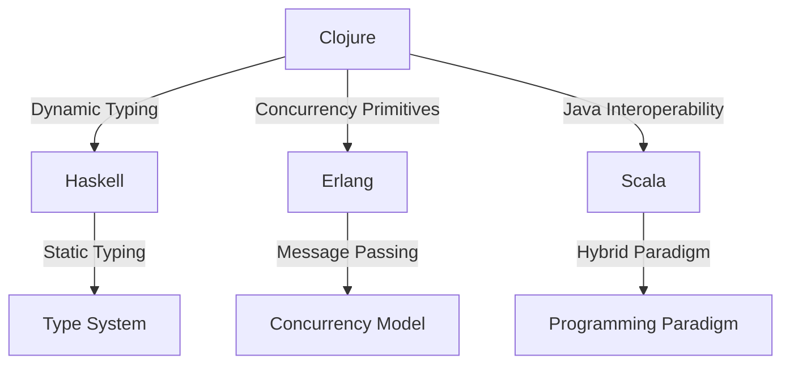

## 1.5. Comparing Clojure with Other Functional Languages

Clojure is a modern, dynamic, and functional programming language that runs on the Java Virtual Machine (JVM). It has gained popularity for its simplicity, powerful concurrency support, and seamless Java interoperability. In this section, we will compare Clojure with other prominent functional programming languages, such as Haskell, Erlang, and Scala. We will explore their core features, type systems, syntax, concurrency models, and ecosystems to understand where Clojure stands and when it might be the preferred choice.

### Introduction to Functional Programming Languages

Functional programming languages emphasize the use of functions, immutability, and declarative code. They are designed to handle symbolic computation and list processing applications. Let's dive into the specifics of each language and see how Clojure compares.

### Haskell

#### Overview

Haskell is a statically typed, purely functional programming language known for its strong type system and lazy evaluation. It is often used in academia and industries that require high assurance software.

#### Key Features

- **Static Typing**: Haskell's type system is one of its most defining features. It uses a strong, static type system with type inference, which helps catch errors at compile time.
- **Lazy Evaluation**: Haskell evaluates expressions only when needed, which can lead to performance improvements and the ability to work with infinite data structures.
- **Purity**: Functions in Haskell are pure, meaning they have no side effects, which makes reasoning about code easier.

#### Comparison with Clojure

- **Typing**: Clojure is dynamically typed, which offers more flexibility but less compile-time error checking compared to Haskell's static typing.
- **Evaluation**: Clojure uses eager evaluation by default, unlike Haskell's lazy evaluation. However, Clojure supports laziness through lazy sequences.
- **Purity**: While Clojure encourages functional programming, it is not purely functional like Haskell. Clojure allows side effects, which can be managed using its concurrency primitives.

#### Code Example

Here's a simple example to illustrate the difference in syntax and typing between Haskell and Clojure:

**Haskell:**

```haskell
-- A simple function to add two numbers
add :: Int -> Int -> Int
add x y = x + y
```

**Clojure:**

```clojure
;; A simple function to add two numbers
(defn add [x y]
  (+ x y))
```

### Erlang

#### Overview

Erlang is a functional language designed for building scalable and fault-tolerant systems. It is widely used in telecommunications and systems that require high availability.

#### Key Features

- **Concurrency**: Erlang's concurrency model is based on lightweight processes and message passing, making it ideal for distributed systems.
- **Fault Tolerance**: Erlang's "let it crash" philosophy and supervision trees help build robust systems.
- **Hot Code Swapping**: Erlang allows code to be updated without stopping the system, which is crucial for high-availability applications.

#### Comparison with Clojure

- **Concurrency**: Clojure also supports concurrency but uses different primitives like atoms, refs, and agents. Clojure's concurrency model is more suited for shared-memory systems, while Erlang excels in distributed environments.
- **Fault Tolerance**: Erlang's built-in support for fault tolerance is more mature compared to Clojure, which relies on Java's exception handling mechanisms.
- **Ecosystem**: Clojure benefits from the vast Java ecosystem, whereas Erlang has a more niche ecosystem focused on telecommunications and distributed systems.

#### Code Example

Let's compare a simple concurrent operation in Erlang and Clojure:

**Erlang:**

```erlang
% Spawning a process in Erlang
spawn(fun() -> io:format("Hello from Erlang~n") end).
```

**Clojure:**

```clojure
;; Spawning a thread in Clojure
(future (println "Hello from Clojure"))
```

### Scala

#### Overview

Scala is a hybrid functional and object-oriented language that runs on the JVM. It is designed to be concise and to integrate seamlessly with Java.

#### Key Features

- **Hybrid Paradigm**: Scala combines functional programming with object-oriented features, offering flexibility in design.
- **Static Typing**: Scala has a strong static type system with type inference, similar to Haskell.
- **Interoperability**: Scala's seamless interoperability with Java is one of its strongest selling points.

#### Comparison with Clojure

- **Typing**: Like Haskell, Scala is statically typed, whereas Clojure is dynamically typed. This affects how errors are caught and how flexible the code can be.
- **Syntax**: Scala's syntax is more similar to Java, which can be an advantage for developers familiar with Java. Clojure's Lisp-like syntax can be a barrier but offers powerful metaprogramming capabilities.
- **Concurrency**: Both Scala and Clojure offer robust concurrency support. Scala uses the Actor model through Akka, while Clojure provides concurrency primitives and core.async for asynchronous programming.

#### Code Example

Here's a comparison of a simple function in Scala and Clojure:

**Scala:**

```scala
// A simple function to add two numbers
def add(x: Int, y: Int): Int = x + y
```

**Clojure:**

```clojure
;; A simple function to add two numbers
(defn add [x y]
  (+ x y))
```

### Visualizing the Differences

To better understand the differences between these languages, let's visualize their key characteristics:



**Figure 1**: Visualizing the key characteristics of Clojure compared to Haskell, Erlang, and Scala.

### When to Choose Clojure

Clojure might be preferred over other functional languages in scenarios where:

- **Java Interoperability**: You need to leverage existing Java libraries or infrastructure.
- **Dynamic Typing**: You prefer the flexibility of dynamic typing and are comfortable with runtime error handling.
- **Concurrency**: You require robust concurrency support for shared-memory systems.
- **Metaprogramming**: You want to take advantage of Clojure's powerful macro system for metaprogramming.

### Try It Yourself

Experiment with the code examples provided above. Try modifying the functions to perform different operations or add additional features. For instance, you could:

- Change the `add` function to perform subtraction or multiplication.
- Implement a simple concurrent task using Clojure's `core.async` library.

### Knowledge Check

- What are the main differences between Clojure's and Haskell's type systems?
- How does Erlang's concurrency model differ from Clojure's?
- In what scenarios might Scala's static typing be advantageous over Clojure's dynamic typing?

### Summary

In this section, we've compared Clojure with other functional programming languages like Haskell, Erlang, and Scala. Each language has its strengths and weaknesses, and the choice of language often depends on the specific requirements of the project. Clojure stands out for its simplicity, powerful concurrency support, and seamless Java interoperability, making it a strong contender for many modern software development projects.

### Ready to Test Your Knowledge?



### What is a key feature of Haskell that distinguishes it from Clojure?

- [x] Static typing with type inference
- [ ] Dynamic typing
- [ ] Java interoperability
- [ ] Message passing concurrency

> **Explanation:** Haskell is known for its static typing with type inference, which helps catch errors at compile time.

### How does Clojure handle concurrency differently from Erlang?

- [x] Uses concurrency primitives like atoms, refs, and agents
- [ ] Uses message passing and lightweight processes
- [ ] Relies on Java's exception handling
- [ ] Implements the Actor model

> **Explanation:** Clojure uses concurrency primitives like atoms, refs, and agents, while Erlang uses message passing and lightweight processes.

### Which language is known for its "let it crash" philosophy?

- [ ] Clojure
- [x] Erlang
- [ ] Haskell
- [ ] Scala

> **Explanation:** Erlang is known for its "let it crash" philosophy, which helps build robust systems.

### What is a benefit of Clojure's dynamic typing?

- [x] Flexibility in coding
- [ ] Compile-time error checking
- [ ] Strong type system
- [ ] Lazy evaluation

> **Explanation:** Clojure's dynamic typing offers flexibility in coding, allowing for more adaptable code structures.

### Which language offers seamless interoperability with Java?

- [x] Scala
- [x] Clojure
- [ ] Haskell
- [ ] Erlang

> **Explanation:** Both Scala and Clojure offer seamless interoperability with Java, making them suitable for JVM-based projects.

### What is a common use case for Erlang?

- [ ] Academic research
- [x] Telecommunications
- [ ] Web development
- [ ] Data science

> **Explanation:** Erlang is widely used in telecommunications and systems that require high availability.

### How does Scala's syntax compare to Clojure's?

- [x] More similar to Java
- [ ] Lisp-like
- [ ] Purely functional
- [ ] Uses message passing

> **Explanation:** Scala's syntax is more similar to Java, which can be an advantage for developers familiar with Java.

### What is a unique feature of Clojure's macro system?

- [x] Powerful metaprogramming capabilities
- [ ] Static typing
- [ ] Lazy evaluation
- [ ] Message passing

> **Explanation:** Clojure's macro system offers powerful metaprogramming capabilities, allowing for code transformation and generation.

### Which language uses the Actor model for concurrency?

- [ ] Clojure
- [ ] Haskell
- [x] Scala
- [ ] Erlang

> **Explanation:** Scala uses the Actor model for concurrency, particularly through the Akka library.

### True or False: Clojure is a purely functional language like Haskell.

- [ ] True
- [x] False

> **Explanation:** Clojure is not purely functional like Haskell; it allows side effects and provides mechanisms to manage them.



Remember, this is just the beginning. As you progress, you'll build more complex and interactive applications using Clojure. Keep experimenting, stay curious, and enjoy the journey!
