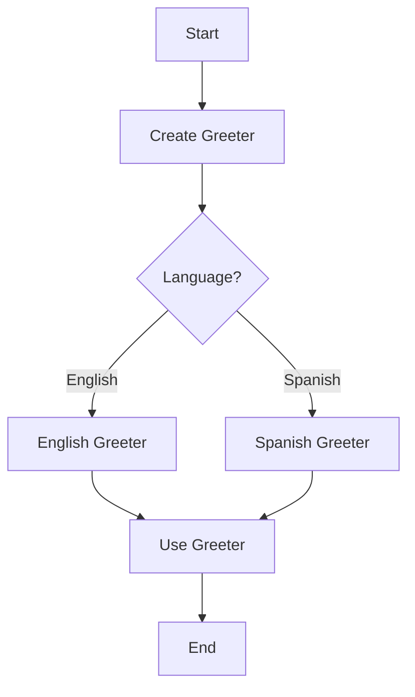

## 1.6. Benefits of Using Design Patterns in Clojure

Design patterns are a cornerstone of software development, providing reusable solutions to common problems. In Clojure, a language that embraces functional programming paradigms, design patterns offer unique advantages that enhance code modularity, readability, and maintainability. This section explores the benefits of using design patterns in Clojure, illustrating how they address specific challenges in functional programming and lead to more predictable and testable code.

### Key Benefits of Using Design Patterns in Clojure

1. **Enhancing Code Modularity**

   Design patterns promote modularity by encouraging the separation of concerns. In Clojure, this is achieved through the use of higher-order functions, protocols, and multimethods. By encapsulating behavior and data, patterns like the Component Pattern facilitate the construction of modular systems.

   ```clojure
   ;; Example of using protocols for modularity
   (defprotocol Greeter
     (greet [this]))

   (defrecord EnglishGreeter []
     Greeter
     (greet [this] "Hello!"))

   (defrecord SpanishGreeter []
     Greeter
     (greet [this] "¡Hola!"))

   ;; Usage
   (defn greet-user [greeter]
     (println (greet greeter)))

   (greet-user (->EnglishGreeter))
   (greet-user (->SpanishGreeter))
   ```

   In this example, the `Greeter` protocol defines a contract for greeting behavior, allowing different implementations to be swapped easily without affecting the rest of the system.

2. **Improving Code Readability**

   Patterns provide a common vocabulary for developers, making code more understandable. In Clojure, patterns like the Threading Macros (`->` and `->>`) improve readability by clarifying the flow of data through a series of transformations.

   ```clojure
   ;; Using threading macros for readability
   (->> [1 2 3 4 5]
        (map inc)
        (filter even?)
        (reduce +))
   ```

   Here, the threading macro `->>` makes it clear that the list is being incremented, filtered, and then reduced, enhancing the readability of the code.

3. **Facilitating Code Maintainability**

   By promoting consistent solutions to common problems, design patterns make code easier to maintain. Patterns like the Factory Function Pattern allow for the creation of objects in a consistent manner, reducing the likelihood of errors when changes are needed.

   ```clojure
   ;; Factory function pattern
   (defn create-greeter [language]
     (case language
       :english (->EnglishGreeter)
       :spanish (->SpanishGreeter)))

   ;; Usage
   (def english-greeter (create-greeter :english))
   (def spanish-greeter (create-greeter :spanish))
   ```

   This factory function provides a single point of change for creating greeter objects, simplifying maintenance.

4. **Addressing Common Challenges in Functional Programming**

   Functional programming introduces challenges such as managing state and handling side effects. Design patterns like the State Pattern and the Strategy Pattern offer solutions by encapsulating state and behavior, making it easier to reason about code.

   ```clojure
   ;; State pattern using atoms
   (defn create-counter []
     (let [state (atom 0)]
       {:increment (fn [] (swap! state inc))
        :decrement (fn [] (swap! state dec))
        :value (fn [] @state)}))

   ;; Usage
   (def counter (create-counter))
   ((:increment counter))
   ((:value counter)) ;; => 1
   ```

   The use of atoms in this state pattern example allows for safe state management in a functional context.

5. **Leading to More Predictable and Testable Code**

   Design patterns contribute to predictability by providing well-defined structures and behaviors. This predictability extends to testing, as patterns often lead to code that is easier to isolate and test. The use of the Command Pattern, for instance, allows for the encapsulation of operations, making them easier to test independently.

   ```clojure
   ;; Command pattern example
   (defn execute-command [command]
     (command))

   (defn print-command []
     (println "Executing command"))

   ;; Usage
   (execute-command print-command)
   ```

   By encapsulating commands as functions, we can easily test each command in isolation.

6. **Leveraging Clojure's Strengths**

   Clojure's strengths lie in its functional nature, immutability, and powerful concurrency models. Design patterns help leverage these strengths by providing structures that align with Clojure's paradigms. For example, the use of persistent data structures in the Flyweight Pattern allows for efficient memory usage and performance.

   ```clojure
   ;; Flyweight pattern using persistent data structures
   (def flyweights (atom {}))

   (defn get-flyweight [key]
     (if-let [fw (get @flyweights key)]
       fw
       (let [new-fw (create-new-flyweight key)]
         (swap! flyweights assoc key new-fw)
         new-fw)))

   ;; Usage
   (get-flyweight :example)
   ```

   This pattern demonstrates how Clojure's persistent data structures can be used to efficiently manage shared data.

### Patterns Particularly Effective in Functional Programming

1. **The Component Pattern**

   The Component Pattern is particularly effective in Clojure for building systems with clear boundaries and dependencies. It allows for the composition of systems from individual components, each responsible for a specific piece of functionality.

   ```clojure
   ;; Component pattern example
   (defn create-database-component []
     {:start (fn [] (println "Starting database"))
      :stop (fn [] (println "Stopping database"))})

   (defn create-web-server-component []
     {:start (fn [] (println "Starting web server"))
      :stop (fn [] (println "Stopping web server"))})

   ;; Usage
   (def db-component (create-database-component))
   ((:start db-component))
   ```

   This pattern facilitates the management of complex systems by breaking them down into manageable components.

2. **The Strategy Pattern**

   The Strategy Pattern is effective in functional programming for encapsulating algorithms and allowing them to be selected at runtime. This pattern aligns well with Clojure's emphasis on functions as first-class citizens.

   ```clojure
   ;; Strategy pattern example
   (defn execute-strategy [strategy]
     (strategy))

   (defn strategy-a []
     (println "Executing strategy A"))

   (defn strategy-b []
     (println "Executing strategy B"))

   ;; Usage
   (execute-strategy strategy-a)
   (execute-strategy strategy-b)
   ```

   By encapsulating strategies as functions, we can easily swap them at runtime, enhancing flexibility.

### Encouraging the Use of Patterns

Design patterns are not just theoretical constructs; they are practical tools that can significantly improve the quality of your Clojure code. By considering patterns as a means to leverage Clojure's strengths fully, you can write more robust, efficient, and elegant code. Remember, this is just the beginning. As you progress, you'll discover more patterns and techniques that will enhance your Clojure development skills. Keep experimenting, stay curious, and enjoy the journey!

### Visualizing Design Patterns in Clojure

To further illustrate the benefits of design patterns in Clojure, let's visualize the flow of data and control in some of the patterns discussed.



**Diagram Description:** This flowchart visualizes the Factory Function Pattern, showing how different greeter objects are created based on the language input.

### References and Further Reading

- [Clojure Design Patterns](https://clojure.org)
- [Functional Programming Patterns](https://www.manning.com/books/functional-programming-patterns-in-scala-and-clojure)
- [Design Patterns: Elements of Reusable Object-Oriented Software](https://www.amazon.com/Design-Patterns-Elements-Reusable-Object-Oriented/dp/0201633612)

### Knowledge Check

Let's reinforce what we've learned with some questions and exercises.

## **Ready to Test Your Knowledge?**



### What is one of the main benefits of using design patterns in Clojure?

- [x] Enhancing code modularity
- [ ] Increasing code complexity
- [ ] Reducing code readability
- [ ] Making code less predictable

> **Explanation:** Design patterns enhance code modularity by promoting the separation of concerns and encapsulation of behavior.

### Which pattern is particularly effective for managing state in Clojure?

- [x] State Pattern
- [ ] Singleton Pattern
- [ ] Factory Pattern
- [ ] Observer Pattern

> **Explanation:** The State Pattern is effective for managing state in Clojure, especially with the use of atoms and state machines.

### How do design patterns improve code readability in Clojure?

- [x] By providing a common vocabulary and structure
- [ ] By making code more verbose
- [ ] By hiding implementation details
- [ ] By increasing the number of lines of code

> **Explanation:** Design patterns improve readability by providing a common vocabulary and structure, making it easier for developers to understand the code.

### What is a key advantage of using the Factory Function Pattern?

- [x] Consistent object creation
- [ ] Reducing the number of functions
- [ ] Increasing code complexity
- [ ] Making code less maintainable

> **Explanation:** The Factory Function Pattern provides a consistent way to create objects, simplifying maintenance and reducing errors.

### Which pattern is used to encapsulate algorithms in Clojure?

- [x] Strategy Pattern
- [ ] Observer Pattern
- [ ] Singleton Pattern
- [ ] Factory Pattern

> **Explanation:** The Strategy Pattern is used to encapsulate algorithms, allowing them to be selected at runtime.

### How do design patterns contribute to testability?

- [x] By providing well-defined structures and behaviors
- [ ] By making code more complex
- [ ] By reducing the number of test cases
- [ ] By hiding implementation details

> **Explanation:** Design patterns contribute to testability by providing well-defined structures and behaviors, making code easier to isolate and test.

### Which Clojure feature is leveraged by the Flyweight Pattern?

- [x] Persistent data structures
- [ ] Dynamic typing
- [ ] Macros
- [ ] Lazy sequences

> **Explanation:** The Flyweight Pattern leverages Clojure's persistent data structures for efficient memory usage and performance.

### What is the role of threading macros in Clojure?

- [x] Improving code readability
- [ ] Increasing code complexity
- [ ] Reducing code modularity
- [ ] Making code less maintainable

> **Explanation:** Threading macros improve code readability by clarifying the flow of data through a series of transformations.

### True or False: Design patterns are only useful in object-oriented programming.

- [ ] True
- [x] False

> **Explanation:** False. Design patterns are useful in various programming paradigms, including functional programming, as they provide reusable solutions to common problems.

### Which pattern is effective for building systems with clear boundaries and dependencies?

- [x] Component Pattern
- [ ] Singleton Pattern
- [ ] Observer Pattern
- [ ] Factory Pattern

> **Explanation:** The Component Pattern is effective for building systems with clear boundaries and dependencies, facilitating the composition of systems from individual components.



By understanding and applying design patterns in Clojure, you can enhance your code's modularity, readability, and maintainability, leading to more robust and efficient software solutions. Keep exploring and experimenting with these patterns to fully leverage Clojure's strengths in your development projects.
