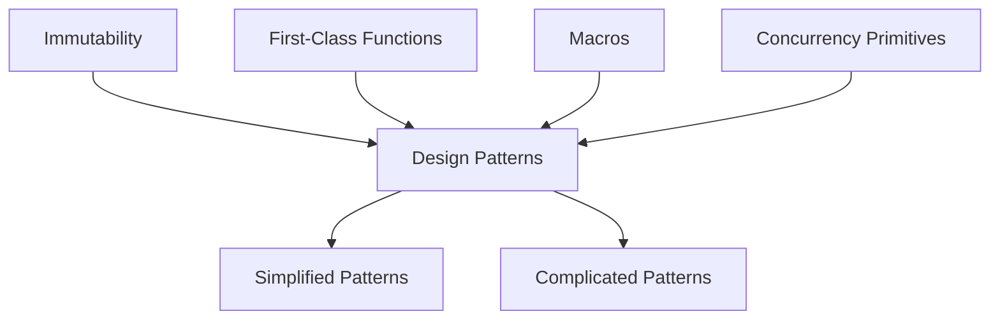

## 1.7. Overview of Clojure's Features Relevant to Design Patterns

Clojure, a modern Lisp dialect, brings a unique set of features to the table that significantly influence how design patterns are applied. Understanding these features is crucial for effectively leveraging design patterns in Clojure. In this section, we will explore Clojure's key features, such as immutability, first-class functions, macros, and concurrency primitives, and discuss how they impact the implementation of traditional design patterns.

### Immutability

**Immutability** is a cornerstone of Clojure's design philosophy. In Clojure, data structures are immutable by default, meaning once created, they cannot be changed. This immutability simplifies reasoning about code, as data does not change unexpectedly, and it eliminates a class of bugs related to mutable state.

#### Impact on Design Patterns

Immutability affects design patterns by reducing the need for certain patterns that manage state changes. For example, the **Observer Pattern**, which typically involves mutable state, can be simplified in Clojure by using immutable data structures and functional transformations.

#### Example: Immutable Data Structures

```clojure
(def my-vector [1 2 3 4 5])

;; Adding an element to the vector
(def new-vector (conj my-vector 6))

;; Original vector remains unchanged
(println my-vector)  ; Output: [1 2 3 4 5]
(println new-vector) ; Output: [1 2 3 4 5 6]
```

### First-Class Functions

Clojure treats functions as first-class citizens, meaning they can be passed as arguments, returned from other functions, and assigned to variables. This feature is a hallmark of functional programming and enables powerful abstractions and code reuse.

#### Impact on Design Patterns

First-class functions simplify the implementation of patterns like the **Strategy Pattern**. Instead of creating multiple classes to represent different strategies, we can use functions to encapsulate behavior.

#### Example: Strategy Pattern with Functions

```clojure
(defn add [a b] (+ a b))
(defn subtract [a b] (- a b))

(defn execute-strategy [strategy a b]
  (strategy a b))

;; Using different strategies
(println (execute-strategy add 5 3))      ; Output: 8
(println (execute-strategy subtract 5 3)) ; Output: 2
```

### Macros

**Macros** in Clojure allow for metaprogramming, enabling developers to extend the language by writing code that generates code. This feature is powerful for creating domain-specific languages (DSLs) and simplifying repetitive code patterns.

#### Impact on Design Patterns

Macros can be used to implement patterns that require boilerplate code, such as the **Decorator Pattern**. By abstracting repetitive code, macros make it easier to apply these patterns consistently.

#### Example: Simple Macro

```clojure
(defmacro unless [condition body]
  `(if (not ~condition)
     ~body))

;; Using the macro
(unless false
  (println "This will print because the condition is false."))
```

### Concurrency Primitives

Clojure provides a robust set of concurrency primitives, including **Atoms**, **Refs**, **Agents**, and **Vars**, which facilitate safe and efficient concurrent programming. These primitives are designed to work seamlessly with Clojure's immutable data structures.

#### Impact on Design Patterns

Concurrency primitives influence patterns like the **Singleton Pattern**, where managing shared state is crucial. In Clojure, Atoms can be used to manage shared state safely without explicit locking.

#### Example: Managing State with Atoms

```clojure
(def counter (atom 0))

(defn increment-counter []
  (swap! counter inc))

(increment-counter)
(println @counter) ; Output: 1
```

### Simplifying and Complicating Patterns

While Clojure's features simplify the implementation of many design patterns, they can also complicate others. For instance, patterns that rely heavily on mutable state or object-oriented inheritance may require rethinking in a functional context.

#### Simplified Patterns

- **Factory Pattern**: Easily implemented using functions that return maps or records.
- **Command Pattern**: Functions can naturally encapsulate commands without the need for additional classes.

#### Complicated Patterns

- **Visitor Pattern**: Requires creative use of multimethods or protocols to achieve similar behavior in a functional paradigm.
- **State Pattern**: Managing state transitions can be more complex without mutable objects.

### Preparing for Design Patterns in Clojure

Understanding Clojure's features is essential for effectively applying design patterns. As we explore various patterns, keep in mind how immutability, first-class functions, macros, and concurrency primitives can be leveraged to create more robust and elegant solutions.

### Try It Yourself

Experiment with the examples provided by modifying the functions and macros. Try creating your own macros or implementing a simple design pattern using Clojure's features. This hands-on approach will deepen your understanding and prepare you for more complex patterns.

### Visualizing Clojure's Features

To better understand how these features interact, let's visualize the relationships between Clojure's core concepts and design patterns.



**Figure 1:** Visualization of how Clojure's features influence design patterns.

### References and Further Reading

- [Clojure Official Documentation](https://clojure.org/reference)
- [Functional Programming in Clojure](https://www.braveclojure.com/)
- [Concurrency in Clojure](https://clojure.org/reference/atoms)

### Knowledge Check

- How does immutability affect the implementation of the Observer Pattern in Clojure?
- What are the benefits of using first-class functions in design patterns?
- How can macros simplify the Decorator Pattern?
- What role do concurrency primitives play in managing shared state?

### Embrace the Journey

Remember, this is just the beginning. As you progress, you'll discover more ways to leverage Clojure's features to implement design patterns effectively. Keep experimenting, stay curious, and enjoy the journey!

## **Ready to Test Your Knowledge?**



### How does immutability simplify design patterns in Clojure?

- [x] By reducing the need for patterns that manage state changes
- [ ] By making data structures mutable
- [ ] By complicating the implementation of patterns
- [ ] By requiring more boilerplate code

> **Explanation:** Immutability simplifies design patterns by reducing the need for patterns that manage state changes, as data does not change unexpectedly.

### What is the benefit of first-class functions in Clojure?

- [x] They enable powerful abstractions and code reuse
- [ ] They make functions mutable
- [ ] They complicate code organization
- [ ] They require additional libraries

> **Explanation:** First-class functions enable powerful abstractions and code reuse by allowing functions to be passed as arguments, returned from other functions, and assigned to variables.

### How do macros impact the implementation of design patterns?

- [x] By allowing code generation and reducing boilerplate
- [ ] By making code less readable
- [ ] By introducing more complexity
- [ ] By requiring more memory

> **Explanation:** Macros allow code generation and reduce boilerplate, making it easier to implement patterns consistently.

### Which concurrency primitive is used to manage shared state in Clojure?

- [x] Atoms
- [ ] Lists
- [ ] Vectors
- [ ] Maps

> **Explanation:** Atoms are used to manage shared state in Clojure, providing a way to safely update state without explicit locking.

### What is a challenge of implementing the Visitor Pattern in Clojure?

- [x] Achieving similar behavior in a functional paradigm
- [ ] Managing mutable state
- [ ] Using object-oriented inheritance
- [ ] Creating additional classes

> **Explanation:** The challenge is achieving similar behavior in a functional paradigm, as the Visitor Pattern relies on object-oriented inheritance.

### How can the Factory Pattern be implemented in Clojure?

- [x] Using functions that return maps or records
- [ ] Using mutable objects
- [ ] Using inheritance
- [ ] Using explicit locking

> **Explanation:** The Factory Pattern can be implemented using functions that return maps or records, leveraging Clojure's functional nature.

### What is a benefit of using macros in Clojure?

- [x] They enable metaprogramming and code generation
- [ ] They make code less maintainable
- [ ] They require more boilerplate
- [ ] They complicate debugging

> **Explanation:** Macros enable metaprogramming and code generation, allowing developers to extend the language and simplify repetitive code patterns.

### How does Clojure handle concurrency?

- [x] With concurrency primitives like Atoms, Refs, and Agents
- [ ] With mutable objects
- [ ] With explicit locking
- [ ] With inheritance

> **Explanation:** Clojure handles concurrency with primitives like Atoms, Refs, and Agents, which facilitate safe and efficient concurrent programming.

### What is the role of first-class functions in the Strategy Pattern?

- [x] They encapsulate behavior without the need for additional classes
- [ ] They make code less readable
- [ ] They complicate the pattern
- [ ] They require more memory

> **Explanation:** First-class functions encapsulate behavior without the need for additional classes, simplifying the implementation of the Strategy Pattern.

### True or False: Clojure's immutability complicates the implementation of design patterns.

- [ ] True
- [x] False

> **Explanation:** False. Clojure's immutability simplifies the implementation of design patterns by reducing the need for patterns that manage state changes.


