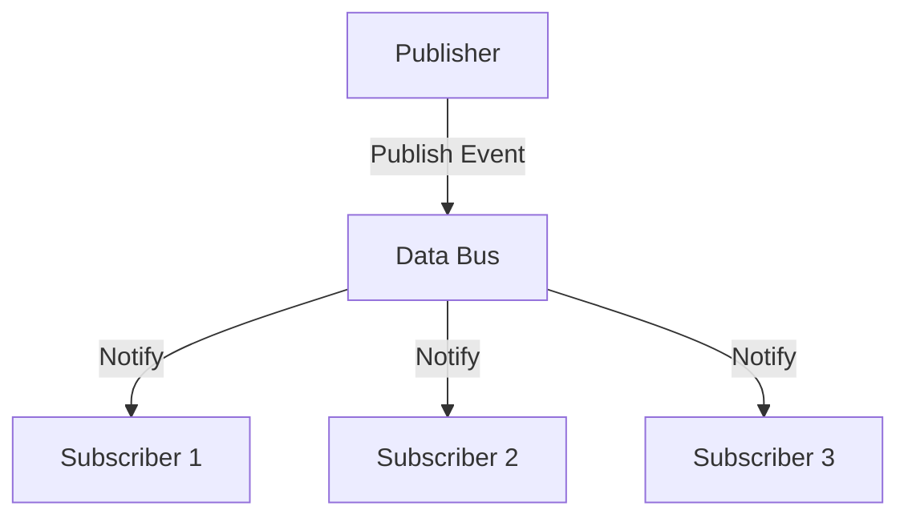

## 10.1 Data Bus in Clojure

In modern software architecture, decoupling components is essential for building scalable and maintainable systems. The Data Bus pattern is a powerful tool that facilitates communication between different parts of an application through a centralized bus. This pattern allows components to publish and subscribe to events or messages without direct dependencies, ensuring efficient and consistent data propagation throughout the system.

### Introduction

The Data Bus pattern acts as a mediator that handles the flow of information between various components in a system. By centralizing communication, it reduces the need for components to be aware of each other's existence, promoting a more modular and flexible architecture. This pattern is particularly useful in event-driven systems where different parts of the application need to react to changes or events occurring elsewhere.

### Detailed Explanation

The core idea of the Data Bus pattern is to provide a centralized mechanism for message exchange. Components can register interest in certain events (subscribe) and emit events (publish) without knowing who the receivers are. This decoupling is achieved through a publish/subscribe mechanism, where the data bus acts as the intermediary.

#### Components of the Data Bus Pattern

1. **Data Bus:** The central hub that manages subscriptions and broadcasts events to interested subscribers.
2. **Publishers:** Components that emit events or messages to the data bus.
3. **Subscribers:** Components that register interest in specific events and react when those events are published.

#### Workflow

1. **Subscription:** Components subscribe to specific events by providing a handler function that will be executed when the event is published.
2. **Publishing:** When an event occurs, a publisher sends the event to the data bus, which then notifies all subscribers of that event.
3. **Event Handling:** Subscribers execute their handler functions in response to the published event.

### Implementing a Simple Data Bus in Clojure

Let's implement a basic Data Bus using Clojure's atom for state management and a simple publish/subscribe mechanism.

```clojure
(def data-bus (atom {}))

(defn subscribe [event handler]
  (swap! data-bus update event conj handler))

(defn publish [event data]
  (doseq [handler (get @data-bus event)]
    (handler data)))
```

#### Example Usage

**Subscribe to an Event:**

```clojure
(subscribe :user-registered
  (fn [user]
    (println "User registered:" user)))
```

**Publish an Event:**

```clojure
(publish :user-registered {:id 1 :name "Alice"})
```

### Handling Asynchronous Communication

For more complex applications, handling events asynchronously can be beneficial. Clojure's `core.async` library provides tools for managing asynchronous communication.

```clojure
(require '[clojure.core.async :refer [chan pub sub >!! <! go-loop]])

(def event-chan (chan))
(def event-pub (pub event-chan :event))

(defn async-publish [event data]
  (>!! event-chan (assoc data :event event)))

(defn async-subscribe [event handler]
  (let [sub-chan (chan)]
    (sub event-pub event sub-chan)
    (go-loop []
      (when-let [data (<! sub-chan)]
        (handler data)
        (recur)))))
```

### Managing Event Types and Namespaces

To maintain clarity and organization, it's important to define standardized event names and document their usage. Grouping events into namespaces or categories can help manage complexity and improve readability.

### Ensuring Thread Safety

When implementing the Data Bus pattern, ensure thread safety by using atomic operations. Avoid race conditions when modifying subscriptions by leveraging Clojure's immutable data structures and concurrency primitives.

### Visual Representation

Here's a conceptual diagram illustrating the Data Bus pattern:



### Advantages and Disadvantages

**Advantages:**
- **Decoupling:** Reduces dependencies between components, enhancing modularity.
- **Scalability:** Facilitates scaling by allowing components to be added or removed without affecting others.
- **Flexibility:** Supports dynamic subscription and unsubscription of events.

**Disadvantages:**
- **Complexity:** Can introduce complexity in managing event flows and debugging.
- **Performance:** May incur overhead in systems with high-frequency events.

### Best Practices

- **Use Descriptive Event Names:** Ensure event names are descriptive and consistent to avoid confusion.
- **Document Event Flows:** Maintain clear documentation of event flows and their handlers.
- **Monitor Performance:** Regularly monitor the performance impact of the data bus, especially in high-load scenarios.

### Conclusion

The Data Bus pattern is a versatile tool for managing communication in decoupled systems. By centralizing event handling, it promotes a clean separation of concerns and enhances the flexibility of your architecture. Whether you're building a simple application or a complex distributed system, the Data Bus pattern can help streamline communication and improve maintainability.

## Quiz Time!



### What is the primary purpose of the Data Bus pattern?

- [x] To facilitate communication between decoupled components through a centralized bus.
- [ ] To directly connect components for faster communication.
- [ ] To store data persistently across the application.
- [ ] To manage database transactions efficiently.

> **Explanation:** The Data Bus pattern centralizes communication, allowing components to publish and subscribe to events without direct dependencies.

### Which Clojure construct is used to manage state in the simple Data Bus implementation?

- [x] Atom
- [ ] Ref
- [ ] Agent
- [ ] Var

> **Explanation:** An atom is used to manage the state of subscriptions in the simple Data Bus implementation.

### How does the Data Bus pattern promote decoupling?

- [x] By allowing components to publish and subscribe to events without knowing each other.
- [ ] By enforcing direct method calls between components.
- [ ] By storing all component data in a central database.
- [ ] By using global variables to share data.

> **Explanation:** The Data Bus pattern allows components to communicate through events, reducing direct dependencies.

### What library is suggested for handling asynchronous communication in the Data Bus pattern?

- [x] core.async
- [ ] clojure.java.io
- [ ] clojure.set
- [ ] clojure.walk

> **Explanation:** The `core.async` library is used for managing asynchronous communication in Clojure.

### What is a potential disadvantage of the Data Bus pattern?

- [x] It can introduce complexity in managing event flows.
- [ ] It tightly couples components.
- [ ] It requires a relational database.
- [ ] It limits the scalability of the system.

> **Explanation:** The Data Bus pattern can introduce complexity, especially in managing and debugging event flows.

### In the provided implementation, how are events published?

- [x] Using the `publish` function.
- [ ] By directly calling subscriber functions.
- [ ] Through a database trigger.
- [ ] By sending HTTP requests.

> **Explanation:** Events are published using the `publish` function, which notifies all subscribers.

### What is the role of the `subscribe` function in the Data Bus pattern?

- [x] To register a handler for a specific event.
- [ ] To send data to the database.
- [ ] To execute a handler immediately.
- [ ] To remove a handler from an event.

> **Explanation:** The `subscribe` function registers a handler that will be executed when the specified event is published.

### How can event types be managed effectively in a Data Bus system?

- [x] By defining standardized event names and organizing them into namespaces.
- [ ] By using random strings for event names.
- [ ] By storing event types in a global variable.
- [ ] By hardcoding event names in each component.

> **Explanation:** Standardized event names and namespaces help manage event types effectively, improving clarity and organization.

### What is a key benefit of using `core.async` for event handling?

- [x] It allows for asynchronous event processing.
- [ ] It simplifies synchronous data access.
- [ ] It automatically scales the application.
- [ ] It provides built-in logging capabilities.

> **Explanation:** `core.async` enables asynchronous event processing, which can improve performance and responsiveness.

### True or False: The Data Bus pattern requires components to have direct dependencies on each other.

- [ ] True
- [x] False

> **Explanation:** False. The Data Bus pattern promotes decoupling by allowing components to communicate without direct dependencies.


