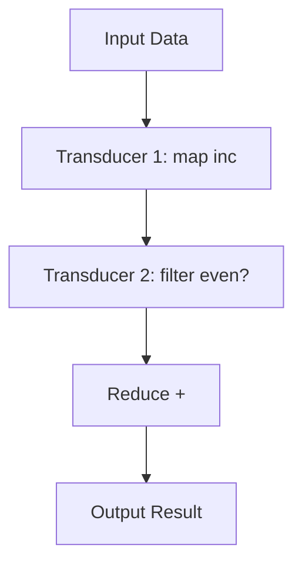

## 10.10. Transducers for Efficient Data Transformation

In the realm of functional programming, Clojure stands out with its robust features for data processing. Among these features, transducers offer a powerful and efficient means to transform data without the overhead of creating intermediate collections. This section delves into the concept of transducers, illustrating their benefits, usage, and best practices.

### Understanding Transducers

Transducers in Clojure are a generalization of the map, filter, and other sequence operations. They allow you to compose processing steps without tying them to a specific data structure. This means you can apply the same transformation logic to different types of collections, streams, or channels, making your code more reusable and efficient.

#### Key Characteristics of Transducers

- **Composable**: Transducers can be composed together to form complex transformations.
- **Efficient**: They avoid the creation of intermediate collections, reducing memory overhead.
- **Versatile**: Transducers can be applied to various data sources, including sequences, channels, and streams.

### How Transducers Differ from Regular Sequence Operations

Traditional sequence operations like `map` and `filter` are tied to specific collections and often generate intermediate results. Transducers, on the other hand, decouple the transformation logic from the data source, allowing for more efficient processing.

```clojure
;; Traditional sequence operations
(defn process-sequence [coll]
  (->> coll
       (map inc)
       (filter even?)
       (reduce +)))

;; Using transducers
(defn process-with-transducers [coll]
  (transduce (comp (map inc) (filter even?)) + coll))
```

In the above example, the transducer version avoids creating intermediate collections, directly applying the composed transformations to the input data.

### Creating and Composing Transducers

To create a transducer, you use the same functions you would for sequence operations, but within the context of `comp` to compose them.

```clojure
(def my-transducer
  (comp
    (map inc)
    (filter even?)))

(defn apply-transducer [coll]
  (transduce my-transducer + coll))
```

Here, `my-transducer` is a composed transducer that increments each element and filters out odd numbers. It can be applied to any collection using `transduce`.

### Performance Improvements with Transducers

Transducers shine in scenarios where performance is critical, especially with large datasets. By eliminating intermediate collections, they reduce memory usage and improve execution speed.

#### Example: Performance Comparison

Consider a scenario where you need to process a large list of numbers:

```clojure
(def large-list (range 1e6))

;; Traditional approach
(time (reduce + (filter even? (map inc large-list))))

;; Transducer approach
(time (transduce (comp (map inc) (filter even?)) + large-list))
```

In this example, the transducer approach is likely to be faster and use less memory, as it processes elements in a single pass.

### When to Use Transducers

Transducers are particularly useful when:

- You need to process large datasets efficiently.
- You want to apply the same transformation logic across different data sources.
- You aim to reduce memory overhead by avoiding intermediate collections.

However, for simple transformations on small datasets, traditional sequence operations may be more straightforward and easier to read.

### Best Practices and Considerations

- **Start Simple**: Use transducers for complex pipelines where performance is a concern. For simple tasks, stick with sequence operations.
- **Compose Carefully**: Ensure that the composed transducers are logically correct and efficient.
- **Test Thoroughly**: As with any optimization, test the performance gains in your specific context.

### Visualizing Transducer Workflow

To better understand how transducers work, let's visualize the process using a flowchart:



This diagram illustrates how data flows through a series of transducers, culminating in a reduction operation.

### External Resources

For more in-depth information on transducers, refer to the [Transducers Reference](https://clojure.org/reference/transducers).

### Knowledge Check

Before we conclude, let's reinforce your understanding with some questions and exercises.

- **What are the main benefits of using transducers?**
- **How do transducers improve performance compared to regular sequence operations?**
- **Try modifying the provided code examples to include additional transformations.**

### Embrace the Journey

Remember, mastering transducers is a step towards writing more efficient and elegant Clojure code. Keep experimenting, stay curious, and enjoy the journey!

## **Ready to Test Your Knowledge?**



### What is a primary benefit of using transducers in Clojure?

- [x] They avoid creating intermediate collections.
- [ ] They are easier to read than regular sequence operations.
- [ ] They are only applicable to sequences.
- [ ] They automatically parallelize computations.

> **Explanation:** Transducers avoid creating intermediate collections, which reduces memory usage and improves performance.

### How do you compose multiple transducers together?

- [x] Using the `comp` function.
- [ ] Using the `concat` function.
- [ ] Using the `merge` function.
- [ ] Using the `reduce` function.

> **Explanation:** The `comp` function is used to compose multiple transducers into a single transformation pipeline.

### Which of the following is NOT a characteristic of transducers?

- [ ] Composable
- [ ] Efficient
- [ ] Versatile
- [x] Immutable

> **Explanation:** While transducers are composable, efficient, and versatile, immutability is not a characteristic specific to transducers.

### In which scenario are transducers most beneficial?

- [x] Processing large datasets efficiently.
- [ ] Performing simple transformations on small datasets.
- [ ] When readability is the primary concern.
- [ ] When using mutable data structures.

> **Explanation:** Transducers are most beneficial when processing large datasets efficiently, as they reduce memory overhead.

### What function is used to apply a transducer to a collection?

- [x] `transduce`
- [ ] `map`
- [ ] `filter`
- [ ] `reduce`

> **Explanation:** The `transduce` function is used to apply a transducer to a collection, combining transformation and reduction.

### True or False: Transducers can only be used with sequences.

- [ ] True
- [x] False

> **Explanation:** Transducers can be used with various data sources, including sequences, channels, and streams.

### What is a key consideration when composing transducers?

- [x] Ensuring logical correctness and efficiency.
- [ ] Using as many transducers as possible.
- [ ] Avoiding the use of `comp`.
- [ ] Always using transducers instead of sequence operations.

> **Explanation:** When composing transducers, it's important to ensure that they are logically correct and efficient.

### Which function is NOT typically used in creating transducers?

- [ ] `map`
- [ ] `filter`
- [x] `concat`
- [ ] `comp`

> **Explanation:** The `concat` function is not typically used in creating transducers, as it is not a transformation function.

### What is the role of the `reduce` function in a transducer pipeline?

- [x] It combines the results of the transformation.
- [ ] It initializes the transducer.
- [ ] It applies the transducer to a sequence.
- [ ] It filters out unwanted elements.

> **Explanation:** The `reduce` function combines the results of the transformation in a transducer pipeline.

### True or False: Transducers automatically parallelize computations.

- [ ] True
- [x] False

> **Explanation:** Transducers do not automatically parallelize computations; they focus on efficient data transformation.


