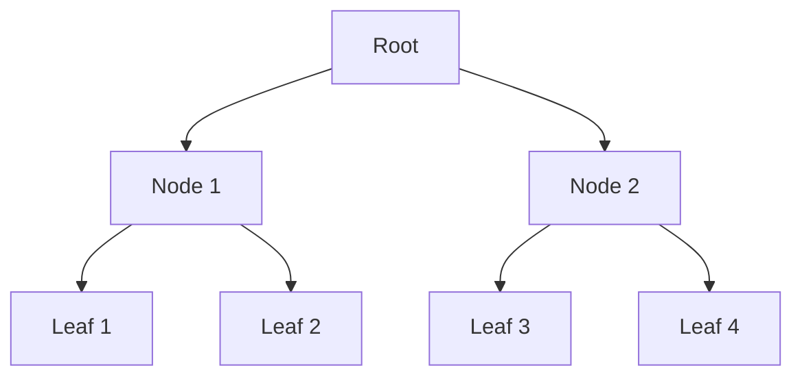

## 10.11. Persistent Data Structures and Performance

### Introduction

In the realm of functional programming, immutability is a cornerstone principle that offers numerous benefits, including easier reasoning about code, thread safety, and reduced side effects. However, immutability also poses challenges, particularly in terms of performance. Clojure, a modern Lisp dialect on the JVM, addresses these challenges through the use of persistent data structures. This section delves into the intricacies of Clojure's persistent data structures, examining their performance characteristics and providing insights into how they maintain efficiency despite being immutable.

### Understanding Persistent Data Structures

**Persistent data structures** are a type of data structure that preserves the previous version of itself when modified. This means that operations such as adding or removing elements do not overwrite the existing structure but instead create a new version that shares as much structure as possible with the old version. This sharing is what makes persistent data structures efficient in terms of both time and space.

#### How Persistent Data Structures Work

Persistent data structures in Clojure leverage a technique known as **structural sharing**. This technique allows new versions of a data structure to reuse parts of the old structure, minimizing the need for copying and thus reducing memory usage and improving performance.

Consider a simple example of a persistent list:

```clojure
(def original-list [1 2 3])
(def new-list (conj original-list 4))

;; original-list remains unchanged
;; new-list is [1 2 3 4]
```

In this example, `new-list` shares the first three elements with `original-list`, and only the new element `4` is added. This sharing is achieved through a data structure known as a **tree**, where nodes can point to other nodes, allowing for efficient updates.

### Performance Characteristics

#### Time Complexity

The performance of persistent data structures is often measured in terms of time complexity for various operations. Here are some common operations and their complexities in Clojure's persistent data structures:

- **Vectors**: Access and update operations are O(log32 N) due to their tree-like structure, where each node can have up to 32 children.
- **Lists**: Access is O(N), but adding or removing elements from the front is O(1).
- **Maps and Sets**: Both offer O(log32 N) complexity for operations like lookup, insertion, and deletion.

The logarithmic base 32 is a result of Clojure's use of **wide trees**, which are trees with a high branching factor. This reduces the depth of the tree, leading to faster operations.

#### Space Complexity

Persistent data structures are designed to be space-efficient. By sharing structure between versions, they minimize the need for additional memory. For example, when a new version of a vector is created, only the path from the root to the modified node needs to be copied, while the rest of the structure is shared.

### Benchmarks and Comparative Analysis

To better understand the performance of persistent data structures, let's consider some benchmarks comparing them to their mutable counterparts.

#### Benchmark Setup

We'll use a simple benchmark to compare the performance of Clojure's persistent vectors with Java's `ArrayList` for a series of append operations.

```clojure
(require '[criterium.core :refer [quick-bench]])

(defn benchmark-persistent-vector []
  (let [v (vec (range 100000))]
    (quick-bench (reduce conj v (range 1000)))))

(defn benchmark-array-list []
  (let [al (java.util.ArrayList. (range 100000))]
    (quick-bench (doseq [i (range 1000)] (.add al i)))))
```

#### Results

- **Persistent Vector**: The append operation is slower compared to `ArrayList` due to the overhead of maintaining immutability and structural sharing.
- **ArrayList**: Offers faster append operations as it directly modifies the underlying array.

However, it's important to note that the benefits of persistent data structures become apparent in concurrent scenarios, where immutability ensures thread safety without the need for locks.

### Scenarios for Performance Tuning

While persistent data structures offer numerous benefits, there are scenarios where performance tuning is necessary:

1. **High-Frequency Updates**: In cases where data structures undergo frequent updates, consider using transients, which provide a temporary mutable state for performance optimization.

2. **Memory Constraints**: When working with large datasets, be mindful of memory usage. Although persistent data structures are space-efficient, they can still consume significant memory if not managed properly.

3. **Concurrency**: In concurrent applications, the thread safety of persistent data structures can lead to performance gains by avoiding locks and reducing contention.

### Practices for Maintaining Performance

To maintain performance while leveraging the benefits of immutability, consider the following practices:

- **Use Transients**: For performance-critical sections, use transients to temporarily allow mutable operations, converting back to persistent structures once modifications are complete.

```clojure
(defn optimized-update [v]
  (persistent! (reduce conj! (transient v) (range 1000))))
```

- **Batch Operations**: Minimize the number of operations on persistent data structures by batching updates, reducing the overhead of creating new versions.

- **Profile and Optimize**: Use profiling tools to identify bottlenecks and optimize critical sections of your code.

### Visualizing Structural Sharing

To better understand how structural sharing works, let's visualize a simple example of a persistent vector.



In this diagram, the root node points to two child nodes, each of which points to leaf nodes. When a new element is added, only the path from the root to the modified leaf needs to be copied, while the rest of the structure remains shared.

### Conclusion

Clojure's persistent data structures offer a powerful solution to the challenges of immutability in functional programming. By leveraging structural sharing, they provide efficient time and space complexity, making them suitable for a wide range of applications. While there are scenarios where performance tuning is necessary, the benefits of immutability, such as thread safety and ease of reasoning, often outweigh the costs. As you continue to explore Clojure, remember to experiment with different data structures and techniques to find the best balance between performance and immutability for your specific use case.

### References and Further Reading

- [Clojure's Persistent Data Structures](https://clojure.org/reference/data_structures)
- [Understanding Structural Sharing](https://en.wikipedia.org/wiki/Persistent_data_structure)
- [Functional Programming in Clojure](https://www.braveclojure.com/)

### Knowledge Check

## **Ready to Test Your Knowledge?**



### What is a key benefit of using persistent data structures in Clojure?

- [x] They provide immutability and thread safety.
- [ ] They are faster than mutable data structures.
- [ ] They consume more memory than mutable data structures.
- [ ] They require complex locking mechanisms.

> **Explanation:** Persistent data structures provide immutability and thread safety by sharing structure between versions, avoiding the need for locks.

### How do persistent data structures achieve efficiency?

- [x] Through structural sharing.
- [ ] By copying the entire structure on each update.
- [ ] By using mutable state internally.
- [ ] By avoiding the use of trees.

> **Explanation:** Persistent data structures achieve efficiency through structural sharing, which allows them to reuse parts of the structure between versions.

### What is the time complexity of accessing an element in a Clojure vector?

- [x] O(log32 N)
- [ ] O(N)
- [ ] O(1)
- [ ] O(log N)

> **Explanation:** Clojure vectors have a time complexity of O(log32 N) for access operations due to their tree-like structure with a branching factor of 32.

### When should you consider using transients in Clojure?

- [x] For performance-critical sections that require temporary mutability.
- [ ] For all data structure operations.
- [ ] When you need to ensure thread safety.
- [ ] When you want to avoid structural sharing.

> **Explanation:** Transients are used in performance-critical sections to allow temporary mutability, optimizing operations before converting back to persistent structures.

### What is a potential downside of using persistent data structures?

- [x] They can be slower for certain operations compared to mutable structures.
- [ ] They require complex locking mechanisms.
- [ ] They do not support immutability.
- [ ] They consume more memory than mutable structures.

> **Explanation:** Persistent data structures can be slower for certain operations due to the overhead of maintaining immutability and structural sharing.

### How can you minimize the overhead of creating new versions of persistent data structures?

- [x] By batching updates.
- [ ] By using mutable state.
- [ ] By avoiding the use of vectors.
- [ ] By copying the entire structure.

> **Explanation:** Batching updates minimizes the overhead of creating new versions by reducing the number of operations on the data structure.

### What is the space complexity advantage of persistent data structures?

- [x] They minimize memory usage through structural sharing.
- [ ] They consume more memory than mutable structures.
- [ ] They require copying the entire structure.
- [ ] They avoid the use of trees.

> **Explanation:** Persistent data structures minimize memory usage through structural sharing, allowing them to reuse parts of the structure between versions.

### What is the primary reason for using persistent data structures in concurrent applications?

- [x] They ensure thread safety without the need for locks.
- [ ] They are faster than mutable structures.
- [ ] They require complex locking mechanisms.
- [ ] They consume more memory than mutable structures.

> **Explanation:** Persistent data structures ensure thread safety without the need for locks, making them ideal for concurrent applications.

### What is a common technique used by persistent data structures to maintain efficiency?

- [x] Structural sharing.
- [ ] Mutable state.
- [ ] Copying the entire structure.
- [ ] Avoiding the use of trees.

> **Explanation:** Structural sharing is a common technique used by persistent data structures to maintain efficiency by reusing parts of the structure between versions.

### True or False: Persistent data structures in Clojure are always faster than their mutable counterparts.

- [ ] True
- [x] False

> **Explanation:** Persistent data structures are not always faster than mutable counterparts; they offer benefits like immutability and thread safety, but may have slower performance for certain operations due to the overhead of maintaining immutability.



Remember, this is just the beginning. As you progress, you'll build more complex and efficient applications using Clojure's powerful persistent data structures. Keep experimenting, stay curious, and enjoy the journey!
