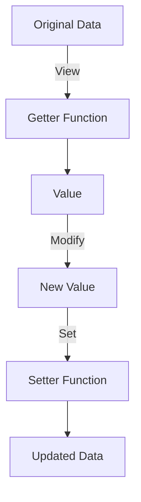

## 10.12. Lens Pattern for Immutable Updates

In the world of functional programming, immutability is a core principle that brings numerous benefits, such as easier reasoning about code, safer concurrent execution, and reduced side effects. However, immutability also introduces challenges, particularly when dealing with deeply nested data structures. Updating such structures immutably can lead to verbose and error-prone code. This is where the lens pattern comes into play, offering a powerful solution for updating nested immutable data structures in a composable and readable way.

### Understanding the Challenges of Immutable Updates

When working with immutable data structures, any update operation results in the creation of a new structure with the desired changes. This approach ensures that the original data remains unchanged, which is crucial for maintaining consistency and avoiding unintended side effects. However, updating nested structures can become cumbersome, as it requires reconstructing each level of the hierarchy leading to the target element.

Consider the following example of a nested map in Clojure:

```clojure
(def person
  {:name "Alice"
   :address {:street "123 Elm St"
             :city "Springfield"
             :zip "12345"}})
```

Suppose we want to update the `zip` code. Without lenses, we would need to manually reconstruct the nested structure:

```clojure
(def updated-person
  (assoc-in person [:address :zip] "54321"))
```

While `assoc-in` is a helpful function provided by Clojure, it can become unwieldy when dealing with more complex structures or when multiple updates are needed.

### Introducing Lenses in Functional Programming

A lens is a functional programming concept that provides a composable way to focus on a part of a data structure. It consists of two primary operations: `get` and `set`. The `get` operation retrieves the value at a specific location within the structure, while the `set` operation updates the value at that location, returning a new structure with the change applied.

Lenses are particularly useful for:

- **Composability**: Lenses can be composed to focus on deeply nested structures.
- **Reusability**: Once defined, a lens can be reused across different parts of the codebase.
- **Readability**: Lenses provide a clear and concise way to express updates to nested data.

### Implementing Lenses in Clojure

While Clojure does not have built-in support for lenses, we can implement them using functions or leverage libraries like [Specter](https://github.com/redplanetlabs/specter) for more advanced capabilities.

#### Basic Lens Implementation

Let's start by implementing a simple lens in Clojure:

```clojure
(defn lens
  [getter setter]
  {:get getter
   :set setter})

(defn view
  [lens data]
  ((:get lens) data))

(defn set
  [lens data value]
  ((:set lens) data value))

(defn over
  [lens data f]
  (set lens data (f (view lens data))))
```

In this implementation, a lens is a map with `:get` and `:set` functions. The `view` function retrieves the value using the lens, `set` updates the value, and `over` applies a function to the value.

#### Example: Using a Lens to Update Nested Structures

Let's define a lens for accessing the `zip` code in our `person` map:

```clojure
(def zip-lens
  (lens
    (fn [data] (get-in data [:address :zip]))
    (fn [data value] (assoc-in data [:address :zip] value))))

;; Viewing the zip code
(view zip-lens person) ;; => "12345"

;; Setting a new zip code
(def updated-person (set zip-lens person "54321"))

;; Verifying the update
(view zip-lens updated-person) ;; => "54321"
```

### Leveraging Specter for Advanced Lens Capabilities

While our basic lens implementation is functional, it lacks the advanced features and optimizations provided by libraries like Specter. Specter is a powerful library for navigating and transforming nested data structures in Clojure. It offers a rich set of navigators and operations that make working with complex data more intuitive and efficient.

#### Using Specter for Nested Updates

Specter provides a concise syntax for defining and using lenses. Here's how we can achieve the same update using Specter:

```clojure
(require '[com.rpl.specter :as sp])

(def updated-person
  (sp/setval [:address :zip] "54321" person))

;; Verify the update
(sp/select-one [:address :zip] updated-person) ;; => "54321"
```

Specter allows us to define navigators that can be composed to focus on specific parts of the data structure. The `setval` function applies the update, and `select-one` retrieves the value.

### Benefits of Using Lenses

The lens pattern offers several benefits, particularly in terms of code clarity and maintainability:

- **Improved Readability**: Lenses provide a clear and declarative way to express updates, making the code easier to understand.
- **Enhanced Composability**: Lenses can be composed to handle complex data structures, reducing boilerplate code.
- **Reusability**: Once defined, lenses can be reused across different parts of the application, promoting consistency.
- **Maintainability**: By encapsulating access and update logic, lenses make it easier to refactor and maintain code.

### Clojure's Unique Features

Clojure's emphasis on immutability and functional programming makes it an ideal language for leveraging the lens pattern. The language's rich set of core functions, combined with libraries like Specter, provides a robust foundation for working with nested data structures.

### Differences and Similarities with Other Patterns

The lens pattern is often compared to other functional programming patterns like zippers and transducers. While zippers provide a way to traverse and modify data structures, lenses focus on composable access and updates. Transducers, on the other hand, are more suited for transforming sequences.

### Try It Yourself

To deepen your understanding of the lens pattern, try experimenting with the following:

- **Modify the `person` map** to include additional nested structures, such as a list of phone numbers, and create lenses to update them.
- **Explore Specter's documentation** to learn about other navigators and operations that can simplify complex updates.
- **Implement a lens** for a different data structure, such as a vector or a set, and practice using it for updates.

### Visualizing the Lens Pattern

To help visualize the lens pattern, consider the following diagram that illustrates the flow of data through a lens:



**Diagram Description**: This diagram shows how a lens operates on data. The original data is passed through the getter function to retrieve a value, which can then be modified. The setter function applies the modification, resulting in updated data.

### References and Links

For further reading on lenses and functional programming, consider the following resources:

- [Specter GitHub Repository](https://github.com/redplanetlabs/specter)
- [Functional Programming in Clojure](https://clojure.org/about/rationale)
- [Clojure Documentation](https://clojure.org/reference/documentation)

### Knowledge Check

To reinforce your understanding of the lens pattern, consider the following questions and exercises:

- What are the primary operations of a lens?
- How does the lens pattern improve code readability and maintainability?
- Implement a lens for a different data structure and use it to perform updates.

### Embrace the Journey

Remember, mastering the lens pattern is just one step in your journey to becoming a proficient Clojure developer. As you continue to explore functional programming, you'll discover new patterns and techniques that will enhance your ability to write robust and elegant code. Keep experimenting, stay curious, and enjoy the journey!

## **Ready to Test Your Knowledge?**



### What is a lens in functional programming?

- [x] A composable way to focus on a part of a data structure
- [ ] A function that only retrieves data
- [ ] A method for sorting data
- [ ] A type of data structure

> **Explanation:** A lens provides a composable way to focus on a specific part of a data structure, allowing for both retrieval and updates.

### Which Clojure library is commonly used for advanced lens capabilities?

- [x] Specter
- [ ] Ring
- [ ] Compojure
- [ ] Leiningen

> **Explanation:** Specter is a powerful library in Clojure for navigating and transforming nested data structures, offering advanced lens capabilities.

### What are the two primary operations of a lens?

- [x] Get and Set
- [ ] Add and Remove
- [ ] Push and Pop
- [ ] Map and Filter

> **Explanation:** The two primary operations of a lens are `get` (to retrieve data) and `set` (to update data).

### How does the lens pattern improve code readability?

- [x] By providing a clear and declarative way to express updates
- [ ] By reducing the number of lines of code
- [ ] By using complex algorithms
- [ ] By eliminating all functions

> **Explanation:** Lenses provide a clear and declarative way to express updates, making the code easier to understand and maintain.

### What is the benefit of using lenses in terms of composability?

- [x] Lenses can be composed to handle complex data structures
- [ ] Lenses eliminate the need for functions
- [ ] Lenses simplify all algorithms
- [ ] Lenses remove all nested data

> **Explanation:** Lenses can be composed to handle complex data structures, reducing boilerplate code and enhancing composability.

### Which function in Specter is used to update a nested value?

- [x] setval
- [ ] assoc
- [ ] update
- [ ] merge

> **Explanation:** The `setval` function in Specter is used to update a nested value within a data structure.

### What is the purpose of the `over` function in a basic lens implementation?

- [x] To apply a function to a value and update the data structure
- [ ] To delete a value from the data structure
- [ ] To sort the data structure
- [ ] To merge two data structures

> **Explanation:** The `over` function applies a function to a value and updates the data structure with the result.

### How does immutability benefit concurrent execution?

- [x] By ensuring data consistency and avoiding unintended side effects
- [ ] By allowing data to be changed freely
- [ ] By reducing the need for functions
- [ ] By eliminating all errors

> **Explanation:** Immutability ensures data consistency and avoids unintended side effects, which is crucial for safe concurrent execution.

### What is a key advantage of using Specter over a basic lens implementation?

- [x] Specter offers advanced features and optimizations
- [ ] Specter eliminates the need for data structures
- [ ] Specter simplifies all algorithms
- [ ] Specter removes all nested data

> **Explanation:** Specter offers advanced features and optimizations for navigating and transforming nested data structures.

### True or False: Lenses can only be used with maps in Clojure.

- [ ] True
- [x] False

> **Explanation:** Lenses can be used with various data structures, not just maps, making them versatile tools for data manipulation.


