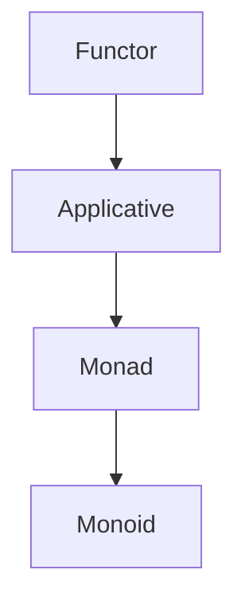

## 10.13. Category Theory Concepts in Clojure

Category theory, a branch of mathematics, provides a high-level, abstract framework for understanding and structuring mathematical concepts. In the realm of functional programming, category theory offers powerful abstractions that help us reason about code in a more mathematical and compositional way. In this section, we will explore key category theory concepts such as functors, applicatives, and monoids, and demonstrate how they manifest in Clojure.

### Introduction to Category Theory in Programming

Category theory abstracts mathematical concepts into a unified framework. At its core, it deals with objects and morphisms (arrows) between these objects. In programming, these objects can be types, and morphisms can be functions. Understanding category theory can lead to more robust and composable code.

#### Key Concepts

- **Objects**: In programming, these are often types or data structures.
- **Morphisms**: Functions or transformations between types.
- **Categories**: Collections of objects and morphisms that satisfy certain properties.

### Functors in Clojure

A functor is a type that can be mapped over. In Clojure, sequences, vectors, and other collections can be considered functors because they support the `map` function.

#### Functor Laws

1. **Identity**: Mapping the identity function over a functor should return the functor unchanged.
2. **Composition**: Mapping a composition of two functions should be the same as mapping each function in sequence.

#### Example: Mapping Over a Vector

```clojure
(defn increment [x] (+ x 1))

;; Using map to apply increment to each element
(def numbers [1 2 3 4 5])
(def incremented-numbers (map increment numbers))

;; Output: (2 3 4 5 6)
```

### Applicatives in Clojure

Applicatives extend functors by allowing functions that are themselves wrapped in a context to be applied to values in a context. This is useful for computations involving multiple independent effects.

#### Example: Using Applicatives

```clojure
(defn add [x y] (+ x y))

;; Using map to apply a function to two vectors
(def numbers1 [1 2 3])
(def numbers2 [4 5 6])
(def summed-numbers (map add numbers1 numbers2))

;; Output: (5 7 9)
```

### Monoids in Clojure

A monoid is a type with an associative binary operation and an identity element. In Clojure, many data structures can be seen as monoids.

#### Monoid Laws

1. **Associativity**: `(a * b) * c` is the same as `a * (b * c)`.
2. **Identity**: There exists an element `e` such that `e * a` is the same as `a * e` is the same as `a`.

#### Example: Using Monoids with Strings

```clojure
(defn concatenate [a b] (str a b))

;; Identity element for strings is the empty string ""
(def identity-element "")

;; Using reduce to concatenate a list of strings
(def strings ["Hello, " "world" "!"])
(def concatenated-string (reduce concatenate identity-element strings))

;; Output: "Hello, world!"
```

### Practical Benefits of Category Theory

Understanding category theory concepts can lead to more modular and reusable code. By abstracting common patterns, we can write code that is easier to reason about and maintain.

#### Benefits

- **Composability**: Functions and data structures can be combined in flexible ways.
- **Reusability**: Abstract patterns can be applied across different contexts.
- **Robustness**: Code that adheres to mathematical laws is often more reliable.

### Encouragement for Further Study

Category theory is a deep and rich field with many more concepts to explore. For those interested in diving deeper, consider studying topics such as monads, natural transformations, and adjunctions.

### Try It Yourself

Experiment with the provided code examples by modifying the functions and data structures. Try creating your own functors, applicatives, and monoids in Clojure.

### Visualizing Category Theory Concepts

Below is a simple diagram illustrating the relationship between functors, applicatives, and monoids.



This diagram shows how each concept builds upon the previous one, forming a hierarchy of abstractions.

### References and Further Reading

- [Category Theory for Programmers](https://bartoszmilewski.com/category/category-theory/)
- [Learn You a Haskell for Great Good!](http://learnyouahaskell.com/)
- [Clojure Documentation](https://clojure.org/reference/documentation)

### Knowledge Check

To reinforce your understanding, try answering the following questions and challenges.

## **Ready to Test Your Knowledge?**



### What is a functor in Clojure?

- [x] A type that can be mapped over
- [ ] A type that can be reduced
- [ ] A type that can be filtered
- [ ] A type that can be concatenated

> **Explanation:** A functor is a type that supports the `map` function, allowing a function to be applied to each element within the functor.

### Which of the following is an example of a monoid in Clojure?

- [x] Strings with concatenation
- [ ] Lists with filtering
- [ ] Maps with merging
- [ ] Sets with intersection

> **Explanation:** Strings with concatenation form a monoid with the empty string as the identity element.

### What is the identity element for addition in Clojure?

- [x] 0
- [ ] 1
- [ ] -1
- [ ] None of the above

> **Explanation:** The identity element for addition is 0 because adding 0 to any number returns the original number.

### What is the main benefit of using applicatives in Clojure?

- [x] They allow functions in a context to be applied to values in a context
- [ ] They allow functions to be composed
- [ ] They allow values to be filtered
- [ ] They allow values to be reduced

> **Explanation:** Applicatives extend functors by allowing functions that are themselves wrapped in a context to be applied to values in a context.

### Which of the following laws must a monoid satisfy?

- [x] Associativity
- [x] Identity
- [ ] Commutativity
- [ ] Distributivity

> **Explanation:** Monoids must satisfy associativity and have an identity element, but they do not require commutativity or distributivity.

### What is the purpose of the `map` function in Clojure?

- [x] To apply a function to each element of a collection
- [ ] To filter elements of a collection
- [ ] To reduce a collection to a single value
- [ ] To concatenate collections

> **Explanation:** The `map` function applies a given function to each element of a collection, returning a new collection with the results.

### Which of the following is a key concept in category theory?

- [x] Objects and morphisms
- [ ] Classes and objects
- [ ] Variables and functions
- [ ] Arrays and loops

> **Explanation:** Category theory deals with objects and morphisms, which are abstract representations of types and functions in programming.

### How does understanding category theory benefit Clojure programmers?

- [x] It leads to more modular and reusable code
- [ ] It makes code run faster
- [ ] It simplifies syntax
- [ ] It reduces memory usage

> **Explanation:** Understanding category theory can lead to more modular and reusable code by abstracting common patterns.

### What is the relationship between functors and applicatives?

- [x] Applicatives extend functors
- [ ] Functors extend applicatives
- [ ] They are unrelated
- [ ] They are the same concept

> **Explanation:** Applicatives extend functors by allowing functions in a context to be applied to values in a context.

### True or False: All functors are monoids.

- [ ] True
- [x] False

> **Explanation:** Not all functors are monoids. Functors and monoids are different abstractions with distinct properties.



Remember, this is just the beginning. As you progress, you'll build more complex and interactive applications using these concepts. Keep experimenting, stay curious, and enjoy the journey!
