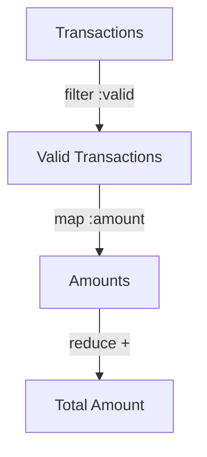

## 10.14. Using `reduce`, `map`, and `filter`

In the realm of functional programming, `reduce`, `map`, and `filter` are indispensable tools that empower developers to perform complex data transformations with elegance and efficiency. These functions form the backbone of many functional programming tasks in Clojure, allowing you to manipulate collections in a declarative manner. In this section, we will explore each of these functions in depth, providing insights into their usage, performance considerations, and how they can be combined to solve complex problems.

### Understanding `map`, `filter`, and `reduce`

Before we dive into advanced examples and performance considerations, let's revisit the fundamental concepts of `map`, `filter`, and `reduce`.

#### `map`: Transforming Collections

The `map` function is used to apply a given function to each element of a collection, producing a new collection of the results. It is a powerful tool for transforming data, allowing you to express operations on collections in a concise and readable way.

```clojure
;; Example: Doubling each number in a list
(def numbers [1 2 3 4 5])
(def doubled (map #(* 2 %) numbers))
;; doubled => (2 4 6 8 10)
```

In this example, `map` applies the anonymous function `#(* 2 %)` to each element of the `numbers` list, resulting in a new list where each number is doubled.

#### `filter`: Selecting Elements

The `filter` function is used to select elements from a collection that satisfy a given predicate function. It returns a new collection containing only the elements for which the predicate returns true.

```clojure
;; Example: Filtering even numbers from a list
(def numbers [1 2 3 4 5])
(def evens (filter even? numbers))
;; evens => (2 4)
```

Here, `filter` uses the `even?` predicate to select only the even numbers from the `numbers` list.

#### `reduce`: Aggregating Values

The `reduce` function is a versatile tool for aggregating values in a collection. It applies a binary function to the elements of a collection, accumulating a result.

```clojure
;; Example: Summing a list of numbers
(def numbers [1 2 3 4 5])
(def sum (reduce + numbers))
;; sum => 15
```

In this example, `reduce` uses the `+` function to sum the elements of the `numbers` list, resulting in a total of 15.

### Advanced Usage and Combinations

Now that we have a solid understanding of the basic operations, let's explore how these functions can be combined to perform more complex data transformations.

#### Combining `map` and `filter`

Combining `map` and `filter` allows you to transform and select data in a single pipeline. This is particularly useful when you need to apply a transformation to a subset of data.

```clojure
;; Example: Doubling only the even numbers in a list
(def numbers [1 2 3 4 5])
(def doubled-evens (map #(* 2 %) (filter even? numbers)))
;; doubled-evens => (4 8)
```

In this example, `filter` is used to select the even numbers, and `map` is then applied to double those numbers.

#### Using `reduce` for Complex Aggregations

`reduce` can be used for more than just simple aggregations like summing numbers. It can also be used to build complex data structures or perform operations that require maintaining state.

```clojure
;; Example: Grouping numbers by even and odd
(def numbers [1 2 3 4 5])
(def grouped (reduce (fn [acc n]
                       (if (even? n)
                         (update acc :evens conj n)
                         (update acc :odds conj n)))
                     {:evens [] :odds []}
                     numbers))
;; grouped => {:evens [2 4], :odds [1 3 5]}
```

Here, `reduce` is used to group numbers into even and odd categories, demonstrating its ability to maintain and update state across iterations.

### Performance Considerations

When working with large collections, performance becomes a critical consideration. Understanding the performance characteristics of `map`, `filter`, and `reduce` can help you write efficient code.

#### Lazy Evaluation

Both `map` and `filter` in Clojure are lazy, meaning they do not immediately evaluate the entire collection. Instead, they produce a lazy sequence that is evaluated as needed. This can lead to significant performance improvements, especially when working with large datasets.

```clojure
;; Example: Lazy evaluation with map
(def numbers (range 1 1000000))
(def lazy-doubled (map #(* 2 %) numbers))
;; Only evaluates when needed
(take 5 lazy-doubled)
;; => (2 4 6 8 10)
```

In this example, the `map` operation is not evaluated until the `take` function requests the first five elements, demonstrating the efficiency of lazy evaluation.

#### Eager Evaluation with `reduce`

Unlike `map` and `filter`, `reduce` is eager and processes the entire collection immediately. This can be beneficial when you need to ensure that all elements are processed, but it also means that `reduce` can be more memory-intensive for large collections.

### Encouraging a Functional Mindset

Thinking in terms of `map`, `filter`, and `reduce` encourages a functional programming mindset, where data transformations are expressed as a series of operations on collections. This approach can lead to more readable and maintainable code.

#### Example: Data Transformation Pipeline

Consider a scenario where you need to process a list of transactions, filtering out invalid ones, calculating totals, and applying discounts.

```clojure
(def transactions [{:amount 100 :valid true}
                   {:amount 200 :valid false}
                   {:amount 300 :valid true}])

(def total (->> transactions
                (filter :valid)
                (map :amount)
                (reduce +)))

;; total => 400
```

In this example, a pipeline is created using `->>` to filter valid transactions, extract their amounts, and sum them up. This demonstrates the power of combining these functions to express complex logic succinctly.

### Visualizing Data Transformation with Mermaid.js

To better understand the flow of data through these functions, let's visualize a data transformation pipeline using Mermaid.js.



This diagram illustrates how transactions are filtered, mapped to their amounts, and reduced to a total, providing a clear visual representation of the data flow.

### Try It Yourself

To deepen your understanding, try modifying the examples provided:

1. **Modify the Doubling Example**: Change the transformation function in the `map` example to triple the numbers instead of doubling them.
2. **Experiment with Grouping**: Alter the grouping example to categorize numbers into positive and negative.
3. **Create a New Pipeline**: Design a pipeline that processes a list of strings, filtering out empty strings, converting them to uppercase, and concatenating them into a single string.

### References and Further Reading

- [ClojureDocs: map](https://clojuredocs.org/clojure.core/map)
- [ClojureDocs: filter](https://clojuredocs.org/clojure.core/filter)
- [ClojureDocs: reduce](https://clojuredocs.org/clojure.core/reduce)

### Key Takeaways

- `map`, `filter`, and `reduce` are foundational functions in Clojure for data transformation.
- Combining these functions allows for expressive and efficient data processing pipelines.
- Understanding lazy and eager evaluation is crucial for performance optimization.
- Embracing a functional programming mindset leads to more readable and maintainable code.

## **Ready to Test Your Knowledge?**



### What does the `map` function do in Clojure?

- [x] Applies a function to each element of a collection and returns a new collection.
- [ ] Filters elements of a collection based on a predicate.
- [ ] Aggregates values in a collection using a binary function.
- [ ] Transforms a collection into a single value.

> **Explanation:** The `map` function applies a given function to each element of a collection, producing a new collection of results.

### How does `filter` differ from `map`?

- [x] `filter` selects elements based on a predicate, while `map` transforms each element.
- [ ] `filter` transforms elements, while `map` selects elements based on a predicate.
- [ ] Both `filter` and `map` aggregate values in a collection.
- [ ] `filter` and `map` are identical in functionality.

> **Explanation:** `filter` selects elements that satisfy a predicate, whereas `map` applies a transformation to each element.

### What is a key characteristic of `reduce` in Clojure?

- [x] It is eager and processes the entire collection immediately.
- [ ] It is lazy and processes elements only when needed.
- [ ] It is used to filter elements from a collection.
- [ ] It applies a function to each element of a collection.

> **Explanation:** `reduce` is eager, meaning it processes the entire collection immediately to produce a single result.

### Which function would you use to sum a list of numbers?

- [x] `reduce`
- [ ] `map`
- [ ] `filter`
- [ ] `apply`

> **Explanation:** `reduce` is used to aggregate values, such as summing a list of numbers.

### What is the result of `(filter even? [1 2 3 4 5])`?

- [x] `(2 4)`
- [ ] `(1 3 5)`
- [ ] `(1 2 3 4 5)`
- [ ] `()`

> **Explanation:** `filter` selects elements that satisfy the `even?` predicate, resulting in `(2 4)`.

### How can `map` and `filter` be combined effectively?

- [x] By filtering a collection first and then mapping a transformation over the filtered results.
- [ ] By mapping a transformation first and then filtering the results.
- [ ] By using `map` to aggregate values and `filter` to transform them.
- [ ] By using `filter` to apply a function to each element.

> **Explanation:** Combining `filter` and `map` allows you to first select relevant elements and then apply a transformation.

### What does lazy evaluation mean in the context of `map` and `filter`?

- [x] They produce a sequence that is evaluated only when needed.
- [ ] They process the entire collection immediately.
- [ ] They transform elements without producing a new collection.
- [ ] They aggregate values into a single result.

> **Explanation:** Lazy evaluation means that `map` and `filter` produce a sequence that is evaluated only when its elements are accessed.

### Which function is best for maintaining state across iterations?

- [x] `reduce`
- [ ] `map`
- [ ] `filter`
- [ ] `apply`

> **Explanation:** `reduce` can maintain and update state across iterations, making it suitable for complex aggregations.

### What is the purpose of the `->>` macro in Clojure?

- [x] To create a pipeline of transformations by threading a value through multiple functions.
- [ ] To apply a function to each element of a collection.
- [ ] To select elements from a collection based on a predicate.
- [ ] To aggregate values in a collection.

> **Explanation:** The `->>` macro is used to create a pipeline of transformations by threading a value through multiple functions.

### True or False: `reduce` is a lazy function in Clojure.

- [ ] True
- [x] False

> **Explanation:** `reduce` is an eager function, meaning it processes the entire collection immediately.



Remember, this is just the beginning. As you progress, you'll build more complex and interactive data transformations. Keep experimenting, stay curious, and enjoy the journey!
