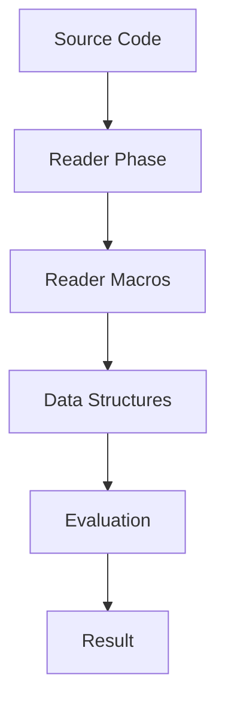

## 10.15. Reader Macros and Code as Data

### Introduction

In the world of Clojure, the concept of code as data, or homoiconicity, is a powerful feature that enables developers to manipulate code with the same ease as data structures. This capability is further enhanced by reader macros, which provide a concise syntax for transforming code during the reading phase. In this section, we will explore what reader macros are, how they function, and how they empower metaprogramming in Clojure. We will also discuss the potential risks associated with their use and encourage responsible practices.

### Understanding Reader Macros

Reader macros in Clojure are special syntactic constructs that transform the way code is read by the Clojure reader. They are not macros in the traditional sense, which operate at the compile-time level, but rather operate at the read-time level. This means they are processed before the code is even evaluated, allowing for powerful transformations and shorthand notations.

#### Common Reader Macros

Let's explore some of the most common reader macros in Clojure:

1. **Quote (`'`)**: The quote reader macro is used to prevent evaluation of a form. It is equivalent to calling the `quote` function.

    ```clojure
    ; Without quote
    (println (+ 1 2)) ; Evaluates to 3

    ; With quote
    (println '(+ 1 2)) ; Evaluates to the list (+ 1 2)
    ```

2. **Var Quote (`#'`)**: The var quote reader macro is used to refer to a var itself, rather than its value. This is useful for functions like `alter-var-root`.

    ```clojure
    ; Without var quote
    (def x 10)
    (println x) ; Evaluates to 10

    ; With var quote
    (println #'x) ; Evaluates to the var #'user/x
    ```

3. **Anonymous Function (`#()`)**: This reader macro provides a shorthand for defining anonymous functions. It uses `%` to refer to arguments.

    ```clojure
    ; Traditional anonymous function
    (fn [x] (+ x 1))

    ; Anonymous function with reader macro
    #(+ % 1)
    ```

### Code as Data: The Power of Homoiconicity

Homoiconicity is the property of a language where the primary representation of programs is also a data structure in a primitive type of the language. In Clojure, this means that code is represented as lists, vectors, maps, and other data structures. This allows for powerful metaprogramming capabilities, as code can be manipulated just like any other data.

#### Manipulating Code as Data

Consider the following example where we manipulate code as data:

```clojure
(def code '(+ 1 2 3))
(eval code) ; Evaluates to 6

; Manipulating the code
(def modified-code (conj code 4))
(eval modified-code) ; Evaluates to 10
```

In this example, we treat the code as a list and use `conj` to add an element to it. This demonstrates the flexibility and power of treating code as data.

### Metaprogramming with Reader Macros

Metaprogramming refers to the practice of writing programs that can manipulate other programs. In Clojure, reader macros and the concept of code as data make metaprogramming particularly powerful. However, with great power comes great responsibility.

#### The Power of Metaprogramming

Metaprogramming allows developers to write more abstract and reusable code. For example, you can create domain-specific languages (DSLs) or generate code dynamically based on certain conditions.

```clojure
(defmacro when-logging-enabled [body]
  `(when *logging-enabled*
     ~body))

; Usage
(def *logging-enabled* true)
(when-logging-enabled (println "Logging is enabled!"))
```

In this example, the `when-logging-enabled` macro generates code based on the value of `*logging-enabled*`.

#### Risks of Metaprogramming

While metaprogramming can be incredibly powerful, it also introduces risks. Code that manipulates other code can become difficult to understand and maintain. It can also lead to unexpected behavior if not used carefully.

### Responsible Use of Reader Macros

To use reader macros responsibly, consider the following guidelines:

1. **Clarity**: Ensure that the use of reader macros enhances the clarity of your code. Avoid using them if they make the code harder to understand.

2. **Documentation**: Document the use of reader macros thoroughly. Explain why they are used and what they achieve.

3. **Testing**: Test code that uses reader macros extensively. Ensure that the transformations they perform are correct and do not introduce bugs.

4. **Limit Scope**: Use reader macros sparingly and limit their scope to where they provide the most benefit.

### Try It Yourself

To get hands-on experience with reader macros and code as data, try modifying the following code examples:

1. **Experiment with the Quote Macro**: Use the quote macro to create lists and prevent evaluation. Try adding elements to the quoted list and evaluate the result.

2. **Create Anonymous Functions**: Use the `#()` reader macro to create anonymous functions that perform different operations. Experiment with multiple arguments using `%1`, `%2`, etc.

3. **Manipulate Code as Data**: Create a list representing a mathematical expression. Use Clojure functions to modify the list and evaluate the result.

### Visualizing Reader Macros and Code as Data

To better understand the flow of reader macros and code as data, consider the following diagram:



**Diagram Description**: This diagram illustrates the process of transforming source code through reader macros into data structures, which are then evaluated to produce a result.

### References and Links

- [Clojure Documentation on Reader Macros](https://clojure.org/reference/reader)
- [MDN Web Docs on Metaprogramming](https://developer.mozilla.org/en-US/docs/Glossary/Metaprogramming)
- [Clojure for the Brave and True](https://www.braveclojure.com/)

### Knowledge Check

To reinforce your understanding of reader macros and code as data, consider the following questions and exercises:

1. **What is a reader macro, and how does it differ from a regular macro?**

2. **Provide an example of using the `#()` reader macro to create an anonymous function.**

3. **Explain the concept of homoiconicity and its significance in Clojure.**

4. **What are the potential risks of using metaprogramming in Clojure?**

5. **Modify the following code to use a reader macro: `(fn [x] (* x x))`**

### Embrace the Journey

Remember, mastering reader macros and the concept of code as data is just the beginning of your journey into advanced Clojure programming. As you progress, you'll unlock new levels of abstraction and power in your code. Keep experimenting, stay curious, and enjoy the journey!

## **Ready to Test Your Knowledge?**



### What is a reader macro in Clojure?

- [x] A syntactic construct that transforms code during the reading phase.
- [ ] A function that operates at runtime.
- [ ] A tool for debugging Clojure code.
- [ ] A library for handling JSON data.

> **Explanation:** Reader macros are processed during the read-time phase, transforming code before evaluation.

### Which reader macro is used to prevent evaluation of a form?

- [x] Quote (`'`)
- [ ] Var Quote (`#'`)
- [ ] Anonymous Function (`#()`)
- [ ] Deref (`@`)

> **Explanation:** The quote reader macro (`'`) is used to prevent evaluation, treating the form as data.

### How does the `#()` reader macro work?

- [x] It creates an anonymous function with `%` as the argument placeholder.
- [ ] It quotes a form to prevent evaluation.
- [ ] It refers to a var itself.
- [ ] It dereferences an atom or ref.

> **Explanation:** The `#()` reader macro creates an anonymous function, using `%` for arguments.

### What is homoiconicity?

- [x] The property of a language where code is represented as data structures.
- [ ] A technique for optimizing Clojure code.
- [ ] A method for handling concurrency.
- [ ] A library for data visualization.

> **Explanation:** Homoiconicity means that code is represented as data structures, enabling metaprogramming.

### What is a potential risk of metaprogramming?

- [x] Code can become difficult to understand and maintain.
- [ ] It improves code readability.
- [ ] It simplifies debugging.
- [ ] It enhances performance.

> **Explanation:** Metaprogramming can lead to complex and hard-to-maintain code if not used carefully.

### How can reader macros be used responsibly?

- [x] By ensuring clarity and documenting their use.
- [ ] By using them as frequently as possible.
- [ ] By avoiding testing.
- [ ] By ignoring their impact on code readability.

> **Explanation:** Responsible use involves clarity, documentation, and thorough testing.

### What does the `#'` reader macro do?

- [x] Refers to a var itself, not its value.
- [ ] Creates an anonymous function.
- [ ] Prevents evaluation of a form.
- [ ] Dereferences an atom or ref.

> **Explanation:** The `#'` reader macro refers to the var itself, useful for certain operations.

### Which of the following is a benefit of code as data?

- [x] It allows for powerful metaprogramming capabilities.
- [ ] It simplifies error handling.
- [ ] It reduces memory usage.
- [ ] It enhances performance.

> **Explanation:** Code as data enables metaprogramming, allowing code manipulation as data structures.

### What is the purpose of the `@` reader macro?

- [x] It dereferences an atom or ref.
- [ ] It creates an anonymous function.
- [ ] It quotes a form.
- [ ] It refers to a var itself.

> **Explanation:** The `@` reader macro is used to dereference an atom or ref, obtaining its value.

### True or False: Reader macros are evaluated at runtime.

- [ ] True
- [x] False

> **Explanation:** Reader macros are processed during the read-time phase, before runtime evaluation.


