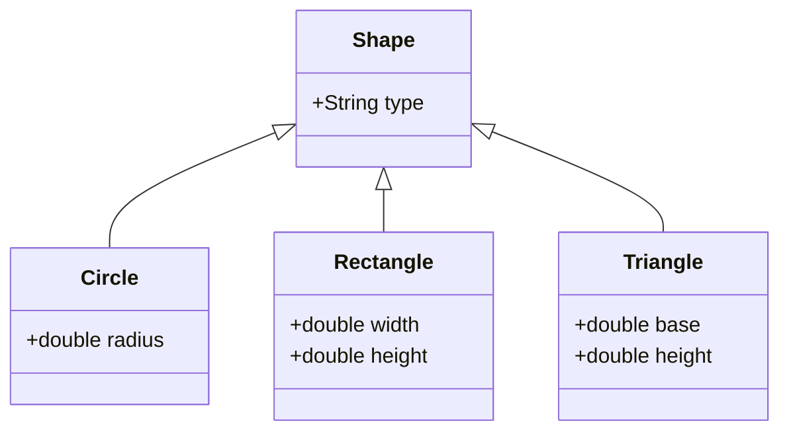

## 10.16. Simulating Algebraic Data Types

Algebraic Data Types (ADTs) are a powerful concept in functional programming languages, allowing developers to model complex data structures with ease and clarity. In this section, we will explore how to simulate ADTs in Clojure, a language that does not natively support them but offers flexible alternatives. We will delve into using maps, records, and tagged unions to represent ADTs, and demonstrate pattern matching with `core.match`. Additionally, we'll discuss the benefits and limitations of these approaches compared to languages with built-in ADTs and highlight libraries that can assist with ADT modeling.

### What Are Algebraic Data Types?

Algebraic Data Types are composite types used in functional programming to define data structures that can take on different forms. They are typically categorized into two main types:

1. **Product Types**: These are akin to tuples or records, where a data type is composed of several fields. Each instance of the type contains values for each field.

2. **Sum Types**: Also known as tagged unions or variant types, these allow a data type to be one of several different types. Each variant can have different fields.

ADTs are prevalent in languages like Haskell and Scala, where they are used to model data with precision and safety. They enable pattern matching, which simplifies the handling of different data variants.

### Simulating ADTs in Clojure

Clojure, being a Lisp dialect, does not have built-in support for ADTs as seen in Haskell or Scala. However, its flexible data structures and dynamic nature allow us to simulate ADTs effectively.

#### Using Maps and Records

Maps and records in Clojure can be used to represent product types. A map is a collection of key-value pairs, while a record is a more structured version of a map with predefined keys.

```clojure
;; Define a product type using a map
(def person {:name "Alice" :age 30 :email "alice@example.com"})

;; Define a product type using a record
(defrecord Person [name age email])

(def alice (->Person "Alice" 30 "alice@example.com"))
```

In the above example, both the map and the record represent a `Person` with fields `name`, `age`, and `email`.

#### Representing Sum Types with Tagged Unions

Tagged unions can be represented using maps with a special key to indicate the type of the variant. This is a common pattern in Clojure to simulate sum types.

```clojure
;; Define a sum type using tagged unions
(defn shape [type & args]
  (case type
    :circle {:type :circle :radius (first args)}
    :rectangle {:type :rectangle :width (first args) :height (second args)}
    :triangle {:type :triangle :base (first args) :height (second args)}))

(def circle (shape :circle 5))
(def rectangle (shape :rectangle 4 6))
```

Here, the `shape` function creates different shapes, each tagged with a `:type` key to distinguish between variants.

### Pattern Matching with `core.match`

Clojure's `core.match` library provides pattern matching capabilities, which can be used to destructure and process ADTs.

```clojure
(require '[clojure.core.match :refer [match]])

(defn area [shape]
  (match shape
    {:type :circle :radius r} (* Math/PI r r)
    {:type :rectangle :width w :height h} (* w h)
    {:type :triangle :base b :height h} (/ (* b h) 2)))

;; Calculate areas
(area circle)      ;; => 78.53981633974483
(area rectangle)   ;; => 24
```

In this example, `match` is used to destructure the shape and calculate its area based on its type.

### Benefits and Limitations

#### Benefits

- **Flexibility**: Clojure's dynamic nature allows for flexible data modeling without the need for rigid type systems.
- **Expressiveness**: Using maps and records, developers can express complex data structures succinctly.
- **Interoperability**: Clojure's data structures are inherently compatible with JSON and other data interchange formats.

#### Limitations

- **Type Safety**: Unlike languages with built-in ADTs, Clojure does not provide compile-time type checking, which can lead to runtime errors.
- **Pattern Matching**: While `core.match` provides pattern matching, it is not as integrated or performant as in languages with native support.

### Libraries for ADT Modeling

Several libraries can assist in modeling ADTs in Clojure, offering additional features and conveniences:

- **`schema`**: Provides a way to define and validate data structures, ensuring they conform to expected shapes.
- **`spec`**: Part of Clojure's core, `spec` allows for runtime validation and generation of data, offering a way to define the shape of data structures.
- **`malli`**: A data-driven schema library for Clojure/Script, offering runtime validation, transformation, and generation.

### Visualizing ADTs in Clojure

To better understand how ADTs can be represented in Clojure, let's visualize the structure of a simple ADT using a class diagram.



This diagram illustrates how different shapes can be modeled as variants of a `Shape` type, each with its own specific fields.

### Try It Yourself

To deepen your understanding, try modifying the code examples:

- Add a new shape type, such as a `Square`, and update the `area` function to handle it.
- Experiment with `core.match` by adding more complex pattern matching scenarios.
- Use `spec` or `malli` to define and validate the shape data structures.

### Knowledge Check

Before we conclude, let's reinforce what we've learned with a few questions:

- How can you simulate product types in Clojure?
- What is the role of the `:type` key in tagged unions?
- How does `core.match` enhance pattern matching in Clojure?

### Summary

Simulating Algebraic Data Types in Clojure involves using maps, records, and tagged unions to model complex data structures. While Clojure lacks native ADT support, its flexibility and dynamic nature allow for effective simulation. By leveraging libraries like `core.match`, `spec`, and `malli`, developers can enhance their data modeling capabilities, ensuring robust and expressive code.

Remember, this is just the beginning. As you continue to explore Clojure, you'll discover even more powerful ways to model and manipulate data. Keep experimenting, stay curious, and enjoy the journey!

## **Ready to Test Your Knowledge?**



### How can you simulate product types in Clojure?

- [x] Using maps and records
- [ ] Using arrays and lists
- [ ] Using only functions
- [ ] Using only strings

> **Explanation:** Product types can be simulated using maps and records, which allow for structured data representation.

### What is the role of the `:type` key in tagged unions?

- [x] To distinguish between different variants
- [ ] To store the data value
- [ ] To indicate the size of the data
- [ ] To provide a default value

> **Explanation:** The `:type` key is used to tag the variant, helping to identify which type of data structure is being used.

### Which library provides pattern matching capabilities in Clojure?

- [x] core.match
- [ ] clojure.spec
- [ ] malli
- [ ] schema

> **Explanation:** `core.match` is the library that provides pattern matching capabilities in Clojure.

### What is a limitation of simulating ADTs in Clojure?

- [x] Lack of compile-time type checking
- [ ] Inability to use functions
- [ ] Lack of data structures
- [ ] Incompatibility with JSON

> **Explanation:** Clojure does not provide compile-time type checking, which can lead to runtime errors.

### Which library is part of Clojure's core for runtime validation?

- [x] clojure.spec
- [ ] core.match
- [ ] malli
- [ ] schema

> **Explanation:** `clojure.spec` is part of Clojure's core and provides runtime validation and data generation.

### How can you represent sum types in Clojure?

- [x] Using tagged unions
- [ ] Using arrays
- [ ] Using only functions
- [ ] Using only strings

> **Explanation:** Sum types can be represented using tagged unions, which use a special key to indicate the variant type.

### What is a benefit of using maps and records for ADTs in Clojure?

- [x] Flexibility in data modeling
- [ ] Compile-time type checking
- [ ] Automatic code generation
- [ ] Built-in pattern matching

> **Explanation:** Maps and records offer flexibility in data modeling, allowing for dynamic and expressive data structures.

### What does `core.match` provide in Clojure?

- [x] Pattern matching capabilities
- [ ] Data validation
- [ ] Type inference
- [ ] Code compilation

> **Explanation:** `core.match` provides pattern matching capabilities, allowing for expressive data handling.

### Which library is data-driven and offers runtime validation in Clojure?

- [x] malli
- [ ] clojure.spec
- [ ] core.match
- [ ] schema

> **Explanation:** `malli` is a data-driven schema library that offers runtime validation, transformation, and generation.

### True or False: Clojure has built-in support for Algebraic Data Types.

- [ ] True
- [x] False

> **Explanation:** Clojure does not have built-in support for Algebraic Data Types, but they can be simulated using maps, records, and tagged unions.


